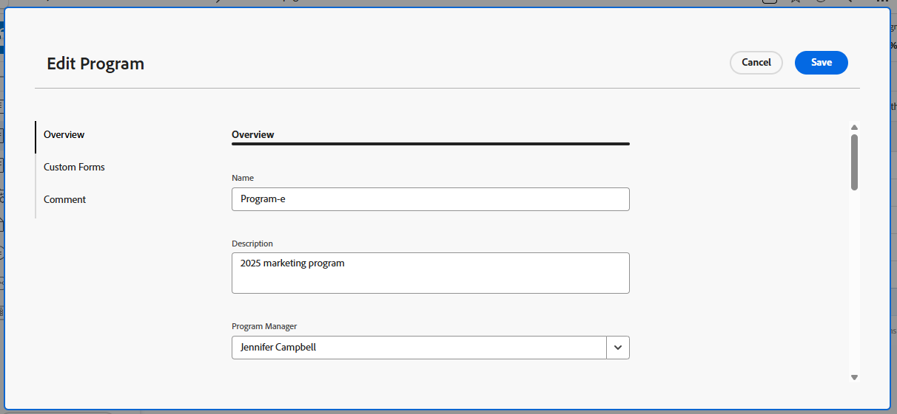

# Programme bearbeiten

Sie können Informationen zu Programmen bearbeiten, die Sie erstellt haben oder die andere Benutzer erstellt haben, wenn sie sie für Sie freigegeben haben.

Sie können ein Programm auf der Programmseite bearbeiten oder Programme in einer Liste bearbeiten.

## Zugriffsanforderungen

+++ Erweitern Sie , um die Zugriffsanforderungen für die -Funktion in diesem Artikel anzuzeigen.

Sie müssen über folgenden Zugriff verfügen, um die Schritte in diesem Artikel ausführen zu können:

<table style="table-layout:auto"> 
 <col> 
 <col> 
 <tbody> 
  <tr> 
   <td role="rowheader">[!DNL Adobe Workfront] Plan</td> 
   <td> 
Beliebig
 </td> 
  </tr> 
  <tr> 
   <td role="rowheader">[!DNL Adobe Workfront] Lizenz*</td> 
   <td> 
Neu: [!UICONTROL Standard] 

Oder 

Aktuell: [!UICONTROL Plan] 
 </td> 
  </tr> 
  <tr> 
   <td role="rowheader">Zugriffsebene</td> 
   <td> 
[!UICONTROL Bearbeiten] Zugriff auf Programme
  </td> 
  </tr> 
  <tr> 
   <td role="rowheader">Objektberechtigungen</td> 
   <td> 
[!UICONTROL Manage]-Berechtigungen für ein Programm
  </td> 
  </tr> 
 </tbody> 
</table>

*Weitere Informationen finden Sie unter [Zugriffsanforderungen in der Dokumentation zu Workfront](/help/quicksilver/administration-and-setup/add-users/access-levels-and-object-permissions/access-level-requirements-in-documentation.md).

+++

## Programme bearbeiten

1. Navigieren Sie zum **[!UICONTROL Hauptmenü]**.
1. Klicken Sie **[!UICONTROL Programme]** und anschließend auf den Namen eines Programms, um es zu öffnen.

   >[!TIP]
   >
   >Sie können auf ein Programm aus dem Portfolio zugreifen, mit dem es verknüpft ist, indem Sie zuerst zum Portfolio wechseln und dann im linken Bereich **[!UICONTROL Programme]** klicken. Weitere Informationen finden Sie unter [Erstellen eines Programms](../../../manage-work/portfolios/create-and-manage-programs/create-program.md).

1. (Optional) Um eingeschränkte Informationen zum Programm zu bearbeiten, klicken Sie **[!UICONTROL linken Bereich auf]** Programmdetails“.

   >[!TIP]
   >
   >Wenn Sie alle Informationen über das Programm bearbeiten möchten, gehen Sie zu Schritt 4.

   

   >[!NOTE]
   >
   >Je nachdem, wie Ihr [!DNL Workfront]- oder Gruppenadministrator Ihre Layout-Vorlage geändert hat, werden die Felder im Bereich [!UICONTROL Programmdetails] möglicherweise neu angeordnet oder nicht angezeigt. Weitere Informationen finden Sie unter [Anpassen der Ansicht [!UICONTROL Details] mithilfe einer Layout-Vorlage](../../../administration-and-setup/customize-workfront/use-layout-templates/customize-details-view-layout-template.md).

   <!--
   
(NOTE: the above note will also come to the Edit Program box)

   -->

   Gehen Sie wie folgt vor, um Informationen [!UICONTROL  Abschnitt ]Details“ zu bearbeiten:

   1. (Optional) Klicken Sie auf **[!UICONTROL Symbol „Alle]** reduzieren“ in der oberen rechten Ecke, um alle Bereiche zu reduzieren.
   1. (Optional und bedingt) Wenn ein Bereich reduziert ist, klicken Sie auf den **Nach rechts zeigenden Pfeil** Nach  neben jedem Bereich, um den Bereich zu erweitern, den Sie bearbeiten möchten.
   1. Informationen zu den im Abschnitt [!UICONTROL Programmdetails] angezeigten Feldern erhalten Sie, indem Sie das Programm wie unten beschrieben im Feld [!UICONTROL Programm ] bearbeiten.
   1. (Optional) Wenn keine benutzerdefinierten Formulare an das Programm angehängt sind, geben Sie den Namen eines Formulars in das Feld **[!UICONTROL Benutzerdefiniertes Formular hinzufügen]** ein, wählen Sie es aus, wenn es in der Liste angezeigt wird, und klicken Sie dann auf **[!UICONTROL Änderungen speichern]**.
   1. (Optional) Klicken Sie auf **[!UICONTROL Export]**-Symbol , um die [!UICONTROL Übersicht] und benutzerdefinierten Formularinformationen in eine PDF-Datei zu exportieren, und klicken Sie dann auf **[!UICONTROL Exportieren]**. Wählen Sie aus den folgenden Optionen aus:

      * Alle auswählen (wird nur angezeigt, wenn mindestens ein benutzerdefiniertes Formular angehängt ist)
      * [!UICONTROL Übersicht]
      * Der Name eines oder mehrerer benutzerdefinierter Formulare

      Die PDF-Datei wird auf Ihren Computer heruntergeladen.

      

      Weitere Informationen finden Sie unter [Exportieren benutzerdefinierter Formulare und Objektdetails](../../../workfront-basics/work-with-custom-forms/export-custom-forms-details.md).

1. Führen Sie einen der folgenden Schritte aus, um alle Informationen zu einem oder mehreren Programmen zu bearbeiten:

   * Klicken Sie auf das **[!UICONTROL Mehr]** Menü  neben dem Programmnamen und dann &#x200B;**[!UICONTROL Bearbeiten].**
   * Gehen Sie zu einer Liste von Programmen und wählen Sie ein oder mehrere Programme aus, die Sie bearbeiten möchten, und klicken Sie dann oben in der Liste auf **[!UICONTROL Bearbeiten]**-Symbol Symbol.

   Das **[!UICONTROL Programm bearbeiten]** Dialogfeld wird angezeigt.

   

   Alle Programmfelder sind im Feld [!UICONTROL Programm bearbeiten] verfügbar und werden nach den im linken Bereich aufgelisteten Bereichen gruppiert.

1. Erwägen Sie, Informationen in einem der folgenden Abschnitte anzugeben:

   * [[!UICONTROL Übersicht]](#overview)
   * [[!UICONTROL Benutzerdefinierte Formulare]](#Custom%C2%A0F)
   * [[!UICONTROL Kommentar]](#comment)

### [!UICONTROL Übersicht] {#overview}

1. Beginnen Sie mit der Bearbeitung eines Programms wie oben beschrieben.
1. Klicken Sie **[!UICONTROL Übersicht]** und geben Sie die folgenden Felder an:

   <!--
   
(NOTE:&nbsp;note below drafted for now)

   -->

   <!--
   <note type="note">
   Depending on how your Workfront administrator or Group administrator sets up our Layout Template, the fields in the Edit Program box might be rearranged or not display. For information, see
   <a href="../../../administration-and-setup/customize-workfront/use-layout-templates/customize-details-view-layout-template.md" class="MCXref xref">Customize the Details view using a layout template</a>.
   </note>
   -->

   <table style="table-layout:auto"> 
    <col> 
    <col> 
    <tbody> 
     <tr> 
      <td role="rowheader">[!UICONTROL Name]</td> 
      <td> 
Aktualisieren Sie den Namen des Programms. 
 
Tipp: Dies ist nicht verfügbar, wenn Sie mehr als ein Programm ausgewählt haben. 
 </td> 
     </tr> 
     <tr> 
      <td role="rowheader">[!UICONTROL Beschreibung]</td> 
      <td> 
Geben Sie eine Beschreibung für die Portfolio ein, um anzugeben, was eindeutig ist. 
 </td> 
     </tr> 
     <tr> 
      <td role="rowheader">[!UICONTROL Programm-Manager]</td> 
      <td> 
Geben Sie den Namen eines Benutzers ein, den Sie als Programm-Manager angeben möchten, und wählen Sie ihn aus, wenn er in der Liste angezeigt wird. Diese Person kann die in den Projekten des Programms definierten Arbeiten überwachen. 
 
Wichtig: Wenn Sie jemanden als Programm-Manager festlegen, erhält dieser automatisch [!UICONTROL Manage]-Berechtigungen für das Programm und die Projekte im Programm. 
 
Tipp: Sie können den Programm-Manager im Programm-Header schnell aktualisieren. 
 </td> 
     </tr> 
     <tr> 
      <td role="rowheader">[!UICONTROL-Gruppe]</td> 
      <td> 
Fügen Sie den Namen einer einzelnen Gruppe hinzu, wenn die Gruppe mit dem Programm verknüpft ist oder für den Abschluss des Programms verantwortlich ist. 
 
Tipp:  
Gehen Sie beim Zugriff auf das Feld [!UICONTROL Group] auf der Seite [!UICONTROL Programmdetails] wie folgt vor: 
 
Sie können sicherstellen, dass Sie die richtige Gruppe auswählen, indem Sie den Mauszeiger darüber bewegen und auf das  [!UICONTROL information] klicken, das neben der Gruppe angezeigt wird. Dadurch wird eine QuickInfo angezeigt, die Informationen über die Gruppe auflistet, wie z. B. die Hierarchie der darüber liegenden Gruppen und deren Administratoren.
 
  
 
Diese Option ist im Feld [!UICONTROL Programm bearbeiten] nicht verfügbar. 
 
 </td> 
     </tr> 
     <tr> 
      <td role="rowheader">[!UICONTROL ist aktiv]</td> 
      <td> 
 Aktivieren Sie dieses Kontrollkästchen, wenn das Programm aktiv sein soll. Andere Benutzer können aktive Programme finden und sie an Projekte anhängen oder zu Portfolios hinzufügen. Inaktive Programme können nicht mit Projekten oder Portfolios verknüpft werden. Dies ist standardmäßig aktiviert.
 </td> 
     </tr> 
    </tbody> 
   </table>

1. Klicken Sie **[!UICONTROL Speichern]** oder fahren Sie mit der Bearbeitung der folgenden Abschnitte fort.

### [!UICONTROL Benutzerdefinierte Formulare]

1. Beginnen Sie mit der Bearbeitung des Programms wie oben beschrieben.
1. Klicken Sie auf **[!UICONTROL Dropdown-Menü]** Forms hinzufügen“, um ein benutzerdefiniertes Formular auszuwählen und es zum Programm hinzuzufügen.

   Sie müssen benutzerdefinierte Programmformulare erstellen, bevor sie hinzugefügt werden können.

   >[!NOTE]
   >
   >Je nachdem, wie Ihr [!DNL Workfront] die Berechtigungen für die Abschnitte in Ihrem benutzerdefinierten Formular festgelegt hat, können nicht alle dieselben Felder in einem bestimmten benutzerdefinierten Formular anzeigen oder bearbeiten. Die Berechtigungen zum Bearbeiten von Feldern innerhalb eines Abschnitts eines benutzerdefinierten Formulars hängen von den Berechtigungen ab, die Sie für das Programm selbst haben. Informationen zum Festlegen von Berechtigungen für Abschnitte eines benutzerdefinierten Formulars finden Sie unter [Erstellen eines benutzerdefinierten Formulars](/help/quicksilver/administration-and-setup/customize-workfront/create-manage-custom-forms/form-designer/design-a-form/design-a-form.md).

1. Aktualisieren Sie alle Felder in den benutzerdefinierten Formularen und klicken Sie dann auf **[!UICONTROL Speichern]** oder fahren Sie mit dem folgenden Abschnitt fort.

### [!UICONTROL Kommentar] {#comment}

1. Beginnen Sie mit der Bearbeitung eines Programms wie oben beschrieben.
1. Klicken Sie **[!UICONTROL Kommentar]**.

   

1. Fügen Sie im Feld **[!UICONTROL Aktualisierung zu jedem Programm hinzufügen]** einen Kommentar hinzu.
1. (Optional) Klicken Sie auf das **[!UICONTROL Personen]**-Symbol, um dem Kommentar einen Benutzer oder ein Team hinzuzufügen.
1. (Optional) Wählen Sie [!UICONTROL **Privat für meine Firma**] aus, um den Kommentar zu sperren und ihn nur für Benutzer in Ihrer Firma privat zu machen.

   Nachdem Sie Ihre Änderungen gespeichert haben, wird der hinzugefügte Kommentar auf der Registerkarte [!UICONTROL Updates] des Programms angezeigt und sendet eine E-Mail an die darin enthaltenen Benutzer.

