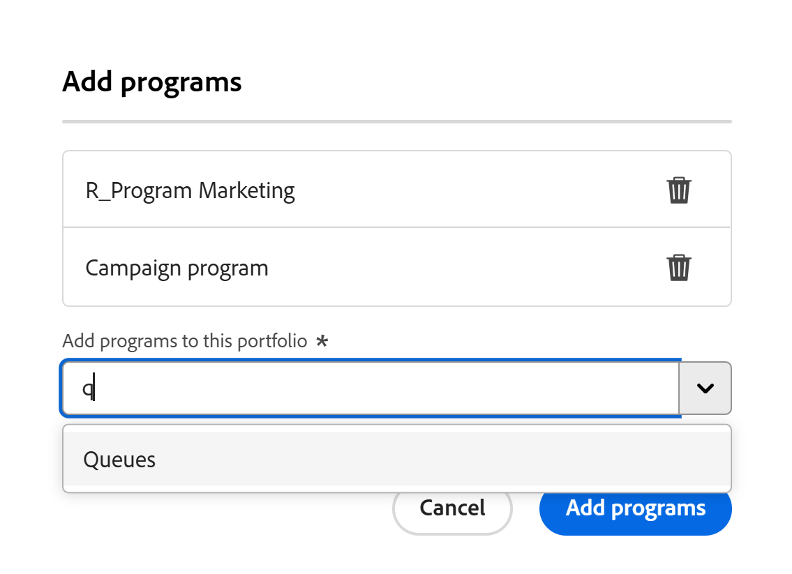

# Hinzufügen eines vorhandenen Programms zu einem Portfolio

<!--Audited: 5/2025-->

<!--The highlighted information on this page refers to functionality not yet generally available. It is available only in the Preview environment for all customers. The same features will also be available in the Production environment for all customers after a week from the Preview release.    

For more information, see [Interface modernization](/help/quicksilver/product-announcements/product-releases/interface-modernization/interface-modernization.md). -->

Sie können einem Portfolio vorhandene Programme hinzufügen. Da Programme nicht in zwei verschiedenen Portfolios vorhanden sein können, wird sie beim Hinzufügen eines vorhandenen Programms dauerhaft von einem Portfolio in ein anderes verschoben.

## Zugriffsanforderungen

+++ Erweitern Sie , um die Zugriffsanforderungen für die -Funktion in diesem Artikel anzuzeigen.

Sie müssen über folgenden Zugriff verfügen, um die Schritte in diesem Artikel ausführen zu können:

<table style="table-layout:auto"> 
 <col> 
 <col> 
 <tbody> 
  <tr> 
   <td role="rowheader">[!DNL Adobe Workfront] Plan</td> 
   <td> 
Beliebig
 </td> 
  </tr> 
  <tr> 
   <td role="rowheader">[!DNL Adobe Workfront] Lizenz*</td> 
   <td> 
Neu: [!UICONTROL Standard] 

Oder 

Aktuell: [!UICONTROL Plan] 
 </td> 
  </tr> 
  <tr> 
   <td role="rowheader">Konfigurationen der Zugriffsebene</td> 
   <td> 
[!UICONTROL Bearbeiten] Zugriff auf Portfolios und Programme 
 </td> 
  </tr> 
  <tr> 
   <td role="rowheader">Objektberechtigungen</td> 
   <td> 
[!UICONTROL Manage]-Berechtigungen für das Portfolio und das Programm
 </td> 
  </tr> 
 </tbody> 
</table>

*Weitere Informationen finden Sie unter [Zugriffsanforderungen in der Dokumentation zu Workfront](/help/quicksilver/administration-and-setup/add-users/access-levels-and-object-permissions/access-level-requirements-in-documentation.md).

+++

## Hinzufügen eines vorhandenen Programms zu einem Portfolio

1. Gehen Sie zu einem Portfolio und klicken Sie **[!UICONTROL linken Bereich]** Programme“.
1. Klicken Sie auf **[!UICONTROL Neues Programm]**.
1. Klicken Sie auf **[!UICONTROL Vorhandenes Programm]**.

   Das **„Programme hinzufügen** wird geöffnet. <!--check screen shot - I logged changes for this casing-->

   

   >[!IMPORTANT]
   >
   >Durch Hinzufügen eines vorhandenen Programms werden alle mit diesem Programm verknüpften Projekte in das Portfolio übernommen. Achten Sie darauf, Projekte nicht unbeabsichtigt auf diese Weise zu verschieben.

1. Geben Sie **[!UICONTROL Feld „Programme zu dieser Portfolio hinzufügen]** den Namen eines Programms ein und wählen Sie es aus, wenn es in der Liste angezeigt wird. <!--see the name of this field, I suggested changes here-->

   Sie können mehr als ein Programm hinzufügen.

1. (Optional) Klicken Sie auf das **Löschen**-Symbol  neben dem Namen eines Programms, wenn Sie es nicht zum Portfolio hinzufügen möchten.

1. Klicken Sie **[!UICONTROL Programme hinzufügen]**. <!--check this button in the UI after they implemented the changes??-->

   Das Programm wird auf der Registerkarte **[!UICONTROL Programme]** des ausgewählten Portfolios angezeigt.
