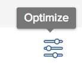

# Optimieren von Projekten im [!UICONTROL Portfolio Optimizer]

Mit dem [!UICONTROL Portfolio Optimizer] können Sie Ihre Projekte anhand ihrer Bewertungen und anderer Werte priorisieren. Der [!UICONTROL Optimizer] berücksichtigt wichtige Projektinformationen wie Kosten, Ausrichtung, Risiko und ROI, um die Projekte nach dem zu priorisieren, was für Sie wichtiger ist.

## Zugriffsanforderungen

+++ Erweitern, um die Zugriffsanforderungen für die in diesem Artikel beschriebene Funktionalität anzuzeigen. 

Sie benötigen die folgenden Zugriffsrechte, um die Schritte in diesem Artikel auszuführen:

<table style="table-layout:auto"> 
 <col> 
 <col> 
 <tbody> 
  <tr> 
   <td role="rowheader">[!DNL Adobe Workfront] Packstück</td> 
   <td> 
Workfront Prime oder höher

      
Workflow-Prime oder höher

    </td> 
  </tr> 
  <tr> 
   <td role="rowheader">[!DNL Adobe Workfront] Lizenz</td> 
   <td> 
[!UICONTROL Standard]

   
[!UICONTROL Plan]
 </td> 
  </tr> 
  <tr> 
   <td role="rowheader">Konfigurationen der Zugriffsebene</td> 
   <td> 
[!UICONTROL Bearbeiten] Zugriff auf [!UICONTROL Portfolios] und [!UICONTROL Projekte]
  </td>
</tr> 
  <tr> 
   <td role="rowheader">Objektberechtigungen</td> 
   <td> 
[!UICONTROL Manage]-Berechtigungen für das Portfolio
  </td> 
  </tr> 
 </tbody> 
</table>

*Weitere Informationen finden Sie unter [Zugriffsanforderungen für Workfront-Dokumentation](/help/quicksilver/administration-and-setup/add-users/access-levels-and-object-permissions/access-level-requirements-in-documentation.md).

+++

<!--
Old
<table style="table-layout:auto"> 
 <col> 
 <col> 
 <tbody> 
  <tr> 
   <td role="rowheader">[!DNL Adobe Workfront] plan</td> 
   <td> Any</td> 
  </tr> 
  <tr> 
   <td role="rowheader">Adobe Workfront licenses*</td> 
   <td> 
New: [!UICONTROL Standard] 

   
Current: [!UICONTROL Plan] 
 </td> 
  </tr> 
  <tr> 
   <td role="rowheader">Access level configurations*</td> 
   <td> 
[!UICONTROL Edit] access to Projects and Portfolios
 </td> 
  </tr> 
  <tr> 
   <td role="rowheader">Object permissions</td> 
   <td> 
[!UICONTROL Manage] permissions to the portfolio
 
Contribute or higher permissions to the projects
 
   
You must have Manage permissions to all the projects in the list to be able to use <b>Set project priority</b>.

    </td> 
  </tr> 
 </tbody> 
</table>
-->

## Optimieren von Projekten im Portfolio-Optimizer

1. Öffnen Sie eine Portfolio und klicken Sie dann im linken ]**auf**[!UICONTROL  Portfolio-Optimierung.

   Der [!UICONTROL Portfolio Optimizer] wird angezeigt.

1. Klicken Sie auf **[!UICONTROL Optimieren]**-Symbol .

   

   Die Kategorien, nach denen ein Projekt bewertet werden kann, werden links neben dem Symbol [!UICONTROL Optimieren] angezeigt.

1. Ändern Sie mithilfe des Gleitkreises die Optimierung einer der folgenden Kategorien:

   * **[!UICONTROL Niedrige Kosten]**: Schieben Sie den Schieberegler nach rechts, um Projekte mit den niedrigsten [!UICONTROL geplanten Kosten] anzuzeigen.
   * **[!UICONTROL Hohe Ausrichtung]**: Schieben Sie den Schieberegler nach rechts, um Projekte mit der höchsten Ausrichtung, die auf der [!UICONTROL Scorecard“ ], anzuzeigen.
   * **[!UICONTROL Hoher Wert]**: Bewegen Sie den Schieberegler nach rechts, um Projekte mit einem höheren [!UICONTROL Nettowert]-Wert anzuzeigen.
   * **[!UICONTROL Niedriges Risiko/]**: Schieben Sie den Schieberegler nach rechts, um Projekte mit dem niedrigsten Risiko/Gewinn-Verhältnis anzuzeigen.
   * **[!UICONTROL Hoher ROI]**: Schieben Sie den Schieberegler nach rechts, um Projekte mit höherer Rentabilität anzuzeigen.

1. Klicken Sie auf das **x**-Symbol, um die Optimierungskategorien zu schließen.

   Dadurch werden die [!UICONTROL Score]-Werte für jedes Projekt in der Spalte **[!UICONTROL Score]** aktualisiert.

   Weitere Informationen zum [!UICONTROL Portfolio Optimizer]-Score finden Sie unter [Übersicht über den [!UICONTROL Portfolio Optimizer]-Score](../../../manage-work/portfolios/portfolio-optimizer/portfolio-optimizer-score.md).

1. Nachdem die richtigen Gewichtungen für die Spalte **[!UICONTROL Score]** festgelegt wurden, klicken Sie auf die Kopfzeile der Spalte **[!UICONTROL Score]**, um nach dieser Spalte zu sortieren. Das Projekt mit der höchsten Punktzahl wird oben in der Liste angezeigt.

1. (Optional) Ziehen Sie Projekte in der Reihenfolge Ihrer Priorität in den Arbeitsbereich.
Dadurch wird die Reihenfolge der Projekte im [!UICONTROL Portfolio Optimizer] geändert.
1. (Optional) Klicken Sie **[!UICONTROL Priorität festlegen]** um die neue Priorität der Projekte zu speichern.

   >[!NOTE]
   >
   >   Sie müssen über Verwaltungsberechtigungen für alle Projekte in der Liste verfügen, um „Projektpriorität festlegen **verwenden zu**.

   Weitere Informationen zum Priorisieren von Projekten in [!UICONTROL Portfolio Optimizer] finden Sie im Artikel [Priorisieren von Projekten in [!UICONTROL Portfolio Optimizer]](../../../manage-work/portfolios/portfolio-optimizer/prioritize-projects-in-portfolio-optimizer.md).

1. Klicken Sie **[!UICONTROL Speichern]**, um Ihren [!UICONTROL Portfolio Optimizer] zu speichern.
