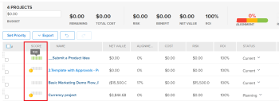

# Übersicht über die Bewertung von [!UICONTROL Portfolio ]Optimizer&#39;

<!--Audited: 01/2025-->

Den Wert für [!UICONTROL Portfolio Optimizer] finden Sie im [!UICONTROL Portfolio Optimizer]. Er wird für jedes Projekt in **[!UICONTROL Spalte]** Score“ angezeigt. Dies stellt eine Bewertung für jedes Projekt im Portfolio dar.

Informationen zum Auffinden von [!UICONTROL Portfolio Optimizer] finden Sie im Artikel [[!UICONTROL Portfolio Optimizer] - Übersicht](../../../manage-work/portfolios/portfolio-optimizer/portfolio-optimizer-overview.md).

Informationen dazu, wie [!DNL Adobe Workfront] den Projektwert und andere Projektinformationen zur Optimierung von Projekten in [!UICONTROL Portfolio Optimizer] verwendet, finden Sie unter [Optimieren von Projekten in Portfolio Optimizer](../../../manage-work/portfolios/portfolio-optimizer/optimize-projects-in-portfolio-optimizer.md).

## Unterschied zwischen dem [!UICONTROL Alignment Score] und dem [!UICONTROL Portfolio Optimizer-Score]

Es gibt einen Unterschied zwischen dem Alignment-Score und dem Portfolio-Optimizer-Score eines Projekts.

Die Alignment-Punktzahl eines Projekts wird anhand der Punkte berechnet, die nach Abschluss der Scorecard erzielt wurden. Dieser Wert wird dann zur Bestimmung des Portfolioausrichtungswerts verwendet. Der Ausrichtungswert wird als Prozentsatz angezeigt.

Der Ausrichtungswert eines Projekts wird in der Spalte **[!UICONTROL Ausrichtung]** des [!UICONTROL Portfolio Optimizer] oder im Feld [!UICONTROL Ausrichtung] der [!UICONTROL Zusammenfassung eines Business-Case] angezeigt.


Weitere Informationen zum Generieren der Ausrichtungsbewertung eines Projekts finden Sie im Artikel [Anwenden einer Scorecard auf ein Projekt und Generieren einer Ausrichtungsbewertung](../../../manage-work/projects/define-a-business-case/apply-scorecard-to-project-to-generate-alignment-score.md).

Der [!UICONTROL Portfolio-Optimizer]-Wert ist ein im [!UICONTROL Portfolio Optimizer} automatisch berechneter Rang] nach dem Projekte priorisiert werden können. Der Portfolio-Optimizer-Score wird als Indikatorsymbol zusammen mit einer Zahl angezeigt und in der Spalte **[!UICONTROL Score]** des [!UICONTROL Portfolio Optimizer] angezeigt.

>[!NOTE]
>
>Ein Projekt kann in [!UICONTROL Portfolio Optimizer} nur bewertet ], wenn sein Business Case abgeschlossen wurde. Weitere Informationen zum Abschließen eines Business-Case finden Sie im Artikel [[!UICONTROL Erstellen eines Business-Case] für ein Projekt](../../../manage-work/projects/define-a-business-case/create-business-case.md).



Die Punktzahl für jedes Projekt wird anhand der Wichtigkeit der folgenden Kategorien berechnet:

* [!UICONTROL Kosten]
* [!UICONTROL Ausrichtung]
* [!UICONTROL Nettowert]
* [!UICONTROL Risiko/Gewinn]
* [!UICONTROL ROI]

## Berechnen des Punktwerts für [!UICONTROL Portfolio Optimizer]

<!--
<p data-mc-conditions="QuicksilverOrClassic.Draft mode">(NOTE: This was edited based on this issue, per Anna: https://hub.workfront.com/issue/603d0c58000095ea0bc00ce5e2110693/overview)</p>
-->

[!DNL Workfront] erstellt einen Score mit dem [!UICONTROL Portfolio Optimizer]. Dies ist ein Ranking, das bei der Priorisierung von Projekten hilfreich ist. Die Werte im Portfolio basieren auf Werten, die in die Business Cases der Projekte eingegeben wurden, und werden zur Berechnung einer Punktzahl für das Projekt verwendet. Projekte mit einer höheren Punktzahl könnten als wichtiger erachtet werden und so priorisiert werden, dass sie zuerst abgeschlossen werden.

Gehen Sie wie folgt vor, um das Ranking eines Projekts zu ermitteln:

1. Wechseln Sie zum [!UICONTROL Portfolio Optimizer].
1. Bewegen Sie den Mauszeiger über das Ranking-Symbol, um die Portfolio-Optimizer-Bewertung für ein Projekt anzuzeigen.


Der Algorithmus für die Berechnung der Bewertungen berücksichtigt die in den Business Cases der Projekte beschriebenen Werte und die Gewichtung, die sie tragen. Dadurch erhält jedes Projekt im Optimizer einen Score und dieser Score wird normalisiert, sodass immer ein Projekt mit einem Score von 100 vorhanden ist. Dadurch erhält das beste Projekt eine hohe Punktzahl.

>[!BEGINSHADEBOX]

**BEISPIEL**

Wenn Sie beispielsweise als einzigen Faktor [!UICONTROL höhere Ausrichtung] berücksichtigen, erhält das Projekt mit der höchsten Ausrichtung den Score 100.

>[!ENDSHADEBOX]

Im Folgenden finden Sie Kriterien, nach denen Sie ein Projekt bewerten können:

* [!UICONTROL Kosten]
* [!UICONTROL Ausrichtung]
* [!UICONTROL Wert]
* [!UICONTROL Risiko/Gewinn]
* [!UICONTROL ROI]


Informationen zum Optimieren von Projekten im Portfolio finden Sie unter [Optimieren von Projekten im [!UICONTROL Portfolio Optimizer]](../../../manage-work/portfolios/portfolio-optimizer/optimize-projects-in-portfolio-optimizer.md).

Jedes Kriterium im Konfigurationsbereich ([!UICONTROL Kosten], [!UICONTROL Ausrichtung], [!UICONTROL ROI], [!UICONTROL Nettowert], [!UICONTROL Risiko-Gewinn]) erhält basierend auf Ihrer Auswahl eine Gewichtung im Bereich von 0 bis 100.

Für jedes Projekt mit einem vollständigen Business-Case wird anhand der folgenden Formel ein Score pro Kriterium generiert:

```
Score Per Criteria = (Project Value For The Criteria - AVG(all the project values for this criteria)) / Standard Deviation of that value for that project
```

**Beispiel** Für den [!UICONTROL Ausrichtungswert] für Projekt A haben Sie Folgendes:

```
Alignment Score = (Project A Alignment Score - AVG (of all the project Alignments)) / Standard Deviation of alignment score for that project
```

Sobald Sie alle [!UICONTROL Score per Criteria] berechnet haben, können Sie sie unter Berücksichtigung ihrer Gewichtung hinzufügen, um den vollständigen Score pro Projekt zu erhalten. Die Punktzahl des Projekts wird anhand der folgenden Formel berechnet:

```
Score = Cost Score * Cost Weight + Alignment Score * Alignment Weight + ROI Score * ROI Weight + Net Value Score * Net Value Weight + Risk Score * Risk Weight
```

Bei den Projektkosten und [!UICONTROL Risiko] funktioniert die Logik umgekehrt wie bei den anderen Kriterien: Wenn Sie möchten, dass Ihnen die [!UICONTROL niedrigen Kosten] wichtig sind, wird dies den Gesamtwert des Projekts nicht erhöhen, sondern um `Cost Score * Cost Weight` verringern.

Nachdem Sie für jedes Projekt die Punktzahl berechnet haben[!UICONTROL  wird der ]Optimierungswert“ für die Projekte wie folgt definiert:

1. [!UICONTROL Minimum] und [!UICONTROL Maximum] werden definiert.
1. Der Bereich zwischen diesen Werten wird berechnet.
1. Für jedes Projekt wird [!UICONTROL Optimierungswert] anhand der folgenden Formel berechnet:

   ```
   Optimization Score = Rounded ((Score - Minimum / Range)*100)
   ```
