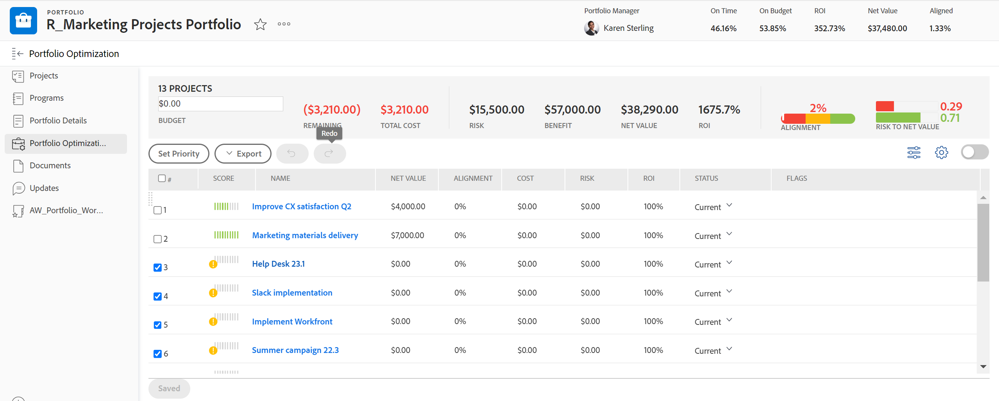

# Priorisieren von Projekten im [!UICONTROL Portfolio Optimizer]

Sie können Ihre Projekte in [!UICONTROL Portfolio Optimizer] priorisieren, um die Reihenfolge festzulegen, in der sie abgeschlossen werden sollen.

Beachten Sie bei der Verwendung des [!UICONTROL Portfolio Optimizer] Folgendes:

* Die Projekte oben in [!UICONTROL Portfolio Optimizer] werden als wichtiger erachtet als die unten aufgeführten. Sie müssen die Projekte in der Reihenfolge ihrer Priorität in [!UICONTROL Portfolio Optimizer} abschließen] damit die Portfolio optimiert werden kann.
* Die Priorität von Projekten in [!UICONTROL Portfolio Optimizer] hat nichts mit dem Feld [!UICONTROL Priorität] auf der Registerkarte [!UICONTROL Projektdetails] eines Projekts zu tun.

  Das Feld [!UICONTROL Priorität] auf der Registerkarte [!UICONTROL Projektdetails] ist eine visuelle Markierung, die Sie manuell angeben, um zu verstehen, wie wichtig ein Projekt sein sollte.

* Die Priorität von Projekten in Portfolio Optimizer ist in der [!DNL Resource Planner] sichtbar, wenn sie dort aktiviert ist. In der [!DNL Resource Planner] erhalten Projekte Ressourcen in der Reihenfolge ihrer Priorität [!UICONTROL Ressourcenplaner] und nicht der Priorität [!UICONTROL Portfolio].

  Informationen zur Priorisierung von Projekten im [!UICONTROL Ressourcenplaner] finden Sie im Artikel [Priorisieren von Projekten im [!UICONTROL Ressourcenplaner]](../../../resource-mgmt/resource-planning/prioritize-projects-resource-planner.md).

* Im **[!UICONTROL Projektpriorisierung]** des [!UICONTROL Portfolio Optimizer] werden Projekte standardmäßig in der Reihenfolge [!UICONTROL Geplante Startdaten] und [!UICONTROL Nettowert] angezeigt.

## Zugriffsanforderungen

+++ Erweitern, um die Zugriffsanforderungen für die in diesem Artikel beschriebene Funktionalität anzuzeigen. 

<table style="table-layout:auto"> 
 <col> 
 <col> 
 <tbody> 
  <tr> 
   <td role="rowheader">[!DNL Adobe Workfront] Packstück</td> 
   <td> 
Workfront Prime oder höher

      
Workflow-Prime oder höher

    </td> 
  </tr> 
  <tr> 
   <td role="rowheader">[!DNL Adobe Workfront] Lizenz</td> 
   <td> 
[!UICONTROL Standard]

   
[!UICONTROL Plan]
 </td> 
  </tr> 
  <tr> 
   <td role="rowheader">Konfigurationen der Zugriffsebene</td> 
   <td> 
[!UICONTROL Bearbeiten] Zugriff auf [!UICONTROL Portfolios] und [!UICONTROL Projekte]
  </td>
</tr> 
  <tr> 
   <td role="rowheader">Objektberechtigungen</td> 
   <td> 
[!UICONTROL Manage]-Berechtigungen für das Portfolio
  </td> 
  </tr> 
 </tbody> 
</table>

*Weitere Informationen finden Sie unter [Zugriffsanforderungen für Workfront-Dokumentation](/help/quicksilver/administration-and-setup/add-users/access-levels-and-object-permissions/access-level-requirements-in-documentation.md).

+++

<!--
Old:

<table style="table-layout:auto"> 
 <col> 
 <col> 
 <tbody> 
  <tr> 
   <td role="rowheader">[!DNL Adobe Workfront] plan</td> 
   <td> 
Any 
 </td> 
  </tr> 
  <tr> 
   <td role="rowheader">Adobe Workfront licenses*</td> 
   <td> 
New: Standard

   
Current: Plan
 </td> 
  </tr> 
  <tr> 
   <td role="rowheader">Access level configurations*</td> 
   <td> 
[!UICONTROL Edit] access to Projects and Portfolios
</td> 
  </tr> 
  <tr> 
   <td role="rowheader">Object permissions</td> 
   <td> 
[!UICONTROL Manage] permissions to the portfolio
 
Contribute or higher permissions to the projects
 
   
You must have Manage permissions to all the projects in the list to be able to use <b>Set project priority</b>.

    </td> 
  </tr> 
 </tbody> 
</table>
-->

## Ändern der Priorität von Projekten im [!UICONTROL Portfolio Optimizer]

{{step1-to-portfolios}}

1. (Optional) Wählen Sie den richtigen Filter im Dropdown-Menü **[!UICONTROL Filter]** aus, um die richtige Liste der Portfolios anzuzeigen.
1. Klicken Sie auf den Namen eines Portfolios, um es zu öffnen.
1. Klicken Sie im linken ]**auf**[!UICONTROL  Portfolio-Optimierung.
1. Ändern Sie im Bereich [!UICONTROL Projektoptimierung] die Priorität Ihrer Projekte, indem Sie die Projekte nach ihrer Priorität ziehen und dann an die gewünschte Anzeigeposition ablegen.

   

   Klicken Sie **[!UICONTROL Bereich &quot;]**&quot; im Bereich „Projektoptimierung“, wenn Sie die Neuanordnung Ihrer Projekte abgeschlossen haben. Die Projekte erhalten eine neue Nummer basierend auf der neuen Bestellung.

1. Klicken Sie **[!UICONTROL Speichern]**, um die neue Projektpriorität im [!UICONTROL Portfolio Optimizer“ zu ]. Die Priorität wird als Zahl in der Spalte **#** aufgeführt.

   >[!TIP]
   >
   >Dies ändert nicht unbedingt die Reihenfolge der Projekte im [!UICONTROL Portfolio Optimizer], da die Liste der Projekte möglicherweise nach einer anderen Spalte als der Spalte **#** sortiert ist. Klicken Sie auf die Spaltenüberschrift **#**, um die Liste nach Projektpriorität zu sortieren.

   Sie können die Priorität des Projekts so anzeigen, wie sie in [!UICONTROL Portfolio Optimizer] im Ressourcenplaner angezeigt wird, indem Sie die **[!UICONTROL Portfolio-Prioritäten anzeigen]** im Ressourcenplaner aktivieren.

   Informationen zur Priorisierung von Projekten im [!UICONTROL Ressourcenplaner] finden Sie im Artikel [Priorisieren von Projekten im [!UICONTROL Ressourcenplaner]](../../../resource-mgmt/resource-planning/prioritize-projects-resource-planner.md).
