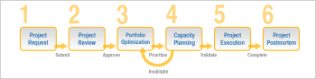

# Übersicht über die Portfolio-Verwaltung

## Übersicht über das Projekt-Portfolio-Management (PPM)

Portfolio- oder Projektmanagement (Project Portfolio Management, PPM) ist der Prozess der Priorisierung und Verwaltung einer Projektliste, um spezifische Geschäftsziele zu erreichen. So ist ein Portfolio eine Sammlung von Projekten mit gemeinsamen Geschäftszielen. Das Ergebnis einer effektiven PPM-Methode ermöglicht es Führungskräften,

* Identifizieren Sie alle Projekte in einem Portfolio.
* Machen Sie sich mit den Auswirkungen der einzelnen Projekte auf Ressourcen, Kosten und Umsatz vertraut.
* Treffen Sie eine intelligente, strategische Entscheidung, wenn Sie Projekte in einem Portfolio priorisieren, auswählen oder entfernen.

Normalerweise verwenden PPM-Experten die folgenden Schritte, um PPM durchzuführen:

1. Erstellen Sie Bewertungskriterien für die Projektauswahl und Priorisierung.
1. Erfassen von Projektanforderungen.
1. Wählen Sie basierend auf den erstellten Kriterien mehrere angeforderte Projekte als Portfolioprojekt aus.
1. Richten Sie die ausgewählten Projekte nach denselben Kriterien aus.
1. die Verfügbarkeit der Ressourcen für die Durchführung der ausgewählten Projekte bewerten.
1. Überprüfen und bewerten Sie den Fortschritt der Projekte im Portfolio und nehmen Sie gegebenenfalls Anpassungen vor.

## Übersicht über die [!DNL Adobe Workfront] PPM-Prozess

Mithilfe der Tools für das Portfolio-Management in [!DNL Workfront].

Die folgende Abbildung zeigt den allgemeinen Überblick über den PPM-Prozess in [!DNL Workfront]:

* [Projektanforderung](#project-request)
* [Projektprüfung](#project-review)
* [Portfolio-Optimierung](#portfolio-optimization)
* [Ressourcenplanung](#resource-planning)
* [Projektausführung](#project-execution)
* [Projekt-Postmortem](#project-postmortem)

### Projektanforderung {#project-request}

Das Projekt-Portfolio-Management beginnt mit einer Projektanforderung. In dieser Phase erstellt ein Projektinhaber eine Projektanforderung und reicht sie zur Überprüfung an einen Exekutivausschuss oder den Portfolio-Manager ein. Dies ist der Zeitpunkt, an dem der Benutzer das Geschäftsszenario des Projekts abschließt und es dann zur Genehmigung einreicht.

Weitere Informationen zum Erstellen eines Geschäftsfalls und einer Projektanforderung finden Sie unter [Geschäftsszenario für ein Projekt erstellen](../../../manage-work/projects/define-a-business-case/create-business-case.md).

### Projektprüfung {#project-review}

Nachdem Sie die Projektanforderung eingereicht haben, prüft der Portfolio-Manager oder ein Executive-Team die Anfrage und entscheidet, ob das Projekt genehmigt werden soll. Wenn der Projektverantwortliche das Projekt genehmigt, wird das Projekt für ein Projekt-Portfolio des Unternehmens ausgewählt.

Weitere Informationen zu Portfolios finden Sie unter [Übersicht über Portfolio in [!DNL Adobe Workfront]](../../../manage-work/portfolios/portfolios-overview/portfolio-overview.md)Weitere Informationen zur Genehmigung eines Geschäftsfalls finden Sie unter [Geschäftsfall genehmigen](../../../manage-work/projects/define-a-business-case/approve-business-case.md).

### Portfolio-Optimierung {#portfolio-optimization}

Nach dem Hinzufügen aller Projekte zum Portfolio optimiert und priorisiert der Portfolio Manager sie entsprechend ihrem Wert, ihrer Ausrichtung und dem Nutzen für die Organisation.

Weitere Informationen zur Portfoliooptimierung finden Sie unter [Projektoptimierung im Portfolio Optimizer](../../../manage-work/portfolios/portfolio-optimizer/optimize-projects-in-portfolio-optimizer.md).

### Ressourcenplanung {#resource-planning}

Neben der Optimierung der Portfolioleistung und der Priorisierung der Projekte stellt der Ressourcen-Manager sicher, dass den Projekten angemessene Ressourcen zugewiesen werden. Sie bewerten die Verfügbarkeit und Zuordnung der Ressourcen mithilfe der in verfügbaren Ressourcen-Management-Tools [!DNL Workfront].

Je nach Verfügbarkeit der Ressourcen muss der Portfolio Manager die Projekte möglicherweise neu priorisieren.

Weitere Informationen zur Ressourcenverwaltung finden Sie unter [Ressourcen verwalten](../../../resource-mgmt/manage-resources.md) Abschnitt.

### Projektausführung {#project-execution}

Nach Erhalt der Projektgenehmigung durch den Portfolio Manager und der Ressourcenvalidierung durch den Ressourcen-Manager als Projekteigentümer können Sie das Projekt in den Projektstatus setzen von [!UICONTROL Aktuell] und Ihre Benutzer können mit der Arbeit beginnen, um das Projekt abzuschließen. Es wird empfohlen, in dieser Phase eine Grundlinie des Projekts zu erfassen, um einen Referenzpunkt für das Projekt in seinem ursprünglichen Zustand zu haben.

Weitere Informationen zum Verwalten von Projekten finden Sie in [!DNL Workfront], siehe [Projekte verwalten: Artikelindex](../../../manage-work/projects/manage-projects/manage-projects-overview.md).\
Weitere Informationen zum Erstellen von Grundlinien für Projekte finden Sie unter [Erstellen von Projekt-Grundlinien](../../../manage-work/projects/create-projects/create-baselines.md).

### Projekt-Postmortem {#project-postmortem}

Nach Abschluss der Projekte im Portfolio können Sie den Erfolg jedes Projekts überprüfen, indem Sie eine Grundlinie erstellen und sie mit der ursprünglichen Grundlinie vergleichen.

Weitere Informationen zum Erstellen von Grundlinien für Projekte finden Sie unter [Erstellen von Projekt-Grundlinien](../../../manage-work/projects/create-projects/create-baselines.md).
