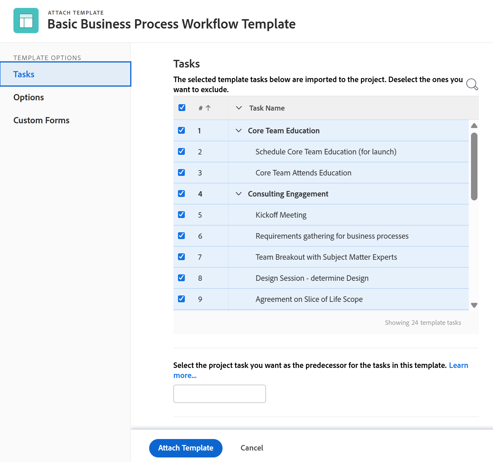

# Eine Vorlage an ein Projekt anhängen

Sie können eine Vorlage entweder während der ersten Erstellungsphase des Projekts oder nach seiner Erstellung an ein Projekt anhängen.

Weitere Informationen zum Erstellen eines Projekts mit einer Vorlage finden Sie unter [Erstellen eines Projekts mit einer Vorlage](../../../manage-work/projects/create-projects/create-project-from-template.md).

## Zugriffsanforderungen

Sie müssen über Folgendes verfügen, um die in diesem Artikel beschriebenen Schritte durchzuführen:

<table style="table-layout:auto"> 
 <col> 
 <col> 
 <tbody> 
  <tr> 
   <td role="rowheader">Adobe Workfront-Plan*</td> 
   <td> 
Beliebig 
 </td> 
  </tr> 
  <tr> 
   <td role="rowheader">Adobe Workfront-Lizenz*</td> 
   <td> 
Plan 
 </td> 
  </tr> 
  <tr> 
   <td role="rowheader">Konfigurationen auf Zugriffsebene*</td> 
   <td> 
Zugriff auf Projekte bearbeiten 
 
Informationen zum Projektzugriff finden Sie unter <a href="../../../administration-and-setup/add-users/configure-and-grant-access/grant-access-projects.md" class="MCXref xref">Projektzugriff gewähren</a>.
 
Zugriff auf Vorlagen anzeigen
 
Weitere Informationen zu Vorlagenberechtigungen finden Sie unter <a href="../../../workfront-basics/grant-and-request-access-to-objects/share-a-template.md" class="MCXref xref">Vorlage freigeben</a>. 
 
Informationen zum Zugriff auf Vorlagen finden Sie unter <a href="../../../administration-and-setup/add-users/configure-and-grant-access/grant-access-templates.md" class="MCXref xref">Zugriff auf Vorlagen gewähren</a>.
 
Hinweis: Wenn Sie immer noch keinen Zugriff haben, fragen Sie Ihren Workfront-Administrator, ob er zusätzliche Zugriffsbeschränkungen für Ihre Zugriffsebene festlegt. Informationen dazu, wie ein Workfront-Administrator Ihre Zugriffsebene ändern kann, finden Sie unter <a href="../../../administration-and-setup/add-users/configure-and-grant-access/create-modify-access-levels.md" class="MCXref xref">Benutzerdefinierte Zugriffsebenen erstellen oder ändern</a>.
 </td> 
  </tr> 
  <tr> 
   <td role="rowheader">Objektberechtigungen</td> 
   <td> 
Berechtigungen für das Projekt verwalten
 
Weitere Informationen zu Projektberechtigungen finden Sie unter <a href="../../../workfront-basics/grant-and-request-access-to-objects/share-a-project.md" class="MCXref xref">Freigeben eines Projekts in Adobe Workfront</a>. 
 
Anzeigen von Berechtigungen oder höher für die Vorlage
 
Informationen zum Anfordern von zusätzlichem Zugriff finden Sie unter <a href="../../../workfront-basics/grant-and-request-access-to-objects/request-access.md" class="MCXref xref">Zugriff auf Objekte anfordern </a>.
 </td> 
  </tr> 
 </tbody> 
</table>

&#42;Wenden Sie sich an Ihren Workfront-Administrator, um zu erfahren, welchen Plan, welchen Lizenztyp oder welchen Zugriff Sie haben.

<!--

<h2>Considerations when adding templates to projects</h2>

(NOTE: moved this to an Overview article of its own) 

Consider the following when adding templates to projects:

<ul>
<li> 
You can attach only active templates to projects. 
 </li>
<li> 
You can attach a template to a project when the project is in a status of Complete, Dead, or in Pending Approval, only when your Adobe Workfront administrator or a group administrator has enabled this functionality in the Project&nbsp;Preferences area. For information about setting project preferences, see <a href="../../../administration-and-setup/set-up-workfront/configure-system-defaults/set-project-preferences.md" class="MCXref xref">Configure system-wide project preferences</a>. 
 </li>
<li> 
Unless you exclude specific template tasks from being added in the attachment process, all template tasks are added to the existing project. 
 </li>
<li> 
Most template settings are added to the project. 
 </li>
<li> 
Some settings from the template automatically transfer to the project, unless you specifically mark them to be excluded. 

Example: </b>">
<b>Example: </b>

For example, these settings are added to the project:

<ul>
<li>Start&nbsp;From field</li>
<li>Custom forms and the information on them</li>
<li>Queue Details </li>
<li>Financial settings </li>
</ul>

 </li>
</ul>

-->

## Eine Vorlage an ein vorhandenes Projekt anhängen {#attach-a-template-to-an-existing-project}

Sie können eine Vorlage an ein Projekt in Workfront von der Projektseite aus oder von einer Projektliste oder einem Bericht aus anhängen.

1. Wechseln Sie zu dem Projekt, an das Sie eine Vorlage anhängen möchten, und klicken Sie auf die Schaltfläche **Mehr** icon  rechts neben dem Projektnamen

   

   Oder

   Wechseln Sie zu einer Projektliste oder einem Bericht und wählen Sie ein Projekt aus. Klicken Sie dann auf **Mehr** icon  oben in der Liste.

   

1. Klicken **Vorlage anhängen**.

   Das Feld Vorlage anhängen wird angezeigt.

1. Geben Sie den Namen der Vorlage ein, die Sie im **Suchvorlagen** und klicken Sie dann auf das Feld, wenn es angezeigt wird.in der Liste

   Oder

   Klicken Sie auf den Namen einer Vorlage im **Andere Vorlagen** Bereich.

   Rechts wird eine Vorschau der Vorlage mit den folgenden Informationen zur Vorlage angezeigt:

   * Dauer
   * Inhaber
   * Die Anzahl der Aufgaben auf oberster Ebene (einschließlich einer Liste der ersten drei Aufgaben auf oberster Ebene)
   * Gesamtzahl der Aufgaben
   * Namen angehängter benutzerdefinierter Formulare

   

1. (Optional) Klicken Sie auf die **Favoriten** icon  links neben dem Vorlagennamen, um ihn als Favoriten zu kennzeichnen. Dadurch wird die Vorlage in die Favoritenliste verschoben.

   

1. (Optional) Klicken Sie auf die **Favoriten** icon  erneut, um sie aus der Favoritenliste zu entfernen.
1. Klicken **Anpassen und Anhängen**.

   

1. Aktualisieren Sie die Informationen in den folgenden Abschnitten, bevor Sie die Vorlage anhängen (oder klicken Sie auf **Vorlage anhängen** jederzeit):

   <table style="table-layout:auto"> 
    <col> 
    <col> 
    <tbody> 
     <tr> 
      <td role="rowheader" colspan="2"> 
Aufgabenbereich
 
  
 </td> 
     </tr> 
     <tr> 
      <td role="rowheader">Die folgenden Vorlagenaufgaben werden in das Projekt importiert. Heben Sie die Auswahl der Personen auf, die Sie ausschließen möchten. </td> 
      <td>Heben Sie die Auswahl aller Aufgaben auf, die Sie aus der Vorlage ausschließen möchten, bevor Sie sie an das Projekt anhängen.</td> 
     </tr> 
     <tr> 
      <td role="rowheader">Wählen Sie die Projektaufgabe aus, die Sie als Vorgänger für die Aufgaben in dieser Vorlage benötigen.</td> 
      <td> 
Klicken Sie auf das Feld, um eine Liste der Projektaufgaben anzuzeigen. Wählen Sie die Projektaufgabe aus, die beendet werden soll, bevor die Vorlagenaufgaben beginnen können. Alternativ können Sie diesen Schritt überspringen und Beziehungen innerhalb des Projekts einrichten, nachdem die Vorlage angehängt wurde. 
 
 Wählen Sie die <strong>Abhängigkeitstyp</strong>, <strong>Lag</strong> Informationen und ob der Vorgänger <strong>Durchgesetzt</strong> oder nicht. 
 </td> 
     </tr> 
     <tr> 
      <td role="rowheader">Wählen Sie die Projektaufgabe aus, die Sie als übergeordnetes Element der Aufgaben in dieser Vorlage verwenden möchten.</td> 
      <td> Wählen Sie die Projektaufgabe aus, die Sie als übergeordnete Aufgabe für alle Vorlagenaufgaben festlegen möchten. Wenn Sie keine Auswahl treffen, werden alle Vorlagenaufgaben am Ende Ihrer aktuellen Projektaufgaben angezeigt. Sie können diesen Schritt überspringen und Aufgaben im Projekt verschieben, nachdem die Vorlage angehängt wurde.</td> 
     </tr> 
     <tr> 
      <td role="rowheader" colspan="2"> 
Optionsabschnitt
 
  
 </td> 
     </tr> 
     <tr> 
      <td role="rowheader">Die unten ausgewählten Elemente werden in das Projekt übertragen. Heben Sie die Auswahl der Personen auf, die Sie ausschließen möchten.</td> 
      <td> 
Deaktivieren Sie die Kontrollkästchen neben allen Informationen, die Sie aus der Vorlage löschen möchten, bevor Sie sie an das Projekt anhängen. Diese Informationen werden nicht von der Vorlage an das Projekt übertragen. Weitere Informationen zu den einzelnen Feldern finden Sie unter <a href="../../../manage-work/projects/create-and-manage-templates/attach-template-to-project-overview.md" class="MCXref xref">Übersicht über das Anhängen einer Vorlage an ein Projekt</a>. 
 
Wichtig: Wenn Sie die <strong>Einrichten von Warteschlangeneigenschaften und Problemen</strong> , überschreiben die Queue Details der Vorlage die des Projekts. In diesem Fall werden die Routing-Regeln, Warteschlangenthemen und Themengruppen der Vorlage zu denen des Projekts hinzugefügt.  Wenn das Projekt als Anforderungswarteschlange eingerichtet ist und die dem Projekt angehängte Vorlage nicht als Anforderungswarteschlange eingerichtet ist, werden die Warteschlangeninformationen des Projekts entfernt, wenn Sie das Projekt verlassen <strong>Warteschlangeneigenschaften und Problemeinrichtung</strong> aktiviert.  Wenn Sie die <strong>Eigenschaften der Warteschlange und Problemeinrichtung</strong> bleiben alle Einstellungen für die Warteschlangeneinstellungen des Projekts erhalten und es werden keine Einstellungen für die Warteschlangeneinrichtung aus der Vorlage angehängt. 
 </td> 
     </tr> 
     <tr> 
      <td role="rowheader" colspan="2"> 
Benutzerspezifischer Forms-Abschnitt
 
  
 </td> 
     </tr> 
     <tr> 
      <td role="rowheader">Benutzerdefinierte Forms</td> 
      <td> 
Wenn benutzerdefinierte Formulare an die Vorlage angehängt werden, werden ihre Namen im linken Bereich angezeigt. 
 </td> 
     </tr> 
    </tbody> 
   </table>

1. (Optional) Aktualisieren Sie die Informationen in den benutzerdefinierten Formularen. Diese Informationen werden an das Projekt übermittelt.

   >[!TIP]
   >
   >* Dieser Schritt ist obligatorisch, wenn die benutzerdefinierten Formulare in der Vorlage leere erforderliche Felder enthalten.
   >* Wenn die Felder aus der Vorlage bereits im Projekt vorhanden sind und Informationen enthalten, bleiben die bereits im Projekt enthaltenen Informationen erhalten. Sie können sie beim Anhängen der Vorlage nicht bearbeiten.

1. Klicken **Vorlage anhängen.**
1. Klicken **Anlage abbrechen** , um das Anhängen der Vorlage zu beenden.

   Oder

   Lassen Sie die Fertigstellung der Anlage zu, um die Vorlage zum Projekt hinzuzufügen.

   Nachdem Sie die Vorlage angehängt haben, können Sie das Projekt bearbeiten und alle Aufgaben, Informationen oder Einstellungen nach Bedarf anpassen.

1. (Optional) Klicken Sie auf **Projektdetails**, dann **Übersicht** , um den Namen der Vorlage anzuzeigen, die Sie im **Projektbeziehungen** Bereich.

   >[!TIP]
   >
   >Wenn Sie dem Projekt mehr als eine Vorlage anhängen, wird nur die zuvor angehängte Vorlage in diesem Feld angezeigt. Weitere Informationen finden Sie unter [Mehrere Vorlagen an ein vorhandenes Projekt anhängen und Vorlageninformationen anzeigen](#attach-multiple-templates-to-an-existing-project-and-view-template-information) in diesem Artikel.

1. (Optional) Entfernen Sie Vorlageninformationen aus dem Projekt, an das Sie die Vorlage angehängt haben. Weitere Informationen finden Sie unter [Entfernen von Vorlageninformationen aus einem Projekt](../../../manage-work/projects/create-and-manage-templates/remove-template-from-project.md).

## Mehrere Vorlagen an ein vorhandenes Projekt anhängen und Vorlageninformationen anzeigen {#attach-multiple-templates-to-an-existing-project-and-view-template-information}

Sie können demselben Projekt mehrere Vorlagen (einzeln) anhängen, indem Sie die im Abschnitt beschriebenen Schritte ausführen [Eine Vorlage an ein vorhandenes Projekt anhängen](#attach-a-template-to-an-existing-project) in diesem Artikel. Dadurch werden die Aufgaben und andere Informationen aus den einzelnen Vorlagen zum Projekt hinzugefügt.

>[!TIP]
>
>Wenn Sie einem Projekt mehrere Vorlagen anhängen, wird nur die Vorlage, die Sie zuerst angehängt haben, im Bereich Projektdetails angezeigt.

So erfahren Sie, welche Vorlage auf ein Projekt angewendet wird:

1. Navigieren Sie zu einem Projekt, an das eine Vorlage angehängt ist.
1. Klicken **Projektdetails** im linken Bereich.
1. Suchen Sie den Namen der Vorlage, die an das Projekt angehängt ist, im **Vorlage** unten im **Übersicht** Abschnitt unter **Projektbeziehungen** .

   

 

 
