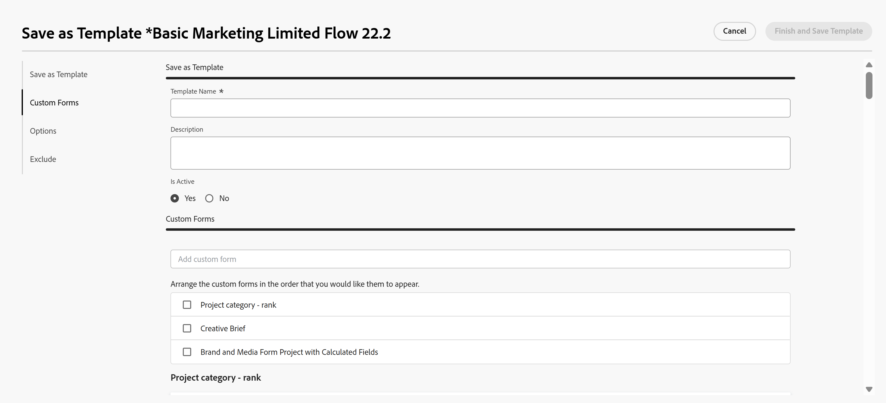
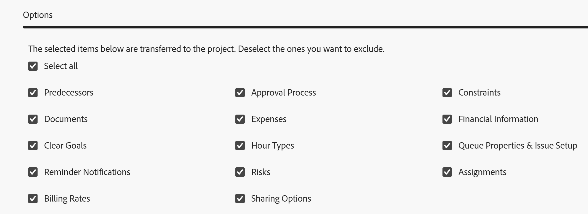
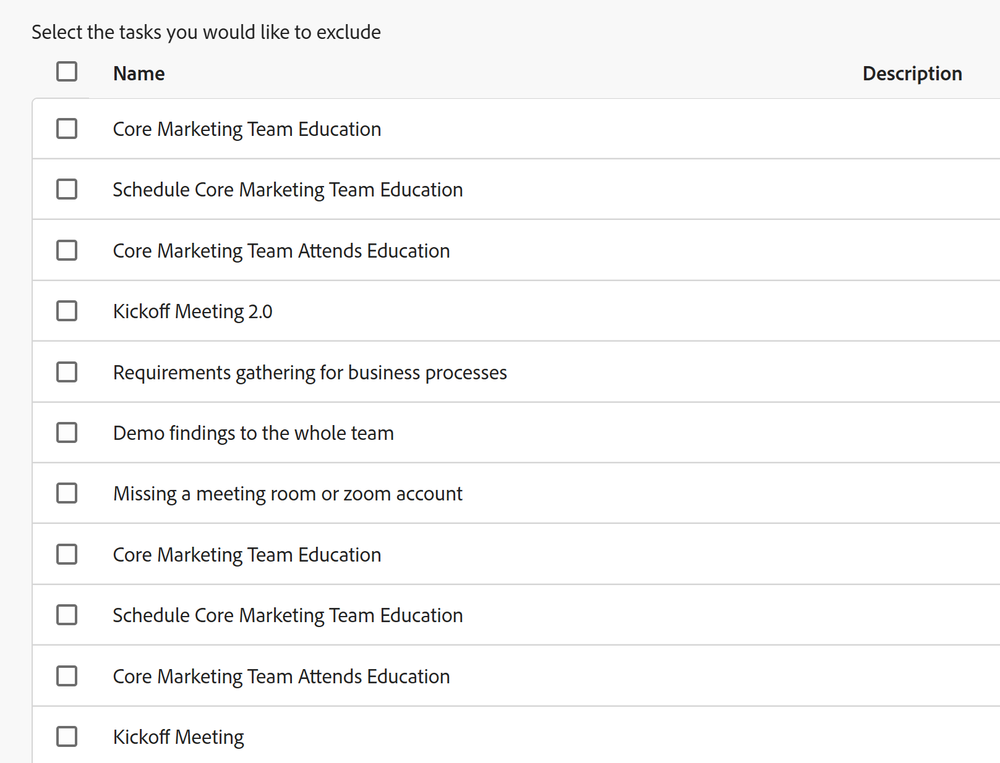

# Vorlage aus Projekt erstellen

<!--Audited: 10/2025-->

<!--

(Note: Keep this article in the Creating and Managing Templates area with the detailed information that this contains. Since this is an article about creating TEMPLATES, this needs to be detailed under Templates; there is a similar article with almost the same title in Managing projects that points to this one - since this functionality is in the UI under Projects, this article must have a presence in that areas as well. Keep both, but make this one the only editable one (iterative))

-->

Beim Speichern eines vorhandenen Projekts als Vorlage können Sie Vorlagen erstellen.

Nachdem Sie ein vorhandenes Projekt als Vorlage gespeichert haben, können Sie die neue Vorlage verwenden, um neue Projekte zu erstellen. Dies vereinfacht und beschleunigt den Projekterstellungsprozess.

>[!NOTE]
>
>Beim Speichern eines Projekts als Vorlage werden die tatsächlichen Daten der Aufgaben und des Projekts nicht für die Vorlage gespeichert.
>
>Eine Vorlage und ihre Aufgaben haben keine tatsächlichen Daten, sondern einen Hinweis darauf, an welchem Tag (ab dem das zukünftige Projekt beginnen könnte) eine Aufgabe beginnen könnte und an welchem Tag sie abgeschlossen werden muss. Wenn Sie Vorlagen zur Erstellung künftiger Projekte verwenden, erhalten die Projekte tatsächliche Termine. Weitere Informationen finden Sie unter [Erstellen eines Projekts](../create-projects/create-project.md).

## Zugriffsanforderungen

+++ Erweitern Sie , um die Zugriffsanforderungen für die -Funktion in diesem Artikel anzuzeigen.

<table style="table-layout:auto"> 
 <col> 
 <col> 
 <tbody> 
  <tr> 
   <td role="rowheader">Adobe Workfront-Paket</td> 
   <td> 
Beliebig
 </td> 
  </tr> 
  <tr> 
   <td role="rowheader">Adobe Workfront-Lizenz</td> 
   <td>
Standard
 
   
Plan
 </td> 
  </tr> 
  <tr> 
   <td role="rowheader">Konfigurationen der Zugriffsebene</td> 
   <td> 
Zugriff auf Vorlagen bearbeiten
</td> 
  </tr> 
  <tr> 
   <td role="rowheader">Objektberechtigungen</td> 
   <td> 
Anzeigen oder Erweitern von Berechtigungen für ein Projekt 
 
Sie erhalten Verwaltungsberechtigungen für die Vorlage, nachdem Sie sie erstellt haben
</td> 
  </tr> 
 </tbody> 
</table>

Weitere Informationen zu den Informationen in dieser Tabelle finden Sie unter [Zugriffsanforderungen in der Dokumentation zu Workfront](/help/quicksilver/administration-and-setup/add-users/access-levels-and-object-permissions/access-level-requirements-in-documentation.md).

+++

<!--Old:
<table style="table-layout:auto"> 
 <col> 
 <col> 
 <tbody> 
  <tr> 
   <td role="rowheader">Adobe Workfront plan*</td> 
   <td> 
Any 
 </td> 
  </tr> 
  <tr> 
   <td role="rowheader">Adobe Workfront license*</td> 
   <td> 
Plan 
 </td> 
  </tr> 
  <tr> 
   <td role="rowheader">Access level configurations*</td> 
   <td> 
Edit access to Templates
 
Note: If you still don't have access, ask your Workfront administrator if they set additional restrictions in your access level. For information on how a Workfront administrator can modify your access level, see <a href="../../../administration-and-setup/add-users/configure-and-grant-access/create-modify-access-levels.md" class="MCXref xref">Create or modify custom access levels</a>.
 </td> 
  </tr> 
  <tr> 
   <td role="rowheader">Object permissions</td> 
   <td> 
View or higher permissions to a project 
 
You obtain Manage permissions to the template after you create it
 
For information on requesting additional access, see <a href="../../../workfront-basics/grant-and-request-access-to-objects/request-access.md" class="MCXref xref">Request access to objects </a>.
 </td> 
  </tr> 
 </tbody> 
</table>-->

## Vorlage aus Projekt erstellen

1. Wechseln Sie zu dem Projekt, das Sie als Vorlage speichern möchten.
1. Klicken Sie auf das **Mehr**-Menü  und dann **Als Vorlage speichern**.
1. Geben Sie die folgenden Informationen für die Vorlage an:

   <table style="table-layout:auto"> 
    <col> 
    <col> 
    <tbody> 
     <tr> 
      <td role="rowheader">Vorlagenname</td> 
      <td>Geben Sie einen Namen für die Vorlage an.</td> 
     </tr> 
     <tr> 
      <td role="rowheader">Beschreibung</td> 
      <td>Geben Sie eine Beschreibung für die Vorlage an.</td> 
     </tr> 
     <tr> 
      <td role="rowheader">Ist aktiv</td> 
      <td> 
Wählen Sie aus den folgenden Optionen aus:
 
       <ul> 
        <li> 
<strong>Ja</strong>: Andere Benutzer können die Vorlage finden und sie an Projekte anhängen.
 </li> 
        <li><strong>Nein</strong>: Andere Benutzer können die Vorlage nicht finden und sie nicht an Projekte anhängen.</li> 
       </ul> </td> 
     </tr> 
    </tbody> 
   </table>

1. Klicken Sie **linken Bedienfeld** Benutzerdefinierte Forms&quot;.
1. Klicken Sie auf **Feld „Benutzerdefiniertes Formular**&quot; und geben Sie entweder den Namen eines benutzerdefinierten Projekts für ein oder wählen Sie einen in der Liste aus.

   Wenn bereits benutzerdefinierte Formulare mit dem Projekt verknüpft sind, werden alle Informationen in den vorhandenen Feldern aus diesen benutzerdefinierten Formularen auf den Formularen angezeigt.

   Sie können bis zu 10 benutzerdefinierte Formulare in eine Vorlage aufnehmen.

1. Bewegen Sie den Mauszeiger über den Namen eines Formulars und klicken Sie dann, um es per Drag-and-Drop an eine neue Position zu ziehen.

   

1. Klicken Sie **linken** auf „Optionen“ und wählen Sie dann die Felder oder Elemente aus, die Sie an die Vorlage übertragen möchten.

   Standardmäßig sind alle Elemente aktiviert. Nicht ausgewählte Elemente werden nicht in die Vorlage übertragen.

   

1. Klicken Sie **linken** auf „Ausschließen“ und wählen Sie dann alle Aufgaben aus, die Sie aus dem Projekt ausschließen möchten.

   

1. Klicken Sie auf **Beenden und Vorlage speichern.**

   Ihre Vorlage wird jetzt in der Liste der verfügbaren Vorlagen angezeigt. Benutzer können die neue Vorlage entweder an ein vorhandenes Projekt anhängen oder sie zum Erstellen eines Projekts verwenden.

