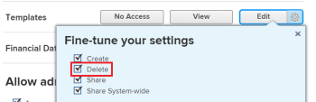
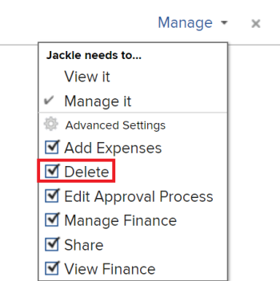

# Löschen von Projektvorlagen

Es wird empfohlen, Vorlagen, die Sie nicht mehr verwenden, zu deaktivieren, anstatt sie zu löschen, damit Sie über einen längeren Zeitraum historische Informationen über Ihre Projekte behalten können. Informationen zum Deaktivieren einer Vorlage finden Sie unter [Projektvorlagen bearbeiten](../../../manage-work/projects/create-and-manage-templates/edit-templates.md).

>[!IMPORTANT]
>
>Wenn Sie eine Vorlage löschen, werden die Projekte, die diese Vorlage verwenden, in keiner Weise geändert. Der Name der ursprünglichen Vorlage wird jedoch nicht mehr im Feld Vorlage des Projekts angezeigt. Darüber hinaus können Sie die Namen der Vorlagenaufgaben für die Aufgaben im Projekt nicht mehr in einer Aufgabenansicht anzeigen. Das Vorlagenfeld im Projekt und das Vorlagenaufgabenfeld in den Aufgaben bleiben leer, nachdem die ursprünglich mit dem Projekt verknüpfte Vorlage gelöscht wurde.

## Zugriffsanforderungen

+++ Erweitern, um die Zugriffsanforderungen für die in diesem Artikel beschriebene Funktionalität anzuzeigen.

<table style="table-layout:auto"> 
 <col> 
 <col> 
 <tbody> 
  <tr> 
   <td role="rowheader">Adobe Workfront-Paket</td> 
   <td> 
Beliebig
 </td> 
  </tr> 
  <tr> 
   <td role="rowheader">Adobe Workfront-Lizenz</td> 
   <td>
Standard
 
   
Abo
 </td> 
  </tr> 
  <tr> 
   <td role="rowheader">Konfigurationen der Zugriffsebene</td> 
   <td> 
Bearbeiten des Zugriffs auf Vorlagen, der den Zugriff auf „Löschen“ umfasst
 <td> 
  </tr> 
  <tr> 
   <td role="rowheader">Objektberechtigungen</td> 
   <td> 
Verwalten Sie Berechtigungen für die Vorlage, die Berechtigungen zum Löschen enthält
</td> 
  </tr> 
 </tbody> 
</table>

Weitere Informationen finden Sie unter [Zugriffsanforderungen in der Dokumentation zu Workfront](/help/quicksilver/administration-and-setup/add-users/access-levels-and-object-permissions/access-level-requirements-in-documentation.md).

+++

<!--
Old:

<table style="table-layout:auto"> 
 <col> 
 <col> 
 <tbody> 
  <tr> 
   <td role="rowheader">Adobe Workfront plan*</td> 
   <td> 
Any
 </td> 
  </tr> 
  <tr> 
   <td role="rowheader">Adobe Workfront license*</td> 
   <td> 
Plan 
 </td> 
  </tr> 
  <tr> 
   <td role="rowheader">Access level configurations*</td> 
   <td> 
Edit access to Templates that includes access to Delete
 
  
 
Note: If you still don't have access, ask your Workfront administrator if they set additional restrictions in your access level. For information on how a Workfront administrator can modify your access level, see <a href="../../../administration-and-setup/add-users/configure-and-grant-access/create-modify-access-levels.md" class="MCXref xref">Create or modify custom access levels</a>.
 </td> 
  </tr> 
  <tr> 
   <td role="rowheader">Object permissions</td> 
   <td> 
Manage permissions to the template that includes permissions to Delete it
 
  
 
For information on requesting additional access, see <a href="../../../workfront-basics/grant-and-request-access-to-objects/request-access.md" class="MCXref xref">Request access to objects </a>.
 </td> 
  </tr> 
 </tbody> 
</table>
-->

## Überlegungen zum Löschen von Vorlagen

* Die Aufgaben, die Projekten beim Anhängen der Vorlage hinzugefügt wurden, verbleiben in den Projekten. Die mit den Aufgaben verknüpften Vorlagenaufgabeninformationen werden jedoch gelöscht.
* Der Name der Vorlage wird nicht mehr im Feld **Vorlage** auf der Unterregisterkarte **Übersicht** des Projekts aufgeführt.

* Sie können eine kürzlich gelöschte Vorlage aus dem Papierkorb wiederherstellen. Weitere Informationen zum Wiederherstellen von Elementen aus dem Papierkorb finden Sie unter [Wiederherstellen gelöschter Elemente](../../../administration-and-setup/manage-workfront/manage-deleted-items/restore-deleted-items.md).

## Löschen einer Vorlage

{{step1-to-templates}}

Dadurch wird eine Liste von Vorlagen geöffnet

1. Wählen Sie die zu löschende Vorlage aus, indem Sie das Kontrollkästchen links neben dem Vorlagennamen aktivieren und dann auf **Löschen > Ja, Löschen** klicken, um den Löschvorgang zu bestätigen.

   ODER

   Klicken Sie auf den Namen einer Vorlage, um darauf zuzugreifen, und klicken Sie dann auf das Menü **Mehr** , dann auf **Vorlage löschen > Ja, löschen**.

   Die Vorlage kann nicht mehr mit einem Projekt verknüpft werden.
