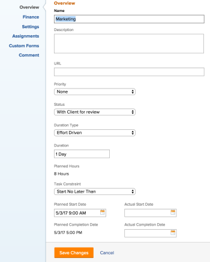

# Vorlagenaufgaben bearbeiten

<!--Audited: 11/2025-->

<!--take out production and preview references and new/ old experiences at release-->

<!--
 

The highlighted information on this page refers to functionality not yet generally available. It is available only in the Preview environment for all customers. The same features will also be available in the Production environment for all customers starting with a week from the Preview release.      

For more information, see [Interface modernization](/help/quicksilver/product-announcements/product-releases/interface-modernization/interface-modernization.md).  

-->

Nachdem Sie eine Vorlage erstellt haben, können Sie die Informationen zu den Vorlagenaufgaben bearbeiten. Die Informationen, die Sie bei einer Vorlagenaufgabe aktualisieren, werden mit Projektaufgaben verknüpft, nachdem Sie die Vorlage zum Erstellen eines Projekts oder zum Anhängen der Vorlage an ein Projekt verwendet haben.

Informationen zum Erstellen einer Vorlage finden Sie unter [Erstellen einer Projektvorlage](../../../manage-work/projects/create-and-manage-templates/create-template.md).

Sie können jeweils nur eine Vorlagenaufgabe bearbeiten oder Vorlagenaufgaben stapelweise bearbeiten.

>[!NOTE]
>
>Vorlagenaufgaben, die zu verschiedenen Vorlagen gehören, können nicht stapelweise bearbeitet werden. Sie können nur Vorlagenaufgaben bearbeiten, die derselben Vorlage angehören.

## Zugriffsanforderungen

+++ Erweitern, um die Zugriffsanforderungen für die in diesem Artikel beschriebene Funktionalität anzuzeigen.

<table style="table-layout:auto"> 
 <col> 
 <col> 
 <tbody> 
  <tr> 
   <td role="rowheader">Adobe Workfront-Paket</td> 
   <td> 
Beliebig
 </td> 
  </tr> 
  <tr> 
   <td role="rowheader">Adobe Workfront-Lizenz</td> 
   <td> 
Standard

   
Plan 
</td> 
  </tr> 
  <tr> 
   <td role="rowheader">Konfiguration der Zugriffsebene</td> 
   <td> 
Zugriff auf Vorlagen bearbeiten
  </td> 
  </tr> 
  <tr> 
   <td role="rowheader">Objektberechtigungen </td> 
   <td> 
Verwalten von Berechtigungen für eine Vorlage. 
 
Sie können eine Vorlagenaufgabe nicht freigeben. 
 </td> 
  </tr> 
 </tbody> 
</table>

Weitere Informationen finden Sie unter [Zugriffsanforderungen in der Dokumentation zu Workfront](/help/quicksilver/administration-and-setup/add-users/access-levels-and-object-permissions/access-level-requirements-in-documentation.md).

+++

<!--Old:

<table style="table-layout:auto"> 
 <col> 
 <col> 
 <tbody> 
  <tr> 
   <td role="rowheader">Adobe Workfront plan</td> 
   <td> 
Any
 </td> 
  </tr> 
  <tr> 
   <td role="rowheader">Adobe Workfront license*</td> 
   <td> 
Standard 

   
Plan 
 </td> 
  </tr> 
  <tr> 
   <td role="rowheader">Access level</td> 
   <td> 
Edit access to Templates
  </td> 
  </tr> 
  <tr> 
   <td role="rowheader">Object permissions </td> 
   <td> 
Manage permissions for a template. 
 
You cannot share a template task. 
 </td> 
  </tr> 
 </tbody> 
</table>-->

## Voraussetzungen

Bevor Sie beginnen, müssen Sie

* Erstellen Sie eine Vorlage.

  Informationen zum Erstellen einer Vorlage finden Sie unter [Erstellen einer Projektvorlage](../../../manage-work/projects/create-and-manage-templates/create-template.md).

## Vorlagenaufgaben bearbeiten

Sie können eine Vorlagenaufgabe mithilfe der Bereiche Vorlagenaufgabe bearbeiten oder Vorlagenaufgaben-Details bearbeiten.

{{step1-to-templates}}

1. Klicken Sie auf den Namen einer Vorlage, um sie zu öffnen.
1. Klicken Sie **linken Bedienfeld** Vorlagenaufgaben“.
1. Klicken Sie auf den Namen einer Vorlagenaufgabe in der Liste, um die Vorlagenaufgabe zu öffnen.
1. Gehen Sie wie folgt vor, um eingeschränkte Informationen zur Vorlagenaufgabe zu bearbeiten:
   1. (Optional) Klicken Sie **linken** auf „Updates“, um der Vorlagenaufgabe Aktualisierungen hinzuzufügen. Vorlagenaufgaben-Aktualisierungen werden nicht in Projektaufgaben übertragen, wenn die Vorlage zum Erstellen eines Projekts verwendet wird.
   1. (Optional) Klicken Sie **linken** auf „Dokumente“, um der Vorlagenaufgabe Dokumente hinzuzufügen. Die Dokumente werden an die Projektaufgaben übertragen, wenn Sie die Vorlage zum Erstellen des Projekts verwenden.
   1. (Bedingt) Um eingeschränkte Informationen zu einer Vorlagenaufgabe zu bearbeiten, klicken Sie im linken Bereich auf **Vorlagenaufgabendetails** und gehen Sie dann in die Bereiche des Abschnitts Details , um Informationen für die einzelnen Bereiche zu bearbeiten.
   1. (Optional) Führen Sie einen der folgenden Schritte aus:
      * Klicken Sie auf das **Alle reduzieren**-Symbol , um alle Bereiche zu reduzieren.
      * Klicken Sie auf **Bearbeiten**-Symbol  und wählen Sie dann einen der folgenden Bereiche aus oder klicken Sie auf **Alle bearbeiten**, um Informationen in allen Bereichen zu bearbeiten:

         * Übersicht
         * Benutzerdefinierte Forms
Namen von benutzerdefinierten Formularen werden nur angezeigt, wenn der Vorlagenaufgabe benutzerdefinierte Formulare beigefügt sind.
         * Finanzielle Details

        >[!TIP]
        >
        >Um Informationen zu allen Feldern zu erhalten, die im Bereich Details angezeigt werden, setzen Sie den Vorgang mit Bearbeiten aller Felder im Feld Vorlagenaufgabe bearbeiten fort, wie unten beschrieben.

   1. (Optional) Klicken Sie im linken Bereich auf **Teilaufgaben**, um untergeordnete Elemente für die Vorlagenaufgabe hinzuzufügen. Das Hinzufügen von Teilaufgaben für Vorlagenaufgaben ähnelt dem Hinzufügen von Projektaufgaben-Teilaufgaben. Weitere Informationen finden Sie im Abschnitt „Erstellen von Teilaufgaben aus dem Abschnitt „Teilaufgaben“ im Artikel [Erstellen von Teilaufgaben](/help/quicksilver/manage-work/tasks/create-tasks/create-subtasks.md).
   1. (Optional) Klicken Sie **linken** auf „Ausgaben“ und fügen Sie den Vorlagenaufgaben Kosten hinzu. Kosten für Vorlagenaufgaben werden auf zukünftige Projektaufgaben übertragen, wenn die Vorlage zum Erstellen eines Projekts verwendet wird.
   1. (Optional) Klicken Sie **linken** auf „Genehmigungen“, um Genehmigungen zu erstellen oder den Vorlagenaufgaben globale Genehmigungen oder Genehmigungen auf Gruppenebene beizufügen. Die Genehmigungen werden auf zukünftige Projektaufgaben übertragen.
   1. (Optional) Klicken Sie im linken Bereich auf **Vorgänger**, um Vorgänger für die Vorlagenaufgaben hinzuzufügen. Das Hinzufügen von Vorlagenaufgabe-Vorgängern ähnelt dem Hinzufügen von Projektaufgaben-Vorgängern. Weitere Informationen finden Sie unter [Erstellen einer Vorgängerbeziehung im Bereich Vorgänger](/help/quicksilver/manage-work/tasks/use-prdcssrs/create-predecessors-in-predecessors-area.md).

1. (Bedingt) Um alle Informationen zu einer Vorlagenaufgabe oder zu mehreren Aufgaben gleichzeitig zu bearbeiten, wählen Sie diese aus einer Liste aus und klicken Sie dann oben in der Liste auf das Symbol **Bearbeiten** .

   Das **Vorlagenaufgabe bearbeiten** wird angezeigt.

   

   >[!TIP]
   >
   >Sie können auch eine Vorlagenaufgabe in einer Liste auswählen und dann rechts neben dem Namen der Vorlagenaufgabe in der Kopfzeile auf **Bearbeiten** klicken, um das Feld **Vorlagenaufgabe bearbeiten** zu öffnen.

1. Erwägen Sie, Informationen in einem der folgenden Abschnitte anzugeben:

* [Name der Vorlagenaufgabe](#template-task-name)
* [Übersicht](#overview)
* [Arbeitsaufträge](#assignments)
* [Finanzielle Details](#finance)
* [Benutzerdefinierte Formulare](#custom-forms)
* [Einstellungen](#settings)
* [Kommentar](#comment)

1. Fahren Sie mit der Bearbeitung der Vorlagenaufgaben wie in den folgenden Abschnitten beschrieben fort.

### Name der Vorlagenaufgabe

>[!TIP]
>
>Der Abschnitt „Name der Vorlagenaufgabe“ ist nicht verfügbar, wenn Vorlagenaufgaben stapelweise bearbeitet werden.

1. Beginnen Sie mit der Bearbeitung einer Vorlagenaufgabe, wie oben beschrieben.
1. Klicken Sie im Feld Vorlagenaufgabe bearbeiten auf **Name der Vorlagenaufgabe** und fügen Sie einen Namen für die Vorlagenaufgabe hinzu.

   Diese Ansicht ist nicht verfügbar, wenn Vorlagenaufgaben stapelweise bearbeitet werden.

1. (Optional) Fahren Sie je nach den Informationen, die Sie ändern möchten, mit der Bearbeitung der folgenden Abschnitte fort.

   ODER

   Klicken Sie auf **Speichern**.

### Übersicht {#overview}

1. Beginnen Sie mit der Bearbeitung einer Vorlagenaufgabe, wie oben beschrieben.
1. Klicken Sie **Feld „Vorlagenaufgabe bearbeiten** im linken Bereich auf **Übersicht**.

   

1. Aktualisieren Sie eines der folgenden:

   <table style="table-layout:auto"> 
    <col> 
    <col> 
    <tbody> 
     <tr> 
      <td role="rowheader"><strong>Beschreibung</strong> </td> 
      <td>Fügen Sie zusätzliche Informationen zur Vorlagenaufgabe hinzu.</td> 
     </tr> 
     <tr> 
      <td role="rowheader"><strong>Priorität</strong> </td> 
      <td> 
Dies ist eine visuelle Markierung, mit der Sie Ihre Vorlagenaufgaben priorisieren können. 
 
Wählen Sie aus den folgenden Optionen aus:
 
       <ul> 
        <li> 
<strong>Kein</strong> 
 </li> 
        <li> 
<strong>Niedrig</strong> 
 </li> 
        <li> 
 <b>normal</b>
 </li> 
        <li> 
<b>Hoch</b> 
 </li> 
        <li> 
<b>Dringlich</b> 
 </li> 
       </ul> 
Je nach den vom Workfront-Administrator ausgewählten Projektvoreinstellungen können die Namen der Prioritäten für Sie unterschiedlich sein. Weitere Informationen zum Bearbeiten von Prioritäten finden Sie unter <a href="../../../administration-and-setup/customize-workfront/creating-custom-status-and-priority-labels/create-customize-priorities.md" class="MCXref xref">Erstellen und Anpassen von Prioritäten</a>.
 </td> 
     </tr> 
     <tr> 
      <td role="rowheader"><strong>Aufgabenbeschränkung</strong> </td> 
      <td> 
Die Aufgabe für das Projekt, die aus dieser Vorlage erstellt wurde, unterliegt dieser Einschränkung. Aufgabeneinschränkungen identifizieren, wann eine Aufgabe abgeschlossen werden muss. 
 
Wählen Sie aus den folgenden Optionen aus:
 
       <ul> 
        <li><strong>Feste Daten</strong>. Geben Sie <strong> „Geplanter Start</strong> und ein <strong>Geplantes Abschlussdatum“ an</strong></li> 
        <li><strong>Muss beginnen am</strong>. Geben Sie <strong>Geplantes Startdatum“ an</strong></li> 
        <li><strong>Muss beendet werden am</strong>. Geben Sie <strong> „Geplantes Abschlussdatum“ </strong>.</li> 
        <li><strong>So bald wie möglich</strong> </li> 
        <li><strong>So spät wie möglich</strong> </li> 
        <li style="font-weight: bold;"><strong>Früheste verfügbare Zeit</strong> </li> 
        <li style="font-weight: bold;"><strong>Letzte verfügbare Zeit</strong> </li> 
        <li>Start nicht später als. Geben Sie <strong>Geplantes Startdatum“ </strong>.</li> 
        <li><strong>Start nicht früher als</strong>. Geben Sie <strong>Geplantes Startdatum“ </strong>.</li> 
        <li><strong>Beenden Sie spätestens</strong>. Geben Sie <strong> „Geplantes Abschlussdatum“ </strong>.</li> 
        <li><strong>Beenden Sie nicht früher als</strong>. Geben Sie <strong> „Geplantes Abschlussdatum“ </strong>.</li> 
       </ul> 
Weitere Informationen zur Aufgabenbeschränkung finden Sie unter <a href="../../../manage-work/tasks/task-constraints/task-constraint-overview.md" class="MCXref xref">Aufgabenbeschränkung - Übersicht</a>.
 </td> 
     </tr> 
     <tr> 
      <td role="rowheader">Starttag (optional und bedingt) </td> 
      <td> 
 Sie können den Starttag einer Vorlagenaufgabe nur angeben, wenn die Aufgabenbeschränkung eine der folgenden ist:
 
       <ul> 
        <li>Muss beginnen am</li> 
        <li>Nicht früher anfangen als</li> 
        <li>Nicht später anfangen als</li> 
        <li>Feste Daten</li> 
       </ul> 
Dies entspricht dem Datum innerhalb der Zeitleiste des zukünftigen Projekts, an dem die Aufgabe gestartet wird. Für alle anderen Einschränkungen berechnet Workfront den Starttag basierend auf der Abhängigkeit der Vorgänger zwischen den Aufgaben. 
 </td> 
     </tr> 
     <tr> 
      <td role="rowheader"><strong>Abschlusstag</strong> (optional und bedingt) </td> 
      <td> 
 Sie können den Abschlusstag einer Vorlagenaufgabe nur angeben, wenn die Aufgabenbeschränkung eine der folgenden ist:
 
       <ul style="list-style-type: circle;"> 
        <li>Muss beendet werden am</li> 
        <li>Nicht früher beenden als (NFBA)</li> 
        <li>Nicht später beenden als (NSBA)</li> 
        <li>Feste Daten</li> 
       </ul> 
Dies entspricht dem Datum innerhalb der Zeitleiste des zukünftigen Projekts, an dem die Aufgabe abgeschlossen wird. Für alle anderen Einschränkungen berechnet Workfront den Abschlusstag anhand der Dauer und der Vorgängerabhängigkeit. 
 </td> 
     </tr> 
     <tr> 
      <td role="rowheader"><strong>URL</strong> </td> 
      <td>Geben Sie einen Weblink an, der sich auf die Informationen zur Vorlagenaufgabe bezieht.</td> 
     </tr>

   <tr> 
      <td role="rowheader"><strong>Work Effort</strong> </td> 
      <td>Wählen Sie aus den folgenden Optionen:
      <ul><li>Klein</li>
      <li>Mittel</li>
      <li>Groß</li></ul>

   
<b>WICHTIG</b>

      
Das Feld Work Effort wird beim Bearbeiten einer Vorlagenaufgabe nur angezeigt, wenn Sie beim Bearbeiten der Vorlage die Einstellung <b>Work Effort zur automatischen Berechnung der geplanten Stunden </b> Aufgabe verwenden auswählen.

   </td> 
     </tr> 
     </tbody> 
   </table>

1. (Optional) Fahren Sie je nach den Informationen, die Sie ändern möchten, mit der Bearbeitung der folgenden Abschnitte fort.

   ODER

   Klicken Sie auf **Speichern**.

### Arbeitsaufträge {#assignments}

1. Beginnen Sie mit der Bearbeitung Ihrer Vorlagenaufgabe, wie oben beschrieben.
1. Klicken Sie **linken** auf „Arbeitsaufträge“.

   Der **Arbeitsaufträge** wird geöffnet.

   

1. Beginnen Sie mit der Eingabe des Namens eines Benutzers, Aufgabengebiets oder Teams in das Feld **Personen, Rollen oder Teams suchen** und wählen Sie sie aus, wenn sie in der Liste angezeigt werden.

1. Aktualisieren Sie die folgenden Informationen:

   <table style="table-layout:auto"> 
   <col> 
   <col> 
   <tbody> 
   <tr> 
   <td role="rowheader">Dauertyp</td> 
   <td> 
Dadurch wird die Beziehung zwischen folgenden Elementen identifiziert: 
 
   <ul> 
   <li> 
Die Anzahl der Ressourcen, die einer Aufgabe zugewiesen sind 
 </li> 
   <li> 
Der Gesamtaufwand, der zum Abschließen der Aufgabe erforderlich ist 
 </li> 
   <li> 
 Die Gesamtdauer der Aufgabe. 
 </li> 
   </ul> 
Ihr Workfront-Administrator oder ein Gruppenadministrator wählt die Standardeinstellung für den Dauertyp für die Aufgaben in Ihrem System oder Ihrer Gruppe aus. Informationen zum Festlegen von Projektstandards finden Sie <a href="../../../administration-and-setup/set-up-workfront/configure-system-defaults/set-task-issue-preferences.md" class="MCXref xref">Konfigurieren von systemweiten Aufgaben- und Problemvoreinstellungen</a>. 
 
Mit Dauertypen können Sie konsistente Ressourcenzuweisungen auf der Grundlage der Anforderungen der Aufgabe festlegen. Weitere Informationen zum Dauertyp einer Aufgabe finden Sie unter <a href="../../../manage-work/tasks/taskdurtn/task-duration-and-duration-type.md" class="MCXref xref">Übersicht über die Aufgabendauer und den Dauertyp</a>. 
 
Wählen Sie aus den folgenden Optionen aus: 
 
   <ul> 
   <li> 
Berechnete Zuweisung 
 </li> 
   <li> 
 Berechnete Arbeit 
 </li> 
   <li> 
Leistungsgesteuert 
 </li> 
   <li> 
Einfach
 </li> 
   </ul> </td> 
   </tr> 
   <tr data-mc-conditions="QuicksilverOrClassic.Quicksilver"> 
   <td role="rowheader">Dauer pro Termin</td> 
   <td> 
Wird nur für das übergeordnete Element der wiederkehrenden Aufgaben angezeigt. Sie zeigt die Dauer jeder wiederkehrenden Aufgabe an, wie sie bei der Erstellung der Aufgabe definiert wurde. Informationen zum Erstellen wiederkehrender Aufgaben finden Sie unter <a href="../../../manage-work/tasks/create-tasks/create-recurring-tasks.md" class="MCXref xref">Wiederkehrende Aufgaben erstellen</a>. 
 
 <b>HINWEIS</b>

   In einzelnen wiederkehrenden Aufgaben geänderte Dauer zeigt nicht den in diesem Feld angegebenen Wert an. 
 </td>
   </tr> 
   <tr> 
   <td role="rowheader">Dauer</td> 
   <td> 
   
 
   
 
   
Dies ist der Zeitraum, den Sie einer Aufgabe erlauben, offen zu bleiben, bevor sie abgeschlossen ist. 
 
   
<b>WICHTIG</b>

   
Da die Aufgabendauer in der Regel die Zeit zwischen dem geplanten Start- und dem geplanten Abschlussdatum ist, wirkt sich dies auf die Zeitleiste des Projekts aus.
 
   
Gehen Sie wie folgt vor, um die Dauer der Aufgabe und die Zeiteinheit anzugeben:
 
   <ul> 
   <li> 
Geben Sie die Zeitdauer ein und wählen Sie aus den verfügbaren Zeiteinheiten im Dropdown-Menü aus.
 
<b>TIPP</b>

   Wenn Sie die Dauer von Aufgaben in einer Aufgabenliste aktualisieren, können Sie die Abkürzung für die Zeiteinheit verwenden. 
 </li> 
   </ul> 
   
 In der folgenden Tabelle können Sie zwischen den Optionen „Reguläre Zeit“ und „Verstrichene Zeit“ wählen: 
 
   <table style="table-layout:auto"> 
   <col> 
   <col data-mc-conditions=""> 
   <tbody> 
   <tr> 
   <td>Zeiteinheit</td> 
   <td>Abkürzung</td> 
   </tr> 
   <tr> 
   <td>Minutes</td> 
   <td>M</td> 
   </tr> 
   <tr> 
   <td>Stunden</td> 
   <td>H</td> 
   </tr> 
   <tr> 
   <td>Tage. Dies ist der Standardwert. </td> 
   <td>D</td> 
   </tr> 
   <tr> 
   <td>Weeks</td> 
   <td>W</td> 
   </tr> 
   <tr> 
   <td>Months</td> 
   <td>T</td> 
   </tr> 
   <tr> 
   <td>Verstrichene Minuten</td> 
   <td>EM</td> 
   </tr> 
   <tr> 
   <td>Verstrichene Stunden</td> 
   <td>EH</td> 
   </tr> 
   <tr> 
   <td>Verstrichene Tage</td> 
   <td>ED</td> 
   </tr> 
   <tr> 
   <td>Verstrichene Wochen</td> 
   <td>EW</td> 
   </tr> 
   <tr> 
   <td>Verstrichene Monate</td> 
   <td>ET</td> 
   </tr> 
   </tbody> 
   </table>

   
<b>NOTIZ</b>

   
Verstrichene Zeit ist eine Zeiteinheit für die Dauer einer Aufgabe. Dies ist die Zeit zwischen dem geplanten Startdatum und dem geplanten Abschlussdatum einer Aufgabe, die Feiertage, Wochenenden und Ausfallzeiten umfasst. Mit anderen Worten: Verstrichene Zeit ist der Ablauf von Kalendertagen.

   Die reguläre Zeit berücksichtigt Feiertage, Wochenenden und Auszeiten und schließt sie von der Dauer der Aufgabe aus. Weitere Informationen zur Aufgabendauer finden Sie unter <a href="../../../manage-work/tasks/taskdurtn/task-duration-and-duration-type.md" class="MCXref xref">Übersicht über die Aufgabendauer und den </a>). 

   
 
   
 </td> 
   </tr> 
   <tr> 
   <td role="rowheader">Geplante Stunden</td> 
   <td> 
Anzahl der geplanten Stunden für die Aufgabe angeben (in Stunden) Dies ist die tatsächliche Zeit, die die Verantwortlichen für die Aufgabe benötigen würden, um diese abzuschließen. Sie können die Anzahl der geplanten Stunden für eine Aufgabe nur angeben, wenn als Dauertyp Berechnete Zuweisung festgelegt ist. Weitere Informationen zu Dauertypen finden Sie unter <a href="../../../manage-work/tasks/taskdurtn/task-duration-and-duration-type.md" class="MCXref xref">Übersicht über Aufgabendauer und Dauertyp</a>.
 
   <b>HINWEIS</b>
   

   Beim Erstellen wiederkehrender Aufgaben sind die geplanten Stunden die Stunden für jedes Vorkommen. Die geplanten Stunden der übergeordneten Aufgaben sind die Summe aller geplanten Stunden aus allen Vorfällen. Informationen zum Erstellen wiederkehrender Aufgaben finden Sie unter <a href="../../../manage-work/tasks/create-tasks/create-recurring-tasks.md" class="MCXref xref">Wiederkehrende Aufgaben erstellen</a>.
   

   </td> 
   </tr> 
   <tr> 
   <td role="rowheader">Zuteilung</td> 
   <td> 
Wenn Ihre Aufgabenbeschränkung auf „Berechnete Arbeit“ oder „Arbeitsaufwand“ basiert, geben Sie <strong>Zuordnung %</strong> (Zuordnungsprozentsatz) für jeden Zugewiesenen an. Dies ist die Zeit aus dem Zeitplan des Verantwortlichen, die er für diese Aufgabe aufwenden kann. Wenn Sie den Zuordnungsprozentsatz für einen Verantwortlichen ändern, werden auch die geplanten Stunden einer Aufgabe geändert. 
 
Wenn die Aufgabenbeschränkung einfach ist, können Sie Folgendes angeben:
 
   <ul> 
   <li> 
Zuweisungsstunden jedes Zugewiesenen.
 </li> 
   <li> 
Geplante Stunden der Aufgabe
 </li> 
   <li> 
Dauer der Aufgabe
 </li> 
   </ul> </td> 
   </tr> 
   <tr> 
   <td role="rowheader">Rolle des Zugewiesenen</td> 
   <td> 
Wählen Sie eine Rolle aus dem Dropdown<strong>Menü „Rolle des Verantwortlichen</strong> aus, wenn Sie eine Person als Verantwortlicher ausgewählt haben. Dies ist die Rolle, die der Verantwortliche bei dieser Aufgabe erfüllen kann. 
 
<b>TIPP</b>

   Im Dropdown-Menü werden nur die Aufgabengebiete angezeigt, die jedem Bearbeiter in seinem Profil zugeordnet sind.
 </td>
   </tr> 
   </tbody> 
   </table>
1. Bewegen Sie den Mauszeiger über den Namen eines Verantwortlichen und klicken Sie auf **Primär**. Dies wird der **Inhaber** der zukünftigen Projektaufgabe sein.

   >[!TIP]
   >
   >Teams können nicht als Eigentümer oder primäre Zuweisung von Aufgaben oder Vorlagenaufgaben bestimmt werden.

1. Klicken **auf &quot;**&quot; oder fahren Sie mit den folgenden Abschnitten fort.

### Finanzielle Details {#finance-2}

1. Beginnen Sie mit der Bearbeitung einer Vorlagenaufgabe, wie oben beschrieben.
1. Klicken Sie **Feld „Vorlagenaufgabe bearbeiten** im linken **auf** Finanzen“.

   

1. Aktualisieren Sie eines der folgenden:

   <table style="table-layout:auto"> 
    <col> 
    <col> 
    <tbody> 
     <tr> 
      <td role="rowheader"><strong>Kostentyp</strong> </td> 
      <td> 
Geben Sie den Kostentyp für die zukünftige Aufgabe an. Dadurch wird bestimmt, wie die Kosten für die Aufgabe basierend auf der Anzahl der Stunden für die Aufgaben berechnet werden. 
 
Wählen Sie aus den folgenden Optionen aus:
 
       <ul> 
        <li> 
Keine Kosten 
 </li> 
        <li> 
Festgelegt pro Stunde 
 </li> 
        <li> 
Benutzer pro Stunde 
 </li> 
        <li> 
Stundensatz nach Funktion 
 </li> 
       </ul> 
Weitere Informationen zur Kostennachverfolgung finden Sie unter <a href="../../../manage-work/projects/project-finances/track-costs.md" class="MCXref xref">Kosten nachverfolgen</a>.
 </td> 
     </tr> 
     <tr> 
      <td role="rowheader"><strong>Umsatztyp</strong> </td> 
      <td> 
Geben Sie den Umsatztyp für die zukünftige Aufgabe an. Dadurch wird bestimmt, wie der Umsatz für die Aufgabe basierend auf der Anzahl der Stunden für die Aufgaben berechnet wird.
 
Wählen Sie aus den folgenden Optionen aus: 
 
       <ul> 
        <li> 
Nicht fakturierbar
 </li> 
        <li> 
Benutzer pro Stunde
 </li> 
        <li> 
Stundensatz nach Funktion
 </li> 
        <li> 
Festgelegt pro Stunde
 </li> 
        <li> 
Benutzende pro Stunde mit Begrenzung
 </li> 
        <li> 
Stundensatz nach Funktion mit Begrenzung
 </li> 
        <li> 
Benutzer pro Stunde plus festgelegt
 </li> 
        <li> 
Stundensatz nach Funktion plus fest
 </li> 
        <li> 
Festeinnahmen
 </li> 
       </ul> 
Weitere Informationen zur Umsatzverfolgung finden Sie unter <a href="../../../manage-work/projects/project-finances/billing-and-revenue-overview.md" class="MCXref xref">Übersicht über Abrechnung und Umsatz</a>.
 </td> 
     </tr> 
    </tbody> 
   </table>

1. (Optional) Fahren Sie je nach den Informationen, die Sie ändern möchten, mit der Bearbeitung der folgenden Abschnitte fort.

   ODER

   Klicken Sie auf **Speichern**.

### Benutzerdefinierte Formulare {#custom-forms-2}

Sie können benutzerdefinierte Formulare definieren, die standardmäßig an Aufgaben angehängt werden, wenn die Aufgaben zu einem Projekt hinzugefügt werden. Informationen dazu, wie Sie das Projekt so einrichten, dass es benutzerdefinierte Formulare für Standardaufgaben enthält, finden Sie im Abschnitt „Aufgaben“ im Artikel [Projekte bearbeiten](../../../manage-work/projects/manage-projects/edit-projects.md).

Sie können auch benutzerdefinierte Formulare zu zukünftigen Aufgaben eines Projekts hinzufügen, wenn das Projekt aus einer Vorlage erstellt wird, indem Sie die benutzerdefinierten Formulare zu den Vorlagenaufgaben hinzufügen.

1. Beginnen Sie mit der Bearbeitung einer Vorlagenaufgabe, wie oben beschrieben.
1. Klicken Sie **Feld „Vorlagenaufgabe bearbeiten** im linken **auf** Benutzerdefinierte Forms&quot;.

   

1. Wählen Sie das oder die benutzerdefinierten Formulare aus, die Sie mit der Vorlagenaufgabe verknüpfen möchten.

   Sie müssen die benutzerdefinierten Formulare erstellen, bevor sie in diesem Feld ausgewählt werden können.
In der Liste werden nur aktive benutzerdefinierte Formulare angezeigt.

   Weitere Informationen zum Erstellen benutzerdefinierter Formulare finden Sie unter [Erstellen eines benutzerdefinierten Formulars](/help/quicksilver/administration-and-setup/customize-workfront/create-manage-custom-forms/form-designer/design-a-form/design-a-form.md).

   Sie können einer Vorlagenaufgabe bis zu zehn benutzerdefinierte Formulare hinzufügen.
Die Formulare werden automatisch zu den Aufgaben hinzugefügt, die aus der Vorlage erstellt wurden.
1. (Bedingt und optional) Wenn Sie ein benutzerdefiniertes Formular an die Vorlagenaufgabe angehängt haben, bearbeiten Sie alle Felder im Formular. Sie müssen alle erforderlichen Felder angeben, bevor Sie die Vorlagenaufgabe speichern können.

   >[!NOTE]
   >
   >Je nachdem, wie der Workfront-Administrator die Berechtigungen für die Abschnitte in Ihrem benutzerdefinierten Formular festgelegt hat, können nicht alle dieselben Felder in einem bestimmten benutzerdefinierten Formular anzeigen oder bearbeiten. Die Berechtigungen zum Bearbeiten von Feldern in einem Abschnitt eines benutzerdefinierten Formulars hängen von den Berechtigungen ab, die Sie für die Vorlagenaufgabe oder die zukünftige Aufgabe haben.\
   >Informationen zum Festlegen von Berechtigungen für Abschnitte eines benutzerdefinierten Formulars finden Sie unter [Freigeben eines benutzerdefinierten Formulars](../../../administration-and-setup/customize-workfront/create-manage-custom-forms/share-access-to-a-custom-form.md).\
   >Informationen zum Festlegen von Aufgabenberechtigungen finden Sie unter [Freigeben einer Aufgabe](../../../workfront-basics/grant-and-request-access-to-objects/share-a-task.md).\
   >Informationen zum Festlegen von Vorlagenberechtigungen finden Sie unter [Freigeben einer Vorlage](../../../workfront-basics/grant-and-request-access-to-objects/share-a-template.md).

1. (Optional) Fahren Sie je nach den Informationen, die Sie ändern möchten, mit der Bearbeitung des folgenden Abschnitts fort.

   ODER

   Klicken Sie auf **Speichern**.

### Einstellungen {#settings-2}

1. Beginnen Sie mit der Bearbeitung einer Vorlagenaufgabe, wie oben beschrieben.
1. Klicken Sie **Feld „Vorlagenaufgabe bearbeiten** im linken Bereich auf **Einstellungen**.

   

1. Aktualisieren Sie eines der folgenden:

   <table style="table-layout:auto"> 
    <col> 
    <col> 
    <tbody> 
   <tr> 
      <td role="rowheader">
<b>Meilenstein</b>
</strong> </td> 
      <td> 
Einen Meilenstein auswählen, der der ausgewählten Vorlagenaufgabe zugeordnet werden soll.

   
<b>WICHTIG</b>

   
Sie müssen einen Meilensteinpfad mit einer Vorlage verknüpfen, damit dieses Feld angezeigt wird. Weitere Informationen finden Sie unter <a href="../create-and-manage-templates/edit-templates.md">Projektvorlagen bearbeiten</a>.
 
   </td> 
     </tr>
     <tr> 
      <td role="rowheader"><strong>Überwachungsmodus</strong> </td> 
      <td> 
Geben Sie an, wie der Fortschrittsstatus der zukünftigen Aufgabe verfolgt werden soll. 
 
Wählen Sie aus den folgenden Optionen aus:
 
       <ul> 
        <li> 
<strong>Benutzer muss aktualisieren</strong> 
 </li> 
        <li> 
<strong>Angenommen, der Vorgang ist pünktlich</strong> 
 </li> 
        <li> 
<strong>Späte Warnungen ignorieren</strong> 
 </li> 
        <li> 
<strong>AutoVervollständigen</strong> 
 </li> 
        <li> 
<strong>Vorgänger</strong> 
 </li> 
       </ul> 
Weitere Informationen zum Tracking-Modus für Aufgaben finden Sie unter <a href="../../../manage-work/tasks/task-information/task-tracking-mode.md" class="MCXref xref">Übersicht über den Tracking-Modus für Aufgaben</a>.
 </td> 
     </tr> 
     <tr> 
      <td role="rowheader"><strong>Erinnerungsnachrichten</strong> </td> 
      <td> 
Wählen Sie aus, welche Erinnerungsnachrichten Sie an die Vorlagenaufgabe anhängen möchten. Sie werden an zukünftige Aufgaben des Projekts angehängt, das aus dieser Vorlage erstellt wird. Ihr Systemadministrator muss Erinnerungsnachrichten konfigurieren, bevor Sie sie für eine Aufgabe auswählen können. Weitere Informationen zum Konfigurieren von Erinnerungsnachrichten finden Sie unter <a href="../../../administration-and-setup/manage-workfront/emails/set-up-reminder-notifications.md" class="MCXref xref">Einrichten von Erinnerungsnachrichten</a>.
 </td> 
     </tr> 
     <tr> 
      <td role="rowheader"><strong>Genehmigungsprozess</strong> </td> 
      <td> 
Wählen Sie den Genehmigungsprozess aus, den Sie mit der Vorlagenaufgabe verknüpfen möchten. Ihr Workfront-Administrator muss Aufgabengenehmigungsprozesse auf Systemebene definieren, bevor Sie sie mit Vorlagenaufgaben verknüpfen können. Benutzende mit administrativem Zugriff auf Genehmigungsprozesse können auch gruppenspezifische Genehmigungsprozesse erstellen. Weitere Informationen zum Erstellen von Genehmigungsprozessen finden Sie unter <a href="../../../administration-and-setup/customize-workfront/configure-approval-milestone-processes/create-approval-processes.md" class="MCXref xref">Erstellen eines Genehmigungsprozesses für Arbeitselemente</a>.
 
Beachten Sie beim Hinzufügen von Genehmigungsprozessen Folgendes: 
 
       <ul> 
       <li>In der Liste werden nur aktive Genehmigungsprozesse angezeigt. </li> 
       <li> 
In der Liste werden systemweite und gruppenspezifische Genehmigungsprozesse angezeigt. Genehmigungsprozesse, die einer anderen Gruppe als der der Vorlage zugeordnet sind, werden nicht in der Liste angezeigt.
 
Wichtig: Wenn sich die mit der Vorlage verknüpfte Gruppe ändert, wird der gruppenspezifische Genehmigungsprozess zu einem einmaligen Genehmigungsprozess. Weitere Informationen darüber, wie sich Änderungen an der Projektgruppe oder Änderungen im Genehmigungsprozess auf die Genehmigungseinstellungen auswirken, finden Sie unter <a href="../../../administration-and-setup/customize-workfront/configure-approval-milestone-processes/how-changes-affect-group-approvals.md" class="MCXref xref">Wie sich Änderungen an Gruppen- und Genehmigungsprozessen auf zugewiesene Genehmigungsprozesse auswirken</a>. 
 </li> 
       <li> 
Wenn Sie einen Genehmigungsprozess für den einmaligen Gebrauch hinzugefügt haben, wird er in diesem Feld als "&lt;Custom&gt;" angezeigt. Weitere Informationen finden Sie unter <a href="../../../review-and-approve-work/manage-approvals/associate-approval-with-work.md" class="MCXref xref">Verknüpfen eines neuen oder vorhandenen Genehmigungsprozesses mit Arbeit</a>. 
  </li> 
       <li> 
Beim Massenbearbeiten von Vorlagenaufgaben gibt es die folgenden Szenarien:
 
       <ul> 
       <li> 
Wenn Sie Vorlagenaufgaben aus derselben Vorlagengruppe auswählen, werden in diesem Feld sowohl Genehmigungsprozesse auf Systemebene als auch auf Gruppenebene angezeigt.
 </li> 
       <li> 
Wenn Sie Vorlagenaufgaben aus verschiedenen Vorlagengruppen auswählen, werden in diesem Feld nur Genehmigungsprozesse auf Systemebene angezeigt.
 </li> 
       <li> 
Wenn einer der Vorlagenaufgaben ein Genehmigungsprozess für den einmaligen Gebrauch angehängt ist, wird sie durch den von Ihnen ausgewählten Genehmigungsprozess auf - oder  ersetzt. 
 </li> 
       </ul> </li> 
       </ul> </td> 
     </tr>

   </tbody> 
   </table>

1. (Optional) Fahren Sie je nach den Informationen, die Sie ändern möchten, mit der Bearbeitung der folgenden Abschnitte fort.

   ODER

   Klicken Sie auf **Speichern**.

### Kommentar {#comment-2}

1. Beginnen Sie mit der Bearbeitung einer Vorlagenaufgabe, wie oben beschrieben.
1. Klicken Sie **Feld „Vorlagenaufgabe bearbeiten** im linken **auf** Kommentar.

   

1. Geben **im Bereich Aktualisierung zur Vorlagenaufgabe hinzufügen** einen Kommentar an, den Sie im Aktualisierungsprozess der Vorlagenaufgabe im Feld Verfügbar anzeigen möchten. Dieser Kommentar ist für alle sichtbar, die Ansichtszugriff auf die Vorlage und die Vorlagenaufgabe und Zugriff auf Ansichtsnotizen haben.
1. Klicken Sie auf **Speichern**.

   Wenn Sie oder ein anderer Benutzer ein Projekt aus dieser Vorlage erstellt, werden alle Einstellungen, die Sie auf Vorlagenaufgaben angewendet haben, zu den Einstellungen für die Projektaufgaben.

<!--Temporary content for Assignments redesign:

Editing template tasks differs depending on which environment you choose to edit the tasks. 

### Edit template tasks in the Production environment

>[!NOTE]
>
>Some customers can edit template tasks in their Production environments the same way they edit them in their Preview environment.
>
>For information about editing tasks in the Preview environment, see the section [Edit template tasks in the Preview environment](#edit-template-tasks-in-the-preview-environment) in this article. 

You can edit a template task using the Edit Template Task or Template Task Details areas. 

{{step1-to-templates}}

1. Click the name of a template to open it.
1. Click **Template Tasks** in the left panel. 
1. Click the name of a template task in the list to open the template task.
1. To edit limited information about the template task, do the following: 
   1. (Optional) Click **Updates** in the left panel to add updates to the template task. Template task updates do not transfer to project tasks when the template is used to create a project.
   1. (Optional) Click **Documents** in the left panel to add documents to the template task. The documents will transfer to the project tasks when you use the template to create the project. 
   1. (Conditional) To edit limited information about a template task, click **Template Task Details** in the left panel, then go to the areas of the Details section to edit information for each area.
   1. (Optional) Do any of the following: 
      * Click the **Collapse all** icon  to collapse all areas. 
      * Click the **Edit** icon , then select from any of the areas below, or click **Edit all** to edit information in all areas:

         * Overview
         * Custom Forms
            Names of customs forms display only if there are custom forms attached to the template task.
         * Finance

         >[!TIP]
         >
         >For information about all fields that display in the Details area, continue with editing all fields using the Edit Template Task box, as described below.

   1. (Optional) Click the **Subtasks** section in the left panel to add children for the template task. Adding subtasks for template tasks is similar to adding project task subtasks. For information, see the section  "Create subtasks from the task Subtasks section" in the article [Create subtasks](/help/quicksilver/manage-work/tasks/create-tasks/create-subtasks.md). 
   1. (Optional) Click **Expenses** in the left panel, and add expenses to the template tasks. Template task expenses transfer to future project tasks, when the template is used to create a project. 
   1. (Optional) Click **Approvals** in the left panel to create approvals or attach global or group-level approvals to the template tasks. The approvals transfer to future project tasks. 
   1. (Optional) Click the **Predecessors** section in the left panel to add predecessors for the template tasks. Adding template task predecessors is similar to adding project task predecessors. For information, see [Create a predecessor relationship using the Predecessors area](/help/quicksilver/manage-work/tasks/use-prdcssrs/create-predecessors-in-predecessors-area.md). 

1. (Optional) To edit several template tasks in bulk, select multiple template tasks, then click **Edit** at the top of the template list.
1. (Conditional) To edit all information about the template task or about several tasks at the same time, click to select them from a list, then click the **Edit** icon  at the top of the list.

   The **Edit Template Task** box displays in the new experience.

   

   >[!TIP]
   >
   >You can also select a template task in a list, then click **Edit** to the right of the template task name in the header, to open the **Edit Template Task** box.

   Continue editing the template task as described in the [Edit a template task using the new experience](#edit-a-template-task-using-the-new-experience) section in this article.
   
1. (Optional) Click **Switch back to old experience** at the bottom of the **Edit Template Task** box to open the **Edit Template Task** box in the old experience. 

   

1. Consider specifying information in any of the following sections:

   * [Overview](#overview)
   * [Finance](#finance)
   * [Settings](#settings)
   * [Assignments](#assignments)
   * [Custom Forms](#custom-forms)
   * [Comment](#comment)

1. Continue editing the template task as described in the [Edit a template task using the old experience](#edit-a-template-task-using-the-old-experience) section in this article.

#### Edit a template task using the old experience

##### Overview {#overview}

1. Begin editing a template task as described above.
1. Click **Overview**.

   

1. Update any of the following:

   <table style="table-layout:auto"> 
    <col> 
    <col> 
    <tbody> 
     <tr> 
      <td role="rowheader"><strong>Name</strong> </td> 
      <td>Specify a name for the template task. This field does not display when editing template tasks in bulk.</td> 
     </tr> 
     <tr> 
      <td role="rowheader"><strong>Description</strong> </td> 
      <td>Add additional information about the template task.</td> 
     </tr> 
     <tr> 
      <td role="rowheader"><strong>URL</strong> </td> 
      <td>Specify a web link that relates to the information about the template task.</td> 
     </tr> 
     <tr> 
      <td role="rowheader"><strong>Priority</strong> </td> 
      <td> 
This is a visual flag for you which allows you to prioritize your template tasks. 
 
Select from the following options:
 
       <ul> 
        <li> 
<strong>None</strong> 
 </li> 
        <li> 
<strong>Low</strong> 
 </li> 
        <li> 
 <b>Normal</b>
 </li> 
        <li> 
<b>High</b> 
 </li> 
        <li> 
<b>Urgent</b> 
 </li> 
       </ul> 
Depending on the Project Preferences selected by your Workfront administrator, the names of priorities might be different for you. For more information about editing priorities, see <a href="../../../administration-and-setup/customize-workfront/creating-custom-status-and-priority-labels/create-customize-priorities.md" class="MCXref xref">Create and customize priorities</a>.
 </td> 
     </tr> 
     <tr> 
      <td role="rowheader"><strong>Duration Type</strong> </td> 
      <td> 
The future task created from this template will have this Duration Type.  Duration Type identifies the relationship between the following:
 
- number of resources assigned to a task
 
- the total effort required to complete the task
 
- the total duration of the task. 
 
Duration Types enable you to set consistent resource assignments based on the needs of the task. For more information about the Duration Type of a task, see <a href="../../../manage-work/tasks/taskdurtn/task-duration-and-duration-type.md" class="MCXref xref">Overview of Task Duration and Duration Type</a>.
 
Select from the following options:
 
       <ul> 
        <li> 
Calculated Assignment 
 </li> 
        <li> 
Calculated Work 
 </li> 
        <li> 
Effort Driven 
 </li> 
        <li> 
Simple   
 </li> 
       </ul> </td> 
     </tr> 
     <tr> 
      <td role="rowheader"><strong>Duration</strong> </td> 
      <td> 
Specify the Duration of the future tasks, in minutes, hours, days, weeks, or months. The future task created from this template will have the Duration specified here.
 
By default, Workfront measures Duration in days. This is the amount of time that you allow for the task to remain incomplete, before it must be completed. You cannot specify the Duration of a task when the <strong>Duration Type</strong> of the task is <strong>Simple</strong>, or when the <strong>Task Constraint</strong> is <strong>Fixed Dates</strong>.
 
<b>IMPORTANT</b>
 
Duration is typically the amount of time between the Planned Start and the Planned Completion Dates of a template task, and for this reason, it affects the timeline of the template. This determines the timeline of the future project created from the template. 
 </td> 
     </tr> 
     <tr> 
      <td role="rowheader"><strong>Planned Hours</strong> </td> 
      <td> 
Specify the number of Planned Hours for the future task on the project created with this template. This is the amount of actual time it would take the assignees of the task to complete it. You can only specify the number of Planned Hours for a task when the <strong>Duration Type</strong> is set to <strong>Calculated Assignment</strong>. 
 </td> 
     </tr> 
     
     <tr> 
      <td role="rowheader"><strong>Task Constraint</strong> </td> 
      <td> 
The task on the project created from this template will have this constraint. Task Constraints identify when a task must be completed. 
 
Select from the following options:
 
       <ul> 
        <li><strong>Fixed Dates</strong>. Specify a <strong>Planned Start</strong> and a <strong>Planned Completion Date.</strong></li> 
        <li><strong>Must Start On</strong>. Specify a <strong>Planned Start Date.</strong></li> 
        <li><strong>Must Finish On</strong>. Specify a <strong>Planned Completion Date</strong>.</li> 
        <li><strong>As Soon as Possible</strong> </li> 
        <li><strong>As Late as Possible</strong> </li> 
        <li style="font-weight: bold;"><strong>Earliest Available Time</strong> </li> 
        <li style="font-weight: bold;"><strong>Latest Available Time</strong> </li> 
        <li>Start No Later Than. Specify a <strong>Planned Start Date</strong>.</li> 
        <li><strong>Start No Earlier Than</strong>. Specify a <strong>Planned Start Date</strong>.</li> 
        <li><strong>Finish No Later Than</strong>. Specify a <strong>Planned Completion Date</strong>.</li> 
        <li><strong>Finish No Earlier Than</strong>. Specify a <strong>Planned Completion Date</strong>.</li> 
       </ul> 
For more information on Task Constraint, see <a href="../../../manage-work/tasks/task-constraints/task-constraint-overview.md" class="MCXref xref">Task Constraint overview</a>.
 </td> 
     </tr> 
     <tr> 
      <td role="rowheader">Start Day (Optional and conditional) </td> 
      <td> 
 You can specify the Start Day of a template task only when the Task Constraint is one of the following:
 
       <ul> 
        <li>Must Start On</li> 
        <li>Start No Earlier Than</li> 
        <li>Start No Later Than</li> 
        <li>Fixed Dates</li> 
       </ul> 
This will correspond to the date within the timeline of the future project when the task will start. For all other constraints, Workfront calculates the Start Day based on predecessor dependency between the tasks. 
 </td> 
     </tr> 
     <tr> 
      <td role="rowheader"><strong>Completion Day</strong> (Optional and conditional) </td> 
      <td> 
 You can specify the Completion Day of a template task only when the Task Constraint is one of the following:
 
       <ul style="list-style-type: circle;"> 
        <li>Must Finish On</li> 
        <li>Finish No Earlier Than</li> 
        <li>Finish No Later Than</li> 
        <li>Fixed Dates</li> 
       </ul> 
This will correspond to the date within the timeline of the future project when the task will complete. For all other constraints, Workfront calculates the Completion Day based on Duration and predecessor dependency. 
 </td> 
     </tr> 
    </tbody> 
   </table>

1. (Optional) Continue editing the following sections, depending on the information you want to modify.

   Or

   Click **Save Changes**.

##### Finance {#finance}

1. Begin editing a template task as described above.
1. Click **Finance**.

   

1. Update any of the following:

   <table style="table-layout:auto"> 
    <col> 
    <col> 
    <tbody> 
     <tr> 
      <td role="rowheader"><strong>Cost Type</strong> </td> 
      <td> 
Specify the Cost Type for the future task. This is going to determine how the Cost on the task is calculated, based on the number of hours on the tasks. 
 
Select from the following options:
 
       <ul> 
        <li> 
No Cost 
 </li> 
        <li> 
Fixed Hourly 
 </li> 
        <li> 
User Hourly 
 </li> 
        <li> 
Role Hourly 
 </li> 
       </ul> 
For more information about tracking costs, see <a href="../../../manage-work/projects/project-finances/track-costs.md" class="MCXref xref">Track costs</a>.
 </td> 
     </tr> 
     <tr> 
      <td role="rowheader"><strong>Revenue Type</strong> </td> 
      <td> 
Specify the Revenue Type for the future task. This is going to determine how the Revenue on the task is calculated, based on the number of hours on the tasks.
 
Select from the following options: 
 
       <ul> 
        <li> 
Not Billable
 </li> 
        <li> 
User Hourly
 </li> 
        <li> 
Role Hourly
 </li> 
        <li> 
Fixed Hourly
 </li> 
        <li> 
User Hourly w/Cap
 </li> 
        <li> 
Role Hourly w/Cap
 </li> 
        <li> 
User Hourly Plus Fixed
 </li> 
        <li> 
Role Hourly Plus Fixed
 </li> 
        <li> 
Fixed Revenue
 </li> 
       </ul> 
For more information about tracking revenue, see <a href="../../../manage-work/projects/project-finances/billing-and-revenue-overview.md" class="MCXref xref">Overview of Billing and Revenue</a>.
 </td> 
     </tr> 
    </tbody> 
   </table>

1. (Optional) Continue editing the following sections, depending on the information you want to modify.

   Or

   Click **Save Changes**.

##### Settings {#settings}

1. Begin editing a template task as described above.
1. Click **Settings**.

   

1. Update any of the following:

   <table style="table-layout:auto"> 
    <col> 
    <col> 
    <tbody> 
   <tr> 
      <td role="rowheader">
<b>Milestone</b>
</strong> </td> 
      <td> 
Choose a milestone to associate with the selected template task.

      
   
<b>IMPORTANT</b>

   
You must associate a milestone path with a template for this field to display. For more information, see <a href="../create-and-manage-templates/edit-templates.md">Edit project templates</a>.
 
   </td> 
     </tr>
     <tr> 
      <td role="rowheader"><strong>Tracking Mode</strong> </td> 
      <td> 
Specify how the progress status of the future task will be tracked. 
 
Select from the following options:
 
       <ul> 
        <li> 
<strong>User Must Update</strong> 
 </li> 
        <li> 
<strong>Assume on Time</strong> 
 </li> 
        <li> 
<strong>Ignore Late Warnings</strong> 
 </li> 
        <li> 
<strong>Autocomplete</strong> 
 </li> 
        <li> 
<strong>Predecessor</strong> 
 </li> 
       </ul> 
For more information about the Tracking Mode on tasks, see <a href="../../../manage-work/tasks/task-information/task-tracking-mode.md" class="MCXref xref">Task Tracking Mode overview</a>.
 </td> 
     </tr> 
     <tr> 
      <td role="rowheader"><strong>Approval Process</strong> </td> 
      <td> 
Select the approval process you want to associate with the template task. Your Workfront administrator must define system-level task Approval Processes before you can associate them with template tasks. A user with administrative access to Approval processes can also create group-specific approval processes. For more information about creating approval processes, see <a href="../../../administration-and-setup/customize-workfront/configure-approval-milestone-processes/create-approval-processes.md" class="MCXref xref">Create an approval process for work items</a>.
 
Consider the following when adding approval processes: 
 
       <ul> 
       <li>Only active approval processes display in the list. </li> 
       <li> 
System-wide and group-specific approval processes display in the list. Approval processes associated with a group other than that of the template do not display in the list.
 
Important: If the group associated with the template changes, the group-specific approval process becomes a single-use approval process. For more information about how changes to the group of the project or changes in the approval process affect approval settings, see <a href="../../../administration-and-setup/customize-workfront/configure-approval-milestone-processes/how-changes-affect-group-approvals.md" class="MCXref xref">How group and approval process changes affect assigned approval processes</a>. 
 </li> 
       <li> 
If you added a single-use approval process, it displays as "&lt;Custom&gt;" in this field. For information, see <a href="../../../review-and-approve-work/manage-approvals/associate-approval-with-work.md" class="MCXref xref">Associate a new or existing approval process with work</a>. 
 <!--
(NOTE: this will be valid only for Classic when they edit the Edit Template box in NWE)
************************* </li> 
       <li> 
When bulk-editing template tasks, the following scenarios exist:
 
       <ul> 
       <li> 
When you select template tasks from the same template group, both system-level and group-level approval processes display in this field.
 </li> 
       <li> 
When you select template tasks from different template groups, only system-level approval processes display in this field.
 </li> 
       <li> 
When any of the template tasks has a single-use approval process attached, it is replaced by the system-level or group-level approval process you select. 
 </li> 
       </ul> </li> 
       </ul> </td> 
     </tr> 
     <tr> 
      <td role="rowheader"><strong>Reminder Notifications</strong> </td> 
      <td> 
Select which Reminder Notifications you would like to attach to the template task. They will be attached to the future tasks on the project created from this template. Your system administrator must configure Reminder Notifications before you can select them on a task. For more information about configuring Reminder Notifications, see <a href="../../../administration-and-setup/manage-workfront/emails/set-up-reminder-notifications.md" class="MCXref xref">Set up reminder notifications</a>.
 </td> 
     </tr> 
    </tbody> 
   </table>

1. (Optional) Continue editing the following sections, depending on the information you want to modify.

   Or

   Click **Save Changes**.

##### Assignments {#assignments}

1. Begin editing a template task as described above.
1. Click **Assignments**.

   

1. Click **Add Assignee** to add a new assignee to the template task. You can assign users, roles, or teams to a task. You can have multiple assignees on a task. The future tasks will have the same resources assigned to it when created from this template task. 
1. (Optional) If you have multiple assignees, select the **Owner** radio button to indicate which user or role is considered the Task Owner or the Primary Assignee. Workfront marks the first user or job role that you assign to a template task as the Owner or Primary Assignee. 
1. (Conditional and optional) If your **Duration Type** is **Calculated Work** or **Effort Driven**, specify the **Allocation %** (allocation percentage) for each assignee. This is the amount of time from the schedule of the assignee that they can spend on this task. Changing the allocation percentage for an assignee will change the Planned Hours of a task. 
1. (Conditional and optional) If your **Duration Type** is **Simple**, specify the **Hours** of each assignee

   Or

   Specify the total number of **Planned Hours** for the template task. This distributes the total hours equally between all the assignees. 

1. (Conditional and optional) If your **Duration Type** is Simple, specify the **Duration** of the template task in days. This will become the duration of the task created from this template. 
1. (Optional) Select a role from the **Assignee's Role** drop-down menu. This is the role that the assignee can fulfill on this future task. Only the job roles associated with each assignee in their profile appear in the drop-down menu.
1. (Optional) Continue editing the following sections, depending on the information you want to modify.

   Or

   Click **Save Changes**.

##### Custom Forms {#custom-forms}

You can define custom forms to be automatically attached by default to tasks when the tasks are added to a project. For information about setting up the project to include default task custom forms, see the "Tasks" section in the article [Edit projects](../../../manage-work/projects/manage-projects/edit-projects.md).

You can also add custom forms to the future tasks of a project when the project is created from a template, by adding the custom forms to the template tasks. 

1. Begin editing a template task as described above.
1. Click **Custom Forms**.

   

1. Select the custom form or forms that you want to associate with the template task. 

   You must build the custom forms before they are available to select in this field. 
   Only active custom forms display in the list. 
   For more information about building custom forms, see [Create a custom form](/help/quicksilver/administration-and-setup/customize-workfront/create-manage-custom-forms/form-designer/design-a-form/design-a-form.md). 
   You can add up to ten custom forms to a template task. 
   The forms are automatically added to the tasks created from the template. 
1. (Conditional and optional) If you attached a custom form to the template task, edit any fields on the form. You must specify all required fields before you can save the template task.

   >[!NOTE]
   >
   >Depending on how your Workfront administrator set the permissions for the sections in your custom form, not everyone can view or edit the same fields on a given custom form. The permissions to edit fields within a section of a custom form depend on the permissions you have on the template task or the future task.   
   >For information about setting permissions on sections of a custom form, see [Share a custom form](../../../administration-and-setup/customize-workfront/create-manage-custom-forms/share-access-to-a-custom-form.md).   
   >For information about setting task permissions, see [Share a task](../../../workfront-basics/grant-and-request-access-to-objects/share-a-task.md).   
   >For information about setting template permissions, see [Share a template](../../../workfront-basics/grant-and-request-access-to-objects/share-a-template.md).

1. (Optional) Continue editing the following section, depending on the information you want to modify.

   Or

   Click **Save Changes**.

##### Comment {#comment}

1. Begin editing a template task as described above.
1. Click **Comment**.

   

1. Specify a comment that you want to display in the updates stream of the template task in the available field. This comment is visible for everyone with View access to the template and the template task and with access to view Notes.
1. Click **Save Changes**.

   When you or another user creates a project from this template, all settings you applied to template tasks become the settings for the project tasks.

#### Edit a template task using the new experience

After opening the **Edit Template Task** box in the new experience, consider specifying information in any of the following sections:

* [Template task name](#template-task-name)
* [Overview](#overview-1)
* [Assignments](#assignments-1)
* [Finance](#finance-1)
* [Custom Forms](#custom-forms-1)
* [Settings](#settings-1)
* [Comment](#comment-1)

##### Template Task Name

>[!TIP]
>
>The Template Task Name section is not available when editing template tasks in bulk.

1. Begin editing a template task as described above.
1. In the Edit Template Task box, click **Template Task Name** and add a name for the template task. 

   This view is not available when editing template tasks in bulk. 

1. (Optional) Continue editing the following sections, depending on the information you want to modify.

   Or

   Click **Save**. 

##### Overview {#overview-1}

1. Begin editing a template task as described above.
1. In the **Edit Template Task** box, click **Overview** in the left panel. 

   

1. Update any of the following:

   <table style="table-layout:auto"> 
    <col> 
    <col> 
    <tbody> 
     <tr> 
      <td role="rowheader"><strong>Description</strong> </td> 
      <td>Add additional information about the template task.</td> 
     </tr> 
     <tr> 
      <td role="rowheader"><strong>Priority</strong> </td> 
      <td> 
This is a visual flag for you which allows you to prioritize your template tasks. 
 
Select from the following options:
 
       <ul> 
        <li> 
<strong>None</strong> 
 </li> 
        <li> 
<strong>Low</strong> 
 </li> 
        <li> 
 <b>Normal</b>
 </li> 
        <li> 
<b>High</b> 
 </li> 
        <li> 
<b>Urgent</b> 
 </li> 
       </ul> 
Depending on the Project Preferences selected by your Workfront administrator, the names of priorities might be different for you. For more information about editing priorities, see <a href="../../../administration-and-setup/customize-workfront/creating-custom-status-and-priority-labels/create-customize-priorities.md" class="MCXref xref">Create and customize priorities</a>.
 </td> 
     </tr> 
     <tr> 
      <td role="rowheader"><strong>Task Constraint</strong> </td> 
      <td> 
The task on the project created from this template will have this constraint. Task Constraints identify when a task must be completed. 
 
Select from the following options:
 
       <ul> 
        <li><strong>Fixed Dates</strong>. Specify a <strong>Planned Start</strong> and a <strong>Planned Completion Date.</strong></li> 
        <li><strong>Must Start On</strong>. Specify a <strong>Planned Start Date.</strong></li> 
        <li><strong>Must Finish On</strong>. Specify a <strong>Planned Completion Date</strong>.</li> 
        <li><strong>As Soon as Possible</strong> </li> 
        <li><strong>As Late as Possible</strong> </li> 
        <li style="font-weight: bold;"><strong>Earliest Available Time</strong> </li> 
        <li style="font-weight: bold;"><strong>Latest Available Time</strong> </li> 
        <li>Start No Later Than. Specify a <strong>Planned Start Date</strong>.</li> 
        <li><strong>Start No Earlier Than</strong>. Specify a <strong>Planned Start Date</strong>.</li> 
        <li><strong>Finish No Later Than</strong>. Specify a <strong>Planned Completion Date</strong>.</li> 
        <li><strong>Finish No Earlier Than</strong>. Specify a <strong>Planned Completion Date</strong>.</li> 
       </ul> 
For more information on Task Constraint, see <a href="../../../manage-work/tasks/task-constraints/task-constraint-overview.md" class="MCXref xref">Task Constraint overview</a>.
 </td> 
     </tr> 
     <tr> 
      <td role="rowheader">Start Day (Optional and conditional) </td> 
      <td> 
 You can specify the Start Day of a template task only when the Task Constraint is one of the following:
 
       <ul> 
        <li>Must Start On</li> 
        <li>Start No Earlier Than</li> 
        <li>Start No Later Than</li> 
        <li>Fixed Dates</li> 
       </ul> 
This will correspond to the date within the timeline of the future project when the task will start. For all other constraints, Workfront calculates the Start Day based on predecessor dependency between the tasks. 
 </td> 
     </tr> 
     <tr> 
      <td role="rowheader"><strong>Completion Day</strong> (Optional and conditional) </td> 
      <td> 
 You can specify the Completion Day of a template task only when the Task Constraint is one of the following:
 
       <ul style="list-style-type: circle;"> 
        <li>Must Finish On</li> 
        <li>Finish No Earlier Than</li> 
        <li>Finish No Later Than</li> 
        <li>Fixed Dates</li> 
       </ul> 
This will correspond to the date within the timeline of the future project when the task will complete. For all other constraints, Workfront calculates the Completion Day based on Duration and predecessor dependency. 
 </td> 
     </tr> 
     <tr> 
      <td role="rowheader"><strong>URL</strong> </td> 
      <td>Specify a web link that relates to the information about the template task.</td> 
     </tr> 

     <tr> 
      <td role="rowheader"><strong>Work Effort</strong> </td> 
      <td>Choose from the following options:
      <ul><li>Small</li>
      <li>Medium</li>
      <li>Large</li></ul>

      
<b>IMPORTANT</b>

      
The Work Effort field displays when editing a template task only when you select the <b>Use Work Effort to automatically calculate task Planned Hours</b> setting when editing the template.

      </td> 
     </tr> 
     </tbody> 
   </table>

1. (Optional) Continue editing the following sections, depending on the information you want to modify.

   Or

   Click **Save**.

##### Assignments {#assignments-1}

1. Begin editing a template task as described above.
1. In the **Edit Template Task** box, click **Assignments** in the left panel.

   

1. In the **Search people, role, or teams** field, start typing the name of an assignee, then select it when it displays in the list

   Or

   Click **Assign to me** to assign the template task to yourself.
1. Consider updating the following information: 

   <table style="table-layout:auto"> 
      <col> 
      <col> 
      <tbody> 

   <tr> 
         <td role="rowheader"><strong>Duration Type</strong> </td> 
         <td> 
The future task created from this template will have this Duration Type.  The Duration Type identifies the relationship between the following:
 
         <ul>
         <li>
Number of resources assigned to a task
 </li>
         <li>
The total effort required to complete the task
</li> 
         <li>
The total duration of the task 
</li></ul> 
Using Duration Types, you can set consistent resource assignments based on the needs of the task. For more information about the Duration Type of a task, see <a href="../../../manage-work/tasks/taskdurtn/task-duration-and-duration-type.md" class="MCXref xref">Overview of Task Duration and Duration Type</a>.
 
Select from the following options:
 
         <ul> 
         <li> 
Calculated Assignment 
 </li> 
         <li> 
Calculated Work 
 </li> 
         <li> 
Effort Driven 
 </li> 
         <li> 
Simple   
 </li> 
         </ul> </td> 
      </tr> 
      <tr> 
         <td role="rowheader"><strong>Duration</strong> </td> 
         <td> 
Specify the Duration of the future tasks, in minutes, hours, days, weeks, or months. The future task created from this template will have the Duration specified here.
 
By default, Workfront measures Duration in days. This is the amount of time that you allow for the task to remain incomplete, before it must be completed. You cannot specify the Duration of a task when the <strong>Duration Type</strong> of the task is <strong>Simple</strong>, or when the <strong>Task Constraint</strong> is <strong>Fixed Dates</strong>.
 
<b>IMPORTANT</b>
 
Duration is typically the amount of time between the Planned Start and the Planned Completion Dates of a template task, and for this reason, it affects the timeline of the template. This determines the timeline of the future project created from the template. 
 </td> 
      </tr> 
      <tr> 
         <td role="rowheader"><strong>Planned Hours</strong> </td> 
         <td> 
Specify the number of Planned Hours for the future task on the project created with this template. This is the amount of actual time it would take the assignees of the task to complete it. You can only specify the number of Planned Hours for a task when the <strong>Duration Type</strong> is set to <strong>Calculated Assignment</strong>. 
 </td> 
      </tr> 
   </tbody> 
      </table>

1. (Optional) Continue editing the following sections, depending on the information you want to modify.

   Or

   Click **Save**.

##### Finance {#finance-1}

1. Begin editing a template task as described above.
1. In the **Edit Template Task** box, click **Finance** in the left panel.

   

1. Update any of the following:

   <table style="table-layout:auto"> 
    <col> 
    <col> 
    <tbody> 
     <tr> 
      <td role="rowheader"><strong>Cost Type</strong> </td> 
      <td> 
Specify the Cost Type for the future task. This is going to determine how the Cost on the task is calculated, based on the number of hours on the tasks. 
 
Select from the following options:
 
       <ul> 
        <li> 
No Cost 
 </li> 
        <li> 
Fixed Hourly 
 </li> 
        <li> 
User Hourly 
 </li> 
        <li> 
Role Hourly 
 </li> 
       </ul> 
For more information about tracking costs, see <a href="../../../manage-work/projects/project-finances/track-costs.md" class="MCXref xref">Track costs</a>.
 </td> 
     </tr> 
     <tr> 
      <td role="rowheader"><strong>Revenue Type</strong> </td> 
      <td> 
Specify the Revenue Type for the future task. This is going to determine how the Revenue on the task is calculated, based on the number of hours on the tasks.
 
Select from the following options: 
 
       <ul> 
        <li> 
Not Billable
 </li> 
        <li> 
User Hourly
 </li> 
        <li> 
Role Hourly
 </li> 
        <li> 
Fixed Hourly
 </li> 
        <li> 
User Hourly w/Cap
 </li> 
        <li> 
Role Hourly w/Cap
 </li> 
        <li> 
User Hourly Plus Fixed
 </li> 
        <li> 
Role Hourly Plus Fixed
 </li> 
        <li> 
Fixed Revenue
 </li> 
       </ul> 
For more information about tracking revenue, see <a href="../../../manage-work/projects/project-finances/billing-and-revenue-overview.md" class="MCXref xref">Overview of Billing and Revenue</a>.
 </td> 
     </tr> 
    </tbody> 
   </table>

1. (Optional) Continue editing the following sections, depending on the information you want to modify.

   Or

   Click **Save**.

##### Custom Forms {#custom-forms-1}

You can define custom forms to be automatically attached by default to tasks when the tasks are added to a project. For information about setting up the project to include default task custom forms, see the "Tasks" section in the article [Edit projects](../../../manage-work/projects/manage-projects/edit-projects.md).

You can also add custom forms to the future tasks of a project when the project is created from a template, by adding the custom forms to the template tasks. 

1. Begin editing a template task as described above.
1. In the **Edit Template Task** box, click **Custom Forms** in the left panel.

   

1. Select the custom form or forms that you want to associate with the template task. 

   You must build the custom forms before they are available to select in this field. 
   Only active custom forms display in the list. 

   For more information about building custom forms, see [Create a custom form](/help/quicksilver/administration-and-setup/customize-workfront/create-manage-custom-forms/form-designer/design-a-form/design-a-form.md). 

   You can add up to ten custom forms to a template task. 
   The forms are automatically added to the tasks created from the template. 
1. (Conditional and optional) If you attached a custom form to the template task, edit any fields on the form. You must specify all required fields before you can save the template task.

   >[!NOTE]
   >
   >Depending on how your Workfront administrator set the permissions for the sections in your custom form, not everyone can view or edit the same fields on a given custom form. The permissions to edit fields within a section of a custom form depend on the permissions you have on the template task or the future task.   
   >For information about setting permissions on sections of a custom form, see [Share a custom form](../../../administration-and-setup/customize-workfront/create-manage-custom-forms/share-access-to-a-custom-form.md).   
   >For information about setting task permissions, see [Share a task](../../../workfront-basics/grant-and-request-access-to-objects/share-a-task.md).   
   >For information about setting template permissions, see [Share a template](../../../workfront-basics/grant-and-request-access-to-objects/share-a-template.md).

1. (Optional) Continue editing the following section, depending on the information you want to modify.

   Or

   Click **Save**.

##### Settings {#settings-1}

1. Begin editing a template task as described above.
1. In the **Edit Template Task Box**, click **Settings** in the left panel.

   

1. Update any of the following:

   <table style="table-layout:auto"> 
    <col> 
    <col> 
    <tbody> 
   <tr> 
      <td role="rowheader">
<b>Milestone</b>
</strong> </td> 
      <td> 
Choose a milestone to associate with the selected template task.

      
   
<b>IMPORTANT</b>

   
You must associate a milestone path with a template for this field to display. For more information, see <a href="../create-and-manage-templates/edit-templates.md">Edit project templates</a>.
 
   </td> 
     </tr>
     <tr> 
      <td role="rowheader"><strong>Tracking Mode</strong> </td> 
      <td> 
Specify how the progress status of the future task will be tracked. 
 
Select from the following options:
 
       <ul> 
        <li> 
<strong>User Must Update</strong> 
 </li> 
        <li> 
<strong>Assume on Time</strong> 
 </li> 
        <li> 
<strong>Ignore Late Warnings</strong> 
 </li> 
        <li> 
<strong>Autocomplete</strong> 
 </li> 
        <li> 
<strong>Predecessor</strong> 
 </li> 
       </ul> 
For more information about the Tracking Mode on tasks, see <a href="../../../manage-work/tasks/task-information/task-tracking-mode.md" class="MCXref xref">Task Tracking Mode overview</a>.
 </td> 
     </tr> 
     <tr> 
      <td role="rowheader"><strong>Reminder Notifications</strong> </td> 
      <td> 
Select which Reminder Notifications you would like to attach to the template task. They will be attached to the future tasks on the project created from this template. Your system administrator must configure Reminder Notifications before you can select them on a task. For more information about configuring Reminder Notifications, see <a href="../../../administration-and-setup/manage-workfront/emails/set-up-reminder-notifications.md" class="MCXref xref">Set up reminder notifications</a>.
 </td> 
     </tr> 
     <tr> 
      <td role="rowheader"><strong>Approval Process</strong> </td> 
      <td> 
Select the approval process you want to associate with the template task. Your Workfront administrator must define system-level task Approval Processes before you can associate them with template tasks. A user with administrative access to Approval processes can also create group-specific approval processes. For more information about creating approval processes, see <a href="../../../administration-and-setup/customize-workfront/configure-approval-milestone-processes/create-approval-processes.md" class="MCXref xref">Create an approval process for work items</a>.
 
Consider the following when adding approval processes: 
 
       <ul> 
       <li>Only active approval processes display in the list. </li> 
       <li> 
System-wide and group-specific approval processes display in the list. Approval processes associated with a group other than that of the template do not display in the list.
 
Important: If the group associated with the template changes, the group-specific approval process becomes a single-use approval process. For more information about how changes to the group of the project or changes in the approval process affect approval settings, see <a href="../../../administration-and-setup/customize-workfront/configure-approval-milestone-processes/how-changes-affect-group-approvals.md" class="MCXref xref">How group and approval process changes affect assigned approval processes</a>. 
 </li> 
       <li> 
If you added a single-use approval process, it displays as "&lt;Custom&gt;" in this field. For information, see <a href="../../../review-and-approve-work/manage-approvals/associate-approval-with-work.md" class="MCXref xref">Associate a new or existing approval process with work</a>. 
  </li> 
       <li> 
When bulk-editing template tasks, the following scenarios exist:
 
       <ul> 
       <li> 
When you select template tasks from the same template group, both system-level and group-level approval processes display in this field.
 </li> 
       <li> 
When you select template tasks from different template groups, only system-level approval processes display in this field.
 </li> 
       <li> 
When any of the template tasks has a single-use approval process attached, it is replaced by the system-level or group-level approval process you select. 
 </li> 
       </ul> </li> 
       </ul> </td> 
     </tr> 
     
    </tbody> 
   </table>

1. (Optional) Continue editing the following sections, depending on the information you want to modify.

   Or

   Click **Save**.

##### Comment {#comment-1}

1. Begin editing a template task as described above.
1. In the **Edit Template Task** box, click **Comment** in the left panel.

   

1. In the **Add an update to the template task** area, specify a comment that you want to display in the updates stream of the template task in the available field. This comment is visible for everyone with View access to the template and the template task and with access to view Notes.
1. Click **Save**.

   When you or another user creates a project from this template, all settings you applied to template tasks become the settings for the project tasks.

### Edit template tasks in the Preview environment-->