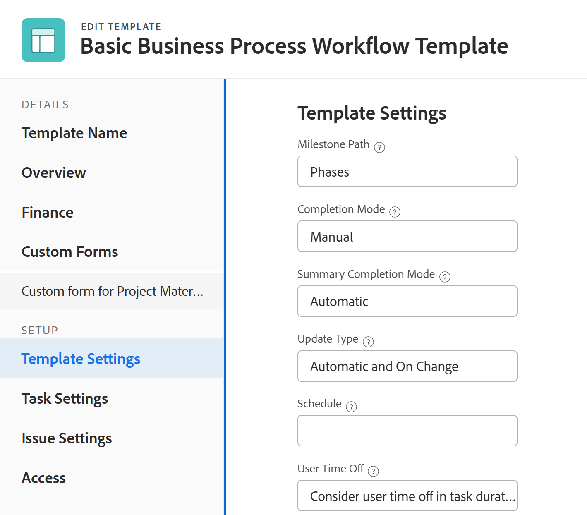

# Projektvorlagen bearbeiten

<!-- Audited: 7/2025 -->

<!--The Resource Pools part also duplicates in the "Working with Resource Pools" article-->

<!--

 

The highlighted information on this page refers to functionality not yet generally available. It is available only in the Preview environment for all customers. The same features will also be available in the Production environment for all customers after a week from the Preview release.      

For more information, see [Interface modernization](/help/quicksilver/product-announcements/product-releases/interface-modernization/interface-modernization.md).  

 

-->

Sie können Projektvorlagen bearbeiten, um Änderungen an den Prozessen und Einstellungen künftiger Projekte widerzuspiegeln.

Nachdem Sie die Änderungen aktualisiert und in einer Vorlage gespeichert haben, werden die neuen Änderungen in neuen Projekten sichtbar, wenn die Projekte mithilfe der Vorlage erstellt werden.

Die Änderungen, die Sie an der Vorlage vornehmen, spiegeln nicht die Projekte wider, die diese Vorlage derzeit verwenden.

Sie können jeweils nur eine Vorlage bearbeiten oder Vorlagen stapelweise bearbeiten.

## Zugriffsanforderungen

+++ Erweitern Sie , um die Zugriffsanforderungen anzuzeigen.

<table style="table-layout:auto"> 
 <col> 
 <col> 
 <tbody> 
  <tr> 
   <td role="rowheader">Adobe Workfront-Paket</td> 
   <td> 
Beliebig
 </td> 
  </tr> 
  <tr> 
   <td role="rowheader">Adobe Workfront-Lizenzen</td> 
   <td>
      
Standard

      
Plan

   </td> 
  </tr> 
  <tr> 
   <td role="rowheader">Konfigurationen der Zugriffsebene</td> 
   <td> 
Zugriff auf Vorlagen bearbeiten
 </td> 
  </tr> 
  <tr> 
   <td role="rowheader">Objektberechtigungen</td> 
   <td> 
    
Berechtigungen zu einer Vorlage beitragen , um sie auf der Registerkarte Vorlagendetails zu bearbeiten
 
     
Verwalten von Berechtigungen für eine Vorlage, um sie im Feld Vorlage bearbeiten zu bearbeiten

   </td> 
  </tr> 
 </tbody> 
</table>

*Weitere Informationen zu den Informationen in dieser Tabelle finden Sie unter [Zugriffsanforderungen in der Dokumentation zu Workfront](/help/quicksilver/administration-and-setup/add-users/access-levels-and-object-permissions/access-level-requirements-in-documentation.md).

+++

<!--Old:

<table style="table-layout:auto"> 
 <col> 
 <col> 
 <tbody> 
  <tr> 
   <td role="rowheader">Adobe Workfront plan</td> 
   <td> 
Any 
 </td> 
  </tr> 
  <tr> 
   <td role="rowheader">Adobe Workfront licenses*</td> 
   <td>
      
New: Standard

      
Or

      
Current: Plan

   </td> 
  </tr> 
  <tr> 
   <td role="rowheader">Access level</td> 
   <td> 
Edit access to Templates
 </td> 
  </tr> 
  <tr> 
   <td role="rowheader">Object permissions</td> 
   <td> 
    <ul> 
     <li> 
Contribute permissions to a template to edit it in the Template Details tab
 </li> 
     <li> 
Manage permissions to a template to edit it in the Edit Template box
 </li> 
   </td> 
  </tr> 
 </tbody> 
</table>-->

## Bearbeiten einer Vorlage {#edit-a-template}

1. Wechseln Sie zu der Vorlage, die Sie bearbeiten möchten.
1. (Bedingt) Um eingeschränkte Informationen über die Vorlage zu bearbeiten, klicken Sie im linken Bereich auf **Vorlagendetails** und gehen Sie dann zu den Bereichen, die im linken Bereich aufgelistet sind, um die Informationen für die einzelnen Bereiche zu bearbeiten.
1. Um Informationen im Abschnitt Details zu bearbeiten, klicken Sie auf das **Bearbeiten**-Symbol  und wählen Sie dann einen der folgenden Bereiche aus oder klicken Sie auf **Alle bearbeiten**, um Informationen in allen Bereichen zu bearbeiten:

   * Übersicht
   * Benutzerdefinierte Formulare

   Namen von benutzerdefinierten Formularen werden nur angezeigt, wenn dem -Objekt benutzerdefinierte Formulare beigefügt sind.

   * Finanzielle Details

   >[!TIP]
   >
   >Informationen zu allen Feldern, die im Detailbereich angezeigt werden, finden Sie im Feld Vorlage bearbeiten weiter unten.

1. (Bedingt) Um alle Informationen über die Vorlage zu bearbeiten, klicken Sie auf das **Mehr** Menü  neben dem Namen der Vorlage und dann auf **Bearbeiten**.

   Das **„Vorlage bearbeiten** wird geöffnet. Die Abschnitte in diesem Feld enthalten die Felder, die im Abschnitt Vorlagendetails verfügbar sind, sowie zusätzliche Felder.

1. Erwägen Sie, Informationen in einem der folgenden Abschnitte zu bearbeiten:

   * [Vorlagenname](#template-name)
   * [Übersicht](#overview-preview)
   * [Finanzen](#finance-preview)
   * [Benutzerdefinierte Formulare](#custom-forms-preview)
   * [Vorlageneinstellungen](#template-settings)
   * [Aufgabeneinstellungen](#task-settings)
   * [Problemeinstellungen](#issue-settings)
   * [Zugriff auf](#access-preview)
   * [Kommentar](#comment)
   <!--* [Linked folders](#linked-folders-conditional-availability) -->

### Vorlagenname{#template-name}

1. Beginnen Sie mit der Bearbeitung Ihrer Vorlage wie oben beschrieben.
1. Klicken Sie im Feld **Vorlage bearbeiten** auf **Vorlagenname**.
1. Aktualisieren oder ersetzen Sie den Namen der Vorlage.
1. (Optional) Fahren Sie je nach den Informationen, die Sie ändern möchten, mit der Bearbeitung der folgenden Abschnitte fort

   ODER

   Klicken Sie auf **Speichern**.

### Übersicht {#overview-preview}

1. Beginnen Sie mit der Bearbeitung Ihrer Vorlage wie oben beschrieben.
1. Klicken Sie im Feld **Vorlage bearbeiten** auf **Übersicht**.

   

1. Aktualisieren Sie die folgenden Felder:

   <table style="table-layout:auto"> 
       <col> 
       <col> 
       <tbody> 
         <tr> 
         <td role="rowheader"><strong>Beschreibung</strong></td> 
         <td>Fügen Sie zusätzliche Informationen über die Vorlage hinzu.</td> 
       </tr> 
         <tr> 
         <td role="rowheader"><strong>Priorität</strong></td> 
         <td>
Dies ist nur eine visuelle Markierung für Sie, mit der Sie Ihre zukünftigen Projekte priorisieren können. Wählen Sie aus den folgenden Optionen aus:
 
         <ul> 
         <li>
<strong>Keine</strong>
</li> 
         <li>
<strong>Niedrig</strong>
</li> 
         <li>
<strong>Normal</strong>
</li> 
         <li>
<strong>Hoch</strong>
</li> 
         <li>
<strong>Dringend</strong>
</li> 
         </ul>

Je nach den vom Workfront-Administrator ausgewählten Projektvoreinstellungen können die Namen der Prioritäten für Sie unterschiedlich sein. Weitere Informationen zum Bearbeiten von Prioritäten finden Sie unter <a href="../../../administration-and-setup/customize-workfront/creating-custom-status-and-priority-labels/create-customize-priorities.md" class="MCXref xref">Erstellen und Anpassen von Prioritäten</a>.

</td> 
       </tr> 
       <tr> 
       <td role="rowheader"><strong>URL</strong></td> 
         <td>Geben Sie einen Weblink an, der sich auf Informationen zu dieser Vorlage bezieht.</td> 
       </tr>
   <tr> 
      <td role="rowheader"><strong>Ist aktiv</strong></td> 
      <td>
Aktivieren Sie diese Option, wenn die Vorlage aktiv sein soll. Andere Benutzer können diese Vorlage suchen und sie beim Erstellen von Projekten an Projekte anhängen. Deaktivieren Sie die Option, wenn Sie nicht mehr verwendete Vorlagen deaktivieren möchten. Deaktivierte Vorlagen können nicht an Projekte angehängt werden. Dies ist standardmäßig aktiviert. 

<b>TIPP</b>

   
Sie können eine Vorlage über die Vorlagenüberschrift deaktivieren, wie im Abschnitt „Aktivieren oder Deaktivieren einer Vorlage“ in diesem Artikel beschrieben.
</td> 
     </tr>

   <tr> 
   <td role="rowheader"><strong>Bedingungstyp</strong></td> 
      <td>
Wählen Sie zwischen den folgenden Bedingungstypen aus:
 
      <ul> 
      <li><strong>Manuell</strong> Der Projektinhaber legt die Projektbedingung manuell fest. <strong></strong></li> 
      <li><strong>Fortschrittsstatus: </strong> Workfront legt die Bedingung des zukünftigen Projekts automatisch auf der Grundlage des Fortschrittsstatus von Aufgaben auf dem kritischen Pfad fest. Weitere Informationen zum Verstehen des Fortschrittsstatus finden Sie unter <a href="../../../manage-work/tasks/task-information/task-progress-status.md" class="MCXref xref">Übersicht über den Aufgabenstatus</a>.</li> 
      </ul>
      </td> 
      </tr> 
      <tr> 
      <td role="rowheader"><strong>Zeitplanmodus</strong></td> 
      <td>
Geben Sie an, ob das Projekt, das diese Vorlage verwendet, ab dem <strong>Startdatum</strong> oder ab dem <strong>Abschlussdatum</strong> geplant wird. Diese Auswahl bestimmt anhand dieser Vorlage die geplanten Termine der zukünftigen Aufgaben im Projekt. 

Wählen Sie aus den folgenden Optionen aus: 
 
      <ul> 
      <li>
<strong>Zeitplan vom Startdatum</strong>: Das Startdatum der Vorlage ist tatsächlich der Starttag. Wenn Sie eine Vorlage vom Startdatum ausgehend planen, berechnet Adobe Workfront den Abschlusstag der Vorlage anhand der Dauer aller Vorlagenaufgaben. Der Starttag der Vorlage wird zum geplanten Startdatum des zukünftigen Projekts.
</li> 
      <li>
<strong>Zeitplan ab Abschlussdatum</strong>: Das Abschlussdatum der Vorlage ist in Wirklichkeit der Abschlussdatum. Wenn Sie für eine Vorlage ein Abschlussdatum festlegen, berechnet Workfront den Starttag der Vorlage anhand der Dauer aller Vorlagenaufgaben. Das Abschlussdatum der Vorlage wird zum geplanten Abschlussdatum des zukünftigen Projekts. 
</li> 
      </ul>
Weitere Informationen zu den Anfangs- und Abschlusstagen von Vorlagenaufgaben finden Sie unter <a href="../../../manage-work/projects/create-and-manage-templates/overview-of-start-completion-day-on-template.md" class="MCXref xref">Übersicht über Anfangs- und Abschlusstage in einer Vorlage</a>. 

Die Einstellung Zeitplan ab für Vorlagen ähnelt der von Projekten. Ihr Workfront-Administrator wählt die Standardeinstellung Zeitplan ab für die Projekte in Ihrem System aus. Informationen zum Festlegen von Projektstandards finden Sie <a href="../../../administration-and-setup/set-up-workfront/configure-system-defaults/set-project-preferences.md" class="MCXref xref">Konfigurieren von systemweiten Projektvoreinstellungen</a>.
</td> 
      </tr>

   <tr> 
      <td role="rowheader"><strong>Portfolio</strong></td> 
      <td>
Geben Sie eine Portfolio für die Projekte an, die aus dieser Vorlage erstellt werden. Sie müssen zunächst eine Portfolio erstellen, bevor sie in der Dropdown-Liste angezeigt wird. 

In der Liste werden nur aktive Portfolios angezeigt. Weitere Informationen zum Erstellen von Portfolios finden Sie unter <a href="../../../manage-work/portfolios/create-and-manage-portfolios/create-portfolios.md" class="MCXref xref">Erstellen eines Portfolios </a>.
</td> 
      </tr> 
      <tr> 
      <td role="rowheader"><strong>Programm</strong></td> 
      <td>
Wenn Sie eine Portfolio für die Vorlage ausgewählt haben, geben Sie ein <strong>Programm</strong> für das zukünftige Projekt an. Einige Portfolios verfügen möglicherweise nicht über Programme. Sie müssen zuerst ein Programm erstellen, bevor es in dieser Dropdown-Liste angezeigt wird. In der Liste werden nur aktive Programme angezeigt.

Weitere Informationen zum Erstellen von Programmen finden Sie unter <a href="../../../manage-work/portfolios/create-and-manage-programs/create-program.md" class="MCXref xref">Erstellen eines Programms</a>.
</td> 
      </tr>  
      <tr data-mc-conditions="QuicksilverOrClassic.Quicksilver"> 
      <td role="rowheader"><strong>Gruppe</strong></td> 
      <td>
Wählen Sie in der Dropdown-Liste die Gruppe aus, die Sie mit Projekten verknüpfen möchten, die aus der Vorlage erstellt wurden. Es kann sich um eine Gruppe auf beliebiger Ebene handeln. 

Sie können sicherstellen, dass Sie die richtige Gruppe auswählen, indem Sie den Mauszeiger darüber bewegen und auf das Informationssymbol  neben der Gruppe klicken. Dadurch wird eine QuickInfo angezeigt, die Informationen über die Gruppe auflistet, wie z. B. die Hierarchie der darüber liegenden Gruppen und deren Administratoren.
 
<b>NOTIZEN</b>

   <ul> 
      <li>
Wenn im Bereich Projekte auf der Seite einer Gruppe jemand ein Projekt mit einer Vorlage erstellt, für die keine Gruppe ausgewählt ist, verknüpft das System die aktuell geöffnete Gruppe mit dem Projekt.

Dies unterscheidet sich von anderen Bereichen, in denen das System die Hauptgruppe einer Benutzerin oder eines Benutzers mit dem Projekt verknüpft, wenn die Benutzerin oder der Benutzer das Projekt mithilfe einer Vorlage erstellt, für die keine Gruppe ausgewählt ist.
</li> 
      <li>
Wenn ein(e) Benutzende(r) beim Erstellen eines Projekts oder beim Konvertieren einer Aufgabe oder eines Problems in ein Projekt eine Vorlage auswählt, aus der eine Gruppe ausgewählt wurde, kann der/die Benutzende eine andere Gruppe für das Projekt auswählen.
</li> 
      <li>Obwohl dieses Feld in Vorlagen nur in der neuen Adobe Workfront-Version verfügbar ist, können Sie es sowohl dort in Listen und Berichten als auch in Adobe Workfront Classic sehen. </li> 
      </ul> 
</td> 
      </tr> 
      <tr> 
      <td role="rowheader"><strong>Firma</strong></td> 
      <td>
Geben Sie die Firma an, die Sie mit der Vorlage verknüpfen möchten. In der Liste werden nur aktive Unternehmen angezeigt.
</td> 
      </tr> 
      <tr> 
      <td role="rowheader"><strong>Für die Vorlage verantwortliche Person</strong></td> 
      <td>
Der Benutzer, der als Vorlagenbesitzer festgelegt ist, muss ein aktiver Workfront-Benutzer sein. 

Beachten Sie Folgendes über den Benutzer, der als Vorlagenbesitzer festgelegt ist: 
 
      <ul> 
      <li>Sie erhalten automatisch Verwaltungsberechtigungen für die Vorlage. </li> 
      <li>Sie werden dem Projektteam hinzugefügt und erhalten automatisch Verwaltungsberechtigungen für das aus der Vorlage erstellte Projekt. </li> 
      <li>Sie werden zum Projektbesitzer, wenn das Projekt aus dieser Vorlage erstellt wird. </li> 
      <li> Wenn der als Vorlagenbesitzer angegebene Benutzer von seiner Zugriffsebene aus nur eingeschränkten Zugriff auf Vorlagen oder Projekte hat, sind seine Verwaltungsberechtigungen für die Vorlage und die Projekte eingeschränkt. Wenn sie beispielsweise nur Ansichtszugriff für Vorlagen oder Projekte in ihrer Zugriffsebene haben, erhalten sie automatisch Ansichtsberechtigungen für die Vorlage und das Projekt, wenn sie als Vorlagenbesitzer angegeben sind.</li>
      </ul></td> 
      </tr> 
      <tr> 
      <td role="rowheader"><strong>Vorlagensponsor</strong></td> 
      <td>
Der in diesem Feld angegebene Benutzer wird zum Projektsponsor, wenn die Vorlage zum Projekt hinzugefügt wird. Dieser Benutzer wird dem Projekt-Team hinzugefügt und erhält automatisch Ansichtsberechtigungen für das Projekt. Der Benutzer, der als Vorlagensponsor angegeben ist, muss ein aktiver Workfront-Benutzer sein. 
</td> 
      </tr> 
      <tr> 
      <td role="rowheader"><strong>Ressourcenmanager</strong></td> 
      <td>
Die angegebenen Benutzer erhalten automatisch Verwaltungsberechtigungen für die zukünftigen Projekte und können Ressourcen zu den Aufgaben und Problemen der Projekte zuweisen. Sie können mehr als einen Ressourcen-Manager angeben. 
</td> 
      </tr> 
      </table>

1. (Optional) Fahren Sie je nach den Informationen, die Sie ändern möchten, mit der Bearbeitung der folgenden Abschnitte fort.

   ODER

   Klicken Sie auf **Speichern**.

### Finanzielle Details {#finance-preview}

1. Beginnen Sie mit der Bearbeitung Ihrer Vorlage wie oben beschrieben.
1. Klicken Sie im Feld **Vorlage bearbeiten** auf **Finanzen**.

   

1. Aktualisieren Sie die folgenden Felder:

   <table style="table-layout:auto"> 
       <col> 
       <col> 
       <tbody> 
         <tr> 
         <td role="rowheader"><strong>Beschreibung</strong></td> 
         <td>Fügen Sie zusätzliche Informationen über die Vorlage hinzu.</td> 
       </tr> 
         <tr> 
         <td role="rowheader"><strong>Priorität</strong></td> 
         <td>
Dies ist nur eine visuelle Markierung für Sie, mit der Sie Ihre zukünftigen Projekte priorisieren können. Wählen Sie aus den folgenden Optionen aus:
 
         <ul> 
         <li>
<strong>Keine</strong>
</li> 
         <li>
<strong>Niedrig</strong>
</li> 
         <li>
<strong>Normal</strong>
</li> 
         <li>
<strong>Hoch</strong>
</li> 
         <li>
<strong>Dringend</strong>
</li> 
         </ul>

Je nach den vom Workfront-Administrator ausgewählten Projektvoreinstellungen können die Namen der Prioritäten für Sie unterschiedlich sein. Weitere Informationen zum Bearbeiten von Prioritäten finden Sie unter <a href="../../../administration-and-setup/customize-workfront/creating-custom-status-and-priority-labels/create-customize-priorities.md" class="MCXref xref">Erstellen und Anpassen von Prioritäten</a>.

</td> 
       </tr> 
       <tr> 
       <td role="rowheader"><strong>URL</strong></td> 
         <td>Geben Sie einen Weblink an, der sich auf Informationen zu dieser Vorlage bezieht.</td> 
       </tr>
      <tr> 
      <td role="rowheader"><strong>Ist aktiv</strong></td> 
      <td>
Aktivieren Sie diese Option, wenn die Vorlage aktiv sein soll. Andere Benutzer können diese Vorlage suchen und sie beim Erstellen von Projekten an Projekte anhängen. Deaktivieren Sie die Option, wenn Sie nicht mehr verwendete Vorlagen deaktivieren möchten. Deaktivierte Vorlagen können nicht an Projekte angehängt werden. Dies ist standardmäßig aktiviert. 

<b>TIPP</b>

   
Sie können eine Vorlage über die Vorlagenüberschrift deaktivieren, wie im Abschnitt „Aktivieren oder Deaktivieren einer Vorlage“ in diesem Artikel beschrieben.
</td> 
     </tr>

   <tr> 
      <td role="rowheader"><strong>Bedingungstyp</strong></td> 
      <td>
Wählen Sie zwischen den folgenden Bedingungstypen aus:
 
      <ul> 
      <li><strong>Manuell</strong> Der Projektinhaber legt die Projektbedingung manuell fest. <strong></strong></li> 
      <li><strong>Fortschrittsstatus: </strong> Workfront legt die Bedingung des zukünftigen Projekts automatisch auf der Grundlage des Fortschrittsstatus von Aufgaben auf dem kritischen Pfad fest. Weitere Informationen zum Verstehen des Fortschrittsstatus finden Sie unter <a href="../../../manage-work/tasks/task-information/task-progress-status.md" class="MCXref xref">Übersicht über den Aufgabenstatus</a>.</li> 
      </ul>
      </td> 
      </tr> 
      <tr> 
      <td role="rowheader"><strong>Zeitplanmodus</strong></td> 
      <td>
Geben Sie an, ob das Projekt, das diese Vorlage verwendet, ab dem <strong>Startdatum</strong> oder ab dem <strong>Abschlussdatum</strong> geplant wird. Diese Auswahl bestimmt anhand dieser Vorlage die geplanten Termine der zukünftigen Aufgaben im Projekt. 

Wählen Sie aus den folgenden Optionen aus: 
 
      <ul> 
      <li>
<strong>Zeitplan vom Startdatum</strong>: Das Startdatum der Vorlage ist tatsächlich der Starttag. Wenn Sie eine Vorlage vom Startdatum ausgehend planen, berechnet Adobe Workfront den Abschlusstag der Vorlage anhand der Dauer aller Vorlagenaufgaben. Der Starttag der Vorlage wird zum geplanten Startdatum des zukünftigen Projekts.
</li> 
      <li>
<strong>Zeitplan ab Abschlussdatum</strong>: Das Abschlussdatum der Vorlage ist in Wirklichkeit der Abschlussdatum. Wenn Sie für eine Vorlage ein Abschlussdatum festlegen, berechnet Workfront den Starttag der Vorlage anhand der Dauer aller Vorlagenaufgaben. Das Abschlussdatum der Vorlage wird zum geplanten Abschlussdatum des zukünftigen Projekts. 
</li> 
      </ul>
Weitere Informationen zu den Anfangs- und Abschlusstagen von Vorlagenaufgaben finden Sie unter <a href="../../../manage-work/projects/create-and-manage-templates/overview-of-start-completion-day-on-template.md" class="MCXref xref">Übersicht über Anfangs- und Abschlusstage in einer Vorlage</a>. 

Die Einstellung Zeitplan ab für Vorlagen ähnelt der von Projekten. Ihr Workfront-Administrator wählt die Standardeinstellung Zeitplan ab für die Projekte in Ihrem System aus. Informationen zum Festlegen von Projektstandards finden Sie <a href="../../../administration-and-setup/set-up-workfront/configure-system-defaults/set-project-preferences.md" class="MCXref xref">Konfigurieren von systemweiten Projektvoreinstellungen</a>.
</td> 
      </tr>

   <tr> 
      <td role="rowheader"><strong>Portfolio</strong></td> 
      <td>
Geben Sie eine Portfolio für die Projekte an, die aus dieser Vorlage erstellt werden. Sie müssen zunächst eine Portfolio erstellen, bevor sie in der Dropdown-Liste angezeigt wird. 

In der Liste werden nur aktive Portfolios angezeigt. Weitere Informationen zum Erstellen von Portfolios finden Sie unter <a href="../../../manage-work/portfolios/create-and-manage-portfolios/create-portfolios.md" class="MCXref xref">Erstellen eines Portfolios </a>.
</td> 
      </tr> 
      <tr> 
      <td role="rowheader"><strong>Programm</strong></td> 
      <td>
Wenn Sie eine Portfolio für die Vorlage ausgewählt haben, geben Sie ein <strong>Programm</strong> für das zukünftige Projekt an. Einige Portfolios verfügen möglicherweise nicht über Programme. Sie müssen zuerst ein Programm erstellen, bevor es in dieser Dropdown-Liste angezeigt wird. In der Liste werden nur aktive Programme angezeigt.

Weitere Informationen zum Erstellen von Programmen finden Sie unter <a href="../../../manage-work/portfolios/create-and-manage-programs/create-program.md" class="MCXref xref">Erstellen eines Programms</a>.
</td> 
      </tr>  
      <tr data-mc-conditions="QuicksilverOrClassic.Quicksilver"> 
      <td role="rowheader"><strong>Gruppe</strong></td> 
      <td>
Wählen Sie in der Dropdown-Liste die Gruppe aus, die Sie mit Projekten verknüpfen möchten, die aus der Vorlage erstellt wurden. Es kann sich um eine Gruppe auf beliebiger Ebene handeln. 

Sie können sicherstellen, dass Sie die richtige Gruppe auswählen, indem Sie den Mauszeiger darüber bewegen und auf das Informationssymbol  neben der Gruppe klicken. Dadurch wird eine QuickInfo angezeigt, die Informationen über die Gruppe auflistet, wie z. B. die Hierarchie der darüber liegenden Gruppen und deren Administratoren.
 
<b>NOTIZEN</b>

   <ul> 
      <li>
Wenn im Bereich Projekte auf der Seite einer Gruppe jemand ein Projekt mit einer Vorlage erstellt, für die keine Gruppe ausgewählt ist, verknüpft das System die aktuell geöffnete Gruppe mit dem Projekt.

Dies unterscheidet sich von anderen Bereichen, in denen das System die Hauptgruppe einer Benutzerin oder eines Benutzers mit dem Projekt verknüpft, wenn die Benutzerin oder der Benutzer das Projekt mithilfe einer Vorlage erstellt, für die keine Gruppe ausgewählt ist.
</li> 
      <li>
Wenn ein(e) Benutzende(r) beim Erstellen eines Projekts oder beim Konvertieren einer Aufgabe oder eines Problems in ein Projekt eine Vorlage auswählt, aus der eine Gruppe ausgewählt wurde, kann der/die Benutzende eine andere Gruppe für das Projekt auswählen.
</li> 
      <li>Obwohl dieses Feld in Vorlagen nur in der neuen Adobe Workfront-Version verfügbar ist, können Sie es sowohl dort in Listen und Berichten als auch in Adobe Workfront Classic sehen. </li> 
      </ul> 
</td> 
      </tr> 
      <tr> 
      <td role="rowheader"><strong>Firma</strong></td> 
      <td>
Geben Sie die Firma an, die Sie mit der Vorlage verknüpfen möchten. In der Liste werden nur aktive Unternehmen angezeigt.
</td> 
      </tr> 
      <tr> 
      <td role="rowheader"><strong>Für die Vorlage verantwortliche Person</strong></td> 
      <td>
Der Benutzer, der als Vorlagenbesitzer festgelegt ist, muss ein aktiver Workfront-Benutzer sein. 

Beachten Sie Folgendes über den Benutzer, der als Vorlagenbesitzer festgelegt ist: 
 
      <ul> 
      <li>Sie erhalten automatisch Verwaltungsberechtigungen für die Vorlage. </li> 
      <li>Sie werden dem Projektteam hinzugefügt und erhalten automatisch Verwaltungsberechtigungen für das aus der Vorlage erstellte Projekt. </li> 
      <li>Sie werden zum Projektbesitzer, wenn das Projekt aus dieser Vorlage erstellt wird. </li> 
      <li> Wenn der als Vorlagenbesitzer angegebene Benutzer von seiner Zugriffsebene aus nur eingeschränkten Zugriff auf Vorlagen oder Projekte hat, sind seine Verwaltungsberechtigungen für die Vorlage und die Projekte eingeschränkt. Wenn sie beispielsweise nur Ansichtszugriff für Vorlagen oder Projekte in ihrer Zugriffsebene haben, erhalten sie automatisch Ansichtsberechtigungen für die Vorlage und das Projekt, wenn sie als Vorlagenbesitzer angegeben sind.</li>
      </ul></td> 
      </tr> 
      <tr> 
      <td role="rowheader"><strong>Vorlagensponsor</strong></td> 
      <td>
Der in diesem Feld angegebene Benutzer wird zum Projektsponsor, wenn die Vorlage zum Projekt hinzugefügt wird. Dieser Benutzer wird dem Projekt-Team hinzugefügt und erhält automatisch Ansichtsberechtigungen für das Projekt. Der Benutzer, der als Vorlagensponsor angegeben ist, muss ein aktiver Workfront-Benutzer sein. 
</td> 
      </tr> 
      <tr> 
      <td role="rowheader"><strong>Ressourcenmanager</strong></td> 
      <td>
Die angegebenen Benutzer erhalten automatisch Verwaltungsberechtigungen für die zukünftigen Projekte und können Ressourcen zu den Aufgaben und Problemen der Projekte zuweisen. Sie können mehr als einen Ressourcen-Manager angeben. 
</td> 
      </tr> 
      </table>

1. (Optional) Fahren Sie je nach den Informationen, die Sie ändern möchten, mit der Bearbeitung der folgenden Abschnitte fort.

   ODER

   Klicken Sie auf **Speichern**.

### Benutzerdefinierte Formulare {#custom-forms-preview}

1. Beginnen Sie mit der Bearbeitung Ihrer Vorlage wie oben beschrieben.
1. Klicken Sie im Feld **Vorlage bearbeiten** auf **Benutzerdefinierte Forms**.

   

   Die Namen der benutzerdefinierten Formulare, die bereits mit der Vorlage verbunden sind, werden im linken Bereich angezeigt.

1. Klicken Sie in das Feld **Benutzerdefiniertes Formular hinzufügen** und wählen Sie das oder die benutzerdefinierten Formulare aus, die Sie mit der Vorlage verknüpfen möchten. Sie müssen die benutzerdefinierten Formulare erstellen, bevor sie in diesem Feld ausgewählt werden können.

   In der Liste werden nur aktive benutzerdefinierte Formulare angezeigt. Weitere Informationen zum Erstellen benutzerdefinierter Formulare finden Sie unter [Erstellen eines benutzerdefinierten Formulars](/help/quicksilver/administration-and-setup/customize-workfront/create-manage-custom-forms/form-designer/design-a-form/design-a-form.md).

   Sie können einer Vorlage bis zu zehn benutzerdefinierte Formulare hinzufügen.

   Die Formulare werden dem Projekt hinzugefügt, das aus dieser Vorlage erstellt wird.

1. (Optional) Aktualisieren Sie die Informationen in einem der Felder auf den benutzerdefinierten Formularen. Die Informationen werden an die Projekte übertragen, die aus der Vorlage erstellt werden.

1. (Optional) Klicken Sie auf das Symbol **x** rechts neben einem benutzerdefinierten Formularnamen und dann auf **Entfernen**, um das Formular aus der Vorlage zu entfernen.

1. (Optional) Fahren Sie je nach den Informationen, die Sie ändern möchten, mit der Bearbeitung des folgenden Abschnitts fort.

   ODER

   Klicken Sie auf **Speichern**.

### Vorlageneinstellungen {#template-settings}

1. Beginnen Sie mit der Bearbeitung Ihrer Vorlage wie oben beschrieben.
1. Klicken Sie **Feld** Vorlage bearbeiten **auf Projekteinstellungen**.

   

1. Aktualisieren Sie die folgenden Felder:

   <table style="table-layout:auto"> 
       <col> 
       <col> 
       <tbody> 
       <tr> 
       <td role="rowheader"><strong>Meilensteinpfad</strong> </td> 
       <td> 
Meilensteinpfad für Vorlage auswählen In der Liste werden nur aktive Meilensteinpfade angezeigt. Weitere Informationen zu Meilensteinpfaden finden Sie unter <a href="../../../administration-and-setup/customize-workfront/configure-approval-milestone-processes/create-milestone-path.md" class="MCXref xref">Meilensteinpfad erstellen</a>.
 </td> 
       </tr> 
       <tr> 
       <td role="rowheader"><strong>Fertigstellungsmodus</strong> </td> 
       <td> 
Steuert, wie das zukünftige Projekt als Abgeschlossen markiert wird.  Wählen Sie aus den folgenden Optionen aus:
 
       <ul> 
       <li> 
<strong>Automatisch</strong>: Das Projekt wird als Abgeschlossen markiert, wenn alle Aufgaben und Probleme abgeschlossen sind.
 </li> 
       <li> 
<strong>Manuell</strong>: Sie müssen den Abschlussstatus für das Projekt manuell auswählen, wenn alle Aufgaben und Probleme abgeschlossen sind. 
 </li> 
       </ul> </td> 
       </tr> 
       <tr> 
       <td role="rowheader"><strong>Zusammenfassung - Fertigstellungsmodus</strong> </td> 
       <td> 
Steuert, wie die übergeordneten Aufgaben im zukünftigen Projekt als Abgeschlossen markiert werden.  Wählen Sie aus den folgenden Optionen aus:
 
       <ul> 
       <li> 
<strong>Automatisch</strong>: Die übergeordneten Aufgaben werden als „Abgeschlossen“ markiert und ihr Prozentwert wird automatisch aktualisiert, wenn die untergeordneten Aufgaben abgeschlossen sind und der Prozentwert der abgeschlossenen untergeordneten Aufgaben aktualisiert wird. 
 </li> 
       <li> 
<strong>Manuell</strong>: Sie müssen den abgeschlossenen Prozentsatz und den Status der übergeordneten Aufgaben manuell aktualisieren, unabhängig davon, welche Änderungen an den untergeordneten Aufgaben vorgenommen werden. 
 </li> 
       </ul> </td> 
       </tr> 
       <tr> 
       <td role="rowheader"><strong>Update-Typ</strong> </td> 
       <td> 
Steuert, wann die Änderungen, die Sie an der Zeitleiste des zukünftigen Projekts vornehmen, im Projekt gespeichert werden. 
 
       <b>BEISPIEL </b> 
       
Die folgenden Änderungen am Projekt-Trigger führen zu einer Aktualisierung der Zeitleiste des Projekts:
 
       <ul> 
       <li> 
Aktualisieren der Daten von Aufgaben
 </li> 
       <li> 
Vorgängerbeziehungen ändern 
 </li> 
       <li> 
Eltern-Kind-Beziehungen ändern
 </li> 
       <li> 
Zusätzlich zum Ändern der Aufgabenbeschränkung oder des Dauertyps können Sie Zuweisungen hinzufügen oder entfernen.
 </li> 
       </ul> 
       
 
Wählen Sie aus den folgenden Optionen aus: 
 
       <ul> 
       <li> 
<strong>Automatisch und Bei Änderung</strong> (Standardeinstellung): Die Zeitleiste des zukünftigen Projekts wird jedes Mal aktualisiert, wenn eine Änderung im Projekt oder in einem anderen Projekt auftritt, von dem die Zeitleiste abhängig ist (Bei Änderung). Die Zeitleiste des Projekts wird ebenfalls jede Nacht aktualisiert (automatisch). Dies ist die empfohlene Einstellung für dieses Feld, da dadurch sichergestellt wird, dass die Zeitleiste des Projekts immer auf dem neuesten Stand ist. Wenn Sie eine Aktion für eine Aufgabe oder ein Projekt durchführen, die bzw. das eine Neuberechnung der Zeitleiste Trigger, werden alle verfügbaren Daten sofort angezeigt, sodass Sie weiterarbeiten können. Bei Projekten mit mehr als 100 Aufgaben werden Datumsangaben, die längere Neuberechnungen erfordern, kurz als Fragezeichen angezeigt (zwischen 1 und 5 Sekunden oder bis zu einer Minute bei großen Projekten). Dies bedeutet, dass die Neuberechnung noch nicht abgeschlossen ist und sich die Daten ändern können. 
 </li> 
       </ul> 
       <ul> 
       <li> 
<strong>Nur </strong>: Die Zeitleiste des Projekts wird jedes Mal aktualisiert, wenn eine Änderung im Projekt oder in einem anderen Projekt erfolgt, von dem die Zeitleiste abhängig ist. Sie können diese Option auswählen, wenn Änderungen nur selten im Projekt oder in anderen Projekten auftreten, von denen die Zeitleiste abhängig ist. 
 </li> 
       </ul> 
       <ul> 
       <li> 
<strong>Nur automatisch</strong>: Die Zeitleiste des Projekts wird jede Nacht aktualisiert. Sie wird nicht sofort nach den Änderungen aktualisiert. Sie können diese Option auswählen, wenn an jedem Tag viele Änderungen im Projekt oder in anderen Projekten auftreten, von denen die Zeitleiste abhängig ist. Beachten Sie jedoch, dass Sie diese Einstellung gewählt haben, da das Projekt nicht gleichzeitig mit den Änderungen aktualisiert wird. 
 </li> 
       </ul> 
       <ul> 
       <li> 
<strong>Nur manuelle </strong>: Die Projekt-Zeitleiste wird nur aktualisiert, wenn Sie die Option zur Neuberechnung von Zeitleisten auswählen, wie in <a href="../../../manage-work/projects/manage-projects/recalculate-project-timeline.md" class="MCXref xref">Neuberechnen von Projekt-Zeitleisten</a> beschrieben. 
 </li> 
       </ul> 
Sie können diese Option auswählen, wenn Sie mehrere Änderungen am Projekt gleichzeitig vornehmen und die Neuberechnung der Zeitleiste nach allen Änderungen (und nicht nach jeder einzelnen Änderung) durchgeführt werden soll.
 </td> 
       </tr> 
       <tr> 
       <td role="rowheader"><strong>Zeitplan</strong> </td> 
       <td> 
Wählen Sie einen Zeitplan für Ihre Vorlage aus. Dies wird zum Zeitplan des Projekts, das aus dieser Vorlage erstellt wird. Dies sollte derselbe Zeitplan sein, der den meisten Personen zugewiesen wird, die an dem Projekt arbeiten. Sie müssen einen Zeitplan erstellen, bevor Sie ihn einer Vorlage zuweisen können. Weitere Informationen zum Erstellen von Zeitplänen finden Sie unter <a href="../../../administration-and-setup/set-up-workfront/configure-timesheets-schedules/create-schedules.md" class="MCXref xref">Erstellen eines Zeitplans</a>.  Wenn Sie in Ihrem System keine benutzerdefinierten Zeitpläne erstellt haben, wird der Standardzeitplan ausgewählt. 
 </td> 
       </tr> 
       <tr> 
       <td role="rowheader"><strong>Benutzer-Ausfallzeit</strong> </td> 
       <td> 
Legt fest, ob die Ausfallzeit des Primären Zugewiesenen einer Aufgabe die geplanten Termine der Aufgabe anpasst. Wenn Sie die Vorlage an ein vorhandenes Projekt anhängen und die Vorlage für dieses Feld eine andere Einstellung als das Projekt hat, bleibt die Einstellung für das Projekt unverändert. Die Standardoption dieser Einstellung für eine neue Vorlage entspricht der Projektvoreinstellung auf Systemebene. 
 
Informationen zu den Projektvoreinstellungen auf Systemebene finden Sie unter <a href="../../../administration-and-setup/set-up-workfront/configure-system-defaults/set-project-preferences.md" class="MCXref xref">Konfigurieren von systemweiten Projektvoreinstellungen</a>. 
 
Weitere Informationen darüber, wie sich diese Einstellung auf die Aufgabentermine in einem Projekt auswirkt, finden Sie unter <a href="../../../manage-work/projects/manage-projects/edit-projects.md" class="MCXref xref">Projekte bearbeiten</a>. Wählen Sie aus den folgenden Optionen aus: 
 
       <ul> 
       <li> 
<strong>Benutzer-Ausfallzeit in Aufgabendauer berücksichtigen</strong>: Bei Auswahl dieser Option werden die geplanten Termine der Aufgaben für das auf dieser Vorlage erstellte Projekt entsprechend der Ausfallzeit des Primären Verantwortlichen für die Aufgabe angepasst, wenn die Ausfallzeit während der Aufgabendauer eintritt. 
 </li> 
       <li> 
<strong>Benutzer-Ausfallzeit in Aufgabendauer ignorieren</strong>: Bei Auswahl dieser Option bleiben die geplanten Termine der auf dieser Vorlage erstellten Aufgaben im Projekt wie ursprünglich geplant, auch wenn der Primäre Bearbeiter der Aufgabe während der Aufgabendauer Ausfallzeiten hat. 
 </li> 
       </ul> </td> 
       </tr> 
       <tr> 
       <td role="rowheader"><strong>Abgleichsmodus für Ressourcen</strong> </td> 
       <td> 
Wählen Sie aus den folgenden Optionen aus: 
 
       <ul> 
       <li> 
<strong>Manuell</strong>: Sie müssen die Ressourcen für das aus dieser Vorlage erstellte Projekt manuell abgleichen (dies ist die Standardeinstellung)
 </li> 
       <li> 
<strong>Automatisch: </strong> Workfront gleicht die Ressourcen für das zukünftige Projekt ab.  Weitere Informationen zum Abgleichen von Ressourcen finden Sie unter <a href="../../../manage-work/gantt-chart/use-the-gantt-chart/level-resources-in-gantt.md" class="MCXref xref">Ressourcen abgleichen“ im Gantt-Diagramm </a>. 
 </li> 
       </ul> </td> 
       </tr> 
       <tr> 
       <td role="rowheader"><strong>Risiko</strong> </td> 
       <td> 
Definieren Sie den Risikograd der Projekte, die aus dieser Vorlage erstellt werden. Das Risiko ist nur ein Indikator dafür, wie riskant ein Projekt sein kann. Sie können die Ausführung Ihrer Projekte nach dem Risikoniveau priorisieren. Ziehen Sie die Auswahl aus den folgenden Risikostufen in Betracht: 
 
       <ul> 
       <li> 
<strong>Sehr niedrig</strong> 
 </li> 
       <li> 
<strong>Niedrig</strong> 
 </li> 
       <li> 
<strong>Medium</strong> 
 </li> 
       <li> 
<strong>Hoch</strong> 
 </li> 
       <li> 
<strong>Sehr hoch</strong> 
 </li> 
       </ul> </td> 
       </tr> 
       <tr> 
       <td role="rowheader"><strong>Ressourcenpools</strong> </td> 
       <td> 
Geben Sie die mit der Vorlage verknüpften Ressourcenpools an. Ressourcenpools sind Sammlungen von Benutzern, die gleichzeitig für die Durchführung eines Projekts benötigt werden. Weitere Informationen zu Ressourcenpools finden Sie unter <a href="../../../resource-mgmt/resource-planning/resource-pools/work-with-resource-pools.md" class="MCXref xref"> Ressourcenpools - Übersicht </a>.
 
 
<b>NOTIZ</b>

       Wenn Sie Vorlagen stapelweise bearbeiten, werden in diesem Feld nur die Ressourcenpools angezeigt, die allen ausgewählten Vorlagen gemeinsam sind. Wenn die ausgewählten Vorlagen keine freigegebenen Ressourcenpools haben, ist dieses Feld leer. Die hier angegebenen Ressourcenpools überschreiben die einzelnen Ressourcenpools der Vorlagen.&lt;/p> &lt;/p> &lt;/td>
       &lt;/tr>
   
   <tr> 
      <td role="rowheader"><strong>Genehmigung des Zeitaufwands für dieses Projekt verlangen</strong></td>

   <td>
Wählen Sie diese Option aus, damit der zukünftige Projektbesitzer des mit dieser Vorlage erstellten Projekts die für das Projekt protokollierte Zeit genehmigen muss.
 
      
Wenn Sie Rechnungsnachweise verwenden und diese Option wählen, werden nur die genehmigten Stunden für das Projekt als verfügbare fakturierbare Stunden für die Rechnungsnachweise angezeigt. 

      
Die Genehmigung der Zeit für das Projekt ist unabhängig von der Genehmigung von Arbeitszeittabellen. Weitere Informationen dazu, wie viel Zeit für die Genehmigung eines Projekts benötigt wird, finden Sie unter <a href="../../../manage-work/projects/manage-projects/require-time-approval-for-projects.md" class="MCXref xref">Zeit für die Genehmigung eines Projekts benötigen</a>.

      </td> 
      </tr> 
      <tr> 
      <td role="rowheader"><strong>Stundentyp filtern</strong> </td> 
      <td> 
Beachten Sie Folgendes:
 
Wählen <strong>Nein</strong>, um alle projektspezifischen Stundentypen für das zukünftige Projekt verfügbar zu machen. (Dies ist die Standardauswahl)
 
ODER
 
Wählen Sie <strong>Ja</strong>, um nur einen Teil der projektspezifischen Stundentypen für das zukünftige Projekt verfügbar zu machen, und wählen Sie dann die Stundentypen aus, die Sie verfügbar machen möchten. (Halten Sie die Umschalttaste gedrückt, um mehrere Stundentypen auszuwählen.)
 
Wenn Sie diese Option wählen, stehen nur die ausgewählten Stundentypen zur Auswahl, wenn Stunden für das Projekt (oder für Aufgaben und Probleme innerhalb des Projekts) protokolliert werden. Es muss mindestens ein Stundentyp ausgewählt werden. Wenn Sie diese Option auswählen und keine Stundentypen auswählen, werden alle Stundentypen für das Projekt verfügbar gemacht.
 
Die Auswahl desselben Stundentyps muss auf der Ebene der einzelnen Benutzenden erfolgen, damit diese Optionen für den Stundentyp im Projekt angezeigt werden. 
 
Weitere Informationen zur Definition von Stundentypen auf Benutzerebene finden Sie im Abschnitt <a href="../../../timesheets/create-and-manage-timesheets/log-time.md#understa" class="MCXref xref">Protokollzeit</a> in <a href="../../../timesheets/create-and-manage-timesheets/log-time.md" class="MCXref xref">Protokollzeit</a>.
 </td> 
      </tr> 
      <tr> 
      <td role="rowheader"><strong>Erinnerungsnachricht</strong> </td> 
      <td>Wählen Sie die Erinnerungsnachricht aus, die mit dem zukünftigen Projekt verknüpft werden soll. Sie müssen Erinnerungsnachrichten für Projekte konfigurieren, damit dieses Feld bei der Bearbeitung einer Vorlage angezeigt wird.  Weitere Informationen zum Konfigurieren von Erinnerungsnachrichten finden Sie unter <a href="../../../administration-and-setup/manage-workfront/emails/set-up-reminder-notifications.md" class="MCXref xref">Einrichten von Erinnerungsnachrichten</a>.</td> 
      </tr>
      <tr> 
      <td role="rowheader"><strong>Genehmigungsprozess</strong> </td> 
      <td> 
Wählen Sie den Genehmigungsprozess aus, den Sie mit der Vorlage verknüpfen möchten. Ihr Workfront-Administrator oder ein Benutzer mit administrativem Zugriff auf Genehmigungsprozesse muss Genehmigungsprozesse auf Systemebene oder Gruppenebene definieren, bevor Sie sie mit einer Vorlage verknüpfen können. Weitere Informationen zum Erstellen von Genehmigungsprozessen finden Sie unter <a href="../../../administration-and-setup/customize-workfront/configure-approval-milestone-processes/create-approval-processes.md" class="MCXref xref">Erstellen eines Genehmigungsprozesses für Arbeitselemente</a>.
 
Beachten Sie beim Hinzufügen von Genehmigungsprozessen Folgendes: 
 
      <ul> 
      <li>In der Liste werden nur aktive Genehmigungsprozesse angezeigt. </li> 
      <li> 
In der Liste werden systemweite und gruppenspezifische Genehmigungsprozesse angezeigt. Ein Genehmigungsprozess, der mit einer anderen Gruppe als der der Vorlage verknüpft ist, wird nicht in der Liste angezeigt.
 
<b>WICHTIG</b>

   Wenn sich die mit der Vorlage verknüpfte Gruppe ändert, wird der gruppenspezifische Genehmigungsprozess zu einem einmaligen Genehmigungsprozess. Weitere Informationen darüber, wie sich Änderungen an der Projektgruppe oder Änderungen im Genehmigungsprozess auf die Genehmigungseinstellungen auswirken, finden Sie unter <a href="../../../administration-and-setup/customize-workfront/configure-approval-milestone-processes/how-changes-affect-group-approvals.md">Wie sich Änderungen an Gruppen- und Genehmigungsprozessen auf zugewiesene Genehmigungsprozesse auswirken</a>. 
 </li>
   <li> 
Wenn Sie einen Genehmigungsprozess für den einmaligen Gebrauch hinzugefügt haben, wird er in diesem Feld als „Benutzerdefiniert“ angezeigt. Weitere Informationen finden Sie unter <a href="../../../review-and-approve-work/manage-approvals/associate-approval-with-work.md" class="MCXref xref">Verknüpfen eines neuen oder vorhandenen Genehmigungsprozesses mit Arbeit</a>. 
 
      </li> 
      <li> 
Bei der Massenbearbeitung von Vorlagen gibt es die folgenden Szenarien:
 
      <ul> 
         <li> 
Wenn Sie Vorlagen aus derselben Gruppe auswählen, werden in diesem Feld sowohl Genehmigungsprozesse auf Systemebene als auch auf Gruppenebene angezeigt.
 </li> 
         <li> 
Wenn Sie Vorlagen aus verschiedenen Gruppen auswählen, werden in diesem Feld nur Genehmigungsprozesse auf Systemebene angezeigt.
 </li> 
         <li> 
Wenn an eine der Vorlagen ein Genehmigungsprozess für den einmaligen Gebrauch angehängt ist, wird sie durch die von Ihnen ausgewählte Systemebene ersetzt. 
 </li> 
      </ul> </li> 
      </ul> </td> 
       </tr>  
       </tbody> 
      </table>

1. (Optional) Fahren Sie je nach den Informationen, die Sie ändern möchten, mit der Bearbeitung der folgenden Abschnitte fort.\
   ODER
1. Klicken Sie auf **Speichern**.

### Einstellungen für die Aufgabe {#task-settings}

Sie können die Standardwerte festlegen, die allen neuen Aufgaben zugeordnet werden, wenn Sie sie einem Projekt hinzufügen, das aus der Vorlage erstellt wird.

Weitere Informationen darüber, wie sich diese Einstellungen auf das Erstellen neuer Aufgaben auswirken, finden Sie unter [Übersicht über Aufgaben erstellen](../../../manage-work/tasks/create-tasks/create-tasks-overview.md).

1. Beginnen Sie mit der Bearbeitung Ihrer Vorlage wie oben beschrieben.
1. Klicken Sie im Feld **Vorlage bearbeiten** auf **Aufgabeneinstellungen**.

   

1. Wählen Sie im Feld **Standardgenehmigungsprozess der Aufgabe** den Genehmigungsprozess aus, den Sie allen neuen Aufgaben zuordnen möchten, wenn Sie sie einem aus dieser Vorlage erstellten Projekt hinzufügen. Sie müssen einen Genehmigungsprozess für Aufgaben erstellen, bevor Sie ihn mit Aufgaben verknüpfen können. In der Liste werden nur aktive Genehmigungsprozesse angezeigt. Weitere Informationen zum Erstellen von Genehmigungsprozessen finden Sie unter [Erstellen von Genehmigungsprozessen](../../../administration-and-setup/customize-workfront/configure-approval-milestone-processes/create-approval-processes.md).
1. Wählen Sie im Feld **Standardmäßige benutzerdefinierte Forms** das benutzerdefinierte Formular bzw. die benutzerdefinierten Formulare aus, die Sie mit allen neuen Aufgaben verknüpfen möchten, wenn Sie sie einem aus dieser Vorlage erstellten Projekt hinzufügen. Sie müssen die benutzerdefinierten Formulare erstellen, bevor sie in diesem Feld ausgewählt werden können. In der Liste werden nur aktive benutzerdefinierte Formulare angezeigt. Weitere Informationen zum Erstellen benutzerdefinierter Formulare finden Sie unter [Erstellen eines benutzerdefinierten Formulars](/help/quicksilver/administration-and-setup/customize-workfront/create-manage-custom-forms/form-designer/design-a-form/design-a-form.md). Sie können bis zu zehn benutzerdefinierte Formulare mit einer Aufgabe verknüpfen.
1. (Optional) Wählen Sie **Work Effort verwenden, um die geplanten Stunden für die Aufgabe automatisch zu berechnen**, wenn Sie in dem aus der Vorlage erstellten Projekt die Verwaltung des Aufgabenaufwands durch Verwendung von Work Effort anstelle von Geplante Stunden aktivieren möchten.
1. (Bedingt und optional) Wenn Sie Work Effort verwenden ausgewählt haben, um die geplanten Stunden für die Aufgabe automatisch zu berechnen, klicken Sie auf das Dropdown-Menü, um den Prozentsatz für jede Arbeitsaufwand-Ebene zu aktualisieren. Die folgenden Prozentwerte sind die Standardwerte:

   | Work Effort Level | Prozentwert |
   |---|---|
   | Klein | 25 % |
   | Mittel | 50 % |
   | Groß | 75 % |

   Informationen zur Verwendung von Work Effort zur Verwaltung des Aufwands für Aufgaben in Projekten finden Sie [Work Effort - Übersicht](../../../manage-work/tasks/task-information/work-effort.md).

1. (Optional) Fahren Sie je nach den Informationen, die Sie ändern möchten, mit der Bearbeitung des folgenden Abschnitts fort.

   ODER

   Klicken Sie auf **Speichern**.

### Problemeinstellungen {#issue-settings}

Durch die Bearbeitung von Anfrageeinstellungen können Sie Benutzer daran hindern, Probleme inline in einem zukünftigen Projekt hinzuzufügen, das aus der Vorlage erstellt wurde.

1. Beginnen Sie mit der Bearbeitung Ihrer Vorlage wie oben beschrieben.
1. Klicken Sie im Feld **Vorlage bearbeiten** auf **Problemeinstellungen**.

   

1. (Optional) Deaktivieren Sie die Option **Benutzer dürfen Probleme inline hinzufügen**. Diese ist standardmäßig aktiviert.

   Wenn diese Option deaktiviert ist, können Benutzende keine Probleme inline zum Projekt oder zu den Aufgaben im Abschnitt „Probleme“ hinzufügen, wenn das Projekt über die Vorlage erstellt wird.

   >[!TIP]
   >
   >Deaktivieren Sie diese Option, wenn Sie Benutzerinnen und Benutzer zwingen möchten, die Felder für neue Probleme oder die benutzerdefinierten Formulare, die mit neuen Problemen verknüpft sind, auszufüllen.

   Wenn diese Option deaktiviert wird, können Benutzende mit der Berechtigung, dem aus der Vorlage erstellten Projekt Probleme hinzuzufügen, dies über die Schaltfläche „Neues Problem“ oder eine mit dem Projekt verknüpfte Anfrage-Warteschlange tun.

   Weitere Informationen zum Konfigurieren von Anfrageeinstellungen für Projekte finden Sie [&#x200B; Abschnitt „Anfrageeinstellungen](../../../manage-work/projects/manage-projects/edit-projects.md#issue) im Artikel [Projekte bearbeiten](../../../manage-work/projects/manage-projects/edit-projects.md).

   Informationen zum Erstellen von Problemen in Projekten finden Sie unter [Erstellen von Problemen](../../../manage-work/issues/manage-issues/create-issues.md).

1. (Optional) Fahren Sie je nach den Informationen, die Sie ändern möchten, mit der Bearbeitung des folgenden Abschnitts fort.

   ODER

   Klicken Sie auf **Speichern**.

### Zugriff {#access-preview}

1. Beginnen Sie mit der Bearbeitung Ihrer Vorlage wie oben beschrieben.
1. Klicken Sie im Feld **Vorlage bearbeiten** auf **Zugriff**.

   

   Der Zugriff, den Sie für Ihre Vorlage angeben, wird zum Zugriff der mit dem Projekt verknüpften Benutzer, wenn die Vorlage zum Erstellen eines Projekts verwendet wird.

   Geben Sie die folgenden **Zugriff**-Informationen für die Vorlage an:

   <table style="table-layout:auto"> 
       <col> 
       <col> 
       <tbody> 
       <tr> 
         <td role="rowheader"><strong>Wenn jemand einer Aufgabe zugewiesen wird</strong> </td> 
         <td> 
Wählen Sie aus <strong>Anzeigen</strong>, <strong>Beitragen, </strong> oder <strong>Verwalten</strong> Zugriff auf eine Aufgabe. Dem Benutzer, der einer Aufgabe zugewiesen ist, wird automatisch dieser Zugriff auf die Aufgabe gewährt. 
 </td> 
       </tr> 
       <tr> 
         <td role="rowheader"><strong>Gewähren Sie auch Zugriff auf das Projekt</strong> </td> 
         <td> 
 Wählen Sie aus <strong>Ansicht</strong>, <strong>Beitragen</strong> oder <strong>Verwalten</strong>-Zugriff auf das Projekt. Der/die Benutzende, der/die einer Aufgabe zugewiesen wurde, erhält automatisch auch diesen Zugriff auf das Projekt. 
 </td> 
       </tr> 
       <tr> 
         <td role="rowheader"><strong>Wenn jemand einem Problem zugewiesen wird</strong> </td> 
         <td> 
Wählen Sie aus <strong>Anzeigen</strong>, <strong>Beitragen</strong> oder <strong>Verwalten</strong> Zugriff auf ein Problem. Der Person, die einem Problem zugewiesen wurde, wird automatisch dieser Zugriff auf das Problem gewährt. 
 </td> 
       </tr> 
       <tr> 
         <td role="rowheader"><strong>Gewähren Sie auch Zugriff auf das Projekt</strong> </td> 
         <td> 
 Wählen Sie aus <strong>Ansicht</strong>, <strong>Beitragen</strong> oder <strong>Verwalten</strong>-Zugriff auf das Projekt. Der einem Problem zugewiesene Benutzer erhält automatisch auch diesen Zugriff auf das Projekt. 
 </td> 
       </tr> 
       <tr> 
         <td role="rowheader"><strong>Wenn jemand eine Anfrage einreicht: Erteilen Sie ihm Zugriff</strong> </td> 
         <td> 
 Wählen Sie aus <strong>Anzeigen</strong>, <strong>Beitragen</strong> oder <strong>Verwalten</strong> Zugriff auf die Anfrage. Wenn er/sie eine Anfrage an das Projekt sendet, erhält er/sie Zugriff auf die von ihm/ihr gesendete Anfrage. Weitere Informationen finden Sie unter <a href="../../../workfront-basics/grant-and-request-access-to-objects/share-an-issue.md" class="MCXref xref">Freigeben eines </a>.
 </td> 
       </tr> 
       <tr> 
         <td role="rowheader"><strong>Personen aus demselben Unternehmen erben dieselben Berechtigungen für alle Anfragen</strong> </td> 
         <td> 
Wählen Sie dieses Feld aus, wenn Personen aus derselben Firma denselben Zugriff auf alle Anforderungen des Projekts haben sollen, unabhängig davon, ob sie sie gesendet haben oder nicht.
 </td> 
       </tr> 
       <tr> 
         <td role="rowheader"><strong>Wenn jemand Zugriff auf dieses Projekt erhält: ihm Zugriff erteilen auf …</strong> </td> 
         <td> 
Wählen Sie die Zugriffsoptionen aus, die Benutzer im Projekt haben sollen, wenn das Projekt für sie freigegeben ist. Wählen Sie die spezifischen Optionen für ihren Zugriff aus, wenn sie bei <strong> Projektfreigabe als Betrachter</strong>, <strong>Mitwirkende</strong> oder <strong>Manager</strong> gekennzeichnet sind. 
 </td> 
       </tr> 
       </tbody> 
      </table>

1. (Optional) Fahren Sie je nach den Informationen, die Sie ändern möchten, mit der Bearbeitung der folgenden Abschnitte fort.

   ODER

   Klicken Sie auf **Speichern**.

   Ihre Änderungen werden für diese Vorlage gesendet.

   Wenn Sie diese Vorlage jetzt zum Erstellen eines Projekts verwenden, werden alle diese Einstellungen auf das neue Projekt übertragen.

<!--I don't think this note is valid anymore - this note was on Edit project when the section below was in that article, by mistake: 
>[!NOTE]
>
>Because linked folders are created when the project is created, editing the linked folder workflow on an existing project is ineffective. Editing these values when creating a project functions as expected.-->

<!-- This section is here by mistake - it should be maybe in layout templates?? 

### Linked folders (conditional availability) {#linked-folders}

Linked folder functionality automatically creates folders in Adobe Experience Manager Assets, and connects these folders to Workfront. 

This section appears only if all of the following apply:

* Your organization has been migrated to the Adobe Admin Console
* Your organization has enabled and configured an integration with Adobe Experience Manager
* The template has enabled and configured linked folders.

For instructions on editing Linked folders, see [Edit workflow values in a project](/help/quicksilver/documents/adobe-workfront-for-experience-manager-assets-essentials/use-aem-workflows.md#edit-workflow-values-in-a-project) in the article [Use workflows in the Experience Manager Assets integration](/help/quicksilver/documents/adobe-workfront-for-experience-manager-assets-essentials/use-aem-workflows.md).

-->

### Kommentar

1. Beginnen Sie mit der Bearbeitung Ihrer Vorlage wie oben beschrieben.
1. Klicken Sie im Feld **Vorlage bearbeiten** auf **Kommentar**.

   
1. Fügen Sie einen Kommentar zur Aktualisierung hinzu, die Sie durchführen, kennzeichnen Sie zusätzliche Benutzer oder aktivieren Sie das **Privat für meine Firma**, um die Aktualisierung für Benutzer in Ihrer Firma privat zu halten, und klicken Sie dann auf **Speichern**.

   >[!TIP]
   >
   >Die Einstellung **Privat für meine**) ist nur verfügbar, wenn Ihr Workfront-Profil mit einer Firma verknüpft ist.

## Stapelweises Bearbeiten von Vorlagen

Sie können Vorlagen stapelweise bearbeiten und alle zugehörigen Informationen gleichzeitig aktualisieren.

<!--
Editing templates in bulk differs depending on which environment you are using. 

### Edit templates in bulk in the Production environment 

*****************and hide the first line below************ -->

{{step1-to-templates}}

1. Mehrere Vorlagen in der Liste auswählen.
1. Klicken Sie auf das **Bearbeiten**-Symbol .

   Das **Vorlage bearbeiten** wird geöffnet.

   

1. Klicken Sie auf die Abschnitte auf der linken Seite, um alle ausgewählten Vorlagen zu bearbeiten.

   Weitere Informationen zum Bearbeiten von Informationen zu Vorlagen finden Sie [&#x200B; Abschnitt „Bearbeiten einer &#x200B;](#edit-a-template)&quot; in diesem Artikel.

1. Aktualisieren Sie die folgenden Abschnitte der ausgewählten Vorlagen:

   * Übersicht
   * Finanzielle Details
   * Benutzerdefinierte Formulare
   * Vorlageneinstellungen
   * Einstellungen für die Aufgabe
   * Problemeinstellungen
   * Zugriff
   * Kommentar

1. Klicken Sie auf **Speichern**.

   Alle von Ihnen vorgenommenen Änderungen sind nun in allen ausgewählten Vorlagen sichtbar.

<!--

### Edit templates in bulk in the Preview environment 

*****************and hide/delete the first line below************

To edit templates in bulk:

{{step1-to-templates}}

1. Select several templates in the list.
1. Click the **Edit** icon .

   The **Edit Templates** dialog box opens.

   

1. Click the sections on the left to edit all selected templates.

   For more information about editing information on templates, see the [Edit a template](#edit-a-template) section in this article.

1. Update the following sections of the selected templates:

   * Overview
   * Custom Forms
   * Finance
   * Template Settings
   * Task Settings
   * Issue Settings
   * Access
   * Comment

1. Click **Save**.

   All changes you made are now visible on all the selected templates.

-->

## Aufgaben zu einer Vorlage hinzufügen

Nachdem Sie Ihre Vorlage erstellt und die Vorlageninformationen bearbeitet haben, können Sie ihr Aufgaben hinzufügen.

Das Hinzufügen von Aufgaben zu einer Vorlage ähnelt dem Hinzufügen von Aufgaben zu einem Projekt.

Weitere Informationen zum Hinzufügen von Aufgaben zu einem Projekt finden Sie unter [Erstellen von Aufgaben in einem Projekt](../../../manage-work/tasks/create-tasks/create-tasks-in-project.md).

Wenn Sie einer Vorlage Aufgaben hinzufügen, ändern sich die Dauer der Vorlage sowie die Start- und Abschlusstage der Vorlage entsprechend. Informationen zu den Anfangs- und Abschlusstagen der Vorlage und der Vorlagenaufgaben finden Sie unter [Übersicht über Anfangs- und Abschlusstage in einer Vorlage](../../../manage-work/projects/create-and-manage-templates/overview-of-start-completion-day-on-template.md).

## Hinzufügen weiterer Elemente zu einer Vorlage

Nachdem Sie Ihre Vorlage erstellt und die Vorlageninformationen bearbeitet haben, können Sie ihr weitere Elemente hinzufügen. Die von Ihnen hinzugefügten Elemente stehen dem Projekt zur Verfügung, wenn Sie es über die Vorlage erstellen.

Das Hinzufügen der folgenden Elemente zu einer Vorlage entspricht dem Hinzufügen zu einem Projekt:

* Dokumente
* Risiken

  Weitere Informationen zum Erstellen von Risiken finden Sie unter [Erstellen und Bearbeiten von Risiken in Projekten](/help/quicksilver/manage-work/projects/define-a-business-case/create-edit-risks-on-projects.md).

* Genehmigungsprozesse

  Informationen zum Verknüpfen von Genehmigungsprozessen mit Arbeiten finden Sie unter [Verknüpfen eines neuen oder vorhandenen Genehmigungsprozesses mit Arbeiten](../../../review-and-approve-work/manage-approvals/associate-approval-with-work.md).

* Abrechnungssätze

  Das Hinzufügen von Verrechnungssätzen für eine Vorlage ähnelt dem Hinzufügen von Verrechnungssätzen zu einem Projekt. Weitere Informationen finden Sie unter [Überschreiben von Abrechnungssätzen für Aufgabengebiete auf Projektebene](/help/quicksilver/manage-work/projects/project-finances/override-job-role-billing-rates-at-the-project-level.md).

* Ausgaben

  Weitere Informationen zum Hinzufügen von Ausgaben finden Sie unter [Projektausgaben verwalten](../../../manage-work/projects/project-finances/manage-project-expenses.md).

* Warteschlangendetails

  Informationen zum Hinzufügen von Warteschlangendetails zu einem Projekt oder einer Vorlage finden Sie unter [Erstellen einer Anfragewarteschlange](/help/quicksilver/manage-work/requests/create-and-manage-request-queues/create-request-queue.md).

* Themengruppen und Warteschlangenthemen

  Informationen zum Hinzufügen von Themengruppen und Warteschlangenthemen zu einem Projekt oder einer Vorlage finden Sie in den folgenden Artikeln:

   * [Themengruppen erstellen](/help/quicksilver/manage-work/requests/create-and-manage-request-queues/create-topic-groups.md)
   * [Warteschlangenthemen erstellen](/help/quicksilver/manage-work/requests/create-and-manage-request-queues/create-queue-topics.md)

Sie können den Aufgaben in der Vorlage die folgenden Elemente hinzufügen:

* Dokumente
* Ausgaben

  Weitere Informationen zum Hinzufügen von Ausgaben finden Sie unter [Projektausgaben verwalten](../../../manage-work/projects/project-finances/manage-project-expenses.md).

* Genehmigungen

  Weitere Informationen zum Verknüpfen von Genehmigungen mit Arbeiten finden Sie unter [Verknüpfen eines neuen oder vorhandenen Genehmigungsprozesses mit Arbeiten](../../../review-and-approve-work/manage-approvals/associate-approval-with-work.md).

## Aktivieren oder Deaktivieren einer Vorlage

Sie können eine Vorlage deaktivieren, wenn Benutzer sie nicht finden sollen, und Projekte aus ihr erstellen. Sie können keine deaktivierte Vorlage an Projekte anhängen oder sie zum Erstellen eines Projekts verwenden.

Deaktivierte Vorlagen wirken sich nicht auf bestehende Projekte aus, die mit ihnen erstellt wurden.

So deaktivieren Sie eine Vorlage:

1. Wechseln Sie zu einer aktiven Vorlage und klicken Sie auf das Menü **Mehr**  neben dem Vorlagennamen und dann auf **Deaktivieren**.

   

   Die Vorlage ist nicht mehr aktiv und Benutzer können sie nicht mehr finden, um Projekte daraus zu erstellen.
1. (Optional) Um die Vorlage zu aktivieren, klicken Sie auf das Symbol **Mehr**  Menü neben dem Vorlagennamen und dann auf **Aktivieren**.

   Die Vorlage ist jetzt aktiv und kann an Projekte angehängt oder zum Erstellen von Projekten verwendet werden.

<!--
Editing a template differs depending on what environment you choose. 

### Edit a template in the Production environment {#edit-a-template-in-the-production-environment} 

1. Go to the template you want to edit.
1. (Conditional) To edit limited information about the template,  click **Template Details** in the left panel, then go to the areas listed in the left panel to edit information for each area. 
1. To edit information in the Details section, click the **Edit** icon , then select from any of the areas below, or click **Edit all** to edit information in all areas:

   * Overview
   * Custom Forms

     Names of customs forms display only if there are custom forms attached to the object.
   
   * Finance

   >[!TIP]
   >
   >For information about all fields that display in the Details area, continue with editing all fields using the Edit Template box below.

1. (Conditional) To edit all information about the template, click the **More** menu  next to the name of the template, then click **Edit**.

   The **Edit Template** box opens. The sections in this box contain the same fields available in  the Template Details section .

1. Consider editing information in any of the following sections:

   * [Overview](#overview) 
   * [Finance](#finance) 
   * [Portfolio](#portfolio) 
   * [Settings](#settings) 
   * [Access](#access) 
   * [Custom Forms](#custom-forms) 
   * [Tasks](#tasks) 
   * [Issues](#issues) 
   * [Comment](#comment)

### Overview {#overview}

1. Begin editing your template as described above.
1. In the **Edit Template** box, click **Overview**.

   

1. Update the following fields:

   <table style="table-layout:auto"> 
    <col> 
    <col> 
    <tbody> 
     <tr> 
      <td role="rowheader"><strong>Name</strong></td> 
      <td>Specify a name for the template.</td> 
     </tr> 
     <tr> 
      <td role="rowheader"><strong>Description</strong></td> 
      <td>Add additional information about the template.</td> 
     </tr> 
     <tr> 
      <td role="rowheader"><strong>Is Active</strong></td> 
      <td>
Select this checkbox if you want the template to be active. Other users can find this template and attach it to projects when creating projects. Deselect this checkbox if you want to deactivate templates that are no longer used. Deactivated templates cannot be attached to projects. This is enabled by default. 

<b>TIP</b>
      
      You can deactivate a template from the template header as described in the [Activate or deactivate a template](#activate-or-deactivate-a-template) section in this article.
</td> 
     </tr> 
     <tr> 
      <td role="rowheader"><strong>URL</strong></td> 
      <td>Specify a web link that relates to information about this template.</td> 
     </tr> 
     <tr> 
      <td role="rowheader"><strong>Schedule From</strong></td> 
      <td>
Specify whether the project using this template is scheduled from the <strong>Start Date</strong>, or from the <strong>Completion Date</strong>. This selection determines the planned dates of the future tasks on the project using this template. 

Select from the following: 
 
       <ul> 
        <li>
<strong>Schedule From Start Date</strong>: The Start Date of the template is actually the Start Day. When you schedule a template from Start Date, Adobe Workfront calculates the Completion Day of the template based on the Duration of all the template tasks. The Start Day of the template becomes the Planned Start Date of the future project.
</li> 
        <li>
<strong>Schedule from Completion Date</strong>: The Completion Date of the template is actually the Completion Day. When you schedule a template from Completion Date, Workfront calculates the Start Day of the template based on the Duration of all the template tasks. The Completion Day of the template becomes the Planned Completion Date of the future project. 
</li> 
       </ul>
For more information about the Start and Completion Days of template tasks, see <a href="../../../manage-work/projects/create-and-manage-templates/overview-of-start-completion-day-on-template.md" class="MCXref xref">Overview of Start and Completion Days in a template</a>. 

The Schedule From setting for templates is similar to that of projects. Your Workfront administrator selects the default Schedule From setting for the projects in your system. For information about setting project defaults, see <a href="../../../administration-and-setup/set-up-workfront/configure-system-defaults/set-project-preferences.md" class="MCXref xref">Configure system-wide project preferences</a>.
</td> 
     </tr> 
     <tr> 
      <td role="rowheader"><strong>Condition Type</strong></td> 
      <td>
Select between the following Condition Types:
 
       <ul> 
        <li><strong>Manual:</strong> The project owner sets the Condition of the project on the project manually. <strong></strong></li> 
        <li><strong>Progress Status:</strong> Workfront automatically sets the Condition of the future project based on the Progress Status of tasks on the Critical Path. For more information about understanding Progress Status, see <a href="../../../manage-work/tasks/task-information/task-progress-status.md" class="MCXref xref">Task Progress Status overview</a>.</li> 
       </ul></td> 
     </tr> 
     <tr> 
      <td role="rowheader"><strong>Priority</strong></td> 
      <td>
This is just a visual flag for you which allows you to prioritize your future projects. Select from the following options:
 
       <ul> 
        <li>
<strong>None</strong>
</li> 
        <li>
<strong>Low</strong>
</li> 
        <li>
<strong>Normal</strong>
</li> 
        <li>
<strong>High</strong>
</li> 
        <li>
<strong>Urgent</strong>
</li> 
       </ul>

Depending on the Project Preferences selected by your Workfront administrator, the names of priorities might be different for you. For more information about editing priorities, see <a href="../../../administration-and-setup/customize-workfront/creating-custom-status-and-priority-labels/create-customize-priorities.md" class="MCXref xref">Create and customize priorities</a>.

</td> 
     </tr> 
     <tr> 
      <td role="rowheader"><strong>Template Owner</strong></td> 
      <td>
The user who is designated as the Template Owner must be a Workfront active user. 

Consider the following about the user designated as the Template Owner: 
 
       <ul> 
        <li>They are automatically given Manage permissions to the template. </li> 
        <li>They are added to the project team and are automatically given Manage permissions to the project created from the template. </li> 
        <li>They become the Project Owner, when the project is created from this template. </li> 
       </ul></td> 
     </tr> 
     <tr> 
      <td role="rowheader"><strong>Template Sponsor</strong></td> 
      <td>
The user specified in this field becomes the Project Sponsor, when the template is added to the project. This user is added to the project team and is automatically given view permissions to the project. The user who is designated as the Template Sponsor must be a Workfront active user. 
</td> 
     </tr> 
     <tr> 
      <td role="rowheader"><strong>Resource Manager</strong></td> 
      <td>
The specified users are automatically given manage permissions to the future projects and can assign resources to the tasks and issues of the projects. You can specify more than one Resource Manager. 
</td> 
     </tr> 
     <tr data-mc-conditions="QuicksilverOrClassic.Quicksilver"> 
      <td role="rowheader"><strong>Group</strong></td> 
      <td>
In the drop-down list, select the group that you want to be associated with projects created from the template. It can be a group of any level. 

You can make sure you are selecting the right group by hovering over it and clicking the information icon  that displays next to it. This displays a tooltip listing information about the group, such as the hierarchy of groups above it and its administrators.
 
<b>NOTES</b>
      
    <ul> 
    <li>
In the Projects area on a group's page, when someone creates a project using a template that doesn't have a group selected, the system associates the currently open group with the project.

This is different from other areas where the system associates a user's Home Group with the project when the user creates the project using a template that doesn't have a group selected.

    </li> 
      <li>
If a user selects a template that has a group selected while creating a project—or while converting a task or issue to a project—the user can choose a different group for the project.
</li> 
      <li>Though this field is available in templates only in the new Adobe Workfront experience, you can see it in lists and reports both there and in Adobe Workfront Classic. </li> 
      </ul> 
</td> 
     </tr> 
     <tr> 
      <td role="rowheader"><strong>Company</strong></td> 
      <td>
Specify the Company that you want to associate with the template. Only active companies display in the list.
</td> 
     </tr> 
    </tbody> 
   </table>

1. (Optional) Continue editing the following sections, depending on the information you want to modify.

   Or

   Click **Save Changes**.

### Finance {#finance}

1. Begin editing your template as described above.
1. In the **Edit Template** box, click **Finance**.

   

1. Update the following fields:

   <table style="table-layout:auto"> 
    <col> 
    <col> 
    <tbody> 
     <tr> 
      <td role="rowheader"><strong>Performance Index Method</strong></td> 
      <td>
Specify whether the Earned Value metrics of the future project are calculated using hours or costs. For more information about the Performance Index Method, see <a href="../../../manage-work/projects/project-finances/set-pim.md" class="MCXref xref">Set the Performance Index Method (PIM)</a>. 
</td> 
     </tr> 
     <tr> 
      <td role="rowheader"><strong>Budget</strong></td> 
      <td>
Specify a Budget for the projects that are created from this template.
</td> 
     </tr> 
     <tr> 
      <td role="rowheader"><strong>Fixed Cost</strong></td> 
      <td>
Specify the Fixed Cost for the projects that are created from this template. This is different than the Labor Cost which comes from the hours on the project and the Expense Cost which comes from the amount of expenses on the project. The Fixed Cost of a project is taken into account when calculating the Net Value of a project and it is part of the Budgeted Cost.
</td> 
     </tr> 
     <tr> 
      <td role="rowheader"><strong>Fixed Revenue</strong></td> 
      <td>
Specify the Fixed Revenue for the projects that are created from this template.
</td> 
     </tr> 
     <tr> 
      <td role="rowheader"><strong>Template Currency</strong></td> 
      <td>
Specify the currency for the future project, if it is different than the default currency of your system. This field is not visible if you have only the default currency in the system. For more information about currency, see <a href="../../../administration-and-setup/manage-workfront/exchange-rates/set-up-exchange-rates.md" class="MCXref xref">Set up exchange rates</a>.
</td> 
     </tr> 
     <tr> 
      <td role="rowheader"><strong>Require time to be approved for this project</strong></td> 
      <td>
Select this option to require the Project Owner of the future project created from this template to approve time logged on the project. If you are using Billing Records and you select this option, only the approved hours on the project appear as available billable hours for the Billing Records. Approving time on the project is independent of approving timesheets. For more information about requiring time to be approved on a project, see <a href="../../../manage-work/projects/manage-projects/require-time-approval-for-projects.md" class="MCXref xref">Require time to be approved for a project</a>.
</td> 
     </tr> 
    </tbody> 
   </table>

1. (Optional) Continue editing the following sections, depending on the information you want to modify.

   Or

   Click **Save Changes**.

### Portfolio {#portfolio}

1. Begin editing your template as described above.
1. In the **Edit Template** box, click **Portfolio**.

   

1. Update the following fields:

   <table style="table-layout:auto">
    <col> 
    <tbody> 
     <tr> 
      <td role="rowheader"><strong>Portfolio</strong></td> 
      <td>
Specify a Portfolio for the projects that are created from this template. You must create a Portfolio first, before it appears in the drop-down list. 

Only active portfolios display in the list. For more information about creating portfolios, see <a href="../../../manage-work/portfolios/create-and-manage-portfolios/create-portfolios.md" class="MCXref xref">Create a portfolio </a>.
</td> 
     </tr> 
     <tr> 
      <td role="rowheader"><strong>Program</strong></td> 
      <td>
If you selected a Portfolio for the template, specify a <strong>Program</strong> for the future project. Some Portfolios might not have Programs. You must create a Program first, before it appears in this drop-down list. Only active programs display in the list.

For more information about creating programs, see <a href="../../../manage-work/portfolios/create-and-manage-programs/create-program.md" class="MCXref xref">Create a program</a>.
</td> 
     </tr> 
     <tr> 
      <td role="rowheader"><strong>Planned Benefit</strong></td> 
      <td>
Specify the Planned Benefit of the projects that are created from this template. The Planned Benefit is used in the Business Case of the project and the Portfolio Optimizer. 

For more information about the Planned Benefit of a project, see <a href="../../../manage-work/projects/project-finances/project-planned-benefit.md" class="MCXref xref">Overview of project Planned Benefit</a>. The Planned Benefit of a project is taken into account when the Net Value of a project is calculated. 

For more information about using the Portfolio Optimizer, see <a href="../../../manage-work/portfolios/portfolio-optimizer/manage-projects-in-portfolio-optimizer.md" class="MCXref xref">Manage projects in the Portfolio Optimizer</a> 
</td> 
     </tr> 
    </tbody> 
   </table>

1. (Optional) Continue editing the following sections, depending on the information you want to modify.

   Or

   Click **Save Changes**.

### Settings {#settings}

1. Begin editing your template as described above.
1. In the **Edit Template** box, click **Settings**.

   

1. Update the following fields: 

   <table style="table-layout:auto"> 
    <col> 
    <col> 
    <tbody> 
     <tr> 
      <td role="rowheader"><strong>Milestone Path</strong> </td> 
      <td> 
Select a Milestone Path for the template. Only active milestone paths display in the list. For more information about Milestone Paths, see <a href="../../../administration-and-setup/customize-workfront/configure-approval-milestone-processes/create-milestone-path.md" class="MCXref xref">Create a milestone path</a>.
 </td> 
     </tr> 
     <tr> 
      <td role="rowheader"><strong>Completion Mode</strong> </td> 
      <td> 
Controls how the future project will be marked as Complete.  Select from the following options:
 
       <ul> 
        <li> 
<strong>Automatic</strong>: The project is marked Complete when all the tasks and issues are completed.
 </li> 
        <li> 
<strong>Manual</strong>: You have to manually select the Complete status for the project, when all the tasks and issues are completed. 
 </li> 
       </ul> </td> 
     </tr> 
     <tr> 
      <td role="rowheader"><strong>Summary Completion Mode</strong> </td> 
      <td> 
Controls how the parent tasks on the future project are marked as Complete.  Select from the following options:
 
       <ul> 
        <li> 
<strong>Automatic</strong>: The parent tasks are marked Complete and they update their percent complete automatically, as the children tasks are completed and the percent complete of the children is updated. 
 </li> 
        <li> 
<strong>Manual</strong>: You have to manually update the percent complete and the status of the parent tasks, independently of what changes are made to the children tasks. 
 </li> 
       </ul> </td> 
     </tr> 
     <tr> 
      <td role="rowheader"><strong>Update Type</strong> </td> 
      <td> 
Controls when the changes you make to the timeline of the future project are saved on the project. 
 
       <b>EXAMPLE </b> 
        
The following changes to the project trigger an update to the timeline of the project:
 
        <ul> 
         <li> 
update the dates of tasks
 </li> 
         <li> 
change predecessor relationships 
 </li> 
         <li> 
change parent-child relationships
 </li> 
         <li> 
add or remove assignments in addition to changing the task constraint or duration type.
 </li> 
        </ul> 
       
 
Select from the following options: 
 
       <ul> 
        <li> 
<strong>Automatic and On Change</strong> (Default setting): The future project timeline is updated each time a change occurs in the project or in another project that the timeline is dependent on (On Change). The project timeline is also updated each night (Automatic). This is the recommended setting for this field because it ensures that the project timeline is always up to date. When you perform an action on a task or project that triggers a timeline recalculation, all available dates are immediately displayed, allowing you to continue working. On projects with more than 100 tasks, dates that require longer recalculations display briefly as a question mark (between 1 and 5 seconds, or up to a minute for large projects). This indicates that the recalculation is not yet finished, and the dates are subject to change. 
 </li> 
       </ul> 
       <ul> 
        <li> 
<strong>Change Only</strong>: The project timeline is updated each time a change occurs in the project or in another project that the timeline is dependent on. You might want to select this option if changes rarely occur in the project or in other projects that the timeline is dependent on. 
 </li> 
       </ul> 
       <ul> 
        <li> 
<strong>Automatic Only</strong>: The project timeline is updated each night; it is not updated immediately after changes are made. You might want to select this option if many changes occur each day in the project or in other projects that the timeline is dependent on. However, be aware that you chose this setting, as the project will not update at the same time that the changes are made. 
 </li> 
       </ul> 
       <ul> 
        <li> 
<strong>Manual Only</strong>: The project timeline is updated only when you select the option to Recalculate Timelines, as described in <a href="../../../manage-work/projects/manage-projects/recalculate-project-timeline.md" class="MCXref xref">Recalculate project timelines</a>. 
 </li> 
       </ul> 
You might want to select this option if you are making many changes to the project at one time, and you want the timeline recalculation to occur after all of the changes have been made (rather than after each individual change).
 </td> 
     </tr> 
     <tr> 
      <td role="rowheader"><strong>Schedule</strong> </td> 
      <td> 
Select a schedule for your template. This will become the schedule of the project that is created from this template. This should be the same schedule assigned to most people that are working on the project. You must create a schedule before you can assign it to a template. For more information about creating schedules, see <a href="../../../administration-and-setup/set-up-workfront/configure-timesheets-schedules/create-schedules.md" class="MCXref xref">Create a schedule</a>.  If you have not created custom schedules in your system, the Default Schedule is selected. 
 </td> 
     </tr> 
     <tr> 
      <td role="rowheader"><strong>User Time Off</strong> </td> 
      <td> 
Determines whether the time off of the Primary Assignee of a task adjusts the task planned dates. When you attach the template to an existing project, and the template has a different setting for this field than the project, the setting on the project remains unchanged. The default option for this setting for a new template is the same as the system-level project preference. 
 
For information about the project preferences at the System level, see <a href="../../../administration-and-setup/set-up-workfront/configure-system-defaults/set-project-preferences.md" class="MCXref xref">Configure system-wide project preferences</a>. 
 
For information about how this setting affects the task dates on a project, see <a href="../../../manage-work/projects/manage-projects/edit-projects.md" class="MCXref xref">Edit projects</a>. Select from the following options: 
 
       <ul> 
        <li> 
<strong>Consider user time off in task durations</strong>: When selecting this option, the planned dates of the tasks on the project created from this template adjust according to the time off of the Primary Assignee of the task, if the time off occurs during the duration of the task. 
 </li> 
        <li> 
<strong>Ignore user time off in task durations</strong>: When selecting this option, the planned dates of the tasks on the project created from this template remain as originally planned, even if the Primary Assignee of the task has time off during the duration of the task. 
 </li> 
       </ul> </td> 
     </tr> 
     <tr> 
      <td role="rowheader"><strong>Resource Leveling Mode</strong> </td> 
      <td> 
Select from the following options: 
 
       <ul> 
        <li> 
<strong>Manual</strong>: you must manually level your resources on the project created from this template (this is the default setting)
 </li> 
        <li> 
<strong>Automatic:</strong> Workfront levels the resources on the future project.  For more information about Resource Leveling, see <a href="../../../manage-work/gantt-chart/use-the-gantt-chart/level-resources-in-gantt.md" class="MCXref xref">Level Resources in the Gantt Chart </a>. 
 </li> 
       </ul> </td> 
     </tr> 
     <tr> 
      <td role="rowheader"><strong>Risk</strong> </td> 
      <td> 
Define the level of risk of the projects created from this template. The risk is just an indicator of how risky a project can be. You can prioritize the execution of your projects based on the level of risk. Consider selecting from the following levels of risk: 
 
       <ul> 
        <li> 
<strong>Very Low</strong> 
 </li> 
        <li> 
<strong>Low</strong> 
 </li> 
        <li> 
<strong>Medium</strong> 
 </li> 
        <li> 
<strong>High</strong> 
 </li> 
        <li> 
<strong>Very High</strong> 
 </li> 
       </ul> </td> 
     </tr> 
     <tr> 
      <td role="rowheader"><strong>Resource Pools</strong> </td> 
      <td> 
Specify the resource pools associated with the template. Resource pools are collections of users that are needed at the same time for the completion of a project. For more information about resource pools, see <a href="../../../resource-mgmt/resource-planning/resource-pools/work-with-resource-pools.md" class="MCXref xref"> Resource pools overview </a>.
 
 
<b>NOTE</b> 
      
      When you edit templates in bulk, only the resource pools that are common to all the templates selected appear in this field. If the templates selected have no shared resource pools, this field will be empty. The resource pools you specify here will overwrite the templates' individual resource pools.
 
 </td> 
     </tr> 
     <tr> 
      <td role="rowheader"><strong>Approval Process</strong> </td> 
      <td> 
Select the approval process you want to associate with the template. Your Workfront administrator or a user with administrative access to Approval Processes must define system-level or group-level project approval processes before you can associate them with a template. For more information about creating approval processes, see <a href="../../../administration-and-setup/customize-workfront/configure-approval-milestone-processes/create-approval-processes.md" class="MCXref xref">Create an approval process for work items</a>.
 
Consider the following when adding approval processes: 
 
      <ul> 
      <li>Only active approval processes display in the list. </li> 
      <li> 
System-wide and group-specific approval processes display in the list. An approval process associated with a group other than that of the template does not display in the list.
 
<b>IMPORTANT</b> 
      
      If the group associated with the template changes, the group-specific approval process becomes a single-use approval process. For more information about how changes to the group of the project or changes in the approval process affect approval settings, see <a href="../../../administration-and-setup/customize-workfront/configure-approval-milestone-processes/how-changes-affect-group-approvals.md">How group and approval process changes affect assigned approval processes</a>. 
 </li> 
      <li> 
If you added a single-use approval process, it displays as "Custom" in this field. For information, see <a href="../../../review-and-approve-work/manage-approvals/associate-approval-with-work.md" class="MCXref xref">Associate a new or existing approval process with work</a>. 
 
      </li> 
      <li> 
When bulk-editing templates, the following scenarios exist:
 
      <ul> 
         <li> 
When you select templates from the same group, both system-level and group-level approval processes display in this field.
 </li> 
         <li> 
When you select templates from different groups, only system-level approval processes display in this field.
 </li> 
         <li> 
When any of the templates has a single-use approval process attached, it is replaced by the system-level you select. 
 </li> 
      </ul> </li> 
      </ul> </td> 
     </tr> 
     <tr> 
      <td role="rowheader"><strong>Filter Hour Types</strong> </td> 
      <td> 
Consider the following:
 
Select <strong>No</strong> to make all project-specific hour types available on the future project. (This is the default selection)
 
Or
 
Select <strong>Yes</strong> to make only a subset of the project-specific hour types available on the future project, then select the hour types you want to make available. (Hold the Shift key to select multiple hour types.)
 
If you select this option, only the hour types you select are made available to select when logging hours on the project (or on tasks and issues within the project). You must select at least one hour type; if you select this option and you do not select any hour types, all hour types are made available on the project.
 
The same hour type selections must be made at the individual user level in order for the user to see these hour type options on the project. 
 
For more information about defining hour types at the user level, see the section <a href="../../../timesheets/create-and-manage-timesheets/log-time.md#understa" class="MCXref xref">Log time</a> in <a href="../../../timesheets/create-and-manage-timesheets/log-time.md" class="MCXref xref">Log time</a>.
 </td> 
     </tr> 
     <tr> 
      <td role="rowheader"><strong>Reminder Notification</strong> </td> 
      <td>Select the Reminder Notification that should be associated with the future project. You must configure Reminder Notifications for projects for this field to appear during editing a template.  For more information about configuring Reminder Notifications, see <a href="../../../administration-and-setup/manage-workfront/emails/set-up-reminder-notifications.md" class="MCXref xref">Set up reminder notifications</a>.</td> 
     </tr> 
    </tbody> 
   </table>

1. (Optional) Continue editing the following sections, depending on the information you want to modify.  
   Or
1. Click **Save Changes**.

### Access {#access}

1. Begin editing your template as described above.
1. In the **Edit Template** box, click **Access**.

   

   The Access you specify for your template will become the Access of users associated with the project when the template is used to create a project.

   Specify the following **Access** information for the template:

   <table style="table-layout:auto"> 
    <col> 
    <col> 
    <tbody> 
     <tr> 
      <td role="rowheader"><strong>When someone is assigned to a task</strong> </td> 
      <td> 
Select from <strong>View</strong>, <strong>Contribute,</strong> or <strong>Manage</strong> access to a task. The user assigned to a task is automatically granted this access to the task. 
 </td> 
     </tr> 
     <tr> 
      <td role="rowheader"><strong>Also grant access to the project</strong> </td> 
      <td> 
 Select from <strong>View</strong>, <strong>Contribute</strong>, or <strong>Manage</strong> access to the project. The user assigned to a task is automatically granted this access to the project, as well. 
 </td> 
     </tr> 
     <tr> 
      <td role="rowheader"><strong>When someone is assigned to an issue</strong> </td> 
      <td> 
Select from <strong>View</strong>, <strong>Contribute,</strong> or <strong>Manage</strong> access to an issue. The user assigned to an issue is automatically granted this access to the issue. 
 </td> 
     </tr> 
     <tr> 
      <td role="rowheader"><strong>Also grant access to the project</strong> </td> 
      <td> 
 Select from <strong>View</strong>, <strong>Contribute</strong>, or <strong>Manage</strong> access to the project. The user assigned to an issue is automatically granted this access to the project, as well. 
 </td> 
     </tr> 
     <tr> 
      <td role="rowheader"><strong>When someone submits a request: Give them access</strong> </td> 
      <td> 
 Select from <strong>View</strong>, <strong>Contribute</strong>, or <strong>Manage</strong> access to the request. When they submit a request to the project, they are granted this access to the request they submitted. For more information, see <a href="../../../workfront-basics/grant-and-request-access-to-objects/share-an-issue.md" class="MCXref xref">Share an issue </a>.
 </td> 
     </tr> 
     <tr> 
      <td role="rowheader"><strong>People from the same company will inherit the same permissions for all requests</strong> </td> 
      <td> 
Select this field if you want people from the same company to have the same access to all the requests on the project, whether they submitted them or not.
 </td> 
     </tr> 
     <tr> 
      <td role="rowheader"><strong>When someone is given access to this project: Give them access to ...</strong> </td> 
      <td> 
Select the access options that you want users to have on the project, if the project is shared with them. Select the specific options for their access, if they are designated as <strong>Viewers</strong>, <strong>Contributors</strong>, or <strong>Managers</strong> when sharing the project with them. 
 </td> 
     </tr> 
    </tbody> 
   </table>

1. (Optional) Continue editing the following sections, depending on the information you want to modify.

   Or

   Click **Save Changes**.

### Custom Forms {#custom-forms}

1. Begin editing your template as described above.
1. In the **Edit Template** box, click **Custom Forms**.

   

1. Select the custom form or forms that you want to associate with the template. You must build the custom forms before they are available to select in this field.

   Only active custom forms display in the list. s

   You can add up to ten custom forms to a template.

   The forms will be added to the project that is created from this template. 

1. (Optional) Continue editing the following section, depending on the information you want to modify.

   Or

   Click **Save Changes**.

### Tasks {#tasks}

You can define the defaults that will be associated with all the new tasks when you add them to a project that is created from the template.

For information about how these settings affect creating new tasks, see [Create tasks overview](../../../manage-work/tasks/create-tasks/create-tasks-overview.md).

1. Begin editing your template as described above.
1. In the **Edit Template** box, click **Tasks**.

   

1. In the **Task Default Approval Process** box, select the Approval Process you want to associate with all new tasks when you add them to a project created from this template. You must create an Approval Process for tasks before you can associate it with tasks. Only active approval processes display in the list. For more information about creating Approval Processes, see [Creating Approval Processes](../../../administration-and-setup/customize-workfront/configure-approval-milestone-processes/create-approval-processes.md).
1. In the **Task Default Custom Forms** box, select the custom form or forms that you want to associate with all new tasks when you add them to a project created from this template. You must build the custom forms before they are available to select in this field. Only active custom forms display in the list. You can associate up to ten custom forms with a task.
1. (Optional) **Select Use Work Effort to automatically calculate task Planned Hours** if you want to enable managing task effort by using Work Effort instead of Planned Hours in the project created from the template.
1. (Conditional and optional) If you selected Use Work Effort to automatically calculate task Planned Hours, click the drop-down menu to update the percentage for each level of Work Effort. The following percentage values are the defaults:
 
   | Work Effort level |Percentage value|
   |---|---|
   | Small |25% |
   | Medium |50% |
   | Large |75% |

  For information about using Work Effort to manage the effort on tasks on projects, see [Work Effort overview](../../../manage-work/tasks/task-information/work-effort.md).

1. (Optional) Continue editing the following section, depending on the information you want to modify.

   Or

   Click **Save Changes**.

### Issues {#issues}

By editing issue settings, you can prevent users from adding issues inline in the future project created from the template.

1. Begin editing your template as described above.
1. In the **Edit Template** box, click **Issues**.

   

1. (Optional) Deselect the **Allow users to add issues inline** option. It is enabled by default.

   When disabling this option users cannot add issues inline to the project or the tasks in the Issues section, when the project is created from the template.

   >[!TIP]
   >
   >Disable this option if you want to enforce users to complete the New Issue Fields or the custom forms associated with new issues.

   When disabling this option, users with permissions to add issues to the project created from the template can do so by using the New Issue button or a request queue associated with the project.

   For more information about configuring issue settings on projects, see the [Issue Settings](../../../manage-work/projects/manage-projects/edit-projects.md#issue) section in the article [Edit projects](../../../manage-work/projects/manage-projects/edit-projects.md).

   For information about creating issues on projects, see [Create issues](../../../manage-work/issues/manage-issues/create-issues.md). 

1. (Optional) Continue editing the following section, depending on the information you want to modify.

   Or

   Click **Save Changes**.

### Comment {#comment}

1. Begin editing your template as described above.
1. In the **Edit Template** box, click **Comment**.

   

1. Specify a comment that you want to display in the updates stream of the template in the available field.

   This comment is visible for everyone with View access to the template and with access to view Notes.

1. Click **Save Changes**.

   Your changes will be submitted for this template.

   Now, when you use this template to create a project all these settings will transfer to the new project.

   <!--drafted section below for the edit template story: 
   remove this tag and add the Preview blurb at the top of this article in yellow, if it's not already there. Keep the "div class" tags below until 23.1 production: 

### Edit a template in the Preview environment {#edit-a-template-in-the-preview-environment}
-->