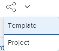

# Projektvorlagen freigeben

Sie können eine Vorlage für Benutzer freigeben oder mithilfe der folgenden Freigabeoptionen auf Vorlagenebene definieren, wie die aus einer Vorlage erstellten Projekte für Benutzer freigegeben werden.

Beim Freigeben eines Objekts in Adobe Workfront ermöglichen Sie anderen Benutzenden, dieses Objekt anzuzeigen, zu ihm beizutragen oder zu bearbeiten.

Informationen zu Berechtigungen für Workfront finden Sie unter [Übersicht über Freigabeberechtigungen für Objekte](../../../workfront-basics/grant-and-request-access-to-objects/sharing-permissions-on-objects-overview.md).

Informationen zu den Berechtigungen, die Sie Benutzern bei der Freigabe einer Vorlage erteilen können, finden Sie unter [Freigeben einer Vorlage](../../../workfront-basics/grant-and-request-access-to-objects/share-a-template.md).

## Zugriffsanforderungen

+++ Erweitern Sie , um die Zugriffsanforderungen für die -Funktion in diesem Artikel anzuzeigen. 

<table style="table-layout:auto"> 
 <col> 
 <col> 
 <tbody> 
  <tr> 
   <td role="rowheader">Adobe Workfront-Paket</td> 
   <td> 
Beliebig
 </td> 
  </tr> 
  <tr> 
   <td role="rowheader">Adobe Workfront-Lizenz</td> 
   <td> 
Standard

   
Plan
 </td> 
  </tr> 
  <tr> 
   <td role="rowheader">Konfigurationen der Zugriffsebene</td> 
   <td> 
Zugriff auf Vorlagen bearbeiten
  </td> 
  </tr> 
  <tr> 
   <td role="rowheader">Objektberechtigungen</td> 
   <td> 
Verwalten von Berechtigungen für eine Vorlage
 </td> 
  </tr> 
 </tbody> 
</table>

Weitere Informationen finden Sie unter [Zugriffsanforderungen in der Dokumentation zu Workfront](/help/quicksilver/administration-and-setup/add-users/access-levels-and-object-permissions/access-level-requirements-in-documentation.md).

+++

<!--Old:
<table style="table-layout:auto"> 
 <col> 
 <col> 
 <tbody> 
  <tr> 
   <td role="rowheader">Adobe Workfront plan*</td> 
   <td> 
Any 
 </td> 
  </tr> 
  <tr> 
   <td role="rowheader">Adobe Workfront license*</td> 
   <td> 
Plan 
 </td> 
  </tr> 
  <tr> 
   <td role="rowheader">Access level configurations*</td> 
   <td> 
Edit access to Templates
 
Note: If you still don't have access, ask your Workfront administrator if they set additional restrictions in your access level. For information on how a Workfront administrator can modify your access level, see <a href="../../../administration-and-setup/add-users/configure-and-grant-access/create-modify-access-levels.md" class="MCXref xref">Create or modify custom access levels</a>.
 </td> 
  </tr> 
  <tr> 
   <td role="rowheader">Object permissions</td> 
   <td> 
Manage permissions to a template
 
For information on requesting additional access, see <a href="../../../workfront-basics/grant-and-request-access-to-objects/request-access.md" class="MCXref xref">Request access to objects </a>.
 </td> 
  </tr> 
 </tbody> 
</table>-->

## Freigeben einer Vorlage {#share-a-template}

Sie können Ihre Vorlagen mithilfe der Vorlagenfreigabe für andere Benutzer freigeben. Diese Aktion definiert, wer über Berechtigungen für die Vorlage verfügt.

>[!NOTE]
>
>Wenn Sie einen aktiven Benutzer als Inhaber der Vorlage festlegen, erhält dieser Benutzer automatisch Verwaltungsberechtigungen für die Vorlage. Informationen dazu, wie Sie eine Person zum Vorlagenbesitzer bestimmen, finden Sie unter [Projektvorlagen bearbeiten](../../../manage-work/projects/create-and-manage-templates/edit-templates.md).

Freigeben einer Vorlage:

1. Klicken Sie auf dem **Hauptmenü**-Symbol  auf **Vorlagen**.

1. Führen Sie einen der folgenden Schritte aus:\
   Klicken Sie auf den Namen einer Vorlage, um sie zu öffnen, und klicken Sie dann auf das Menü **Mehr**  und dann auf **Vorlagenfreigabe**.

   Oder

   Wählen Sie eine Vorlage aus der Liste aus, klicken Sie auf das Freigabesymbol  dann auf **Vorlage.**

   >[!TIP]
   >
   >Sie können ein Objekt nur für aktive Benutzer, Teams, Rollen oder Unternehmen freigeben.

1. Wählen Sie im Feld **Vorlagenzugriff** die Personen, Teams, Rollen, Gruppen oder Unternehmen aus, für die Sie die Vorlage freigeben möchten.

   Sie können auch auf das Symbol **Optionen** klicken, um die Vorlage systemweit verfügbar zu machen:

1. Wählen Sie aus dem Dropdown-Menü für jede Entität, für die Sie Daten freigeben, eine der folgenden Optionen aus:

   * **Anzeigen**: Benutzer mit diesen Berechtigungen können die Vorlage anzeigen und ein Projekt damit erstellen oder sie an ein vorhandenes Projekt anhängen.

     >[!TIP]
     >
     >Ihr Workfront-Administrator muss Ihnen Bearbeitungszugriff auf Projekte erteilen, um Projekte erstellen zu können.

   * **Verwalten**: Benutzer mit diesen Berechtigungen können die Vorlage bearbeiten oder löschen.

     Informationen zu den hier verfügbaren erweiterten Einstellungen  Sie im Abschnitt [Erweiterte Einstellungen für die Vorlagenfreigabe](../../../workfront-basics/grant-and-request-access-to-objects/share-a-template.md#template-permissions) im Artikel [Freigeben einer Vorlage](../../../workfront-basics/grant-and-request-access-to-objects/share-a-template.md).

1. Klicken Sie auf **Speichern**.

## Freigeben eines Projekts über eine Vorlage {#share-a-project-from-a-template}

Bei der gemeinsamen Nutzung von Vorlagen für Projekte können Sie auf Vorlagenebene festlegen, wer über Berechtigungen für die in der Vorlage erstellten Projekte verfügt.

So geben Sie zukünftige Projekte, die aus einer Vorlage erstellt wurden, für Benutzer frei:

1. Führen Sie einen der folgenden Schritte aus:\
   Klicken Sie auf den Namen einer Vorlage, um sie zu öffnen, und klicken Sie dann auf das Menü **Mehr**  und dann auf **Vorlagenfreigabe**.

   

   Oder

   Wählen Sie eine Vorlage aus der Liste aus, klicken Sie auf **Freigeben** und dann auf **Projekt.**

1. Wählen Sie im Feld **Projektzugriff** die Personen, Teams, Rollen, Gruppen oder Unternehmen aus, für die die Vorlage freigegeben ist.

   >[!TIP]
   >
   >Sie können ein Objekt nur für aktive Benutzer, Teams, Rollen oder Unternehmen freigeben.

1. Wählen Sie aus dem Dropdown-Menü für jede Entität eine der folgenden Optionen aus:

   * **Kein Zugriff**: Sie können angeben, welche Benutzer keinen Zugriff auf die Vorlage haben.\
     Diese Option ist nur bei der Massenfreigabe von Projekten aus Vorlagen verfügbar. 
   * **Anzeigen**: Benutzer mit diesen Berechtigungen können Projekte anzeigen, die aus der Vorlage erstellt wurden.
   * **Beitragen**: Benutzer mit diesen Berechtigungen können zu Projekten beitragen, die aus der Vorlage erstellt wurden 
   * **Verwalten**: Benutzer mit diesen Berechtigungen können Projekte verwalten oder löschen, die aus dieser Vorlage erstellt wurden.

1. (Optional) Klicken Sie auf **Optionen**, um die Projekte systemweit verfügbar zu machen.
1. Klicken Sie auf **Speichern**.

<!--

<h3>Overview of project sharing from other sources</h3>

You may already have been assigned access to projects from other areas of Workfront.  You may have been assigned access to projects from the following areas: 

<ul>
<li>When a project is created For more information about sharing projects when the project is created, see the "Access" section in <a href="../../../manage-work/projects/manage-projects/edit-projects.md" class="MCXref xref">Edit projects</a>.</li>
<li>When your Workfront administrator sets user access levels For more information about setting access levels, see <a href="../../../administration-and-setup/add-users/configure-and-grant-access/create-modify-access-levels.md" class="MCXref xref">Create or modify custom access levels</a>.</li>
<li>When using the project access template</li>
</ul>

When using the Template Project Sharing feature, if a user's access to a project is View, but you set the access permissions for Template Project Sharing to Manage, the user will have Manage permission for every project created using this specific template. The user will only have View permission for the other projects they are on.

-->

## Stapelweises Freigeben von Vorlagen und Projekten aus Vorlagen

Sie können mehrere Vorlagen sowie Projekte aus mehreren Vorlagen gleichzeitig freigeben.

>[!NOTE]
>
>Wenn Sie mehrere Vorlagen auswählen, können Sie nicht sehen, wer bereits über Berechtigungen für die einzelnen Vorlagen verfügt.

1. Navigieren Sie zu einer Liste von Vorlagen.
1. Wählen Sie mehrere Vorlagen aus und klicken Sie dann auf .

   

   >[!TIP]
   >
   >Sie können ein Objekt nur für aktive Benutzer, Teams, Rollen oder Unternehmen freigeben.

1. Klicken Sie **Vorlage**, um die ausgewählten Vorlagen freizugeben.

   Oder

   Klicken Sie **Projekt**, um die Projekte freizugeben, die aus den ausgewählten Vorlagen erstellt werden.

1. Sie können die Vorlagen für die Projekte weiterhin freigeben, wie in den folgenden Abschnitten in diesem Artikel beschrieben:

   * [Freigeben einer Vorlage](#share-a-template)
   * [Freigeben eines Projekts über eine Vorlage](#share-a-project-from-a-template)
