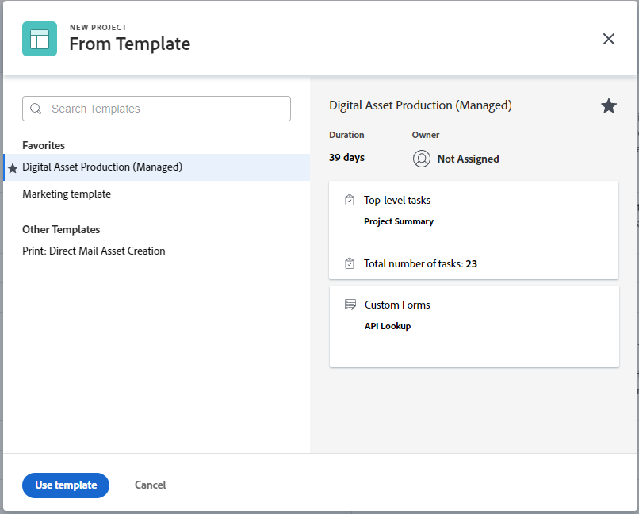

# Erstellen eines Projekts mithilfe einer Vorlage

<!-- Audited: 10/2025 -->

Sie können Vorlagen als Framework verwenden, um Projekte in Adobe Workfront zu erstellen. Bei Projekten, die sich oft wiederholen, erübrigt sich die Verwendung von Vorlagen für die allgemeine Zeitleiste des neuen Projekts, dieselben Projekte wiederholt zu erstellen.

Mit Vorlagen können Sie wiederholbare Prozesse, Informationen und Einstellungen erfassen, die mit Ihren Projekten verknüpft sind. Die mit einer Vorlage verknüpften Informationen werden an das Projekt übertragen. Dazu gehören Aufgaben, Zuweisungen, Dauer, Dokumente, finanzielle Details, Risiken und benutzerdefinierte Formulare.

>[!TIP]
>
>Workfront definiert die Gruppe und den Status des neuen Projekts wie folgt:
>
>* Der Standardstatus eines neuen Projekts, das über eine Vorlage erstellt wurde, entspricht dem Status, den Ihr Workfront-Administrator im Hauptbereich Projektvoreinstellungen oder ein Gruppenadministrator (oder Workfront-Administrator) im Bereich Projektvoreinstellungen für eine Gruppe definiert hat. Informationen zum Konfigurieren von Projektvoreinstellungen finden Sie [Systemweite Projektvoreinstellungen konfigurieren](../../../administration-and-setup/set-up-workfront/configure-system-defaults/set-project-preferences.md) oder [Projektvoreinstellungen für eine Gruppe konfigurieren](../../../administration-and-setup/manage-groups/create-and-manage-groups/configure-project-preferences-group.md).
>
>* Die Gruppe des neuen Projekts ist die Gruppe der Vorlage. Wenn die Vorlage keiner Gruppe zugeordnet ist, ist die Gruppe des Projekts die Hauptgruppe des Benutzers, der das Projekt erstellt.
>
>* Die für ein neues Projekt verfügbaren Status stimmen mit den Status der Projektgruppe überein, bei der es sich entweder um die Gruppe der Vorlage oder die Hauptgruppe des Benutzers handelt, der das Projekt erstellt.

Sie haben die folgenden Optionen, um ein Projekt aus einer Vorlage zu erstellen:

* Erstellen eines Projekts über eine Vorlage im Bereich „Projekte“
* Erstellen eines Projekts anhand einer Vorlage auf Vorlagenebene
* Vorlage an ein vorhandenes Projekt anhängen

  Weitere Informationen finden Sie unter [Anhängen einer Vorlage an ein Projekt](../../../manage-work/projects/create-and-manage-templates/attach-template-to-project.md).

* Erstellen eines Projekts über eine Vorlage im Bereich Gruppen

## Zugriffsanforderungen

+++ Erweitern, um die Zugriffsanforderungen für die in diesem Artikel beschriebene Funktionalität anzuzeigen.

<table style="table-layout:auto"> 
 <col> 
 <col> 
 <tbody> 
  <tr> 
   <td role="rowheader">Adobe Workfront-Paket</td> 
   <td> 
Beliebig
 </td> 
  </tr> 
  <tr> 
   <td role="rowheader">Workfront-Lizenz</td> 
   <td> 
Standard

        
Abo
 </td> 
  </tr> 
  <tr> 
   <td role="rowheader">Konfiguration der Zugriffsebene</td> 
   <td> 
Zugriff auf Projekte und Vorlagen bearbeiten

   
Bearbeiten Sie den Zugriff auf Portfolios und Programme, wenn die verwendete Vorlage einen Portfolio und ein Programm enthält
  
   </td> 
  </tr> 
  <tr> 
   <td role="rowheader">Objektberechtigungen</td> 
   <td> 
Anzeigen von Berechtigungen für eine Vorlage
 
  
Wenn die verwendete Vorlage eine Portfolio und ein Programm enthält, müssen Sie über Verwaltungsberechtigungen für das Portfolio und das Programm verfügen, um das Projekt zu erstellen 
 
   
Wenn Sie ein Projekt erstellen, erhalten Sie automatisch Verwaltungsberechtigungen für das Projekt.
</td> 
  </tr> 
 </tbody> 
</table>

Weitere Informationen finden Sie unter [Zugriffsanforderungen in der Dokumentation zu Workfront](/help/quicksilver/administration-and-setup/add-users/access-levels-and-object-permissions/access-level-requirements-in-documentation.md).

+++

<!--
Old:

<table style="table-layout:auto"> 
 <col> 
 <col> 
 <tbody> 
  <tr> 
   <td role="rowheader">Adobe Workfront plan</td> 
   <td> 
Any 
 </td> 
  </tr> 
  <tr> 
   <td role="rowheader">Workfront license*</td> 
   <td> 
New: Standard

        
or

        
Current: Plan 
 </td> 
  </tr> 
  <tr> 
   <td role="rowheader">Access level</td> 
   <td> 
Edit access to Projects and to Templates

   
   
edit access to Portfolios and Programs, if the template you use contains a Portfolio and a Program

   
   </td> 
  </tr> 
  <tr> 
   <td role="rowheader">Object permissions</td> 
   <td> 
View permissions to a template
 
  
If the template you use contains a Portfolio and a Program, you must have Manage permissions to the portfolio and program to create the project 
 
   
When you create a project, you automatically receive Manage permissions to the project.
</td> 
  </tr> 
 </tbody> 
</table>
-->

## Erstellen eines Projekts über eine Vorlage im Bereich „Projekte“

Sie können ein Projekt über den Bereich Projekte im Hauptmenü oder über den Bereich Projekte eines Portfolios oder Programms erstellen.

>[!NOTE]
>
>Der System- oder Gruppenadministrator kann die Benutzeroberfläche mithilfe einer Layout-Vorlage ändern. In diesem Fall können einige der Namen der Abschnitte und Bereiche, auf die in den folgenden Schritten verwiesen wird, in Ihrer Instanz von Workfront unterschiedlich sein.

1. Führen Sie einen der folgenden Schritte aus:

   * Klicken Sie oben links auf **[!UICONTROL Hauptmenü]**-Symbol  und klicken Sie dann auf **Projekte** und erweitern Sie **Neues Projekt**.
   * Gehen Sie zu einem Portfolio und erweitern Sie dann **Neues Projekt**.

     >[!TIP]
     >
     >Wenn Sie ein Projekt mit einer Vorlage aus einem Portfolio erstellen, wird das Portfolio-Feld des neuen Projekts aktualisiert und zeigt das Portfolio an, aus dem Sie das Projekt erstellen möchten. Dadurch wird das Portfolio-Feld in der Vorlage überschrieben, falls es angegeben ist.

   * Wechseln Sie zu einem Programm und erweitern Sie dann **Neues Projekt**.

     >[!TIP]
     >
     >Wenn Sie ein Projekt mithilfe einer Vorlage aus einem Programm erstellen, wird das Feld Programm der neuen Projekte aktualisiert und zeigt das Programm an, aus dem Sie das Projekt erstellen möchten. Das Feld Portfolio der Vorlage wird aktualisiert und zeigt das Portfolio des Programms an, aus dem Sie das Projekt erstellen möchten. Dadurch werden die Programmfelder und Portfolio-Felder in der Vorlage überschrieben, falls sie angegeben sind.

   * Wenn Sie Gruppenadministrator sind, können Sie im Abschnitt Projekte einer Gruppe, die Sie verwalten, auch ein Projekt erstellen. Weitere Informationen finden Sie unter [Erstellen und Ändern der Projekte einer Gruppe](../../../administration-and-setup/manage-groups/work-with-group-objects/create-and-modify-a-groups-projects.md).

     >[!TIP]
     >
     >Wenn Sie ein Projekt mit einer Vorlage aus einer Gruppe erstellen, wird die Gruppe, aus der Sie das Projekt erstellen, nur dann im Feld Gruppe des neuen Projekts angezeigt, wenn das Feld Gruppe der Vorlage nicht angegeben ist. Wenn das Feld Vorlagengruppe angegeben ist, wird für das neue Projekt das Feld Gruppe der Vorlage verwendet.

   <!--
   
(this, above, is hyperlinked to the classic version of this article; the Milestone View steps are similar to creating a project in Classic than to the way you do it in NWE)

   -->

   

1. Klicken Sie auf den Namen einer Vorlage in der Liste **Favoritenvorlagen**.

   

   Oder gehen Sie folgendermaßen vor:

   1. Klicken Sie auf **Neues Projekt aus Vorlage**.
   1. (Optional) Geben Sie im Feld **Suchvorlagen** den Namen einer Vorlage ein und klicken Sie darauf, wenn sie in der Liste angezeigt wird.
   1. Klicken Sie auf den Namen einer der folgenden Vorlagentypen, um sie auszuwählen:

      * Eine alte Workfront-Speichervorlage

        Bei älteren Workfront-Speichervorlagen wird neben dem Namen das Symbol für alten Speicher ) angezeigt.

        Dokumente über die Vorlage und die zukünftigen Projekte werden im Workfront-Speicher gespeichert.
      * Eine Adobe Cloud-Speichervorlage

        Dokumente zur Vorlage und zu den zukünftigen Projekten werden im Adobe Cloud-Speicher gespeichert.

      >[!NOTE]
      >
      >* Durch die Verwendung einer Adobe-Cloud-Speichervorlage wird ein Adobe-Cloud-Speicherprojekt erstellt.
      >
      >* Durch die Verwendung einer Legacy-Speichervorlage für Workfront wird ein Legacy-Speicherprojekt für Workfront erstellt.
      >
      >* Beim Erstellen von Projekten mit Vorlagen aus einem Portfolio oder Programm gibt es die folgenden Szenarien:
      >     * Sie können keine Adobe-Cloud-Speichervorlage aus einem alten Workfront-Speicherportfolio oder -Programm verwenden, um ein Projekt zu erstellen.
      >     * Sie können ein Adobe-Cloud-Speicherprojekt für ein Adobe-Speicherportfolio oder -Programm mithilfe einer Legacy-Speichervorlage erstellen. Vorlagendokumente und -ordner werden nicht an das neue Projekt angehängt.
      >
      > Ihre Workfront-Instanz verfügt möglicherweise nicht über beide Arten von Dokumentspeicher.
      >
      >Weitere Informationen finden Sie unter [Übersicht über das Dokumentenmanagement für Projekte und verwandte Objekte](/help/quicksilver/manage-work/projects/manage-projects/manage-documents-on-projects.md).

   1. (Bedingt und optional) Wenn Sie eine ältere Speichervorlage ausgewählt haben, wählen Sie die Einstellung Dieses Projekt im Adobe Cloud-Speicher erstellen in der unteren rechten Ecke des Felds Neues Projekt aus. Dadurch wird ein Adobe-Cloud-Speicherprojekt erstellt. Dokumente und Dokumentordner aus der Vorlage werden nicht zum Projekt hinzugefügt.

   1. Überprüfen Sie die folgenden Vorlagendetails auf der rechten Seite:

      * Vorlagendauer
      * Inhaber der Vorlage
      * Die Anzahl der Aufgaben der obersten Ebene, einschließlich der Namen der drei wichtigsten Aufgaben
      * Die Anzahl aller Aufgaben in der Vorlage
      * Die Namen der benutzerdefinierten Vorlagenformulare

   1. (Optional) Bewegen Sie den Mauszeiger im linken Bereich über den Namen einer Vorlage und klicken Sie auf das Symbol **Favoriten** **Symbol** , um sie für die zukünftige Verwendung als Favorit zu markieren.

      ODER

      Erweitern Sie die **Favoritenvorlagen** Liste und wählen Sie eine Vorlage aus der Dropdown-Liste aus.

      >[!TIP]
      >
      >Sie können bis zu 40 Workfront-Elemente als Favoriten markieren. Dazu gehören Vorlagen und andere Elemente.

   1. Klicken Sie **Vorlage verwenden** wenn Sie eine Vorlage ausgewählt haben.

      

      <!--
      no longer available, after unshimming - Oct 2025:
      >[!NOTE]
      >
      >If you have the Milestone View applied to the list of projects, click the name of a template in the **New from Template section**.
      >
      >
      >
      >
      -->

   Das **Neues Projekt** wird geöffnet.

   

1. (Bedingt) Wenn ein Feld bereits in der Vorlage ausgefüllt ist, wird das Feld im Feld **Neues Projekt** vorbefüllt.

   Bearbeiten Sie die vorausgefüllten Werte, um sie besser an Ihr Projekt anzupassen.

   Weitere Informationen finden Sie unter [Projekte bearbeiten](../../../manage-work/projects/manage-projects/edit-projects.md).
1. Klicken Sie **Projekt erstellen**.

   Alle in der Vorlage definierten Details werden automatisch dem neu erstellten Projekt zugeordnet, sofern Sie sie im vorherigen Schritt nicht geändert haben.

   Ein Dokumentordner mit demselben Namen wie das Projekt wird automatisch für Adobe Cloud-Speicher-Projekte im Abschnitt Dokumente des Projekts erstellt.

## Erstellen eines Projekts über eine Vorlage im Bereich Vorlagen

Anstatt im Bereich Projekte zu beginnen, können Sie ein Projekt aus einer Vorlage erstellen, indem Sie mit der Vorlage beginnen.

>[!NOTE]
>
>Mit dem Workfront-Dokumentspeicher verknüpfte Vorlagen erstellen veraltete Workfront-Speicherprojekte. Mit Adobe Cloud-Speicherdokumenten verknüpfte Vorlagen für erstellen Adobe Cloud-Speicherprojekte. Ihre Workfront-Instanz verfügt möglicherweise nicht über beide Arten von Dokumentspeicher.
>
>Weitere Informationen finden Sie unter [Übersicht über das Dokumentenmanagement für Projekte und verwandte Objekte](/help/quicksilver/manage-work/projects/manage-projects/manage-documents-on-projects.md).

{{step1-to-templates}}

1. Klicken Sie auf den Namen einer Vorlage, die Sie verwenden möchten.
1. Klicken Sie auf das **Mehr** Menü  rechts neben dem Vorlagennamen in der Kopfzeile und klicken Sie dann auf **Projekt erstellen**.

   

   Das **Neues Projekt** wird geöffnet.

1. Geben Sie einen Namen für das Projekt ein. Workfront verwendet den Namen der Vorlage, um das neue Projekt zu benennen.

1. Überprüfen Sie jeden Abschnitt im Feld **Neues Projekt** und nehmen Sie die erforderlichen Änderungen vor.

   

   Wenn ein Feld bereits in der Vorlage ausgefüllt ist, wird das Feld im Feld **Neues Projekt** vorausgefüllt. Sie können die vorausgefüllten Werte bearbeiten, um sie besser an Ihr Projekt anzupassen.

   Weitere Informationen finden Sie unter [Projekte bearbeiten](../../../manage-work/projects/manage-projects/edit-projects.md).

1. Klicken Sie **Projekt erstellen**.

   Alle in der Vorlage definierten Details werden automatisch dem neu erstellten Projekt zugeordnet, sofern Sie sie im vorherigen Schritt nicht geändert haben.

   Ein Dokumentordner mit demselben Namen wie das Projekt wird automatisch für Adobe Cloud-Speicher-Projekte im Abschnitt Dokumente des Projekts erstellt.
