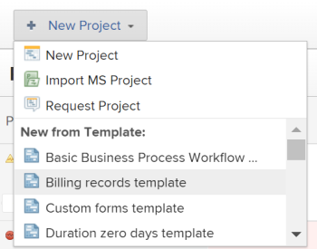

# Erstellen eines Projekts mit einer Vorlage

Sie können Vorlagen als Framework zum Erstellen von Projekten verwenden. Wenn Sie Projekte haben, die sich häufig wiederholen, sparen Sie sich durch die Verwendung von Vorlagen für die allgemeine Zeitleiste des neuen Projekts, dieselben Projekte wiederholt erstellen zu müssen.

Vorlagen bieten Ihnen eine Möglichkeit, wiederholbare Prozesse, Informationen und Einstellungen zu erfassen, die mit Ihren Projekten verknüpft sind. Die mit einer Vorlage verknüpften Informationen werden an das Projekt übertragen. Dazu gehören Aufgaben, Zuweisungen, Dauern, Dokumente, Finanzdetails, Risiken und benutzerdefinierte Formulare.

>[!TIP]
>
>Workfront definiert die Gruppe und den Status des neuen Projekts wie folgt:
>
>* Der Standardstatus eines neuen Projekts, das aus einer Vorlage erstellt wurde, entspricht dem Status, der von Ihrem Workfront-Administrator im Hauptbereich &quot;Projekteinstellungen&quot;oder von einem Gruppenadministrator (oder Workfront-Administrator) im Bereich &quot;Projekteinstellungen&quot;für eine Gruppe definiert wurde. Informationen zum Konfigurieren von Projektvoreinstellungen finden Sie unter [Systemweite Projektvoreinstellungen konfigurieren](../../../administration-and-setup/set-up-workfront/configure-system-defaults/set-project-preferences.md) oder [Konfigurieren von Projektvoreinstellungen für eine Gruppe](../../../administration-and-setup/manage-groups/create-and-manage-groups/configure-project-preferences-group.md).
>
>* Die Gruppe des neuen Projekts ist die Gruppe der Vorlage. Wenn die Vorlage nicht mit einer Gruppe verknüpft ist, ist die Gruppe des Projekts die Startseite des Benutzers, der das Projekt erstellt.
>
>* Die für ein neues Projekt verfügbaren Status stimmen mit den Status der Gruppe des Projekts überein, bei der es sich entweder um die Gruppe der Vorlage oder um die Home-Gruppe des Benutzers handelt, der das Projekt erstellt.

Sie haben die folgenden Optionen zum Erstellen eines Projekts aus einer Vorlage:

* Erstellen eines Projekts aus einer Vorlage im Bereich &quot;Projekte&quot;
* Erstellen eines Projekts aus einer Vorlage auf Vorlagenebene
* Eine Vorlage an ein vorhandenes Projekt anhängen

   Weitere Informationen finden Sie unter [Eine Vorlage an ein Projekt anhängen](../../../manage-work/projects/create-and-manage-templates/attach-template-to-project.md).

* Erstellen eines Projekts aus einer Vorlage im Bereich &quot;Gruppen&quot;

## Zugriffsanforderungen

<!--drafted for P&P:

<table style="table-layout:auto"> 
 <col> 
 <col> 
 <tbody> 
  <tr> 
   <td role="rowheader">Adobe Workfront plan*</td> 
   <td> 
Any 
 </td> 
  </tr> 
  <tr> 
   <td role="rowheader">Workfront license*</td> 
   <td> 
Current license: Standard 

   Or
   
Legacy license: Plan 

    </td> 
  </tr> 
  <tr> 
   <td role="rowheader">Access level configurations*</td> 
   <td> 
Edit access to Projects and to Templates
 
<b>NOTE</b>
   
   If you still don't have access, ask your Workfront administrator if they set additional restrictions in your access level. For information about access to projects, see <a href="../../../administration-and-setup/add-users/configure-and-grant-access/grant-access-projects.md" class="MCXref xref">Grant access to projects</a>. For information on how a Workfront administrator can change your access level, see <a href="../../../administration-and-setup/add-users/configure-and-grant-access/create-modify-access-levels.md" class="MCXref xref">Create or modify custom access levels</a>. 
 </td> 
  </tr> 
  <tr> 
   <td role="rowheader">Object permissions</td> 
   <td> 
View permissions to a template
 
When you create a project you automatically receive Manage permissions to the project 
 
 For information about project permissions, see <a href="../../../workfront-basics/grant-and-request-access-to-objects/share-a-project.md" class="MCXref xref">Share a project in Adobe Workfront</a>.
 
For information on requesting additional access, see <a href="../../../workfront-basics/grant-and-request-access-to-objects/request-access.md" class="MCXref xref">Request access to objects </a>.
 </td> 
  </tr> 
 </tbody> 
</table>
-->

Sie müssen über folgenden Zugriff verfügen, um die Schritte in diesem Artikel ausführen zu können:

<table style="table-layout:auto"> 
 <col> 
 <col> 
 <tbody> 
  <tr> 
   <td role="rowheader">Adobe Workfront-Plan*</td> 
   <td> 
Beliebig 
 </td> 
  </tr> 
  <tr> 
   <td role="rowheader">Übersicht über Workfront-Lizenzen*</td> 
   <td> 
Plan 
 </td> 
  </tr> 
  <tr> 
   <td role="rowheader">Zugriffsebene*</td> 
   <td> 
Zugriff auf Projekte und Vorlagen bearbeiten
 
<b>NOTIZ</b>

Wenn Sie immer noch keinen Zugriff haben, fragen Sie Ihren Workfront-Administrator, ob er zusätzliche Zugriffsbeschränkungen für Ihre Zugriffsebene festlegt. Informationen zum Zugriff auf Projekte finden Sie unter <a href="../../../administration-and-setup/add-users/configure-and-grant-access/grant-access-projects.md" class="MCXref xref">Projektzugriff gewähren</a>. Informationen dazu, wie ein Workfront-Administrator Ihre Zugriffsstufe ändern kann, finden Sie unter <a href="../../../administration-and-setup/add-users/configure-and-grant-access/create-modify-access-levels.md" class="MCXref xref">Benutzerdefinierte Zugriffsebenen erstellen oder ändern</a>. 
 </td>
</tr> 
  <tr> 
   <td role="rowheader">Objektberechtigungen</td> 
   <td> 
Berechtigungen für eine Vorlage anzeigen
 
Wenn Sie ein Projekt erstellen, erhalten Sie automatisch Verwaltungsberechtigungen für das Projekt 
 
 Weitere Informationen zu Projektberechtigungen finden Sie unter <a href="../../../workfront-basics/grant-and-request-access-to-objects/share-a-project.md" class="MCXref xref">Freigeben eines Projekts in Adobe Workfront</a>.
 
Informationen zum Anfordern von zusätzlichem Zugriff finden Sie unter <a href="../../../workfront-basics/grant-and-request-access-to-objects/request-access.md" class="MCXref xref">Zugriff auf Objekte anfordern </a>.
 </td> 
  </tr> 
 </tbody> 
</table>

&#42;Wenden Sie sich an Ihren Workfront-Administrator, um zu erfahren, welchen Plan, welchen Lizenztyp oder welchen Zugriff Sie haben.

## Erstellen eines Projekts aus einer Vorlage im Bereich &quot;Projekte&quot;

Sie können ein Projekt im Bereich Projekte im Hauptmenü oder im Bereich Projekte eines Portfolios oder Programms erstellen.

1. Führen Sie einen der folgenden Schritte aus:

   * Klicken Sie auf **Hauptmenü** klicken **Projekte**, dann erweitern **Neues Projekt**.
   * Wechseln Sie zu einem Portfolio und erweitern Sie **Neues Projekt**.

      >[!TIP]
      >
      >Wenn Sie ein Projekt mit einer Vorlage aus einem Portfolio erstellen, wird das Projektfeld des neuen Portfolios aktualisiert, um das Portfolio anzuzeigen, aus dem Sie das Projekt erstellen möchten. Dadurch wird das Feld Portfolio in der Vorlage überschrieben, sofern angegeben.

   * Navigieren Sie zu einem Programm und erweitern Sie **Neues Projekt**.

      >[!TIP]
      >
      >Wenn Sie ein Projekt mithilfe einer Vorlage aus einem Programm erstellen, wird das Programmfeld der neuen Projekte aktualisiert, um das Programm anzuzeigen, aus dem Sie das Projekt erstellen möchten. Das Feld Portfolio der Vorlage wird aktualisiert und zeigt das Portfolio des Programms an, aus dem Sie das Projekt erstellen möchten. Dadurch werden die Portfolio- und Programmfelder in der Vorlage überschrieben, sofern sie angegeben wurden.

   * Als Gruppenadministrator können Sie auch ein Projekt im Abschnitt &quot;Projekte&quot;einer von Ihnen verwalteten Gruppe erstellen. Weitere Informationen finden Sie unter [Erstellen und Ändern von Gruppenprojekten](../../../administration-and-setup/manage-groups/work-with-group-objects/create-and-modify-a-groups-projects.md).

      >[!TIP]
      >
      >Wenn Sie ein Projekt mit einer Vorlage aus einer Gruppe erstellen, wird die Gruppe, aus der Sie das Projekt erstellen, nur dann im Feld Gruppe des neuen Projekts angezeigt, wenn das Feld Gruppe der Vorlage nicht angegeben ist. Wenn das Vorlagengruppenfeld angegeben ist, ist das Gruppenfeld des neuen Projekts das des Vorlagenfelds.
   <!--
   
(this, above, is hyperlinked to the classic version of this article; the Milestone View steps are similar to creating a project in Classic than to the way you do it in NWE)

   -->

   

1. Klicken Sie auf den Namen einer Vorlage im **Favoritenvorlagen** Liste

   

   Oder

   Gehen Sie wie folgt vor:

   1. Auswählen **Neues Projekt aus Vorlage**.
   1. Im **Suchvorlagen** eingeben, den Namen einer Vorlage eingeben und auf diese klicken, wenn sie in der Liste angezeigt wird.
   1. Überprüfen Sie die Vorlagendetails auf der rechten Seite.

      Die Vorlagendetails umfassen Folgendes:

      * Vorlagendauer
      * Vorlageninhaber
      * Die Anzahl der Aufgaben auf oberster Ebene, die die Namen der drei wichtigsten Aufgaben enthält
      * Die Anzahl aller Aufgaben in der Vorlage
      * Die Namen der benutzerdefinierten Vorlagen-Formulare
   1. (Optional) Bewegen Sie den Mauszeiger über den Namen einer Vorlage und klicken Sie auf die Schaltfläche **Favoriten** **icon**  , um ihn als Favoriten für die zukünftige Verwendung zu kennzeichnen.

      Oder

      Erweitern Sie die **Favoritenvorlagen** und wählen Sie eine Vorlage aus der Dropdown-Liste aus.

      >[!TIP]
      >
      >Sie können bis zu 40 Workfront-Elemente als Favoriten markieren. Dazu gehören Vorlagen und andere Elemente.

   1. Klicken **Vorlage verwenden** wenn Sie eine Vorlage ausgewählt haben.

   

   >[!NOTE]
   >
   >Wenn Sie die Meilensteinansicht auf die Liste der Projekte angewendet haben, klicken Sie auf den Namen einer Vorlage in der **Neuer Bereich &quot;Vorlage&quot;**.
   >
   >
   >   >

1. Die **Neues Projekt** wird geöffnet.

   

1. Wenn ein Feld bereits in der Vorlage ausgefüllt ist, wird das Feld im **Neues Projekt** ankreuzen. Sie können die vorausgefüllten Werte bearbeiten, um sie besser an Ihr Projekt anzupassen. Weitere Informationen finden Sie unter [Projekte bearbeiten](../../../manage-work/projects/manage-projects/edit-projects.md).
1. Klicken **Projekt erstellen**.

   Alle in der Vorlage definierten Details werden automatisch mit dem neu erstellten Projekt verknüpft, wenn Sie sie im vorherigen Schritt nicht geändert haben.

## Erstellen eines Projekts aus einer Vorlage im Bereich &quot;Vorlagen&quot;

Anstatt im Bereich &quot;Projekte&quot;zu beginnen, können Sie ein Projekt aus einer Vorlage erstellen, indem Sie mit der Vorlage beginnen.

 

1. Aus dem **Hauptmenü** klicken **Vorlagen**.

1. Klicken Sie auf den Namen einer Vorlage, die Sie verwenden möchten.
1. Klicken Sie auf **Mehr** Menü Klicken Sie auf **Projekt erstellen.**

   

   Die **Neues Projekt** wird geöffnet.

1. Geben Sie einen Namen für das Projekt an, überprüfen Sie dann jeden Abschnitt und nehmen Sie die erforderlichen Änderungen vor.

   

   Wenn ein Feld bereits in der Vorlage ausgefüllt ist, wird das Feld im **Neues Projekt** ankreuzen. Sie können die vorausgefüllten Werte bearbeiten, um sie besser an Ihr Projekt anzupassen. Weitere Informationen finden Sie unter [Projekte bearbeiten](../../../manage-work/projects/manage-projects/edit-projects.md).

1. Klicken **Projekt erstellen.**

   Alle in der Vorlage definierten Details werden automatisch mit dem neu erstellten Projekt verknüpft, wenn Sie sie im vorherigen Schritt nicht geändert haben.
