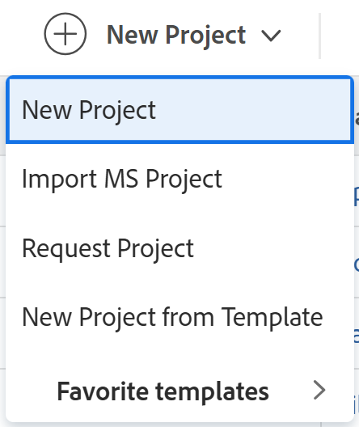

# Projekt erstellen

<!--

(NOTE:this is linked from the UI from the Projects global nav section in classic. Do not change/ remove)

-->

<!-- Audited: 12/2023 -->

Die Projekte stellen einen großen Teil der Arbeit dar, die in Adobe Workfront geleistet werden muss.

## Zugriffsanforderungen

<!--drafted for P&P - replace table below with this:

<table style="table-layout:auto"> 
 <col> 
 <col> 
 <tbody> 
  <tr> 
   <td role="rowheader">Workfront plan*</td> 
   <td> 
Any
 </td> 
  </tr> 
  <tr> 
   <td role="rowheader">Workfront license*</td> 
   <td> 
Current license: Standard 

   Or
   
Legacy license: Plan 

    </td> 
  </tr> 
  <tr> 
   <td role="rowheader">Access level*</td> 
   <td> 
Edit access to Projects
 
<b>NOTE</b>
   
   If you still don't have access, ask your Workfront administrator if they set additional restrictions in your access level. For information about access to projects, see <a href="../../../administration-and-setup/add-users/configure-and-grant-access/grant-access-projects.md" class="MCXref xref">Grant access to projects</a>. For information on how a Workfront administrator can change your access level, see <a href="../../../administration-and-setup/add-users/configure-and-grant-access/create-modify-access-levels.md" class="MCXref xref">Create or modify custom access levels</a>. 
 </td> 
  </tr> 
  <tr> 
   <td role="rowheader">Object permissions</td> 
   <td> 
When you create a project you automatically receive Manage permissions to the project 
 
 For information about project permissions, see <a href="../../../workfront-basics/grant-and-request-access-to-objects/share-a-project.md" class="MCXref xref">Share a project in Adobe Workfront</a>.
 
For information on requesting additional access, see <a href="../../../workfront-basics/grant-and-request-access-to-objects/request-access.md" class="MCXref xref">Request access to objects </a>.
 </td> 
  </tr> 
 </tbody> 
</table>

-->

Sie müssen über folgenden Zugriff verfügen, um die Schritte in diesem Artikel ausführen zu können:

<table style="table-layout:auto"> 
 <col> 
 <col> 
 <tbody> 
  <tr> 
   <td role="rowheader">Adobe Workfront-Abo</td> 
   <td> 
Alle
 </td> 
  </tr> 
  <tr> 
   <td role="rowheader">Adobe Workfront-Lizenz</td> 
   <td> 
Neu: Standard

        
oder

        
Aktuell: Plan 
 </td> 
  </tr> 
  <tr> 
   <td role="rowheader">Konfigurationen auf Zugriffsebene</td> 
   <td> 
Zugriff auf Projekte bearbeiten
 </td> 
  </tr> 
  <tr> 
   <td role="rowheader">Objektberechtigungen</td> 
   <td> 
Wenn Sie ein Projekt erstellen, erhalten Sie automatisch Verwaltungsberechtigungen für das Projekt.
 </td> 
  </tr> 
 </tbody> 
</table>

Weitere Informationen zu den Informationen in dieser Tabelle finden Sie unter [Zugriffsanforderungen in der Dokumentation zu Workfront](/help/quicksilver/administration-and-setup/add-users/access-levels-and-object-permissions/access-level-requirements-in-documentation.md).

## Möglichkeiten zum Erstellen von Projekten

Sie können ein Projekt in Workfront mit einer der folgenden Methoden erstellen:

* Erstellen Sie ein Projekt von Grund auf neu, ohne eine Vorlage zu verwenden. In diesem Artikel wird beschrieben, wie Sie ein Projekt von Grund auf neu erstellen.

* Ein vorhandenes Projekt kopieren\
  Weitere Informationen zum Kopieren von Projekten finden Sie unter [Projekt kopieren](../../../manage-work/projects/manage-projects/copy-project.md).

* Verwenden Sie eine Vorlage.\
  Weitere Informationen zur Verwendung einer Vorlage zum Erstellen eines neuen Projekts finden Sie unter [Erstellen eines Projekts mit einer Vorlage](../../../manage-work/projects/create-projects/create-project-from-template.md).

* Importieren Sie ein Projekt aus Microsoft Project.\
  Weitere Informationen zum Importieren eines Projekts aus einem MS-Projekt finden Sie unter [Importieren eines Projekts aus einem Microsoft-Projekt](../../../manage-work/projects/create-projects/import-project-from-ms-project.md).

* Importieren Sie ein Projekt mit Kick-Start.

  Als Workfront-Administrator können Sie Projekte mit einem Schnellstart importieren.

  Informationen zum Importieren von Daten mit Kick-Start in Workfront finden Sie unter [Daten mithilfe einer Kick-Start-Vorlage in Adobe Workfront importieren](../../../administration-and-setup/manage-workfront/using-kick-starts/import-data-via-kickstarts.md).

  Informationen zum Importieren von Projekten mit Kick-Start finden Sie unter [Szenario &quot;Kick-Starts&quot;: einfache Vorbereitung für Projekt- und Aufgabenimport](../../../administration-and-setup/manage-workfront/using-kick-starts/kick-starts-scenario-simple-project-task-import-prep.md).

* Veröffentlichen Sie eine Initiative aus einem Szenario im Adobe Workfront-Szenario-Planer. Für den Szenario-Planer ist eine zusätzliche Lizenz erforderlich. Weitere Informationen zum Workfront-Szenario-Planer finden Sie unter [Übersicht über den Szenario-Planer](../../../scenario-planner/scenario-planner-overview.md). Informationen zum Erstellen von Projekten aus Veröffentlichungsinitiativen finden Sie unter  [Aktualisieren oder Erstellen von Projekten durch Veröffentlichen von Initiativen im Szenario-Planer](../../../scenario-planner/publish-scenarios-update-projects.md).

## Voraussetzungen

Bevor Sie beginnen, müssen Sie Folgendes sicherstellen:

* Ihr System- oder Gruppenadministrator hat im Bereich &quot;Einrichtung&quot;die Voreinstellung &quot;Benutzer können Projekte ohne Verwendung einer Vorlage erstellen dürfen&quot;aktiviert.

  Weitere Informationen finden Sie unter [Systemweite Projektvoreinstellungen konfigurieren](../../../administration-and-setup/set-up-workfront/configure-system-defaults/set-project-preferences.md).

## Neue Standardeinstellungen für Projekte

Wenn Sie ein Projekt erstellen, wendet Workfront eine Reihe von Standardeinstellungen an. Beispielsweise sind der Status-, Gruppen- und Zeitplanmodus beim Erstellen eines Projekts voreingestellt.

Beachten Sie Folgendes:

* Als Workfront-Administrator oder Gruppenadministrator können Sie die Standardeinstellungen für ein neues Projekt konfigurieren, wenn Sie die Projektvoreinstellungen für Ihre gesamte Workfront-Instanz oder für eine Gruppe konfigurieren.
* Workfront wendet gegebenenfalls die Gruppeneinstellungen an, bevor die vom Workfront-Administrator festgelegten angewendet werden.
* Der Standardstatus eines neuen Projekts entspricht dem Status, der von Ihrem Workfront-Administrator im Bereich mit den Haupteinstellungen des Projekts oder von einem Gruppenadministrator (oder Workfront-Administrator) im Bereich Projekteinstellungen für eine Gruppe definiert wurde.

  >[!NOTE]
  >
  >Es wird empfohlen, den Standardstatus für ein neues Projekt &quot;Planung&quot;festzulegen. Wenn Sie Änderungen am neuen Projekt vornehmen, wird sichergestellt, dass keine Benachrichtigungen an die dem Projekt zugewiesenen Benutzer gesendet werden.
  >
  >Weitere Informationen zum Einrichten des Standardstatus und anderer Standardeinstellungen für ein neues Projekt finden Sie unter [Systemweite Projektvoreinstellungen konfigurieren](../../../administration-and-setup/set-up-workfront/configure-system-defaults/set-project-preferences.md) oder [Konfigurieren von Projektvoreinstellungen für eine Gruppe](../../../administration-and-setup/manage-groups/create-and-manage-groups/configure-project-preferences-group.md).

* Es gibt die folgenden Szenarien, in denen Workfront die Gruppe und den Status eines neuen Projekts definiert:

   * Wenn Sie ein Projekt von Grund auf neu erstellen, ist die Gruppe des Projekts Ihre Startseite.

     Der Projektstatus ist der Standardstatus in den Projekteinstellungen Ihrer Startseite oder Ihrer Workfront-Instanz. Sie können den Standardstatus beim Erstellen des Projekts in einen beliebigen Status ändern, der für die Gruppe des Projekts verfügbar ist.

   * Wenn Sie ein Projekt mit einer Vorlage erstellen, haben die Einstellungen aus der Vorlage Vorrang vor den Einstellungen, die vom Workfront- oder Gruppenadministrator festgelegt wurden.

     Die Gruppe des neuen Projekts ist die Gruppe der Vorlage. Wenn die Vorlage nicht mit einer Gruppe verknüpft ist, ist die Gruppe des Projekts die Startseite des Benutzers, der das Projekt erstellt.

     Der Standardstatus eines neuen Projekts, das aus einer Vorlage erstellt wurde, entspricht dem Status, der von Ihrem Workfront-Administrator im Hauptbereich &quot;Projekteinstellungen&quot;oder von einem Gruppenadministrator (oder Workfront-Administrator) im Bereich &quot;Projekteinstellungen&quot;für die Gruppe definiert wurde. Sie können den Standardstatus beim Erstellen eines Projekts aus einer Vorlage in einen beliebigen Status der Gruppe des Projekts ändern, bei der es sich entweder um die Gruppe der Vorlage oder um die Startseite des Benutzers handelt, der das Projekt erstellt.

   * Wenn Sie ein Projekt durch Konvertieren eines Problems erstellen, ist die Gruppe eines neuen Projekts die Gruppe des vorhandenen Projekts des Problems. Wenn der Benutzer, der das Problem konvertiert, keinen Zugriff auf das Projekt des Problems hat oder das Projekt des Problems keine Gruppe hat, ist die Gruppe des neuen Projekts die Startseite des Benutzers, der das Problem konvertiert.

     Die Status des neuen Projekts stimmen mit den Gruppenstatus der mit dem Projekt verknüpften Gruppe überein, d. h. entweder der Gruppe des ursprünglichen Projekts oder der Startseite des Benutzers, der das Problem konvertiert.

     Wenn Sie beim Erstellen des Projekts durch Konvertieren des Problems eine Vorlage verwenden, finden Sie im zweiten oben stehenden Szenario, welche Gruppe und welcher Status von Workfront für das neue Projekt gilt.

## Neues Projekt erstellen

>[!NOTE]
>
>Wenn Sie ein Projekt mit einer Vorlage erstellen, empfehlen wir, auch den Artikel zu sehen [Erstellen eines Projekts mit einer Vorlage](/help/quicksilver/manage-work/projects/create-projects/create-project-from-template.md).

1. Führen Sie einen der folgenden Schritte aus:

   * Klicken Sie auf **[!UICONTROL Hauptmenü]** icon  in der oberen rechten Ecke von Adobe Workfront oder (falls verfügbar) klicken Sie auf das **[!UICONTROL Hauptmenü]** icon  in der oberen linken Ecke. Klicks **Projekte**, dann erweitern **Neues Projekt**.
   * Wechseln Sie zu einem Portfolio und erweitern Sie **Neues Projekt**.
   * Öffnen Sie ein Programm und erweitern Sie **Neues Projekt**.
   * Als Gruppenadministrator können Sie auch ein Projekt im Abschnitt &quot;Projekte&quot;einer von Ihnen verwalteten Gruppe erstellen. Weitere Informationen finden Sie unter [Erstellen und Ändern von Gruppenprojekten](../../../administration-and-setup/manage-groups/work-with-group-objects/create-and-modify-a-groups-projects.md).

   

1. Klicks **Neues Projekt** im Menü ein Projekt von Grund auf neu erstellen.
1. Geben Sie einen Namen für Ihr Projekt ein. Drücken Sie die Eingabetaste , um den Namen zu speichern.

   

   In der Kopfzeile der Projektseite wird ein kurzer Überblick über den aktuellen Zustand und Fortschritt eines Projekts angezeigt. Die Informationen in der Projektheader ändern sich mit der Aktualisierung der Projektinformationen.

1. Klicks **Hinzufügen von Aufgaben beginnen**.

   Oder

   Klicks **Neue Aufgabe** , um dem Projekt Aufgaben hinzuzufügen und ihnen Ressourcen zuzuweisen.

   Weitere Informationen zum Hinzufügen von Aufgaben zu einem Projekt finden Sie unter [Erstellen von Aufgaben in einem Projekt](../../../manage-work/tasks/create-tasks/create-tasks-in-project.md).

1. Bearbeiten Sie die Projektdetails, indem Sie auf die **Mehr** Menü und dann **Bearbeiten**  neben dem Namen des Projekts.

   Die **Projekt bearbeiten** wird geöffnet.

   Weitere Informationen zum Bearbeiten eines Projekts finden Sie unter [Projekte bearbeiten](../../../manage-work/projects/manage-projects/edit-projects.md).

1. (Optional) Nachdem Sie die Projekteinstellungen konfiguriert und die Aufgaben hinzugefügt haben, können Sie den Status des Projekts in **Aktuell**.

   Dies weist darauf hin, dass das Projekt jetzt startbereit ist und die den Aufgaben zugewiesenen Benutzer jetzt mit der Bearbeitung beginnen können.

   Weitere Informationen zum Projektstatus finden Sie unter [Zugriff auf die Liste der Systemprojektstatus](../../../administration-and-setup/customize-workfront/creating-custom-status-and-priority-labels/project-statuses.md).
