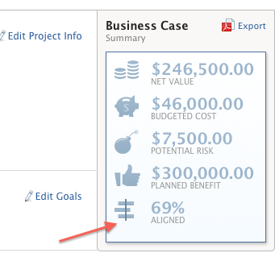

# Anwenden einer Scorecard auf ein Projekt und Generieren eines Alignment-Scores

<!-- Audited: 06/2025 -->

Sie können eine Scorecard verwenden, um zu messen, wie gut ein Projekt den zuvor festgelegten Kriterien eines Portfolios entspricht. Eine Scorecard spiegelt häufig die Mission, die Werte und die strategischen Ziele eines Unternehmens wider.

Weitere Informationen zu Scorecards und dazu, wie Sie eine Scorecard erstellen können, finden Sie unter [Erstellen einer Scorecard](../../../administration-and-setup/set-up-workfront/configure-system-defaults/create-scorecard.md).

## Zugriffsanforderungen

+++ Erweitern Sie , um die Zugriffsanforderungen für die -Funktion in diesem Artikel anzuzeigen.

<table style="table-layout:auto"> 
 <col> 
 <col> 
 <tbody> 
  <tr> 
   <td role="rowheader">Adobe Workfront-Plan*</td> 
   <td>
   
Aktuell: Prime oder höher

   
oder

   
Legacy: Unternehmen oder höher
 </td>
  </tr> 
  <tr> 
   <td role="rowheader">Adobe Workfront-Lizenz*</td> 
   <td>
   
Aktuell: Standard

   
oder

   
Legacy: Plan
</td>  
  </tr> 
  <tr> 
   <td role="rowheader">Konfigurationen der Zugriffsebene</td> 
   <td> 
Zugriff auf Projekte bearbeiten
 
Zugriff auf Portfolios anzeigen oder höher
 </td> 
  </tr> 
  <tr> 
   <td role="rowheader">Objektberechtigungen</td> 
   <td>
Verwalten von Berechtigungen für ein Projekt
 
Anzeigen oder Erweitern von Berechtigungen für ein Portfolio
 </td> 
  </tr> 
 </tbody> 
</table>

*Weitere Informationen finden Sie unter [Zugriffsanforderungen in der Dokumentation zu Workfront](/help/quicksilver/administration-and-setup/add-users/access-levels-and-object-permissions/access-level-requirements-in-documentation.md).

+++

## Projekt-Scorecards {#project-scorecards}

* [Scorecards - Übersicht](#scorecards-overview)
* [Scorecard auf ein Projekt anwenden](#apply-a-scorecard-to-a-project)

### Scorecards - Übersicht {#scorecards-overview}

In der Regel vervollständigt ein Projekt-Manager die Scorecard-Informationen, um einen Ausrichtungswert zwischen 0 und 100 für das Projekt zu erzeugen. Der erzeugte Wert wird später verwendet, wenn der Portfolio-Manager die Projekte im Portfolio-Optimizer überprüft, um sie zu vergleichen.

Weitere Informationen zur Portfoliooptimierung finden Sie unter [Übersicht über Portfolio Optimizer](../../../manage-work/portfolios/portfolio-optimizer/portfolio-optimizer-overview.md).

### Scorecard auf ein Projekt anwenden

Als Benutzer mit einer Standard- oder Planlizenz und der Berechtigung Verwalten für ein Projekt können Sie eine Scorecard an das Projekt anhängen.

Weitere Informationen zu Projektberechtigungen finden Sie unter [Freigeben eines Projekts in Adobe Workfront](../../../workfront-basics/grant-and-request-access-to-objects/share-a-project.md).

Sie können einem Projekt Scorecards hinzufügen, um den Business Case für das Projekt zu erstellen.

Weitere Informationen zum Erstellen eines Business Case finden Sie unter [Erstellen eines Business Case für ein Projekt](../../../manage-work/projects/define-a-business-case/create-business-case.md).

Ihr Adobe Workfront-Administrator oder Gruppenadministrator muss den Scorecard-Abschnitt im Business Case-Bereich Ihrer Projekte aktivieren, bevor Sie über den Business Case auf Scorecards zugreifen können. Informationen zum Einrichten von Projektvoreinstellungen und Aktivieren von Geschäftsbereichen finden Sie unter [Konfigurieren von systemweiten Projektvoreinstellungen](../../../administration-and-setup/set-up-workfront/configure-system-defaults/set-project-preferences.md).

Anwenden einer Scorecard auf ein Projekt:

1. Wechseln Sie zu einem Projekt, auf das Sie eine Scorecard anwenden möchten.
1. Klicken Sie **linken Bedienfeld** Business Case“.
1. Suchen Sie den **Scorecard** des Business Case.\
   Sie müssen eine Scorecard erstellen, bevor der Abschnitt **Scorecard** im Business-Case angezeigt wird.

   Informationen zum Erstellen einer Scorecard finden Sie unter [Erstellen einer Scorecard](../../../administration-and-setup/set-up-workfront/configure-system-defaults/create-scorecard.md).

1. Wählen Sie eine Scorecard aus dem Dropdown-Menü aus.

   

1. Geben Sie eine Antwort für alle Fragen in der Scorecard ein.

   Workfront wendet auf jede beantwortete Frage eine Punktzahl an und berechnet eine Gesamtprojektzahl auf der Grundlage der individuellen Punktzahl jeder Frage.

   Weitere Informationen zum Generieren der Gesamtausrichtungsbewertung für das Projekt finden Sie unter [Generieren einer Ausrichtungsbewertung für ein Projekt](#generate-an-alignment-score-for-a-project).

1. Klicken Sie **Speichern**, um die Scorecard zu speichern und das Projekt zu bewerten.

   Die Scorecard ist jetzt mit dem Projekt verknüpft und das Projekt wurde bewertet.

<!--This functionality was removed when we redesigned bulk editing projects with 23.2: 

1. (Conditional) When changes occur in the values of scorecard questions, you must recalculate the scorecard to reflect the new values for the project score. To recaulate the scorecard, do the following: 

   1. Go to a list of projects and select all projects in the list. 
   1. Click the **Edit** icon at the top of the list. 
   1. Click **Settings** in the left panel, then check the **Recalculate Scorecards** option at the end of the Settings area. 
   1. Click Save. This recalculates the score value based on the scorecards attached for all the selected projects.  

      >[!NOTE]
      >
      >   The option to recalculate scorecards has been removed from the Preview environment, when editing projects in bulk. 

-->

## Ausrichtungsbewertung generieren

* [Generieren eines Ausrichtungswerts für ein Projekt](#generate-an-alignment-score-for-a-project)
* [Ausrichtungsbewertung für ein Portfolio generieren](#generate-an-alignment-score-for-a-portfolio)

### Erstellen eines Ausrichtungswerts für ein Projekt {#generate-an-alignment-score-for-a-project}

Der Ausrichtungswert ist der Wert, der nach Abschluss der Scorecard erzeugt wird.

Scorecards enthalten Fragen mit Antwortmöglichkeiten, denen numerische Werte zugewiesen wurden, so genannte Ausrichtungspunkte. Anhand dieser Punkte wird bestimmt, wie gut das Projekt mit Ihrer Organisation übereinstimmt. Die Ausrichtungspunkte für jede Frage enthalten eine Zahl zwischen 0 und 100.

Wenn die Scorecard abgeschlossen ist, berechnet Workfront die Alignment-Bewertung des Projekts als Prozentsatz und verwendet dabei die folgende Formel:

`Project Alignment Score = The sum of the question points from the scorecard met at a given time / The sum of the possible points on the scorecard`

Weitere Informationen finden Sie unter [Erstellen einer Scorecard](../../../administration-and-setup/set-up-workfront/configure-system-defaults/create-scorecard.md).

### Ausrichtungsbewertung für ein Portfolio generieren {#generate-an-alignment-score-for-a-portfolio}

Der Ausrichtungswert des Portfolios ist ein Durchschnitt der Ausrichtungswerte aller Projekte im Portfolio.

Wenn die Scorecards der Projekte abgeschlossen sind, verwendet Workfront diese Werte, um den Alignment-Score des Portfolios als Prozentsatz zu berechnen, wobei die folgende Formel verwendet wird:

`Portfolio Alignment Score = The sum of the percentages of the project alignment scores / Number of projects in the portfolio`

>[!NOTE]
>
>Wenn einem Projekt keine Scorecard zugeordnet ist und es daher keinen Ausrichtungswert hat, wird davon ausgegangen, dass es eine Ausrichtung von 0 % im Portfolio hat. Das Projekt wird in der Anzahl der Projekte im Portfolio berücksichtigt.

## Ausrichtungsbewertung anzeigen

Sie können den Alignment-Score eines Projekts auf Projektebene oder in Portfolio Optimizer anzeigen.

* [Anzeigen des Ausrichtungswerts in einem Projekt](#view-the-alignment-score-on-a-project)
* [Anzeigen der Alignment-Bewertungen des Projekts und des Portfolios in Portfolio Optimizer](#view-the-alignment-scores-of-the-project-and-of-the-portfolio-in-the-portfolio-optimizer)

### Anzeigen des Ausrichtungswerts in einem Projekt

Sie können den Alignment-Score eines Projekts auf Projektebene anzeigen, wenn Sie über Beitragsrechte für das Projekt verfügen.

1. Navigieren Sie zum Projekt, dessen Ausrichtungsbewertung Sie anzeigen möchten.
1. Klicken Sie **linken Bedienfeld** Business Case“.
1. Navigieren Sie zur **Zusammenfassung eines Business** Case“ auf der rechten Seite Ihres Bildschirms.

   Die Ausrichtungsbewertung befindet sich in der Zusammenfassung des Business-Case im Wert **Abgestimmt**.

   

### Anzeigen der Alignment-Bewertungen des Projekts und des Portfolios in Portfolio Optimizer

Sie können den Alignment-Score eines Projekts oder Portfolios in Portfolio Optimizer anzeigen, wenn Sie über Verwaltungszugriff auf das Portfolio verfügen.

Weitere Informationen zu den in Portfolio Optimizer angezeigten Informationen finden Sie unter [Übersicht über Portfolio Optimizer](../../../manage-work/portfolios/portfolio-optimizer/portfolio-optimizer-overview.md).

* [Finden Sie den Alignment Score des Projekts in Portfolio Optimizer](#locate-the-alignment-score-of-the-project-in-the-portfolio-optimizer)
* [Suchen Sie den Ausrichtungswert des Portfolios im Portfolio Optimizer.](#locate-the-alignment-score-of-the-portfolio-in-the-portfolio-optimizer)

  

#### Suchen Sie den Ausrichtungswert des Projekts im Portfolio Optimizer. {#locate-the-alignment-score-of-the-project-in-the-portfolio-optimizer}

{{step1-to-portfolios}}

1. Klicken Sie auf den Namen eines Portfolios.
1. Klicken Sie im linken **auf** Portfolio-Optimierung.

   Der Portfolio Optimizer wird angezeigt.

   Der Alignment-Score eines Projekts wird als Prozentsatz in der Spalte **Ausrichtung** des Portfolio Optimizer angezeigt.

   Dies ist der Alignment-Score des Projekts basierend auf der Scorecard, die mit dem Projekt verknüpft ist.

#### Suchen Sie den Ausrichtungswert des Portfolios im Portfolio Optimizer.  {#locate-the-alignment-score-of-the-portfolio-in-the-portfolio-optimizer}

{{step1-to-portfolios}}

1. Klicken Sie auf den Namen eines Portfolios.
1. Klicken Sie im linken **auf** Portfolio-Optimierung.
1. Oben im Portfolio Optimizer finden Sie den Wert **Aligned** sowie den **Alignment**, der den Alignment-Score des Portfolios angibt.

   Dies ist der Alignment-Score des Portfolios.

   Weitere Informationen dazu, wie der Ausrichtungswert eines Portfolios generiert wird, finden Sie unter [Erstellen eines Ausrichtungswerts für ein Portfolio](#generate-an-alignment-score-for-a-portfolio).

## Überblick über die Portfolio Optimizer-Bewertung

Es gibt einen Unterschied zwischen dem Alignment-Score und dem Portfolio-Optimizer-Score eines Projekts.

Die Alignment-Punktzahl eines Projekts wird anhand der Punkte berechnet, die nach Abschluss der Scorecard erzielt wurden. Dieser Wert wird dann zur Bestimmung des Portfolioausrichtungswerts verwendet. Der Ausrichtungswert wird als Prozentsatz angezeigt.

Der Ausrichtungswert eines Projekts wird in der Spalte **Ausrichtung** des Portfolio Optimizer angezeigt.

Der Portfolio-Optimizer-Score ist ein im Portfolio Optimizer automatisch berechneter Rang, nach dem Projekte priorisiert werden können. Der Portfolio-Optimizer-Score wird als Indikatorsymbol zusammen mit einer Zahl angezeigt und in der Spalte **Score** von Portfolio Optimizer angezeigt. Ein Portfolio Optimizer-Score wird nur generiert, wenn alle Abschnitte des Business Case abgeschlossen sind, mit Ausnahme von „Ziele“.

Weitere Informationen zum Erstellen eines Business Case für ein Projekt finden Sie unter [Erstellen eines Business Case für ein Projekt](../../../manage-work/projects/define-a-business-case/create-business-case.md).

Weitere Informationen zur Berechnung des Portfolio-Optimizer-Scores eines Projekts finden Sie unter [Überblick über den Portfolio Optimizer-Score](../../../manage-work/portfolios/portfolio-optimizer/portfolio-optimizer-score.md).
