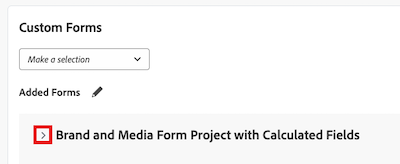

# Anfügen eines benutzerdefinierten Formulars an einen Business-Case

Benutzerdefinierte Forms werden verwendet, um Informationen zu erfassen, die in bestehenden Adobe Workfront-Feldern nicht angezeigt werden.

Weitere Informationen zum Erstellen benutzerdefinierter Forms finden Sie im Artikel [Erstellen eines benutzerdefinierten Formulars](/help/quicksilver/administration-and-setup/customize-workfront/create-manage-custom-forms/form-designer/design-a-form/design-a-form.md).

## Zugriffsanforderungen

<!--Audit: 06/2025-->

+++ Erweitern, um die Zugriffsanforderungen für die in diesem Artikel beschriebene Funktionalität anzuzeigen.

<table style="table-layout:auto"> 
 <col> 
 <col> 
 <tbody> 
  <tr> 
   <td role="rowheader">
Adobe Workfront-Paket
</td> 
   <td> 
Prime oder höher

  </tr> 
  <tr> 
   <td role="rowheader">
Adobe Workfront-Lizenz/p&gt;</td> 
   <td> 
   
Standard 
 
   
Abo 
 </td> 
  </tr> 
  <tr> 
   <td role="rowheader">Konfigurationen der Zugriffsebene</td> 
   <td> 
Zugriff auf Projekte bearbeiten
  </td> 
  </tr> 
  <tr> 
   <td role="rowheader">
Objektberechtigungen
</td> 
   <td> 
Verwalten von Berechtigungen oder höher für das Projekt
  </td> 
  </tr> 
 </tbody> 
</table>

Weitere Informationen finden Sie unter [Zugriffsanforderungen](/help/quicksilver/administration-and-setup/add-users/access-levels-and-object-permissions/access-level-requirements-in-documentation.md) in der Dokumentation zu Workfront.

+++

## Benutzerdefinierte Forms an Projekte anhängen

Sie können benutzerdefinierte Forms in den folgenden Bereichen an ein Projekt anhängen:

* Beim Bearbeiten eines Projekts im Abschnitt Projektdetails .
* Beim Bearbeiten eines Projekts im Feld Projekt bearbeiten .
* Beim Massenbearbeiten mehrerer Projekte aus einer Liste von Projekten.

  Informationen zum Anhängen benutzerdefinierter Formulare an Projekte während der Bearbeitung eines oder mehrerer Projekte finden Sie im Artikel [Projekte bearbeiten](../../../manage-work/projects/manage-projects/edit-projects.md).

* Beim Erstellen des Business Case eines Projekts, im Business Case, wie in diesem Artikel beschrieben.

Informationen zum Anhängen benutzerdefinierter Formulare an Objekte finden Sie unter [Hinzufügen eines benutzerdefinierten Formulars zu einem Objekt](../../../workfront-basics/work-with-custom-forms/add-a-custom-form-to-an-object.md).

## Benutzerdefinierte Forms an den Business Case anhängen

Um ein benutzerdefiniertes Formular zu einem Business Case hinzuzufügen, muss der Workfront-Administrator diese Option in „Setup“ auswählen. Weitere Informationen zur Aktivierung benutzerdefinierter Formulare im Setup finden Sie [Konfigurieren von systemweiten Projektvoreinstellungen](../../../administration-and-setup/set-up-workfront/configure-system-defaults/set-project-preferences.md).

So fügen Sie ein benutzerdefiniertes Formular hinzu:

1. Gehen Sie zu dem Projekt, an das Sie das Formular anhängen möchten, und klicken Sie dann **linken Bereich** Business Case“. Der Business Case wird angezeigt.

1. Wählen **Abschnitt „Benutzerdefiniertes Formular** aus dem Dropdown-Menü das benutzerdefinierte Formular aus, das Sie anhängen möchten. Das benutzerdefinierte Formular wird im Abschnitt **Hinzugefügte Formulare** unten angezeigt.

1. (Optional) Um die Details des benutzerdefinierten Formulars zu erweitern, klicken Sie auf den Pfeil links neben dem Namen des benutzerdefinierten Formulars.

   

<!--
1. (Optional) Select **Edit Custom Form**.  
  

1. (Optional) Specify information in the fields of the custom form, then click **Save** .
-->
