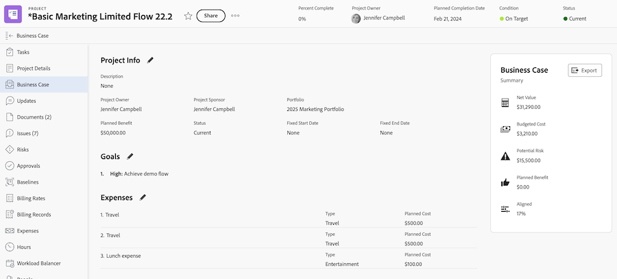

# Business Case-Ziele erstellen

<!-- Audited: 6/2025 -->

Beim Erstellen eines Business Case können Sie eine Reihe von Zielen erstellen, um die Ziele eines Projekts zu definieren. Diese Ziele werden verwendet, um dem Portfolio-Manager oder Projektsponsor den Zweck des Abschlusses eines Projekts mitzuteilen.

<!--

(NOTE: below snippet: NWE only, not classic)

-->

>[!TIP]
>
>Sie können strategische Ziele für Ihr Unternehmen erstellen, die nicht mit dem individuellen Business Case eines Projekts verbunden sind. Sie müssen Zugriff auf Adobe Workfront-Ziele haben, um strategische Ziele erstellen zu können. Sie können sie dann mit Projekten außerhalb ihrer Business Cases verbinden. Informationen zum Erstellen von Zielen mithilfe von Workfront-Zielen finden Sie unter [Adobe Workfront-Ziele - Übersicht](../../../workfront-goals/goal-management/wf-goals-overview.md).

Beachten Sie beim Erstellen von Business Case-Zielen für Ihre Projekte Folgendes:

* Business Case-Ziele sind projektspezifisch. Sie können Ziele nicht von einem Projekt in ein anderes kopieren oder auf Systemebene festlegen; sie müssen auf der Ebene jedes Projekts definiert werden.
* Ihr Adobe Workfront-Administrator oder Gruppenadministrator muss den Abschnitt „Ziele“ des Projekts aktivieren, bevor er im Business Case angezeigt wird. Informationen zur Aktivierung von Business-Case-Feldern für Projekte finden Sie [Konfigurieren von systemweiten Projektvoreinstellungen](../../../administration-and-setup/set-up-workfront/configure-system-defaults/set-project-preferences.md).

* Ziele sind kein obligatorischer Abschnitt im Business Case des Projekts.

  Ein Projekt kann eine Punktzahl erhalten, die in Portfolio Optimizer priorisiert werden soll, auch wenn der Abschnitt „Ziele“ nicht definiert ist.

  Weitere Informationen zum Portfolio Optimizer-Score finden Sie unter [Anwenden einer Scorecard auf ein Projekt und Generieren eines Ausrichtungsscores](../../../manage-work/projects/define-a-business-case/apply-scorecard-to-project-to-generate-alignment-score.md).

* Sie können keine Berichte zu Business Case-Zielen erstellen.

## Zugriffsanforderungen

+++ Erweitern Sie , um die Zugriffsanforderungen für die -Funktion in diesem Artikel anzuzeigen.

<table style="table-layout:auto"> 
 <col> 
 </col> 
 <col> 
 </col> 
 <tbody> 
  <tr> 
   <td role="rowheader">
Adobe Workfront-Paket
</td> 
   <td> 
Prime oder höher

  </tr> 
  <tr> 
   <td role="rowheader">
Adobe Workfront-Lizenz
</td>
   <td> 
   
Standard
 
   
Plan 
 
   </td> 
  </tr> 
  <tr> 
   <td role="rowheader">Konfigurationen der Zugriffsebene</td> 
   <td> 
Zugriff auf Projekte bearbeiten
 </td> 
  </tr> 
  <tr> 
   <td role="rowheader">
Objektberechtigungen
</td> 
   <td> 
Verwalten von Berechtigungen oder höher für das Projekt
 </td> 
  </tr> 
 </tbody> 
</table>

Weitere Informationen finden Sie unter [Zugriffsanforderungen in der Dokumentation zu Workfront](/help/quicksilver/administration-and-setup/add-users/access-levels-and-object-permissions/access-level-requirements-in-documentation.md).

+++

## Hinzufügen eines Ziels zum Business Case eines Projekts

{{step1-to-projects}}

1. Wählen Sie in der Projektliste das Projekt aus, für das Sie Business-Case-Ziele definieren möchten.

1. Klicken Sie im linken Bedienfeld auf **Business Case**. Der Abschnitt **Business-Case** wird angezeigt.

   

1. Klicken **Abschnitt „Ziele** auf **Ziele bearbeiten**.

1. Geben Sie im ersten Feld die Zielbeschreibung ein.

1. Wählen Sie **Dropdown** Menü Wichtigkeit die Wichtigkeitsstufe (oder Priorität) für dieses Ziel aus:

   * Maximal
   * Hoch
   * Mittel
   * Niedrig
   * Minimal

   

   >[!NOTE]
   >
   >Die Wichtigkeitsstufen von Zielen können nicht angepasst werden.

1. (Optional) Um ein weiteres Ziel hinzuzufügen, klicken Sie auf **Weitere Ziele hinzufügen** und wiederholen Sie die Schritte 5 bis 6.

1. Klicken Sie auf **Speichern**.
