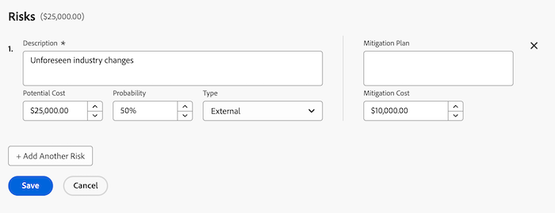

# Risiken in Projekten erstellen und bearbeiten

<!--Audited: 06/2025-->

<!--The highlighted information on this page refers to functionality not yet generally available. It is available only in the Preview environment for all customers. The same features will also be available in the Production environment for all customers after a week from the Preview release.    

For more information, see [Interface modernization](/help/quicksilver/product-announcements/product-releases/interface-modernization/interface-modernization.md). -->

Risiken sind mögliche Ereignisse oder Faktoren, die verhindern, dass ein Projekt termingerecht oder innerhalb des Budgets abgeschlossen wird. Sie können Risiken im Rahmen der Erstellung eines Business Case für ein Projekt oder über die Registerkarte Risiken aufzeichnen.

Risiken können nur bei Projekten oder Vorlagen erstellt werden. Sie können keine Risiken mit Aufgaben oder Problemen verknüpfen.

Risiken können mit Kosten verbunden sein, die tatsächlichen Risikokosten wirken sich jedoch nicht auf die tatsächlichen Kosten des Projekts aus.

>[!NOTE]
>
>In diesem Artikel werden die mit dem Projekt verbundenen Risiken definiert, während Sie sie im Business Case des Projekts definieren oder auf der Registerkarte Risiken des Projekts hinzufügen.
>
>Informationen zum Risikofeld, das beim Bearbeiten eines Projekts verfügbar ist, finden Sie unter [Projekte bearbeiten](../../../manage-work/projects/manage-projects/edit-projects.md).

## Zugriffsanforderungen

Sie müssen über folgenden Zugriff verfügen, um die Schritte in diesem Artikel ausführen zu können:

+++ Erweitern Sie , um die Zugriffsanforderungen für die -Funktion in diesem Artikel anzuzeigen. 

<table style="table-layout:auto"> 
 <col> 
 <col> 
 <tbody> 
  <tr> 
   <td role="rowheader">
Adobe Workfront-Plan*
</td> 
   <td> 
Aktuelle Pläne:

   <ul><li>Beliebiger Plan, um Risiken im Risikobereich des Projekts hinzuzufügen
</li>
   <li>
Prime oder höher, um Risiken zum Business Case des Projekts hinzuzufügen
</li></ul>
   
Legacy-Pläne: Beliebiger Plan

   </td> 
  </tr> 
  <tr> 
   <td role="rowheader">
Adobe Workfront-Lizenz*
</td> 
   <td> 
Aktuell: Standard 

   
Legacy: Plan 
 </td> 
  </tr> 
  <tr> 
   <td role="rowheader">
Konfigurationen der Zugriffsebene
</td> 
   <td> 
Zugriff auf Projekte und Finanzdaten bearbeiten
 </td> 
  </tr> 
  <tr> 
   <td role="rowheader">
Objektberechtigungen
</td> 
   <td> 
 Verwalten Sie Berechtigungen, einschließlich Finanzen verwalten für das Projekt, für das Sie Risiken erstellen oder bearbeiten möchten 
 </td> 
  </tr> 
 </tbody> 
</table>

*Weitere Informationen finden Sie unter [Zugriffsanforderungen in der Dokumentation zu Workfront](/help/quicksilver/administration-and-setup/add-users/access-levels-and-object-permissions/access-level-requirements-in-documentation.md).

+++

## Risiken im Business Case erstellen und bearbeiten

Sie können Risiken im Rahmen der Planung eines Business Case eines Projekts erstellen. Sie können sie später im Business Case bearbeiten, wenn Änderungen an ihrer Wahrscheinlichkeit, ihrem Plan zur Risikominderung oder ihren Kosten auftreten, z. B. . Informationen zum Erstellen eines Business-Case finden Sie [Erstellen eines Business-Case für ein Projekt](../../../manage-work/projects/define-a-business-case/create-business-case.md).

Ihr Workfront-Administrator oder Gruppenadministrator muss den Abschnitt **Risiken** in Ihrem Business-Case im Bereich Projektvoreinstellungen aktivieren, bevor Sie ihn auf Projektebene im Business-Case-Abschnitt anzeigen können. Informationen zum Festlegen von Projektvoreinstellungen finden Sie [Konfigurieren von systemweiten Projektvoreinstellungen](../../../administration-and-setup/set-up-workfront/configure-system-defaults/set-project-preferences.md).

Risiken im Business Case erstellen und bearbeiten ist identisch.

So erstellen oder bearbeiten Sie ein Risiko im Business Case:

1. Gehen Sie zu dem Projekt, für das Sie Risiken erstellen möchten.
1. Klicken Sie **linken Bedienfeld** Business Case“.
1. Klicken **Abschnitt &quot;**&quot; auf **Risiken bearbeiten**.
1. Geben Sie die folgenden Informationen ein oder bearbeiten Sie sie:

   * **Beschreibung:** Beschreiben Sie das Risiko.

   * **Mögliche Kosten**: Geben Sie die geschätzten Kosten ein, wenn das Risiko eintreten sollte.

   * **Wahrscheinlichkeit**: Geben Sie die Wahrscheinlichkeit für das Eintreten des Risikos als Prozentwert ein.

   * **Typ:** Wählen Sie aus, unter welche Kategorie das Risiko fällt.
   * **Minderungsplan**: Aktualisieren Sie die Beschreibung des Plans, um das Risiko zu mindern.

   * **Kosten zur Risikominderung**: Geben Sie die Kosten für den Plan zur Risikominderung ein, den Sie erstellen müssen, um das Risiko zu vermeiden.

   

1. (Optional) Klicken Sie auf **Weitere Risiken hinzufügen**, um weitere Risiken hinzuzufügen.
1. Klicken Sie auf **Speichern**.

## Risiken im Risikobereich erstellen und bearbeiten

Neben dem Erstellen und Bearbeiten von Risiken im Business Case können Sie dazu auch den Abschnitt **Risiken** eines Projekts verwenden.

Risiken können im Abschnitt Risiken eines Projekts oder einer Vorlage erstellt und bearbeitet werden. Das Erstellen von Risiken für Vorlagen entspricht dem Erstellen von Risiken für Projekte.

### Risiken im Bereich „Risiken“ erstellen {#create-risks-in-the-risks-area}

1. Gehen Sie zu dem Projekt, für das Sie Risiken erstellen möchten.
1. Klicken Sie **linken** auf „Risiken“.

   

1. Klicken Sie auf **Weitere Risiken hinzufügen** und erstellen Sie Risiken, indem Sie ihre Informationen inline bearbeiten.

   Oder

   Klicken Sie **Neues Risiko**, um das Feld **Neues Risiko** zu öffnen.

   

1. (Bedingt) Wenn Sie ein Risiko in das Feld **Neues Risiko** einfügen, geben Sie die folgenden Informationen ein:

   * **Beschreibung**: Beschreiben Sie das Risiko. Dies ist ein Pflichtfeld.
   * **Risikotyp**: Geben Sie an, unter welche Kategorie das Risiko fällt.\
     Ihr Workfront-Administrator definiert die in Ihrer Umgebung verfügbaren Risikotypen. Informationen zur Definition von Risikotypen finden Sie im Artikel [Risikotypen bearbeiten und erstellen](../../../administration-and-setup/set-up-workfront/configure-system-defaults/edit-create-risk-types.md).

   * **Wahrscheinlichkeit**: Geben Sie die Wahrscheinlichkeit für das Eintreten des Risikos als Prozentwert an.
   * **Mögliche Kosten**: Geben Sie die geschätzten Kosten an, wenn das Risiko eintreten sollte.
   * **Istkosten**: Geben Sie die Istkosten des Risikos an, wenn das Risiko eingetreten ist.
   * **Kosten für die Risikominderung**: Geben Sie die Kosten des Minderungsplans an, den Sie erstellen müssen, um das Risiko zu vermeiden.
   * **Minderungsplan**: Aktualisieren Sie die Beschreibung des Plans, um das Risiko zu mindern.

1. Klicken Sie auf **Speichern**.

1. (Optional) Wählen Sie im Dropdown-Menü **Status** für das Risiko einen anderen **Status** aus, wenn Sie die Ansicht **Standard** für die Liste der Risiken anwenden.

   Standardmäßig lautet der **Status** eines Risikos **Identifiziert**.

### Risiken im Risikobereich bearbeiten {#edit-risks-in-the-risks-area}

Risiken können während der Laufzeit eines Projekts oder bei Änderungen bearbeitet werden (z. B. Änderung der Wahrscheinlichkeit, der potenziellen Kosten oder des Status).

Sie können jeweils nur ein Risiko oder mehrere Risiken gleichzeitig bearbeiten.

Risiken bearbeiten:

1. Navigieren Sie zu einem Projekt, für das Sie vorhandene Risiken bearbeiten möchten.
1. Klicken Sie **linken** auf „Risiken“.
1. Beginnen Sie mit der Inline-Bearbeitung der Felder für die Risiken, die Sie in der Liste sehen, um jeweils ein Risiko zu bearbeiten.

   Oder

   Wählen Sie ein oder mehrere Risiken aus und klicken Sie dann **Bearbeiten**, um mehrere Risiken gleichzeitig zu bearbeiten.

   >[!NOTE]
   >
   >Wenn Sie mehrere Risiken gleichzeitig bearbeiten, wenden Sie dieselben Informationen auf alle ausgewählten Risiken an. Die mit den einzelnen Risiken verbundenen Informationen vor Ihren Änderungen werden in einer Massenbearbeitung überschrieben.

1. Wenn Sie auf **Bearbeiten** geklickt haben, wird das **Risiko bearbeiten** oder **Risiken bearbeiten** geöffnet.

   Aktualisieren Sie die folgenden Felder:

   * **Beschreibung**: Bearbeiten Sie die Beschreibung des Risikos.
   * **Risikotyp**: Aktualisieren Sie, unter welche Kategorie das Risiko fällt.
   * **Wahrscheinlichkeit**: Geben Sie die Wahrscheinlichkeit für das Eintreten des Risikos als Prozentwert an.
   * **Mögliche Kosten**: Geben Sie die geschätzten Kosten an, wenn das Risiko eintreten sollte.
   * **Istkosten**: Geben Sie die Istkosten des Risikos an, wenn das Risiko eingetreten ist.
   * **Kosten für die Risikominderung**: Geben Sie die Kosten des Minderungsplans an, den Sie erstellen müssen, um das Risiko zu vermeiden.
   * **Minderungsplan**: Aktualisieren Sie die Beschreibung des Plans, um das Risiko zu mindern.

1. Klicken Sie auf **Speichern**.
1. (Optional) Bearbeiten Sie den **Status** für ein Risiko im **Status** Dropdown-Menü, wenn Sie die **Standard**-Ansicht für die Liste der Risiken anwenden.

   >[!NOTE]
   >
   >Der **Status** von Risiken kann im Dialogfeld **Risiko bearbeiten** nicht bearbeitet werden. Dies ist nur bei einer Inline-Bearbeitung möglich.
