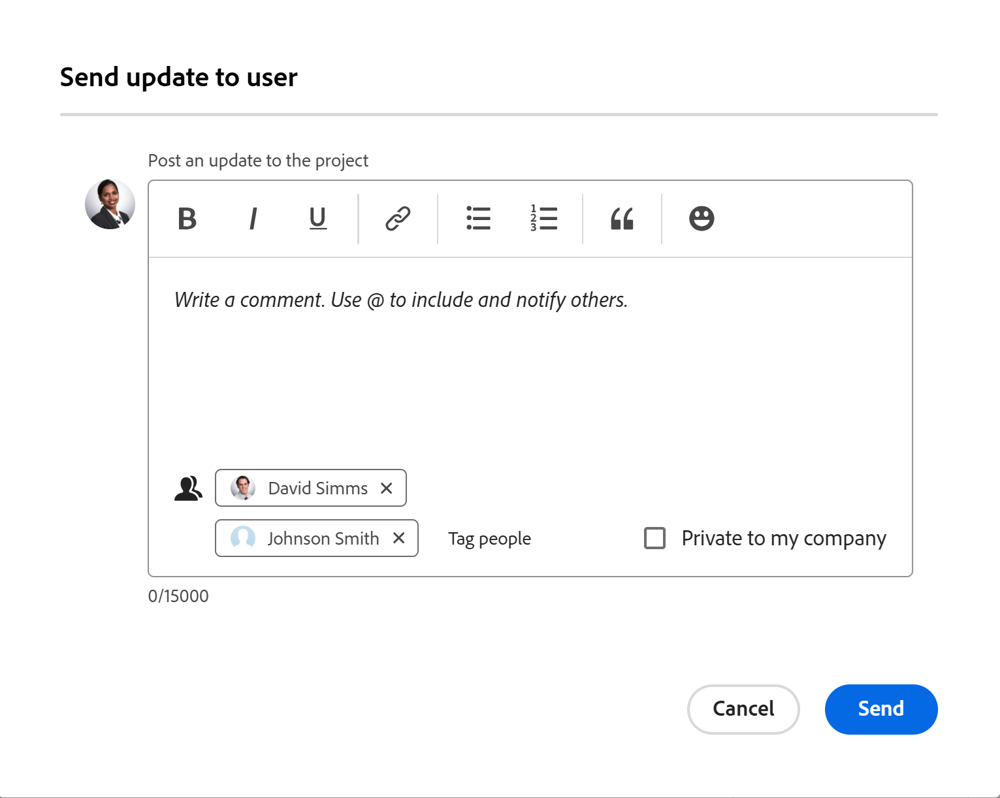

# Kommunikation mit Mitgliedern des Projekt-Teams

Sie können mit den Mitgliedern Ihres Projektteams einfach über Adobe Workfront kommunizieren.

Alle einem Projekt zugeordneten Benutzer werden aus dem Projektteam abgerufen. Informationen zum Projektteam finden Sie unter [Projektteam - Übersicht](../../../manage-work/projects/planning-a-project/project-team-overview.md).

## Zugriffsanforderungen

+++ Erweitern, um die Zugriffsanforderungen für die in diesem Artikel beschriebene Funktionalität anzuzeigen.

<table style="table-layout:auto"> 
 <col> 
 </col> 
 <col> 
 </col> 
 <tbody> 
  <tr> 
   <td role="rowheader">Adobe Workfront-Packaging</td> 
   <td> 
Beliebig
 </td> 
  </tr> 
  <tr> 
   <td role="rowheader">Adobe Workfront-Lizenz</td> 
   <td>
Mitwirkende oder höher
 
   
Anfragende oder höher
 </td> 
  </tr> 
  <tr> 
   <td role="rowheader">Konfigurationen der Zugriffsebene</td> 
   <td> 
Zugriff auf Projekte anzeigen oder höher
</td> 
  </tr> 
  <tr> 
   <td role="rowheader">Objektberechtigungen</td> 
   <td> 
Anzeigen von oder höheren Berechtigungen für das Projekt
</td> 
  </tr> 
 </tbody> 
</table>

Weitere Informationen finden Sie unter [Zugriffsanforderungen in der Dokumentation zu Workfront](/help/quicksilver/administration-and-setup/add-users/access-levels-and-object-permissions/access-level-requirements-in-documentation.md).

+++

<!--
Old:

<table style="table-layout:auto"> 
 <col> 
 </col> 
 <col> 
 </col> 
 <tbody> 
  <tr> 
   <td role="rowheader">Adobe Workfront plan*</td> 
   <td> 
Any
 </td> 
  </tr> 
  <tr> 
   <td role="rowheader">Adobe Workfront license*</td> 
   <td> 
Request or higher
 </td> 
  </tr> 
  <tr> 
   <td role="rowheader">Access level configurations*</td> 
   <td> 
View or higher access to Projects
 
Note: If you still don't have access, ask your Workfront administrator if they set additional restrictions in your access level. For information on how a Workfront administrator can modify your access level, see <a href="../../../administration-and-setup/add-users/configure-and-grant-access/create-modify-access-levels.md" class="MCXref xref">Create or modify custom access levels</a>.
 </td> 
  </tr> 
  <tr> 
   <td role="rowheader">Object permissions</td> 
   <td> 
View or higher permissions to the project
 
For information on requesting additional access, see <a href="../../../workfront-basics/grant-and-request-access-to-objects/request-access.md" class="MCXref xref">Request access to objects </a>.
 </td> 
  </tr> 
 </tbody> 
</table>
-->

## Senden einer E-Mail an ein Mitglied des Projektteams {#send-an-email-to-a-project-team-member}

1. Wechseln Sie zu einem Projekt, an dessen Mitglieder des Projektteams Sie eine E-Mail senden möchten.
1. Klicken Sie **linken** auf „Personen“.

   Um alle Mitglieder des Projektteams zu aktualisieren, klicken Sie **Alle aktualisieren** in der linken oberen Ecke der Liste der Mitglieder des Projektteams.

   ODER

   Um bestimmte Mitglieder des Projektteams zu aktualisieren, wählen Sie einen oder mehrere Benutzer in der Liste aus und klicken Sie dann auf **Aktualisierung an Benutzer senden**.

   

1. Geben Sie Ihr Update im Bereich **Für Projekt aktualisieren** ein.
1. (Optional) Um die Aktualisierung als privat festzulegen, wählen Sie die Option **Privat für meine Firma** aus.

   Benutzende außerhalb des Unternehmens können keine private Aktualisierung anzeigen.

1. (Optional) Klicken Sie auf **Personen taggen**, um weitere nicht ausgewählte Empfänger hinzuzufügen.
1. Klicken Sie auf **Senden**.

   Die Aktualisierung und die Namen der eingeschlossenen Benutzer werden im Abschnitt **Aktualisierungen** des Projekts angezeigt.

## Senden von Aktualisierungen an Mitglieder des Projektteams und andere

Sie können Projektaktualisierungen an Team-Mitglieder und andere Benutzer senden, die möglicherweise nicht zum Projekt-Team gehören. Alle Benutzer müssen über ein gültiges Workfront-Konto verfügen. Das Update wird in Workfront als Benachrichtigung gesendet.

1. Navigieren Sie zu einem Projekt, von dem Sie Aktualisierungen an andere Benutzer senden möchten.
1. Klicken Sie **linken** auf „Personen“.
1. (Optional und bedingt) Wenn die Benutzer, an die Sie Aktualisierungen senden möchten, nicht zum Projektteam gehören, klicken Sie auf **Benutzer hinzufügen**, um sie zum Projektteam hinzuzufügen.

   Informationen zum Hinzufügen von Benutzern zum Projektteam finden Sie unter [Verwalten des Projektteams](../../../manage-work/projects/planning-a-project/manage-project-team.md).

1. Senden Sie eine Aktualisierung an die Mitglieder des Projektteams, wie im Abschnitt [Senden einer E-Mail an ein Mitglied des Projektteams](#send-an-email-to-a-project-team-member) in diesem Artikel beschrieben.

   Die Aktualisierung und die Namen der darin enthaltenen Benutzer werden im Abschnitt **Aktualisierungen** des Projekts angezeigt.

<!--

 
(NOTE: drafted. No longer valid)

<ol>
<li value="1"> 
Go to a project whose members of the project team you want to send an email to. 
 </li>
<li value="2"> Click <strong>People</strong> in the left panel.</li>
<li value="3"> 
To update all members of the project team, click <strong>Update All</strong> in the upper-left corner of the list of project team members.
 
Or
 
To update certain members of the project team, select one or several users in the list, then click <strong>Update</strong>. 
 </li>
<li value="4">Type your update in the <strong>Post an update to this project</strong> field.</li>
<li value="5"> 
(Optional) To make the update private, click the <strong>Lock</strong> icon.
 
Users outside the company cannot view a private update.
 </li>
<li value="6"> 
(Optional) Add a user who is not part of the Project Team by typing their name in the people field, then selecting the user from the list when it displays. 
 </li>
<li value="7"> 
Click <strong>Send.</strong>
 
The update and the names of the users included in it display in the Updates tab of the project.
 </li>
</ol> 

-->
