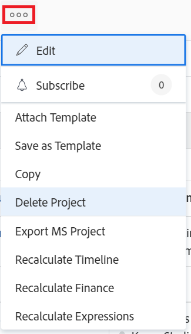

# Löschen von Projekten

<!--Audited: 07/2024-->

Sie können ein Projekt löschen, wenn das Projekt und seine Daten nicht mehr benötigt werden.

Als Alternative zum Löschen eines Projekts empfehlen wir, das Projekt zu bearbeiten und den Status in „Abgeschlossen“ oder „Inaktiv“ zu ändern. Dadurch werden alle aktuellen Aufgaben im Zusammenhang mit dem Projekt aus der Aufgabenliste eines Benutzers entfernt, alle mit dem Projekt verknüpften Daten werden jedoch gespeichert.

Sie können ein Projekt in einer Projektliste oder auf Projektebene löschen.

## Zugriffsanforderungen

+++ Erweitern, um die Zugriffsanforderungen für die in diesem Artikel beschriebene Funktionalität anzuzeigen.

<table style="table-layout:auto"> 
 <col> 
 <col> 
 <tbody> 
  <tr> 
   <td> 
Adobe Workfront-Paket
 </td> 
   <td>Beliebig</td> 
  </tr> 
  <tr> 
   <td> 
Adobe Workfront-Lizenz
 </td> 
   <td> 
Standard

   
Abo
 
   </td> 
  </tr> 
    <td>Konfigurationen der Zugriffsebene</td> 
   <td> 
Zugriff auf Projekte mit der Möglichkeit zum Erstellen und Löschen von Projekten bearbeiten
 </td> 
  </tr> 
    <td> 
Objektberechtigungen
 </td> 
   <td> 
Zugriff auf Projekte, Aufgaben und Probleme bearbeiten mit der Möglichkeit, Projekte, Aufgaben und Probleme zu löschen
 </td> 
  </tr> 
 </tbody> 
</table>

Weitere Informationen finden Sie unter [Zugriffsanforderungen](/help/quicksilver/administration-and-setup/add-users/access-levels-and-object-permissions/access-level-requirements-in-documentation.md) in der Dokumentation zu Workfront.

+++

<!--
Old:

<table style="table-layout:auto"> 
 <col> 
 <col> 
 <tbody> 
  <tr> 
   <td> 
Adobe Workfront plan
 </td> 
   <td>Any</td> 
  </tr> 
  <tr> 
   <td> 
Adobe Workfront license*
 </td> 
   <td> 
New license: Standard 

   
Current license: Plan 
 
   </td> 
  </tr> 
  <tr data-mc-conditions=""> 
   <td>Access level configuration</td> 
   <td> 
Edit access to Projects with ability to Create and Delete projects
 </td> 
  </tr> 
  <tr data-mc-conditions=""> 
   <td> 
Object permissions 
 </td> 
   <td> 
Edit access to Projects, Tasks, Issues with ability to Delete projects, tasks, and issues
 </td> 
  </tr> 
 </tbody> 
</table>
-->

## Verstehen des Prozesses zum Löschen von Projekten

* [Einschränkungen für das Löschen von Projekten](#limitations-for-deleting-projects)
* [Auswirkungen des Löschens von Projekten](#the-impact-of-deleting-projects)

### Einschränkungen beim Löschen von Projekten  {#limitations-for-deleting-projects}

* Gelöschte Elemente werden 30 Tage lang in den Papierkorb verschoben und können nur vom Workfront-Administrator wiederhergestellt werden.

  Weitere Informationen zum Wiederherstellen von Objekten finden Sie im Artikel [Wiederherstellen gelöschter Elemente](../../../administration-and-setup/manage-workfront/manage-deleted-items/restore-deleted-items.md).

* Wenn das Projekt Aufgaben oder Probleme mit protokollierten Stunden aufweist, muss der Workfront- oder Gruppenadministrator das Löschen dieser Aufgaben durch Konfigurieren der Voreinstellungen für Aufgaben und Probleme in Ihrer Workfront-Instanz zulassen, damit Sie das Projekt, das die Aufgaben enthält, löschen können.

  Weitere Informationen zum Aktivieren des Löschens von Aufgaben, Problemen oder Projekten, bei denen Stunden protokolliert werden, finden Sie im Abschnitt „Löschen“ in [Konfigurieren von systemweiten Aufgaben- und Problemeinstellungen](../../../administration-and-setup/set-up-workfront/configure-system-defaults/set-task-issue-preferences.md).

  <!--
  
(NOTE: this bullet stays in NWE only forever)

  -->

### Auswirkungen des Löschens von Projekten {#the-impact-of-deleting-projects}

* Wenn Sie ein Projekt löschen, wirkt sich dies auf andere mit dem Projekt verknüpfte Objekte aus.

  Die folgenden an ein Projekt angehängten Objekte werden ebenfalls gelöscht, wenn Sie ein Projekt löschen:

   * Dokumente

     Sie können ein Projekt, an das ein ausgechecktes Dokument angehängt ist, nicht löschen. Weitere Informationen zum Auschecken von Dokumenten finden Sie unter [Auschecken von Dokumenten](../../../documents/managing-documents/check-out-documents.md).

     Sie können einzelne Dokumente, die beim Löschen des Projekts gelöscht wurden, nicht über die Registerkarte Dokumente im Papierkorb wiederherstellen. Sie können die beim Löschen des Projekts gelöschten Dokumente nur wiederherstellen, wenn Sie das Projekt wiederherstellen.

   * Aufgaben
   * Teilaufgaben
   * Probleme
   * Updates
   * Genehmigungen
   * Ausgaben
   * Risiken
   * Baselines
   * Business Case-Informationen
   * Warteschlangendetails-Informationen
   * Abrechnungssätze
   * Abrechnungseinträge

     Sie können kein Projekt löschen, das Rechnungsnachweise mit dem Status In Rechnung gestellt enthält. Weitere Informationen finden Sie unter [Erstellen von Abrechnungseinträgen](../../projects/project-finances/create-billing-records.md).

* Je nachdem, wie Ihr Workfront-Administrator die Voreinstellungen für die Projekt-, Aufgaben- oder Problemlöschung in der Arbeitszeittabelle und den Stundeneinstellungen Ihrer Workfront-Instanz konfiguriert, werden die für die Aufgaben, Probleme oder das Projekt protokollierten Stunden beim Löschen des Projekts auf eine der folgenden Arten gehandhabt:

   * Die Stunden verbleiben auf der Arbeitszeittabelle als allgemeine Zeit.
   * Die Stunden werden gelöscht und werden wiederhergestellt, falls das Projekt jemals wiederhergestellt wird.

  Weitere Informationen zum Konfigurieren der Löschvoreinstellungen für Stunden, die bei Problemen protokolliert sind, finden Sie unter [Konfigurieren von Arbeitszeittabellen- und Stundenvoreinstellungen](../../../administration-and-setup/set-up-workfront/configure-timesheets-schedules/timesheet-and-hour-preferences.md).

* Wenn das zu löschende Projekt mit einer Initiative im Workfront-Szenarioplaner verknüpft ist:

   * Die Initiative bleibt im Plan, aber die Verknüpfung zum Projekt wird entfernt.
   * Wenn das zu löschende Projekt mit der einzigen veröffentlichten Initiative aus einem Plan verknüpft ist, wird auch der Hinweis entfernt, dass der Plan veröffentlicht wurde.
   * Wenn Sie ein gelöschtes Projekt wiederherstellen, wird das Projekt wiederhergestellt, aber sein Link zur Initiative wird nicht wiederhergestellt und der Bereich Szenario-Planer wird nicht mehr in den Projektdetails angezeigt.

     Für den Szenarienplaner ist eine zusätzliche Lizenz erforderlich. Weitere Informationen zum Workfront-Szenarienplaner finden Sie unter [Überblick über den Szenarienplaner](../../../scenario-planner/scenario-planner-overview.md).

     Informationen zu Projekten, die mit Initiativen im Szenario-Planer verknüpft sind, finden Sie unter [Aktualisieren oder Erstellen von Projekten durch Veröffentlichung von Initiativen im Szenario-Planer](../../../scenario-planner/publish-scenarios-update-projects.md).

* Wenn das Projekt auch eine Aktivität für ein Ziel in Workfront Goals ist:

   * Das Projekt wird aus dem Ziel gelöscht. Der vom Projekt für das Ziel angegebene Fortschritt wird ebenfalls entfernt.

   * Wenn Sie das gelöschte Projekt wiederherstellen, wird das Projekt auch als Zielaktivität wiederhergestellt.

     Dies erfordert eine zusätzliche Lizenz. Informationen zu Workfront-Zielen finden Sie unter [Adobe Workfront-Ziele - Übersicht](../../../workfront-goals/goal-management/wf-goals-overview.md).

     Informationen zum Verknüpfen von Projekten mit Zielen finden Sie unter [Hinzufügen von Projekten zu Zielen in Adobe Workfront Goals](../../../workfront-goals/results-and-activities/connect-projects-to-goals-overview.md).

## Löschen eines Projekts in einer Liste

Sie können Projekte aus einer Projektliste löschen.

1. Navigieren Sie zu einer Liste von Projekten oder einem Projektbericht.
1. Wählen Sie das bzw. die Projekte aus, die Sie löschen möchten, und klicken Sie dann oben in **Liste auf** Löschen&quot;.

1. Klicken Sie auf **Ja, löschen**, um den Löschvorgang zu bestätigen.

   Die Projekte werden gelöscht und für 30 Tage im Papierkorb gespeichert. Ihr Workfront-Administrator kann gelöschte Projekte während dieses Zeitraums aus dem Papierkorb wiederherstellen.

## Löschen eines Projekts auf Projektebene

1. Wechseln Sie zu dem Projekt, das Sie löschen möchten.
1. Klicken Sie auf das **Mehr**-Symbol  rechts neben dem Projektnamen und klicken Sie dann auf **Projekt löschen**.

   

1. Klicken Sie **Ja, löschen**.

   Das Projekt wird gelöscht und für 30 Tage im Papierkorb gespeichert. Ihr Workfront-Administrator kann sie während dieses Zeitraums aus dem Papierkorb wiederherstellen.

## Löschen eines Projekts von der Seite „Verbundene Datensätze“ eines Workfront Planning-Datensatzes

>[!NOTE]
>
>Die Informationen in diesem Abschnitt beziehen sich auf Adobe Workfront-Planung, eine zusätzliche Funktion von Adobe Workfront.
>
>Eine Liste der Anforderungen für den Zugriff auf Workfront-Planung finden Sie unter [Überblick über den Zugriff auf Adobe Workfront-Planung](/help/quicksilver/planning/access/access-overview.md).
> 
>Allgemeine Informationen zu Workfront Planning finden Sie unter [Erste Schritte mit Adobe Workfront Planning](/help/quicksilver/planning/general/planning-overview.md).

Sie müssen über Folgendes verfügen, bevor Sie auf Projekte in einer Workfront Planning-Seite mit verbundenen Datensätzen zugreifen und sie löschen können:

* Planen von Datensatztypen im Zusammenhang mit Workfront-Projekten. Weitere Informationen finden Sie unter [Verbinden von Datensatztypen](/help/quicksilver/planning/architecture/connect-record-types.md).
* Planungsunterlagen. Weitere Informationen finden Sie unter [Erstellen von Datensätzen](/help/quicksilver/planning/records/create-records.md).
* Eine Seite mit verbundenen Datensätzen, auf der mit einem Planungsdatensatz verbundene Projekte angezeigt werden. Weitere Informationen finden Sie unter [Hinzufügen einer verbundenen Datensatzseite zu einem Datensatz](/help/quicksilver/planning/records/add-a-connected-records-page-to-a-record.md).

So löschen Sie einen Datensatz aus einer verbundenen Datensatzseite:

1. Bewegen Sie auf der Seite „Verbundene Datensätze“, auf der die mit einem Datensatz verbundenen Projekte angezeigt werden, den Mauszeiger über den Namen eines Projekts und klicken Sie auf das Symbol **Mehr** 

   ODER

   Ein oder mehrere Projekte in der Liste auswählen. Beachten Sie den blauen Balken am unteren Rand der Projektliste.

1. Klicken Sie **Löschen** und dann **Löschen** zur Bestätigung.

   Die Projekte werden gelöscht und in den Workfront-Papierkorb verschoben.

## Gelöschte Projekte wiederherstellen

Ein System- oder Gruppen-Administrator kann Projekte innerhalb von 30 Tagen nach dem Löschen wiederherstellen, wie im Artikel &quot;[&#x200B; gelöschter Elemente wiederherstellen“ &#x200B;](../../../administration-and-setup/manage-workfront/manage-deleted-items/restore-deleted-items.md).
