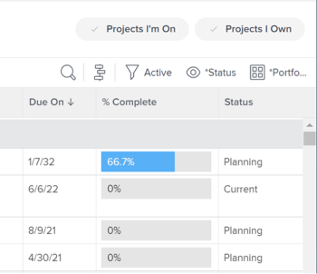
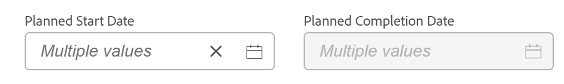
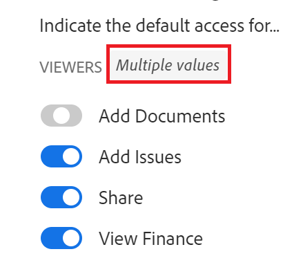
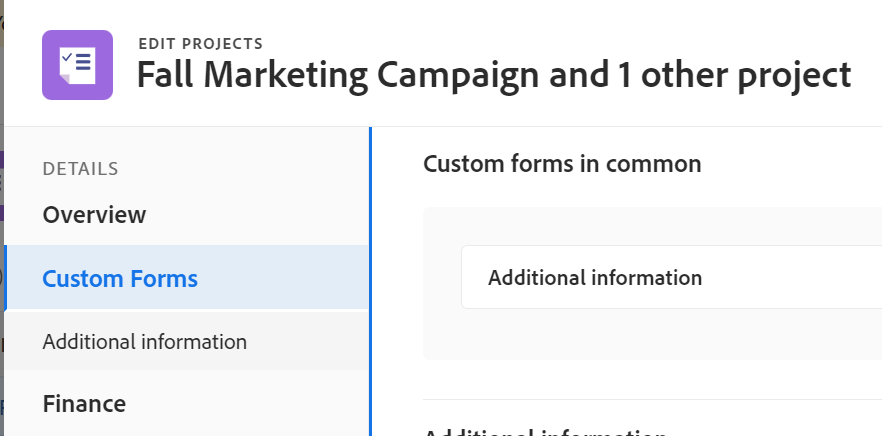

# Projekte bearbeiten

<!--Audited: 07/2024-->

<!--The highlighted information on this page refers to functionality not yet generally available. It is available only in the Preview environment for all customers. After the monthly releases to Production, the same features are also available in the Production environment for customers who enabled fast releases.    

For information about fast releases, see [Enable or disable fast releases for your organization](/help/quicksilver/administration-and-setup/set-up-workfront/configure-system-defaults/enable-fast-release-process.md). -->

<!--

***Linked to many articles,

The Resource Pools part also duplicates in the "Working with Resource Pools" article 

The Update Type section is also documented in Selecting the Project Update Type article

Keep the reference link to the other article that also documents the Update Type) 

(NOTE 2: information described here also exists in these articles:

** Project Overview area

**Manage project Finance area

If you need to update just one field, check to see if that field is also listed there and update in both places.)

-->

Sie können ein Projekt in Adobe Workfront so oft wie nötig bearbeiten. Es wird empfohlen, Projekte nur minimal zu bearbeiten, wenn sich ihr Status in „Aktuell“ ändert, um Verwirrung zu vermeiden, indem Sie Benachrichtigungen über die Änderungen an das gesamte Projekt-Team senden.

Idealerweise sollten Sie ein Projekt bearbeiten, wenn sich das Projekt im Status Planung befindet. Informationen zum Projektteam finden Sie unter [Projektteam - Übersicht](../../../manage-work/projects/planning-a-project/project-team-overview.md).

## Zugriffsanforderungen

+++ Erweitern, um die Zugriffsanforderungen für die in diesem Artikel beschriebene Funktionalität anzuzeigen.

<table style="table-layout:auto"> 
 <col> 
 <col> 
 <tbody> 
  <tr> 
   <td role="rowheader">Adobe Workfront-Paket</td> 
   <td> 
Beliebig
 </td> 
  </tr> 
  <tr> 
   <td role="rowheader">Adobe Workfront-Lizenz</td> 
   <td>
Standard
 
   
Plan
 </td> 
  </tr> 
  <tr> 
   <td role="rowheader">Konfigurationen der Zugriffsebene</td> 
   <td> 
Zugriff auf Projekte bearbeiten
 </td> 
  </tr> 
  <tr> 
   <td role="rowheader">Objektberechtigungen</td> 
   <td> 
     
Verwalten von Berechtigungen für ein Projekt
 
     </td> 
  </tr> 
 </tbody> 
</table>

*Weitere Informationen zu den Informationen in dieser Tabelle finden Sie unter [Zugriffsanforderungen in der Dokumentation zu Workfront](/help/quicksilver/administration-and-setup/add-users/access-levels-and-object-permissions/access-level-requirements-in-documentation.md).

+++

<!--Old:

<table style="table-layout:auto"> 
 <col> 
 <col> 
 <tbody> 
  <tr> 
   <td role="rowheader">Adobe Workfront plan</td> 
   <td> 
Any
 </td> 
  </tr> 
  <tr> 
   <td role="rowheader">Adobe Workfront license*</td> 
   <td>
New: Standard 
 
   Or
   
Current: Plan 
 </td> 
  </tr> 
  <tr> 
   <td role="rowheader">Access level configurations</td> 
   <td> 
Edit access to Projects
 </td> 
  </tr> 
  <tr> 
   <td role="rowheader">Object permissions</td> 
   <td> 
     
Manage permissions to a project 
 
     </td> 
  </tr> 
 </tbody> 
</table>

*For more detail about the information in this table, see [Access requirements in Workfront documentation](/help/quicksilver/administration-and-setup/add-users/access-levels-and-object-permissions/access-level-requirements-in-documentation.md).-->

## Einschränkungen beim Bearbeiten von Projekten

Es gibt einige Einschränkungen, die Sie möglicherweise daran hindern, Projekte zu bearbeiten.

Beachten Sie beim Bearbeiten von Projekten Folgendes:

* Projekte, die sich in einem Genehmigungsprozess befinden, können nicht bearbeitet werden, es sei denn, die Zeit wird protokolliert und der Status wird geändert.
* Sie können Dokumente oder Vorlagen nur dann an ein Projekt anhängen, das den Status „Abgeschlossen“, „Eingestellt“ oder „Ausstehende Genehmigung“ hat, wenn diese Funktion von Ihrem Workfront-Administrator oder einem Gruppenadministrator im Bereich „Projektvoreinstellungen“ aktiviert wurde. Informationen zum Festlegen von Projektvoreinstellungen finden Sie [Konfigurieren von systemweiten Projektvoreinstellungen](../../../administration-and-setup/set-up-workfront/configure-system-defaults/set-project-preferences.md).
* Sie können nur die folgenden Informationen zu einem Projekt mit dem Status „Eingestellt“ oder „Abgeschlossen“ bearbeiten:

   * Bestehende Ausgaben ändern.
   * Hinzufügen, Entfernen oder Bearbeiten benutzerdefinierter Formulare.

## Bearbeiten eines Projekts

Durch die Bearbeitung eines Projekts können Sie Informationen und Einstellungen für das Projekt sowie Aufgaben und Probleme im Projekt ändern.

Einige in diesem Artikel erwähnte Einstellungen können durch ihren Status in der Vorlage, aus der das Projekt erstellt wurde, von ihrem Standardstatus abweichen.

Informationen zum Bearbeiten von Vorlagen finden Sie unter [Projektvorlagen bearbeiten](../../../manage-work/projects/create-and-manage-templates/edit-templates.md).

Informationen zum Erstellen eines Projekts über eine Vorlage finden Sie unter [Erstellen eines Projekts über eine Vorlage](/help/quicksilver/manage-work/projects/create-projects/create-project-from-template.md).

{{step1-to-projects}}

1. (Optional) Klicken Sie **Projekte, an** ich beteiligt bin **oder Projekte,** ich besitze) in der oberen rechten Ecke, um Projekte anzuzeigen, bei denen Sie der Eigentümer sind, oder Projekte, bei denen Sie Teil des Projektteams sind.

   

   >[!NOTE]
   >
   >Als Gruppenadministrator können Sie die Projekte Ihrer Gruppe sowohl im Bereich Gruppen als auch im Bereich Projekte anzeigen und bearbeiten. Weitere Informationen finden Sie unter [Erstellen und Ändern der Projekte einer Gruppe](../../../administration-and-setup/manage-groups/work-with-group-objects/create-and-modify-a-groups-projects.md).

1. Klicken Sie auf den Namen des Projekts, das Sie bearbeiten möchten, um die Projektseite zu öffnen.

1. (Optional) Um eingeschränkte Informationen zu einem Projekt zu bearbeiten, klicken Sie **linken Bereich auf** Projektdetails“. Wenn Sie alle Projektinformationen bearbeiten möchten, fahren Sie mit Schritt 5 fort. <!--accurate?!-->

   

   >[!NOTE]
   >
   >Je nachdem, wie Workfront-Admins oder Gruppenadmins Ihre Layout-Vorlage geändert haben, werden die Felder im Bereich Projektdetails möglicherweise neu angeordnet oder nicht angezeigt. Weitere Informationen finden Sie unter [Anpassen der Detailansicht mithilfe einer Layout-Vorlage](../../../administration-and-setup/customize-workfront/use-layout-templates/customize-details-view-layout-template.md).

   Gehen Sie wie folgt vor, um Informationen im Abschnitt Details zu bearbeiten:

   1. (Optional) Klicken Sie auf das Symbol **Alle reduzieren**  in der oberen rechten Ecke, um alle Bereiche zu reduzieren.
   1. (Optional und bedingt) Wenn ein Bereich reduziert ist, klicken Sie auf den **Nach rechts zeigenden Pfeil** Nach  neben jedem Bereich, um den Bereich zu erweitern, den Sie bearbeiten möchten.
   1. Weitere Informationen zum Bearbeiten von Informationen auf der Registerkarte Projektdetails finden Sie in den folgenden Artikeln:

      * [Verwalten von Informationen im Projektübersichtsbereich](../../../manage-work/projects/manage-projects/understand-project-overview-area.md)
      * [Verwalten von Informationen im Projektfinanzierungsbereich](../../../manage-work/projects/project-finances/manage-project-finance-area.md)

   1. (Optional) Um ein benutzerdefiniertes Formular anzuhängen, geben Sie zunächst den Namen eines Formulars in das Feld **Benutzerdefiniertes Formular hinzufügen** ein, wählen Sie es aus, wenn es in der Liste angezeigt wird, und klicken Sie dann auf **Änderungen speichern**.
   1. (Optional) Klicken Sie auf **Export**-Symbol , um die Übersichts- und benutzerdefinierten Formularinformationen in eine PDF-Datei zu exportieren, und klicken Sie dann auf **Exportieren**. Wählen Sie aus den folgenden Optionen aus:

      * Alle auswählen (wird nur angezeigt, wenn mindestens ein benutzerdefiniertes Formular angehängt ist)
      * Übersicht
      * Der Name eines oder mehrerer benutzerdefinierter Formulare

      Die PDF-Datei wird auf Ihren Computer heruntergeladen.

      

      Weitere Informationen finden Sie unter [Exportieren benutzerdefinierter Formulare und Objektdetails](../../../workfront-basics/work-with-custom-forms/export-custom-forms-details.md).

   Um Informationen zu den im Abschnitt Projektdetails angezeigten Feldern zu erhalten, fahren Sie mit dem Bearbeiten des Projekts im Feld Projekt bearbeiten wie unten beschrieben fort.
1. Um alle Projektinformationen zu bearbeiten, klicken Sie auf das Menü **Mehr**  neben dem Projektnamen und dann auf **Bearbeiten**.

   ODER

   Wählen Sie aus einer Projektliste ein oder mehrere Projekte aus und klicken Sie dann oben in der Liste auf **Bearbeiten** Symbol .

   Weitere Informationen zur Massenbearbeitung von Projekten finden Sie im Abschnitt [Massenbearbeitung von Projekten](#edit-projects-in-bulk) in diesem Artikel.

   Das **Projekt bearbeiten** wird geöffnet.

   >[!IMPORTANT]
   >
   >Sie müssen über Verwaltungsberechtigungen für das Projekt verfügen, um die Option Bearbeiten anzeigen zu können.

   Alle Projektfelder sind im Feld Projekt bearbeiten verfügbar und werden nach den im linken Bedienfeld aufgelisteten Bereichen gruppiert.

   >[!NOTE]
   >
   >Je nachdem, wie der Workfront-Administrator oder der Gruppenadministrator Ihre Layout-Vorlage geändert hat, werden die Bereiche im linken Bereich des Felds Projekt bearbeiten oder die in diesen Bereichen aufgelisteten Felder möglicherweise neu angeordnet oder nicht angezeigt. Weitere Informationen finden Sie unter [Anpassen der Detailansicht mithilfe einer Layout-Vorlage](../../../administration-and-setup/customize-workfront/use-layout-templates/customize-details-view-layout-template.md).

1. (Bedingt) Wenn Sie auf das Menü **Mehr** und dann auf **Bearbeiten** geklickt haben, aktualisieren Sie die Informationen in einem der folgenden Bereiche, die im linken Bereich aufgeführt sind:

   * [Projektname](#project-name)
   * [Übersicht](#overview)
   * [Benutzerdefinierte Formulare](#custom-forms)
   * [Finanzen](#finance)
   * [Projekteinstellungen](#project-settings)
   * [Aufgabeneinstellungen](#task-settings)
   * [Problemeinstellungen](#issue-settings)
   * [Zugriff](#access)
   * [Kommentar](#comment)

   >[!NOTE]
   >
   >Je nachdem, wie Ihr Workfront-Administrator Ihre Layout-Vorlage für den Detailbereich des Projekts einrichtet, können die Abschnitte und Felder im Feld Projekt bearbeiten in Ihrer Umgebung unterschiedlich sein. Weitere Informationen finden Sie unter [Anpassen der Detailansicht mithilfe einer Layout-Vorlage](../../../administration-and-setup/customize-workfront/use-layout-templates/customize-details-view-layout-template.md).

### Projektname {#project-name}

1. Beginnen Sie mit der Bearbeitung Ihres Projekts wie oben beschrieben.
1. Klicken Sie **linken** auf „Projektname“.

   

1. Aktualisieren Sie den Namen des Projekts.

   Der Projektname kann nicht bearbeitet werden, wenn Projekte stapelweise bearbeitet werden.

### Übersicht {#overview}

1. Beginnen Sie mit der Bearbeitung Ihres Projekts wie oben beschrieben.
1. Klicken Sie **linken** auf „Übersicht“.

   

1. Aktualisieren Sie die folgenden Informationen zum Projekt:

   <table style="table-layout:auto"> 
      <col> 
      <col> 
      <tbody> 
      <tr> 
         <td role="rowheader"><strong>Beschreibung</strong> </td> 
         <td> 
Fügen Sie zusätzliche Informationen über das Projekt hinzu.
 </td> 
      </tr> 
      <tr> 
         <td role="rowheader"><strong>Status</strong> </td> 
         <td> 
Wählen Sie den Status des Projekts aus. Sie können ein Projekt nicht als abgeschlossen markieren, bevor alle Aufgaben und Probleme abgeschlossen sind. Informationen zum Projektstatus finden Sie unter <a href="../../../administration-and-setup/customize-workfront/creating-custom-status-and-priority-labels/project-statuses.md" class="MCXref xref">Zugriff auf die Liste der Systemprojektstatus</a>
 </td> 
      </tr> 
      <tr> 
         <td role="rowheader"><strong>Priorität</strong> </td> 
         <td> 
 
Dies ist nur eine visuelle Markierung, mit der Sie Ihre Projekte nach Priorität ordnen können.
 
Je nach den vom Workfront-Administrator ausgewählten Projektvoreinstellungen können die Namen der Prioritäten für Sie unterschiedlich sein. Weitere Informationen zum Bearbeiten von Prioritäten finden Sie unter <a href="../../../administration-and-setup/customize-workfront/creating-custom-status-and-priority-labels/create-customize-priorities.md" class="MCXref xref">Erstellen und Anpassen von Prioritäten</a>
 
 </td> 
      </tr> 
      <tr> 
         <td role="rowheader"><strong>URL</strong> </td> 
         <td> 
Geben Sie einen Weblink an, der sich auf Informationen zu diesem Projekt bezieht.
 </td> 
      </tr> 
      <tr> 
         <td role="rowheader"><strong>Bedingungstyp</strong> </td> 
         <td> 
Wählen Sie zwischen den folgenden Bedingungstypen aus: 
         <ul> 
         <li><strong>Manuell:</strong> Der Projektinhaber legt die Bedingung für das Projekt manuell fest.</li> 
         <li><strong>Fortschrittsstatus: </strong> Workfront legt die Bedingung automatisch auf Grundlage des Fortschrittsstatus von Aufgaben auf dem kritischen Pfad fest. Weitere Informationen zum Verstehen des Fortschrittsstatus finden Sie unter <a href="../../../manage-work/tasks/task-information/task-progress-status.md" class="MCXref xref">Übersicht über den Aufgabenstatus</a>.</li> 
         </ul>
Ihr WorkfrontAdministrator oder ein Gruppenadministrator wählt den Standard für die Berechnung der Projektbedingung für Ihr System  Ihre Gruppe . Informationen zum Festlegen von Projektstandards finden Sie <a href="../../../administration-and-setup/set-up-workfront/configure-system-defaults/set-project-preferences.md" class="MCXref xref">Konfigurieren von systemweiten Projektvoreinstellungen</a>. 

 </td> 
      </tr> 
      <tr> 
         <td role="rowheader"><strong>Bedingung</strong> </td> 
         <td> 
 
(Wird erst angezeigt, nachdem Sie <strong>Manuell</strong> für <strong>Bedingungstyp</strong>) ausgewählt haben: Wählen Sie eine Bedingung aus, um anzugeben, wie das Projekt verläuft. 
 
Informationen dazu, wie Projektbedingungen automatisch oder manuell festgelegt werden können, finden Sie unter <a href="../../../manage-work/projects/manage-projects/project-condition-and-condition-type.md" class="MCXref xref">Übersicht über Projektbedingungen und Bedingungstyp</a>
 
 </td> 
      </tr> 
      <tr> 
         <td role="rowheader"><strong>Zeitplanmodus</strong> </td> 
         <td> 
Geben Sie an, ob das Projekt ab dem Startdatum oder ab dem Abschlussdatum geplant ist. Diese Auswahl bestimmt die geplanten Termine der Aufgaben im Projekt. 
         <ul> 
         <li><strong>Startdatum</strong>: Die erste Aufgabe des Projekts hat standardmäßig dasselbe geplante Startdatum wie das Projekt. Informationen zum geplanten Startdatum der Aufgabe finden Sie unter <a href="../../../manage-work/tasks/task-information/task-planned-start-date.md" class="MCXref xref">Übersicht über das geplante Startdatum der Aufgabe</a>. Die Zeitleiste des Projekts berechnet sich aus dem Start- und Abschlussdatum des Projekts und wird vom System auf der Grundlage der Dauer aller Aufgaben berechnet. </li> 
         <li><strong>Abschlussdatum</strong>: Die letzte Aufgabe des Projekts hat dasselbe geplante Abschlussdatum wie das Projekt. Die Zeitleiste des Projekts berechnet sich anhand des Abschlussdatums, und das Startdatum des Projekts wird vom System berechnet, indem die Dauer aller Aufgaben vom Abschlussdatum des Projekts abgezogen wird. </li> 
         </ul>
Der WorkfrontAdministrator oder ein Gruppenadministrator  die Standardeinstellung für den Zeitplanmodus für Ihr System oder Ihre Gruppe aus. Informationen zum Festlegen von Projektstandards finden Sie <a href="../../../administration-and-setup/set-up-workfront/configure-system-defaults/set-project-preferences.md" class="MCXref xref">Konfigurieren von systemweiten Projektvoreinstellungen</a>.

 </td> 
      </tr> 
      <tr> 
         <td role="rowheader"><strong>Geplantes Startdatum und Uhrzeit</strong> </td> 
         <td> 
 
Geben Sie das Datum an, an dem Sie <strong>Von Startdatum planen</strong> auswählen.  
 
Dies ist ein schreibgeschütztes Feld, wenn Sie die Option <strong>Aus Abschlussdatum planen</strong> auswählen. 
 
 </td> 
      </tr> 
      <tr> 
         <td role="rowheader"><strong>Geplantes Abschlussdatum und -uhrzeit</strong> </td> 
         <td> 
Geben Sie das Datum an, an dem Sie <strong>Von Abschlussdatum planen</strong> wählen. 
 
Dies ist ein schreibgeschütztes Feld, wenn Sie die Option <strong>Ab Startdatum planen</strong> auswählen. 
 </td> 
      </tr> 
      <tr> 
         <td role="rowheader"><strong>Portfolio</strong></td> 
         <td>Geben Sie eine Portfolio an, zu der das Projekt gehört. Sie müssen zunächst eine Portfolio erstellen, bevor sie in der Dropdown-Liste angezeigt wird. Einem Projekt können nur aktive Portfolios zugeordnet werden. Weitere Informationen zum Erstellen von Portfolios finden Sie unter <a href="../../../manage-work/portfolios/create-and-manage-portfolios/create-portfolios.md" class="MCXref xref">Erstellen eines Portfolios </a>.
         
<b>NOTIZ</b>

         
Sie müssen über Verwaltungsberechtigungen für das Portfolio verfügen, um es zum Projekt hinzufügen oder daraus entfernen zu können.

      </td> 
      </tr> 
      <tr> 
         <td role="rowheader"><strong>Programm</strong></td> 
         <td> 
Wenn Sie eine Portfolio für das Projekt ausgewählt haben, geben Sie ein Programm für das Projekt an. Einige Portfolios verfügen möglicherweise nicht über Programme. Sie müssen zuerst ein Programm erstellen, bevor es in dieser Dropdown-Liste angezeigt wird. Einem Projekt können nur aktive Programme zugeordnet werden. 
 
Weitere Informationen zum Erstellen von Programmen finden Sie unter <a href="../../../manage-work/portfolios/create-and-manage-programs/create-program.md" class="MCXref xref">Erstellen eines Programms</a>.
 
      
<b>NOTIZ</b>

         
Sie müssen über Verwaltungsberechtigungen für das Programm verfügen, um es zum Projekt hinzufügen oder entfernen zu können.
   
      </td> 
      </tr> 
      <tr> 
         <td role="rowheader"><strong>Gruppe</strong></td> 
         <td> 
 
Geben Sie den Namen der mit dem Projekt verknüpften Gruppe an. 
Dies ist ein Pflichtfeld. Sie können kein Projekt haben, das keiner Gruppe zugeordnet ist. 
 
Sie können sicherstellen, dass Sie die richtige Gruppe auswählen, indem Sie den Mauszeiger darüber bewegen und auf das Informationssymbol  neben der Gruppe klicken. Dadurch wird eine QuickInfo angezeigt, die Informationen über die Gruppe auflistet, wie z. B. die Hierarchie der darüber liegenden Gruppen und deren Administratoren.
 Standardmäßig wird eine der folgenden Gruppen bei der Erstellung automatisch einem Projekt zugeordnet, es sei denn, Sie geben eine andere Gruppe an:
 
         <ul> 
         <li> 
Wenn das Projekt im Bereich Projekte erstellt wird, wird die Hauptgruppe des Projekterstellers mit dem Projekt verknüpft. 
 
Dies gilt auch, wenn das Projekt über den Abschnitt Projekte in einem Portfolio oder Programm erstellt wird.
 </li> 
         <li> 
Wenn das Projekt auf der Hauptseite einer Gruppe im Bereich Setup erstellt wird, wird diese Gruppe mit dem Projekt verknüpft.
 </li> 
         </ul> 
 
  
 
         
<b>NOTIZEN</b>

         <ul>
         <li>
Wenn das Projekt bzw. seine Aufgaben oder Probleme mit einem benutzerdefinierten Status auf Gruppenebene verknüpft sind, kann eine Änderung der Gruppe des Projekts dazu führen, dass sich der Status des Projekts bzw. der Aufgaben oder Probleme so ändert, dass er mit der neuen Gruppe übereinstimmt.
</li>
         <li>
Wenn das Projekt bzw. seine Aufgaben oder Probleme bereits mit einem Genehmigungsprozess auf Gruppenebene unter Verwendung benutzerdefinierter Status auf Gruppenebene verknüpft sind, kann eine Änderung der Gruppe zu einem Konflikt zwischen den Genehmigungsstatus der vorherigen Gruppe und den auf Systemebene vorhandenen Status führen.

         
Erwägen Sie, die Genehmigungsprozesse auf Gruppenebene für das Projekt oder seine Aufgaben oder Probleme zu entfernen, bevor Sie die Gruppe aktualisieren.

         
Informationen zum Erstellen von Genehmigungsprozessen auf Gruppenebene finden Sie unter <a href="../../../administration-and-setup/manage-groups/work-with-group-objects/create-and-modify-groups-approval-processes.md" class="MCXref xref">Genehmigungsprozesse auf Gruppenebene</a>.

         
Informationen zum Erstellen eines benutzerdefinierten Status auf Gruppenebene finden Sie unter <a href="../../../administration-and-setup/manage-groups/manage-group-statuses/create-or-edit-a-group-status.md" class="MCXref xref">Erstellen oder Bearbeiten eines Gruppenstatus</a>
</li></ul> </td> 
      </tr> 
      <tr> 
         <td role="rowheader"><strong>Firma</strong> </td> 
         <td> 
Geben Sie eine Firma an, die mit dem Projekt verknüpft ist. Sie müssen eine Firma erstellen, bevor Sie sie mit einem Projekt verknüpfen können. Einem Projekt können nur aktive Unternehmen zugeordnet werden. Informationen zum Erstellen von Unternehmen finden Sie unter <a href="../../../administration-and-setup/set-up-workfront/organizational-setup/create-and-edit-companies.md" class="MCXref xref">Erstellen und Bearbeiten von Unternehmen</a>.
 </td> 
      </tr> 
      <tr> 
         <td role="rowheader"><strong>Projektbesitzer</strong> </td> 
         <td> 
Beginnen Sie mit der Eingabe des Namens eines Benutzers, um ihn zum Projekt hinzuzufügen, und wählen Sie ihn aus, wenn er in der Liste angezeigt wird. Der Benutzer wird dem Projekt-Team hinzugefügt und erhält automatisch Verwaltungsberechtigungen für das Projekt. Der Benutzer, der als Projektbesitzer festgelegt ist, muss ein aktiver Workfront-Benutzer sein.

         </td> 
      </tr> 
      <tr> 
         <td role="rowheader"><strong>Projektsponsor</strong> </td> 
         <td> 
Beginnen Sie mit der Eingabe des Namens eines Benutzers, um ihn zum Projekt hinzuzufügen, und wählen Sie ihn aus, wenn er in der Liste angezeigt wird. Der Benutzer wird dem Projekt-Team hinzugefügt und erhält automatisch Ansichtsberechtigungen für das Projekt. Der Benutzer, der als Projektsponsor festgelegt ist, muss ein aktiver Workfront-Benutzer sein. 
 </td> 
      </tr> 
      <tr> 
         <td role="rowheader"><strong>Ressourcenmanager</strong> </td> 
         <td> 
 Geben Sie die Namen der Benutzer ein, die dem Projekt hinzugefügt werden sollen, und wählen Sie sie aus, wenn sie in der Liste angezeigt werden. Die Benutzer werden dem Projekt-Team hinzugefügt und erhalten automatisch Verwaltungsberechtigungen für das Projekt, sodass sie den Aufgaben und Problemen im Projekt Ressourcen zuweisen können. Benutzer behalten die Verwaltungsberechtigungen für das Projekt bei, selbst wenn sie aus dem Feld Ressourcen-Manager entfernt werden. Sie können mehr als einen Ressourcen-Manager angeben. 
 </td> 
      </tr>

   <tr> 
         <td role="rowheader"><strong>Konvertierte Anfrage - Urheber</strong> </td> 
         <td> 
 Standardmäßig wird dieses Feld automatisch mit dem Namen des Benutzers ausgefüllt, der das Problem erstellt hat, aus dem das Projekt konvertiert wurde. Sie können diesen Namen mit dem Namen eines anderen Benutzers in Workfront aktualisieren.  
 </td> 
      </tr>

   </tbody> 
      </table>

   >[!TIP]
   >
   >Beachten Sie beim Aktualisieren der Felder Projektbesitzer, Projektsponsor und Ressourcen-Manager den Avatar, die Primäre Rolle des Benutzers oder seine E-Mail-Adresse, um zwischen Benutzern mit identischen Namen zu unterscheiden.
   >
   >Benutzende müssen mindestens einem Aufgabengebiet zugeordnet sein, damit sie es beim Hinzufügen anzeigen können.
   >
   >Die Einstellung Kontaktinformationen anzeigen muss in Ihrer Zugriffsebene aktiviert sein, damit Benutzer die E-Mails von Benutzern anzeigen können. Weitere Informationen finden Sie unter [Gewähren des Benutzerzugriffs](../../../administration-and-setup/add-users/configure-and-grant-access/grant-access-other-users.md).

1. (Optional) Fahren Sie je nach den Informationen, die Sie ändern möchten, mit der Bearbeitung der folgenden Abschnitte fort

   ODER

   Klicken Sie auf **Speichern**.

### Benutzerdefinierte Formulare {#custom-forms}

Je nach Ihrer Zugriffsebene und Ihrer Berechtigung für das Projekt gibt es die folgenden Szenarien:

* Wenn Sie für das Projekt keine Bearbeitungsberechtigungen für benutzerdefinierte Formulare haben, können Sie die Felder in keinem der angehängten benutzerdefinierten Formulare bearbeiten. Sie können nur die Felder auf den benutzerdefinierten Formularen anzeigen, die an das Projekt angehängt sind.
* Wenn Sie Lesezugriff (und nicht Bearbeitungszugriff) auf einen Abschnitt in einem benutzerdefinierten Formular haben, können Sie die Felder in diesem Abschnitt nicht bearbeiten.
* Wenn Sie keinen Zugriff auf einen Abschnitt in einem der benutzerdefinierten Formulare haben, die an das Projekt angehängt sind, wird der Abschnitt nicht im Feld Projekt bearbeiten angezeigt.

Wenn Sie mehr als ein Projekt auswählen, um sie stapelweise zu bearbeiten, gibt es die folgenden Szenarien:

* Wenn Sie für mindestens eines der ausgewählten Projekte keine Berechtigung zum Bearbeiten eines benutzerdefinierten Formulars haben, können Sie die Felder in keinem der angehängten benutzerdefinierten Formulare bearbeiten. Sie können nur die Felder in den angehängten benutzerdefinierten Formularen anzeigen
* Wenn Sie Lesezugriff (und nicht Bearbeitungszugriff) auf einen Abschnitt in einem benutzerdefinierten Formular haben, können Sie die Felder in diesem Abschnitt nicht bearbeiten. Sie können nur die Felder in diesem Abschnitt anzeigen.
* Wenn Sie keinen Zugriff auf einen Abschnitt in einem der benutzerdefinierten Formulare haben, die an mindestens eines der Projekte angehängt sind, wird der Abschnitt nicht im Feld Projekte bearbeiten angezeigt.
* Wenn Pflichtfelder in einem der benutzerdefinierten Formulare an alle Projekte angehängt sind und Sie ein Feld auswählen, ohne es tatsächlich zu bearbeiten, müssen Sie Ihre Änderungen an diesem Feld verwerfen oder ihm Informationen hinzufügen, bevor Sie die ausgewählten Projekte speichern können. Wenn Sie kein erforderliches Feld auswählen, können Sie die ausgewählten Projekte speichern, auch wenn das erforderliche Feld leer ist.

Informationen zum Zugriff auf benutzerdefinierte Formulare finden Sie in den folgenden Artikeln:

* [Freigeben eines benutzerdefinierten Formulars](../../../administration-and-setup/customize-workfront/create-manage-custom-forms/share-access-to-a-custom-form.md)
* [Organisieren und Vorschau eines Formulars](/help/quicksilver/administration-and-setup/customize-workfront/create-manage-custom-forms/form-designer/design-a-form/organize-a-form.md)

So bearbeiten Sie beim Bearbeiten eines Projekts Informationen zu benutzerdefinierten Formularen:

1. Beginnen Sie mit der Bearbeitung Ihres Projekts wie oben beschrieben.
1. Klicken Sie **linken Bedienfeld** Benutzerdefinierte Forms&quot;.

   

1. Klicken Sie auf **Benutzerdefiniertes Formular hinzufügen** und wählen Sie ein Formular aus der Liste aus, um es an das Projekt anzuhängen. Standardmäßig werden die ersten 40 Formulare in alphabetischer Reihenfolge angezeigt. Wenn das Formular nicht in der Liste angezeigt wird, fangen Sie an, seinen Namen einzugeben, und wählen Sie es aus, wenn es in der Liste angezeigt wird.

   >[!NOTE]
   >
   >Sie müssen die benutzerdefinierten Formulare erstellen, bevor sie in diesem Feld ausgewählt werden können. In der Liste werden nur aktive benutzerdefinierte Formulare angezeigt. Weitere Informationen zum Erstellen benutzerdefinierter Formulare finden Sie unter [Erstellen eines benutzerdefinierten Formulars](/help/quicksilver/administration-and-setup/customize-workfront/create-manage-custom-forms/form-designer/design-a-form/design-a-form.md). Sie können einem Projekt bis zu zehn benutzerdefinierte Formulare hinzufügen.

1. (Bedingt) Wenn Sie ein benutzerdefiniertes Formular an das Projekt angehängt haben, bearbeiten Sie alle Felder im Formular. Sie müssen alle erforderlichen Felder angeben, bevor Sie das Projekt speichern können.
1. (Optional) Klicken Sie auf das **X**-Symbol rechts neben dem Namen eines benutzerdefinierten Formulars, um es zu entfernen, und klicken Sie dann auf **Entfernen**.
1. (Optional) Fahren Sie je nach den Informationen, die Sie ändern möchten, mit der Bearbeitung der folgenden Abschnitte fort

   ODER

   Klicken Sie auf **Speichern**.

### Finanzielle Details {#finance}

Je nach Ihrer Zugriffsebene und Ihrer Berechtigung für das Projekt gibt es die folgenden Szenarien:

* Wenn Sie für das Projekt über Anzeigeberechtigungen für Finanzdaten und Finanzdaten verfügen, können Sie die Felder nur im Abschnitt Finanzen anzeigen. Die Felder in diesem Abschnitt können nicht bearbeitet werden.
* Wenn Sie für das Projekt über Bearbeitungsberechtigungen für Finanzdaten und Finanzdaten verwalten verfügen, können Sie die Felder in diesem Abschnitt aktualisieren.

Wenn Sie mehr als ein Projekt auswählen, um sie stapelweise zu bearbeiten, gibt es die folgenden Szenarien:

* Wenn Sie mindestens ein Projekt auswählen, für das Sie über die Berechtigung „Finanzen anzeigen“ (anstelle von „Finanzen verwalten„) verfügen, können Sie die Felder in diesem Abschnitt nur für alle ausgewählten Projekte anzeigen. Die Felder im Abschnitt Finanzen können nicht stapelweise bearbeitet werden.
* Wenn Sie mindestens ein Projekt auswählen, für das Sie keine Finanzberechtigungen haben, wird dieser Abschnitt überhaupt nicht angezeigt.

So bearbeiten Sie Felder im Bereich Finanzen:

1. Beginnen Sie mit der Bearbeitung Ihres Projekts wie oben beschrieben.
1. Klicken Sie **linken** auf „Finanzen“.

   

1. Aktualisieren Sie die folgenden Finanzinformationen für das Projekt:

   <table style="table-layout:auto"> 
    <col> 
    <col> 
    <tbody> 
     <tr data-mc-conditions=""> 
      <td role="rowheader"><strong>Währung</strong> </td> 
      <td> 
 
Geben Sie die Währung für das Projekt an, wenn sie sich von der Standardwährung Ihres Systems unterscheidet. Sie können die Währung eines Projekts nicht ändern, wenn bereits Finanzinformationen zu dem Projekt vorhanden sind. Dieses Feld ist nicht sichtbar, wenn Sie nur die Standardwährung im System haben. 
 
Weitere Informationen zur Währung finden Sie unter <a href="../../../administration-and-setup/manage-workfront/exchange-rates/set-up-exchange-rates.md" class="MCXref xref">Einrichten von Wechselkursen</a>. 
 
 </td> 
     </tr> 
     <tr> 
      <td role="rowheader"><strong>Budget</strong> </td> 
      <td> Geben Sie ein Budget für das Projekt an. </td> 
     </tr> 
     <tr> 
      <td role="rowheader"><strong>Leistungsindexmethode</strong> </td> 
      <td> 
Wählen Sie <b>Stundenbasiert</b> oder <b>Kostenbasiert</b> um anzugeben, ob die Earned Value-Metriken des Projekts (wie Kostenentwicklungsindex oder Geschätzte Ist-Kosten) anhand von Stunden oder Kosten berechnet werden. 
 
Weitere Informationen zur Leistungsindexmethode finden Sie unter <a href="../../../manage-work/projects/project-finances/set-pim.md" class="MCXref xref">Festlegen der Leistungsindexmethode (PIM)</a>. 
 
Ihr WorkfrontAdministrator oder ein Gruppenadministrator  die Standardeinstellung für die Leistungsindexmethode für Ihr System oder Ihre Gruppe aus. Informationen zum Festlegen von Projektstandards finden Sie <a href="../../../administration-and-setup/set-up-workfront/configure-system-defaults/set-project-preferences.md" class="MCXref xref">Konfigurieren von systemweiten Projektvoreinstellungen</a>.
 </td> 
     </tr> 
     <tr> 
      <td role="rowheader"><strong>Kalkulation bei Abschluss</strong> </td> 
      <td> 
 
Geben Sie an, wie Workfront die Schätzung bei Abschluss (EAC) berechnen soll. 

      Wählen Sie aus den folgenden Optionen aus: 
      <ul><li><b>Kalkulation auf Projektebene</b></li>
      <li><b>Rollup aus Aufgaben/Teilaufgaben</b></li> </ul>
      
Weitere Informationen dazu, wie die Schätzung zum Abschluss berechnet wird, finden Sie unter <a href="../../../manage-work/projects/project-finances/calculate-eac.md" class="MCXref xref">Schätzung zum Abschluss berechnen (EAC)</a>.
 
Der Workfront- oder Gruppenadministrator wählt die Standardeinstellung für Schätzung bei Abschluss für Ihr System oder Ihre Gruppe aus. Informationen zum Festlegen von Projektstandards finden Sie <a href="../../../administration-and-setup/set-up-workfront/configure-system-defaults/set-project-preferences.md" class="MCXref xref">Konfigurieren von systemweiten Projektvoreinstellungen</a>.
 
 </td> 
     </tr> 
     <tr> 
      <td role="rowheader"><strong>Geplanter Nutzen</strong> </td> 
      <td> 
Schätzen Sie den geplanten Nutzen des Projekts. Dies wird im Business Case des Projekts und in Portfolio Optimizer verwendet. Weitere Informationen zum geplanten Nutzen eines Projekts finden Sie unter <a href="../../../manage-work/projects/project-finances/project-planned-benefit.md" class="MCXref xref">Übersicht über den geplanten Nutzen eines Projekts</a>. Der geplante Nutzen eines Projekts wird bei der Berechnung des Nettowerts eines Projekts berücksichtigt. 
 
Weitere Informationen finden Sie unter <a href="../../../manage-work/portfolios/portfolio-optimizer/manage-projects-in-portfolio-optimizer.md" class="MCXref xref">Verwalten von Projekten im Portfolio Optimizer: Artikelindex</a> . 
 </td> 
     </tr> 
     <tr> 
      <td role="rowheader"><strong>Tatsächlicher Gewinn</strong> </td> 
      <td> 
Schätzen Sie den tatsächlichen Nutzen des Projekts. Dies ist ein Währungsbetrag, der den Vorteil darstellt, den Ihr Unternehmen oder Ihre Abteilung nach Abschluss dieses Projekts erhalten würde. 
 </td> 
     </tr> 
      <tr> 
      <td role="rowheader"><strong>Fixkosten</strong> </td> 
      <td> 
Geben Sie die Fixkosten für das Projekt an. Dies unterscheidet sich von den Lohnkosten, die aus den Stunden für das Projekt und den Ausgaben, die aus dem Betrag der Ausgaben für das Projekt stammen. Die Fixkosten eines Projekts werden bei der Berechnung des Nettowerts eines Projekts berücksichtigt und sind Teil der budgetierten Kosten. 
 </td> 
     </tr> 
     <tr> 
      <td role="rowheader"><strong>Festeinnahmen</strong> </td> 
      <td> 
Geben Sie die Festeinnahmen für das Projekt an. 
 </td> 
     </tr> 
    </tbody> 
   </table>

1. (Optional) Fahren Sie je nach den Informationen, die Sie ändern möchten, mit der Bearbeitung der folgenden Abschnitte fort.

   ODER

   Klicken Sie auf **Speichern**.

### Projekteinstellungen {#project-settings}

1. Beginnen Sie mit der Bearbeitung Ihres Projekts wie oben beschrieben.
1. Klicken Sie **linken** auf „Projekteinstellungen“.

   

1. Aktualisieren Sie die folgenden Informationen:

   <table style="table-layout:auto"> 
      <col> 
      <col> 
      <tbody> 
      <tr> 
      <td role="rowheader"><strong>Meilensteinpfad</strong> </td> 
       <td> 
Wählen Sie einen Meilensteinpfad für das Projekt. In der Liste werden nur aktive Meilensteinpfade angezeigt.
 
Weitere Informationen zu Meilensteinpfaden finden Sie unter <a href="../../../administration-and-setup/customize-workfront/configure-approval-milestone-processes/create-milestone-path.md" class="MCXref xref">Meilensteinpfad erstellen</a>.
 </td> 
      </tr> 
      <tr> 
      <td role="rowheader"><strong>Fertigstellungsmodus</strong> </td> 
      <td> 
Steuert, wie das Projekt als Abgeschlossen markiert wird. Wählen Sie aus den folgenden Optionen aus: 
       <ul> 
       <li>
<strong>Automatisch</strong>: Das Projekt wird als Abgeschlossen markiert, wenn alle Aufgaben und Probleme abgeschlossen sind.

Der Projektstatus wird nur dann automatisch in Abgeschlossen geändert, wenn der Projektstatus bei Abschluss der Aufgaben aktuell ist. 
</li> 
       <li><strong>Manuell</strong>: Sie müssen den Abschlussstatus für das Projekt manuell auswählen, wenn alle Aufgaben und Probleme abgeschlossen sind.</li> 
       </ul>
 </td> 
       </tr> 
       <tr> 
       <td role="rowheader"><strong>Zusammenfassung - Fertigstellungsmodus</strong></td> 
       <td> 
Steuert, wie die übergeordneten Aufgaben als Abgeschlossen markiert werden. Wählen Sie aus den folgenden Optionen aus: 
       <ul> 
       <li><strong>Automatisch</strong>: Die übergeordneten Aufgaben werden als „Abgeschlossen“ markiert und ihr Prozentwert wird automatisch aktualisiert, wenn die untergeordneten Aufgaben abgeschlossen sind und der Prozentwert der abgeschlossenen untergeordneten Aufgaben aktualisiert wird. </li> 
       <li><strong>Manuell</strong>: Sie müssen den abgeschlossenen Prozentsatz und den Status der übergeordneten Aufgaben manuell aktualisieren, unabhängig davon, welche Änderungen an den untergeordneten Aufgaben vorgenommen werden. Auf diese Weise können Sie eine übergeordnete Aufgabe als abgeschlossen markieren, auch wenn die Teilaufgaben noch nicht abgeschlossen sind. </li> 
       </ul>
 </td> 
       </tr> 
       <tr> 
       <td role="rowheader"><strong>Update-Typ</strong></td> 
       <td> 
Steuert, wann die Änderungen, die Sie an der Projekt-Zeitleiste vornehmen, im Projekt oder in den übergeordneten Aufgaben gespeichert werden. Beispielsweise wird durch die folgenden Änderungen am Projekt-Trigger die Zeitleiste des Projekts aktualisiert: 
       <ul> 
       <li>Aktualisieren der Daten von Aufgaben</li> 
       <li>Vorgängerbeziehungen von Aufgaben ändern</li> 
       <li>
Ändern Sie die hierarchischen Beziehungen, indem Sie zusätzlich zur Änderung der Aufgabenbeschränkung oder des Dauertyps Zuweisungen hinzufügen oder entfernen.

Wenn die Aufgaben aktualisiert werden, werden ihre übergeordneten Objekte (übergeordnete Aufgaben oder das Projekt) zu dem Zeitpunkt aktualisiert, der durch den Aktualisierungstyp angegeben wird. 

Wenn die übergeordneten Objekte bei Auswahl von „Automatisch und bei Änderung“ oder „Nur Änderung“ nicht sofort nach der Änderung aktualisiert werden, aktualisieren Sie die Seite

Wählen Sie aus den folgenden Optionen aus: 

- <strong>Automatisch und Bei Änderung</strong> (Standardeinstellung): Die Zeitleiste des Projekts wird jedes Mal aktualisiert, wenn eine Änderung im Projekt oder in einem anderen Projekt auftritt, von dem das Projekt abhängig ist (Bei Änderung). Die Zeitleiste des Projekts wird ebenfalls jede Nacht aktualisiert (automatisch).

Dies ist die empfohlene Einstellung für dieses Feld, da dadurch sichergestellt wird, dass das Projekt immer auf dem neuesten Stand ist.

Wenn Sie eine Aktion für eine Aufgabe oder ein Projekt durchführen, die bzw. das eine Neuberechnung der Zeitleiste Trigger, werden alle verfügbaren Daten sofort angezeigt, sodass Sie weiterarbeiten können. Bei Projekten mit mehr als 100 Aufgaben werden Datumsangaben, die längere Neuberechnungen erfordern, kurz als Fragezeichen angezeigt (zwischen 1 und 5 Sekunden oder bis zu einer Minute bei großen Projekten). Dies bedeutet, dass die Neuberechnung noch nicht abgeschlossen ist und sich die Daten ändern können.

- <strong>Nur </strong>: Die Zeitleiste des Projekts wird jedes Mal aktualisiert, wenn eine Änderung im Projekt oder in einem anderen Projekt erfolgt, von dem das Projekt abhängig ist. Sie können diese Option auswählen, wenn Änderungen nur selten im Projekt oder in anderen Projekten auftreten, von denen die Zeitleiste abhängig ist.

- <strong>Nur automatisch</strong>: Die Zeitleiste des Projekts wird jede Nacht aktualisiert. Die Zeitleiste wird nicht sofort nach dem Vornehmen von Änderungen aktualisiert.

Sie können diese Option auswählen, wenn an jedem Tag viele Änderungen im Projekt oder in anderen Projekten auftreten, von denen die Zeitleiste abhängig ist. Beachten Sie jedoch, dass Sie diese Einstellung gewählt haben, da das Projekt nicht gleichzeitig mit den Änderungen aktualisiert wird.

- <strong>Nur manuelle </strong>: Die Zeitleiste des Projekts wird nur aktualisiert, wenn die Option zur Neuberechnung der Zeitleiste ausgewählt wird. Weitere Informationen zur manuellen Neuberechnung der Projekt-Zeitleiste finden Sie unter <a href="../../../manage-work/projects/manage-projects/recalculate-project-timeline.md" class="MCXref xref">Neuberechnen von Projekt-Zeitleisten</a>. 

Sie können diese Option auswählen, wenn Sie mehrere Änderungen am Projekt gleichzeitig vornehmen und die Neuberechnung der Zeitleiste nach allen Änderungen (und nicht nach jeder einzelnen Änderung) durchgeführt werden soll.
</li> 
       </ul>
 </td> 
       </tr> 
       <tr> 
       <td role="rowheader"><strong>Zeitplan</strong> </td> 
       <td> 
Wählen Sie einen Zeitplan für Ihr Projekt aus. Dies sollte derselbe Zeitplan sein, der den meisten Personen zugewiesen wird, die an dem Projekt arbeiten. Sie müssen einen Zeitplan erstellen, bevor Sie ihn einem Projekt oder einem Benutzer zuweisen können. Wenn Sie in Ihrem System keine benutzerdefinierten Zeitpläne erstellt haben, wird der Standardzeitplan ausgewählt.
 
Weitere Informationen zum Erstellen von Zeitplänen finden Sie unter <a href="../../../administration-and-setup/set-up-workfront/configure-timesheets-schedules/create-schedules.md" class="MCXref xref">Erstellen eines Zeitplans</a>. 
 </td> 
       </tr> 
       <tr> 
       <td role="rowheader"><strong>Benutzer-Ausfallzeit</strong> </td> 
       <td> 
Legt fest, ob die Ausfallzeit des Primären Verantwortlichen für eine Aufgabe die geplanten Termine für die Aufgabe im Projekt anpasst. 

Ihr WorkfrontAdministrator oder ein Gruppenadministrator wählt den Standard für diese Einstellung für Ihr System  Ihre Gruppe . Informationen zum Festlegen von Projektstandards finden Sie <a href="../../../administration-and-setup/set-up-workfront/configure-system-defaults/set-project-preferences.md" class="MCXref xref">Konfigurieren von systemweiten Projektvoreinstellungen</a>. 

Wählen Sie aus den folgenden Optionen aus: - <strong>Benutzer-Ausfallzeit in Aufgabendauer berücksichtigen</strong>: Bei Auswahl dieser Option werden die geplanten Termine der Aufgaben entsprechend der Ausfallzeit des Primären Verantwortlichen der Aufgabe angepasst, wenn die Ausfallzeit während der Aufgabendauer eintritt. 

Wenn beispielsweise ein Vorgang mit der Einschränkung So bald wie möglich für den 1. Juni geplant ist, um ihn am 3. Juni abzuschließen, und der Primäre Verantwortliche für den 2. Juni eine Ausfallzeit markiert hat, sind bei Aktivierung dieser Option die geplanten Termine für den Vorgang der 1. Juni bis der 4. Juni. Je nach Aufgabenbeschränkung gibt es die folgenden Szenarien: 
 
       <ul> 
       <li>Bei Aufgabenbeschränkungen, die sich auf die Planung ab einem Startdatum beziehen (So bald wie möglich, Früheste verfügbare Zeit, Start nicht früher als, Start nicht später als, Muss beginnen am), ändert sich das geplante Startdatum nicht, aber das geplante Abschlussdatum ändert sich.</li> 
       <li>Bei Aufgabenbeschränkungen, die sich auf die Planung ab einem Abschlussdatum beziehen (So spät wie möglich, Späteste verfügbare Zeit, Ende nicht früher als, Ende nicht später als, Muss abgeschlossen sein am), ändert sich das geplante Abschlussdatum nicht, aber das geplante Startdatum ändert sich.</li> 
       <li>Bei Aufgaben mit einer Beschränkung auf feste Termine ändern sich weder das geplante Start- noch das Abschlussdatum. </li> 
       </ul>
Die Dauer der Aufgabe ändert sich nicht, wenn Sie diese Einstellung auswählen. Je nach Aufgabenbeschränkung ändern sich nur die geplanten Termine. Informationen zu Aufgabenbeschränkungen finden Sie unter <a href="../../../manage-work/tasks/task-constraints/task-constraint-overview.md" class="MCXref xref">Übersicht über Aufgabenbeschränkungen</a>. 

- <strong>Benutzer-Ausfallzeit in Aufgabendauer ignorieren</strong>: Bei Auswahl dieser Option bleiben die geplanten Termine der Aufgaben im Projekt wie ursprünglich geplant, auch wenn der Primäre Verantwortliche der Aufgabe während der Aufgabendauer Ausfallzeiten hat. 

Beachten Sie bei der Auswahl von Optionen für diese Einstellung Folgendes:
 
       <ul> 
       <li>
Die Standardoption für diese Einstellung bei einem neuen Projekt entspricht der Projektvoreinstellung auf Systemebene. 

Informationen zu den Projektvoreinstellungen auf Systemebene finden Sie unter <a href="../../../administration-and-setup/set-up-workfront/configure-system-defaults/set-project-preferences.md" class="MCXref xref">Konfigurieren von systemweiten Projektvoreinstellungen</a>. 
</li> 
       <li>Wenn Sie eine Vorlage an ein vorhandenes Projekt anhängen, wird die Einstellung im Projekt aktualisiert, damit sie mit der der Vorlage übereinstimmt. </li> 
       <li>
Workfront entscheidet, welche Termine für geplante Aufgaben entsprechend dem Wert der Aufgabenbeschränkung der Aufgabe angepasst werden sollen. Je nachdem, was das ist, können entweder der geplante Start oder das geplante Abschlussdatum oder beide betroffen sein oder sogar gleich bleiben. Wenn beispielsweise eine Aufgabe eine Beschränkung für feste Termine aufweist, werden die Termine nicht angepasst, wenn der Primäre Verantwortliche Ausfallzeiten hat, auch wenn <strong>Benutzer Ausfallzeiten in Aufgabendauer berücksichtigen</strong> ausgewählt ist. 
</li> 
       </ul></td> 
      </tr> 
      <tr> 
       <td role="rowheader"><strong>Abgleichsmodus für Ressourcen</strong> </td> 
       <td> 
 
Wählen Sie aus den folgenden Optionen aus:
 
- <strong>Manuell</strong>: Die Ressourcen müssen manuell abgeglichen werden (dies ist die Standardeinstellung).
 
- <strong>Automatisch</strong>: Workfront gleicht Ihre Ressourcen ab.
 
Weitere Informationen zum Abgleichen von Ressourcen finden Sie unter <a href="../../../manage-work/gantt-chart/use-the-gantt-chart/level-resources-in-gantt.md" class="MCXref xref">Ressourcen abgleichen“ im Gantt-Diagramm </a>.
 
 </td> 
      </tr> 
      <tr> 
       <td role="rowheader"><strong>Risiko</strong> </td> 
       <td> 
 
Definieren Sie den Risikograd Ihres Projekts. Das Risiko ist nur ein Indikator dafür, wie riskant ein Projekt sein kann. Sie können die Ausführung Ihrer Projekte nach dem Risikoniveau priorisieren.
 
 
Erwägen Sie die Auswahl aus den folgenden Risikostufen:
 
- Sehr niedrig
 
- niedrig
 
- MEDIUM
 
- Hoch
 
- Sehr hoch
 
Die Risikostufen, die Sie hier angeben, können nicht angepasst werden.
 
Diese stehen nicht in Zusammenhang mit den potenziellen Risiken, die während der Lebensdauer eines Projekts auftreten könnten und die Sie auf der Registerkarte „Risiken“ des Projekts oder im Business Case aufzeichnen sollten. Informationen zu potenziellen Projektrisiken finden Sie unter <a href="../../../administration-and-setup/set-up-workfront/configure-system-defaults/edit-create-risk-types.md" class="MCXref xref">Risikotypen bearbeiten und erstellen</a>. 
 
 
 </td> 
      </tr> 
      <tr> 
       <td role="rowheader"><strong>Ressourcenpools</strong> </td> 
       <td> 
 
Geben Sie die dem Projekt zugeordneten Ressourcenpools an. Ressourcenpools sind Sammlungen von Benutzern, die gleichzeitig für den Abschluss eines Projekts benötigt werden und die Projektbudgetierung im Ressourcenplaner ermöglichen. Weitere Informationen zu Ressourcenpools finden Sie unter <a href="../../../resource-mgmt/resource-planning/resource-pools/work-with-resource-pools.md" class="MCXref xref"> Ressourcenpools - Übersicht </a>. 
 
Wenn Sie Projekte stapelweise bearbeiten, werden in diesem Feld nur die Ressourcenpools angezeigt, die für alle ausgewählten Projekte gelten. Wenn die ausgewählten Projekte keine freigegebenen Ressourcenpools haben, ist dieses Feld leer. Die hier angegebenen Ressourcenpools überschreiben die einzelnen Ressourcenpools der Projekte.
 
 </td> 
      </tr> 
      <tr> 
       <td role="rowheader"> <strong>Zulassen, dass Abrechnungssätze auf Firmenebene Abrechnungssätze auf Projektebene überschreiben</strong></td> 
       <td>Aktivieren Sie diese Option, damit Abrechnungssätze auf Firmenebene historische Abrechnungssätze für Aufgabengebiete überschreiben können, es sei denn, diese Sätze sind als „In Rechnung gestellt“ gekennzeichnet. Wenn diese Option aktiviert ist, werden historische Vorgangsrollensätze außer Kraft gesetzt, es sei denn, sie sind als „In Rechnung gestellt“ gekennzeichnet.  Weitere Informationen finden Sie unter <a href="../../../manage-work/projects/project-finances/override-project-level-with-company-level-billing-rates.md" class="MCXref xref">Überschreiben von Abrechnungssätzen auf Projektebene mit Abrechnungssätzen auf Firmenebene</a>.</td> 
      </tr> 
      <tr> 
       <td role="rowheader"><strong>Genehmigung des Zeitaufwands für dieses Projekt verlangen</strong></td> 
       <td> 
 Wählen Sie diese Option aus, damit der Projektbesitzer die für das Projekt protokollierte Zeit genehmigen muss. Wenn Sie Rechnungsnachweise verwenden und diese Option wählen, werden nur die genehmigten Stunden für das Projekt als verfügbare fakturierbare Stunden für die Rechnungsnachweise angezeigt. Die Genehmigung der Zeit für das Projekt ist unabhängig von der Genehmigung von Arbeitszeittabellen. 
 
Weitere Informationen dazu, wie viel Zeit für die Genehmigung eines Projekts benötigt wird, finden Sie unter <a href="../../../manage-work/projects/manage-projects/require-time-approval-for-projects.md" class="MCXref xref">Zeit für die Genehmigung eines Projekts benötigen</a>.
 </td> 
      </tr> 
      <tr> 
       <td role="rowheader"><strong>Stundentypen filtern</strong> und <strong>Stundentypen</strong></td> 
       <td> 
 
Wählen Sie aus den folgenden Optionen aus:
 
       <ul> 
       <li> 
Wählen <strong>Nein</strong>, um alle projektspezifischen Stundentypen für das Projekt verfügbar zu machen. (Dies ist die Standardauswahl)
 
ODER
 </li> 
       <li>Wählen Sie <strong>Ja</strong>, um nur eine Teilmenge der projektspezifischen Stundentypen für das Projekt verfügbar zu machen, und wählen Sie dann die Stundentypen, die Sie verfügbar machen möchten, aus dem Feld <b>Stundentypen</b> aus.</li> 
       
<b>TIPP</b>

       
Das Feld <b>Stundentypen</b> kann nicht bearbeitet werden, wenn Sie auf <b>Nein</b> klicken.
 
       
Wenn Sie diese Option wählen, stehen nur die ausgewählten Stundentypen zur Auswahl, wenn Stunden für das Projekt (oder für Aufgaben und Probleme innerhalb des Projekts) protokolliert werden. Es muss mindestens ein Stundentyp ausgewählt werden. Wenn Sie diese Option auswählen und keine Stundentypen auswählen, werden alle Stundentypen für das Projekt verfügbar gemacht.
 </ul>

   
Die Auswahl desselben Stundentyps muss auf der Ebene der einzelnen Benutzenden erfolgen, damit diese Optionen für den Stundentyp im Projekt angezeigt werden. Weitere Informationen zur Definition von Stundentypen auf Benutzerebene finden Sie unter <a href="../../../timesheets/create-and-manage-timesheets/log-time.md" class="MCXref xref">Zeit protokollieren</a>. 
 
 </td> 
      </tr> 
      <tr data-mc-conditions=""> 
       <td role="rowheader"><strong>Erinnerungsnachricht</strong> </td> 
       <td> 
 
Wählen Sie die Erinnerungsnachricht aus, die mit dem Projekt verknüpft werden soll. Sie müssen Erinnerungsnachrichten für Projekte konfigurieren, damit dieses Feld beim Bearbeiten eines Projekts angezeigt wird. Weitere Informationen zum Konfigurieren von Erinnerungsnachrichten finden Sie unter <a href="../../../administration-and-setup/manage-workfront/emails/set-up-reminder-notifications.md"><a href="../../../administration-and-setup/manage-workfront/emails/set-up-reminder-notifications.md" class="MCXref xref">Einrichten von </a></a>
 
 </td> 
      </tr> 
      <tr data-mc-conditions=""> 
       <td role="rowheader"><strong>Genehmigungsprozess</strong></td> 
       <td> 
Wählen Sie den Genehmigungsprozess aus, den Sie mit dem Projekt verknüpfen möchten. Ihr Workfront-Administrator muss Genehmigungsprozesse auf Systemebene definieren, bevor Sie sie mit Projekten verknüpfen können. Benutzende mit administrativem Zugriff auf Genehmigungsprozesse können auch gruppenspezifische Genehmigungsprozesse erstellen. Weitere Informationen zum Erstellen von Genehmigungsprozessen finden Sie unter <a href="../../../administration-and-setup/customize-workfront/configure-approval-milestone-processes/create-approval-processes.md" class="MCXref xref">Erstellen eines Genehmigungsprozesses für Arbeitselemente</a>.
 
Beachten Sie beim Hinzufügen von Genehmigungsprozessen Folgendes: 
 
       <ul> 
       <li>In der Liste werden nur aktive Genehmigungsprozesse angezeigt. </li> 
       <li> 
In der Liste werden systemweite und gruppenspezifische Genehmigungsprozesse angezeigt. Ein Genehmigungsprozess, der mit einer anderen Gruppe als der des Projekts verknüpft ist, wird nicht in der Liste angezeigt.
 
Wenn sich die mit dem Projekt verknüpfte Gruppe ändert, wird der gruppenspezifische Genehmigungsprozess zu einem einmaligen Genehmigungsprozess. Weitere Informationen darüber, wie sich Änderungen an der Projektgruppe oder Änderungen im Genehmigungsprozess auf die Genehmigungseinstellungen auswirken, finden Sie unter <a href="../../../administration-and-setup/customize-workfront/configure-approval-milestone-processes/how-changes-affect-group-approvals.md" class="MCXref xref">Wie sich Änderungen an Gruppen- und Genehmigungsprozessen auf zugewiesene Genehmigungsprozesse auswirken</a>. 
 </li> <!--(NOTE: this bullet stays here although the sections it might appear in are QS only, so we can use the snippet for both Qs and classic)-->
       
Bei der Massenbearbeitung von Projekten gibt es die folgenden Szenarien:
 
       <ul> 
       <li> 
Wenn Sie Projekte aus derselben Gruppe auswählen, werden in diesem Feld sowohl Genehmigungsprozesse auf Systemebene als auch auf Gruppenebene angezeigt.
 </li> 
       <li> 
Wenn Sie Projekte aus verschiedenen Gruppen auswählen, werden in diesem Feld nur Genehmigungsprozesse auf Systemebene angezeigt.
 </li> 
       <li> 
Wenn an eines der Projekte ein Genehmigungsprozess für den einmaligen Gebrauch angehängt ist, wird es durch den von Ihnen ausgewählten Genehmigungsprozess auf Systemebene oder Gruppenebene ersetzt. 
 </li> 
      </ul> </td> 
      </tr> 
      <tr> 
      </tr> 
      </tbody> 
      </table>

1. (Optional) Fahren Sie je nach den Informationen, die Sie ändern möchten, mit der Bearbeitung der folgenden Abschnitte fort.

   ODER

   Klicken Sie auf **Speichern**.

### Einstellungen für die Aufgabe {#task-settings}

Sie können die Standardwerte festlegen, die mit allen neuen Aufgaben verknüpft werden, wenn Sie sie zum Projekt hinzufügen.

Informationen darüber, wie sich diese Einstellungen auf die Erstellung neuer Aufgaben auswirken, finden Sie im Abschnitt [Aufgabenstandardwerte beim Hinzufügen von Aufgaben zu einem Projekt](../../../manage-work/tasks/create-tasks/create-tasks-overview.md#understa) im Artikel [Übersicht über Aufgaben erstellen](../../../manage-work/tasks/create-tasks/create-tasks-overview.md).

1. Beginnen Sie mit der Bearbeitung Ihres Projekts wie oben beschrieben.
1. Klicken Sie **linken** auf „Aufgabeneinstellungen“.

   

1. Wählen Sie **Feld „Standardmäßiger Aufgabengenehmigungsprozess** den Aufgabengenehmigungsprozess aus, den Sie allen neuen Aufgaben zuordnen möchten, wenn Sie sie zum Projekt hinzufügen.

   Ihr Workfront-Administrator (oder ein Benutzer mit administrativem Zugriff auf Genehmigungsprozesse) muss einen Genehmigungsprozess auf Systemebene oder Gruppenebene für eine Aufgabe erstellen, bevor Sie sie mit einem Projekt verknüpfen können. In der Liste werden nur aktive Genehmigungsprozesse angezeigt. Informationen zum Erstellen von Genehmigungsprozessen finden Sie unter [Erstellen eines Genehmigungsprozesses für Arbeitselemente](../../../administration-and-setup/customize-workfront/configure-approval-milestone-processes/create-approval-processes.md). Informationen darüber, wie sich Änderungen an der Projektgruppe oder Änderungen im Genehmigungsprozess auf die Genehmigungseinstellungen auswirken, finden Sie unter [Wie sich Änderungen an Gruppen- und Genehmigungsprozessen auf zugewiesene Genehmigungsprozesse auswirken](../../../administration-and-setup/customize-workfront/configure-approval-milestone-processes/how-changes-affect-group-approvals.md).

   Bei der Massenbearbeitung von Projekten gibt es die folgenden Szenarien:

   * Wenn Sie mehrere Projekte aus derselben Gruppe auswählen, werden in diesem Feld sowohl systemweite als auch gruppenspezifische Aufgabengenehmigungsprozesse angezeigt.
   * Wenn Sie mehrere Projekte aus verschiedenen Gruppen auswählen, werden in diesem Feld nur Aufgabengenehmigungsprozesse auf Systemebene angezeigt.

1. Wählen Sie im Feld **Standardmäßige benutzerdefinierte Forms** das benutzerdefinierte Formular bzw. die benutzerdefinierten Formulare aus, die Sie mit allen neuen Aufgaben verknüpfen möchten, wenn Sie sie zum Projekt hinzufügen. Sie müssen die benutzerdefinierten Formulare erstellen, bevor sie in diesem Feld ausgewählt werden können. In der Liste werden nur aktive benutzerdefinierte Formulare angezeigt. Weitere Informationen zum Erstellen benutzerdefinierter Formulare finden Sie unter [Erstellen eines benutzerdefinierten Formulars](/help/quicksilver/administration-and-setup/customize-workfront/create-manage-custom-forms/form-designer/design-a-form/design-a-form.md). Sie können bis zu zehn benutzerdefinierte Formulare mit einer Aufgabe verknüpfen.
1. (Optional) Wählen Sie **Work Effort verwenden, um die geplanten Stunden für die Aufgabe automatisch zu berechnen**, wenn Sie die Verwaltung des Aufgabenaufwands mithilfe des Work Effort anstelle der geplanten Stunden aktivieren möchten.

   

1. (Bedingt und optional) Wenn Sie Work Effort verwenden ausgewählt haben, um die geplanten Stunden für die Aufgabe automatisch zu berechnen, klicken Sie für jede Aufwandsebene auf das Dropdown-Menü und wählen Sie für jede Stufe einen Prozentsatz aus. Die folgenden Prozentwerte sind Standardwerte:

   | Größe | Prozentsatz |
   |---|---|
   | Klein | 25 % |
   | Mittel | 50 % |
   | Groß | 75 % |

   >[!TIP]
   >
   >Wenn als Projektaktualisierungstyp „Automatisch“ festgelegt ist und Sie diese Einstellung auswählen, werden die geplanten Stunden der Aufgaben entsprechend der Aufgabendauer und dem Work Effort-Prozentsatz aktualisiert, wenn sie auf null gesetzt sind. Weitere Informationen zur Verwendung von Work Effort zum Planen des Aufwands für eine Aufgabe finden Sie [Work Effort - Übersicht](../../../manage-work/tasks/task-information/work-effort.md).

1. (Optional) Fahren Sie je nach den Informationen, die Sie ändern möchten, mit der Bearbeitung der folgenden Abschnitte fort.

   ODER

   Klicken Sie auf **Speichern**.

### Problemeinstellungen {#issue-settings}

1. Beginnen Sie mit der Bearbeitung Ihres Projekts wie oben beschrieben.
1. Klicken Sie **linken Bedienfeld auf** Problemeinstellungen“.

   

1. (Optional) Deaktivieren Sie die Option **Benutzer dürfen Probleme inline hinzufügen**. Er ist standardmäßig ausgewählt.

   Wenn diese Option deaktiviert wird, können Benutzende keine Probleme inline zum Projekt oder zu den Aufgaben im Abschnitt „Probleme“ hinzufügen.

   >[!TIP]
   >
   >Deaktivieren Sie diese Option, wenn Sie Benutzerinnen und Benutzer zwingen möchten, die Felder für neue Probleme oder die benutzerdefinierten Formulare, die mit neuen Problemen verknüpft sind, auszufüllen. Wenn Benutzende Probleme inline eingeben können, können sie die Felder für neue Probleme und die benutzerdefinierten Formulare beim Erstellen von Problemen umgehen. Informationen zum Festlegen von Feldern und benutzerdefinierten Formularen für neue Probleme finden Sie unter [Erstellen einer Anfrage-Warteschlange](../../../manage-work/requests/create-and-manage-request-queues/create-request-queue.md).

   Wenn Sie diese Option deaktivieren, können Benutzende mit der Berechtigung, Probleme zum Projekt oder zu den Aufgaben hinzuzufügen, dies auf folgende Weise tun:

   * Klicken Sie oben in der Problemliste im Abschnitt „Probleme“ des Projekts oder der Aufgaben auf „Neues Problem“.
   * Wenn das Projekt als Anfrage-Warteschlange konfiguriert ist, kann im Bereich Anfragen eine neue Anfrage eingegeben werden.

   >[!NOTE]
   >
   >Beim Massenbearbeiten von Projekten ist diese Einstellung aktiviert, wenn sie für mindestens ein Projekt aktiviert ist, und deaktiviert, wenn sie für alle ausgewählten Projekte deaktiviert ist.

   <!--drafted for bulk edit projects: the statement above needs to be corrected when the new UI for bulk edit projects is updated; not sure if we'll need to describe this at all or we can cover this in  a "Considerations" mini section inside the Editing in bulk section below- ??? -->

1. (Optional) Fahren Sie je nach den Informationen, die Sie ändern möchten, mit der Bearbeitung der folgenden Abschnitte fort.

   ODER

   Klicken Sie auf **Speichern**.

### Zugriff {#access}

Sie können festlegen, welche Berechtigungen Benutzerinnen und Benutzer für das Projekt erhalten, sowie die Aufgaben und Probleme im Projekt, wenn sie mit einem dieser Objekttypen interagieren.

>[!IMPORTANT]
>
>Wenn Sie die Berechtigungen für das Projekt, die Aufgaben und die Probleme beim Bearbeiten des Projekts ändern, wird festgelegt, wie die Berechtigungen gewährt werden, wenn Benutzende mit diesen Objekttypen interagieren, nachdem der Zugriff geändert wurde.
>
>Wenn Sie diese Konfiguration ändern, werden die Benutzerberechtigungen für diese Objekttypen nicht rückwirkend auf Elemente geändert, denen die Benutzer bereits zugewiesen oder darin enthalten waren.

1. Beginnen Sie mit der Bearbeitung Ihres Projekts wie oben beschrieben.
1. Klicken Sie **linken** auf „Zugriff“.

   

1. Geben Sie die folgenden **Zugriff**-Informationen für das Projekt an:

   <table style="table-layout:auto"> 
    <col> 
    <col> 
    <tbody> 
     <tr data-mc-conditions=""> 
      <td role="rowheader"><strong>Wenn jemand einer Aufgabe zugewiesen wird</strong></td> 
      <td>
Wählen Sie aus <strong>Anzeigen</strong>, <strong>Beitragen, </strong> oder <strong>Verwalten</strong> Zugriff auf eine Aufgabe. Dem Benutzer, der einer Aufgabe zugewiesen ist, wird automatisch dieser Zugriff auf die Aufgabe gewährt.
</td> 
     </tr> 
     <tr data-mc-conditions=""> 
      <td role="rowheader"><strong>Gewährt auch Zugriff auf das Projekt</strong></td> 
      <td>
Wählen Sie aus <strong>Ansicht</strong>, <strong>Beitragen</strong> oder <strong>Verwalten</strong>-Zugriff auf das Projekt. Der/die Benutzende, der/die einer Aufgabe zugewiesen wurde, erhält automatisch auch diesen Zugriff auf das Projekt. 
</td> 
     </tr> 
     <tr data-mc-conditions=""> 
      <td role="rowheader"><strong>Wenn jemand einem Problem zugewiesen wird</strong></td> 
      <td>
Wählen Sie aus <strong>Anzeigen</strong>, <strong>Beitragen</strong> oder <strong>Verwalten</strong> Zugriff auf ein Problem. Der Person, die einem Problem zugewiesen wurde, wird automatisch dieser Zugriff auf das Problem gewährt. Weitere Informationen finden Sie unter <a href="../../../workfront-basics/grant-and-request-access-to-objects/share-an-issue.md" class="MCXref xref">Freigeben eines </a>. 
</td> 
     </tr> 
     <tr data-mc-conditions=""> 
      <td role="rowheader"><strong>Gewährt auch Zugriff auf das Projekt</strong></td> 
      <td>
Wählen Sie aus <strong>Ansicht</strong>, <strong>Beitragen</strong> oder <strong>Verwalten</strong>-Zugriff auf das Projekt. Der einem Problem zugewiesene Benutzer erhält automatisch auch diesen Zugriff auf das Projekt. 
</td> 
     </tr> 
     <tr data-mc-conditions=""> 
      <td role="rowheader"><strong>Wenn jemand eine Anfrage sendet: Erteilen Sie ihm Zugriff</strong></td> 
      <td>
Wählen Sie aus <strong>Anzeigen</strong>, <strong>Beitragen</strong> oder <strong>Verwalten</strong> Zugriff auf die Anfrage. Wenn es sich bei dem Projekt auch um eine Anfrage-Warteschlange handelt und ein(e) Benutzende(r) eine Anfrage an das Projekt sendet, erhält er/sie diesen Zugriff auf die gesendete Anfrage. Informationen zum Einrichten eines Projekts als Anfrage-Warteschlange finden Sie unter <a href="../../../manage-work/requests/create-and-manage-request-queues/create-request-queue.md" class="MCXref xref">Erstellen einer Anfrage-Warteschlange</a>. 
</td> 
     </tr> 
     <tr data-mc-conditions=""> 
      <td role="rowheader"><strong>Personen im selben Unternehmen erben für alle Anforderungen dieselben Berechtigungen</strong></td> 
      <td>
Wählen Sie dieses Feld aus, wenn Personen aus derselben Firma denselben Zugriff auf alle Anforderungen des Projekts haben sollen, unabhängig davon, ob sie sie gesendet haben oder nicht. 
</td> 
     </tr> 
     <tr> 
      <td role="rowheader"><strong>Wenn jemand Zugriff auf dieses Projekt erhält: Geben Sie den Standardzugriff für an…</strong></td> 
      <td>
Wählen Sie die Zugriffsoptionen aus, die Benutzer im Projekt haben sollen, wenn das Projekt für sie freigegeben ist. Wählen Sie die spezifischen Optionen für ihren Zugriff aus, wenn sie bei <strong> Projektfreigabe als Betrachter</strong>, <strong>Mitwirkende</strong> oder <strong>Manager</strong> gekennzeichnet sind. 

Der <strong>Löschen</strong>-Zugriff in der <strong>Verwalten</strong>-Berechtigungsstufe bestimmt, ob Benutzer das Projekt selbst löschen können. Benutzer mit <strong>Verwalten</strong>-Zugriff auf das Projekt können Aufgaben und Probleme innerhalb des Projekts löschen, unabhängig davon, ob diese Option aktiviert ist oder ob sie über <strong>Verwalten</strong>-Berechtigungen für die Aufgaben und Probleme verfügen. 
</td> 
     </tr> 
    </tbody> 
   </table>

1. Klicken Sie auf **Speichern**.

### Kommentar

1. Beginnen Sie mit der Bearbeitung Ihres Projekts wie oben beschrieben.
1. Klicken Sie **linken** auf „Kommentar“.

   

1. Fügen Sie in das bereitgestellte Feld einen Kommentar ein. Workfront fügt den Kommentar im Bereich Aktualisierungen des Projekts hinzu. Weitere Informationen zum Aktualisieren von Arbeit finden Sie unter [Arbeit aktualisieren](/help/quicksilver/workfront-basics/updating-work-items-and-viewing-updates/update-work.md).
1. Klicken Sie auf **Speichern**.

## Bearbeiten eines Projekts im Projekt-Header (eingeschränkt)

Sie können eine begrenzte Menge an Informationen im Projekt-Header bearbeiten.

Ihr System- oder Gruppenadministrator kann die Felder anpassen, die Sie im Projekt-Header sehen.

Die folgenden Felder sind standardmäßig in der Projekt-Kopfzeile enthalten.

* Projektname
* Prozent abgeschlossen
* Projektbesitzer
* Geplantes Abschlussdatum und -zeit

  >[!NOTE]
  >
  >Sie können dieses Feld nur bearbeiten, wenn das Projekt ab Abschlussdatum geplant ist. Wenn das Projekt ab dem Startdatum geplant ist, berechnet Workfront das geplante Abschlussdatum und die geplante Abschlusszeit basierend auf der Dauer der Aufgaben.

* Bedingung

  >[!NOTE]
  >
  >Dieses Feld kann nur bearbeitet werden, wenn der Bedingungstyp des Projekts „Manuell“ ist. Wenn als Bedingungstyp Fortschrittsstatus festgelegt ist, berechnet Workfront die Bedingung basierend auf dem Fortschritt der Aufgaben. Weitere Informationen finden Sie [Übersicht über Projektbedingung und Bedingungstyp](../../../manage-work/projects/manage-projects/project-condition-and-condition-type.md).

* Status
* Treffen von Genehmigungsentscheidungen, wenn Sie in einem aktuellen Genehmigungsprozess als genehmigende Person festgelegt sind

## Projekte stapelweise bearbeiten

Sie können Projekte stapelweise bearbeiten und die Informationen für alle ausgewählten Projekte gleichzeitig aktualisieren.

Beachten Sie beim Massenbearbeiten von Projekten Folgendes:

* Die Informationen, die Sie für alle ausgewählten Projekte ändern, überschreiben die vorhandenen Informationen zu den einzelnen Projekten, mit Ausnahme des Felds Ressourcen-Manager .

  Durch Hinzufügen eines neuen Ressourcen-Managers bei der Massenbearbeitung von Projekten wird dieser Manager allen ausgewählten Projekten hinzugefügt. Wenn andere Ressourcenmanager mit den ausgewählten Projekten verknüpft sind, bleiben sie zusätzlich zu dem durch Massenbearbeitung hinzugefügten Projekt in den Projekten.

* Wenn Sie Projekte auswählen, die unterschiedliche Werte für dasselbe Feld haben, wird im Feld Projekte bearbeiten die Kennzeichnung „Mehrere Werte“ angezeigt. Bei Feldern, die Kontrollkästchen, Optionsfelder und Umschalter sind, wird neben diesen ein Indikator für „Mehrere Werte“ angezeigt.

  

* Wenn die ausgewählten Optionen in mindestens einem der ausgewählten Projekte unterschiedlich sind, werden zusätzlich zum Indikator „Mehrere Werte“ Felder mit mehreren Optionen auf eine der folgenden Arten angezeigt:

   * Kontrollkästchen-Felder enthalten eine Zeile anstelle eines Kontrollkästchens für die Option, die für einige, aber nicht für alle ausgewählten Projekte aktiviert ist.

     

   * Felder vom Typ Umschalter werden abgeblendet angezeigt, wobei der Umschalter in der Mitte für die Option steht, die für einige, aber nicht für alle ausgewählten Projekte aktiviert ist.

  

   * Für Felder vom Typ Optionsfelder, für die einige Optionen ausgewählt sind, aber nicht alle, werden alle Optionsfelder als leer angezeigt.

     

* Wenn Sie eine Option in einem Feld mit mehreren Optionen aktualisieren (z. B. in einem Feld, das als eine Reihe von Ein-/Ausschaltern oder Kontrollkästchen angezeigt wird), müssen alle anderen Optionen zwischen den ausgewählten Projekten übereinstimmen.

  >[!IMPORTANT]
  >
  >Beispielsweise könnte ein Kontrollkästchen mit drei Kontrollkästchen (Option 1, Option 2 und Option 3) vorhanden sein, wobei Option 1 für alle Projekte deaktiviert ist und Option 2 und 3 für einige Projekte aktiviert sind und für andere ausgewählte Projekte deaktiviert ist. Wenn Sie Option 1 für alle Projekte aktivieren möchten, müssen Sie auch Option 2 und 3 für alle ausgewählten Projekte übereinstimmen lassen, bevor Sie Ihre Änderungen speichern können. Daher müssen Sie sie entweder auswählen oder die Auswahl aufheben, damit sie in allen ausgewählten Projekten übereinstimmen. Wenn Sie keine der Optionen ändern, können Sie das Feld unverändert speichern, und die Projekte behalten ihre aktuelle Auswahl für alle Optionen bei.

* Wenn Sie mehrere Projekte auswählen, die verschiedenen Gruppen angehören, handelt es sich bei den im Feld Status angezeigten Status um Status auf Systemebene und nicht um auf Gruppenebene.

So bearbeiten Sie Projekte stapelweise:

{{step1-to-projects}}

1. Mehrere Projekte in der Liste auswählen.
1. Klicken Sie auf **Bearbeiten**-Symbol  oben in der Liste.
Das **Projekte bearbeiten** wird geöffnet.

   

Je nachdem, wie der Workfront-Administrator oder der Gruppenadministrator Ihre Layout-Vorlage geändert hat, werden die Bereiche im linken Bereich des Felds Projekt bearbeiten oder die in diesen Bereichen aufgelisteten Felder möglicherweise neu angeordnet oder nicht angezeigt. Weitere Informationen finden Sie unter [Anpassen der Detailansicht mithilfe einer Layout-Vorlage](../../../administration-and-setup/customize-workfront/use-layout-templates/customize-details-view-layout-template.md).

1. Klicken Sie **Übersicht**, um allgemeine Informationen zu den ausgewählten Projekten zu bearbeiten.  Weitere Informationen zum Bearbeiten des Übersichtsbereichs finden Sie im Abschnitt [Übersicht](#overview) in diesem Artikel.

   >[!TIP]
   >
   >Felder, die Sie bearbeiten, werden mit einem hellvioletten Hintergrund angezeigt.

1. Klicken Sie **Benutzerdefinierte Forms**, um benutzerdefinierte Formulare zu bearbeiten, hinzuzufügen oder zu ersetzen, die mit den ausgewählten Projekten verknüpft sind.

   Die benutzerdefinierten Formulare, die an alle ausgewählten Projekte angehängt sind, werden im Unterabschnitt **Benutzerdefinierte Formulare gemeinsam** im Bereich **Benutzerdefinierte Forms** angezeigt.

   

   >[!TIP]
   >
   >   Die Namen der Formulare, die allen ausgewählten Projekten gemeinsam sind, werden im linken Bereich des Felds Projekte bearbeiten angezeigt.

1. Geben Sie den Namen eines benutzerdefinierten Formulars in das Feld **Benutzerdefiniertes Formular hinzufügen** ein.

   Der Indikator 

   Die benutzerdefinierten Formulare, die bereits an die ausgewählten Projekte angehängt sind, werden im Unterabschnitt &quot;**Formulare** im Feld **Benutzerdefiniertes Formular hinzufügen** angezeigt.

   Zusätzliche benutzerdefinierte Formulare, die mit Projekten verknüpft werden können, aber mit keinem der ausgewählten Projekte verbunden sind, werden im Unterabschnitt **Hinzuzufügende Forms** im Feld **Benutzerdefiniertes Formular hinzufügen** angezeigt.

1. Klicken Sie, um zusätzliche benutzerdefinierte Formulare in den Unterabschnitten **Benutzerdefiniertes Formular hinzufügen** oder **Forms zum Hinzufügen** auszuwählen, wenn es in der Liste angezeigt wird.

   Wenn ein benutzerdefiniertes Formular bereits an einige der ausgewählten Projekte angehängt ist, gibt es neben dem Namen des Formulars einen Hinweis darauf, wie viele Projekte das Formular bereits angehängt haben, wenn Sie ein Formular hinzufügen.

1. (Optional) Klicken Sie auf das Symbol **x** rechts neben dem Namen eines benutzerdefinierten Formulars und dann auf **Entfernen**, um es aus allen ausgewählten Projekten zu entfernen.

   >[!CAUTION]
   >
   >Durch Entfernen benutzerdefinierter Formulare gehen alle vorhandenen Informationen zu benutzerdefinierten Feldern auf den Formularen verloren. Dies kann nicht wiederhergestellt werden.

   Weitere Informationen zum Bearbeiten benutzerdefinierter Formulare finden Sie im Abschnitt [Benutzerdefinierte Forms](#custom-forms) in diesem Artikel.

1. Klicken Sie **Finanzen**, um Finanzinformationen für alle ausgewählten Projekte zu bearbeiten.
Weitere Informationen zum Bearbeiten des Bereichs „Finanzen“ finden Sie im Abschnitt [Finanzen](#finance) in diesem Artikel.
1. Klicken Sie **Projekteinstellungen**, um die Einstellungen für alle ausgewählten Projekte zu bearbeiten.
Weitere Informationen zum Bearbeiten des Bereichs Projekteinstellungen finden Sie im Abschnitt [Projekteinstellungen](#project-settings) in diesem Artikel.
1. Klicken Sie **Aufgabeneinstellungen**, um die Aufgabeneinstellungen für alle ausgewählten Projekte zu bearbeiten.
Weitere Informationen zum Bearbeiten des Bereichs Aufgabeneinstellungen finden Sie im Abschnitt [Aufgabeneinstellungen](#task-settings) in diesem Artikel.
1. Klicken Sie **Anfrageeinstellungen**, um die Anfrageeinstellungen für alle ausgewählten Projekte zu bearbeiten.
Weitere Informationen zum Bearbeiten des Bereichs „Anfrageeinstellungen“ finden Sie im Abschnitt [Anfrageeinstellungen](#issue-settings) in diesem Artikel.
1. Klicken Sie **Zugriff**, um die Zugriffseinstellungen für alle ausgewählten Projekte zu bearbeiten.
Weitere Informationen zum Bearbeiten des Zugriffsbereichs finden Sie im Abschnitt [Zugriff](#access) in diesem Artikel.
1. Klicken Sie **Kommentar** und fügen Sie dann einen Kommentar in das bereitgestellte Feld ein. Workfront fügt den Kommentar im Bereich **Updates** jedes Projekts hinzu. Informationen zum Aktualisieren von Arbeit finden Sie unter [Arbeit aktualisieren](/help/quicksilver/workfront-basics/updating-work-items-and-viewing-updates/update-work.md).
1. (Optional) Um Informationen zu entfernen, die Sie im Feld „Projekte bearbeiten“ hinzugefügt haben, bewegen Sie den Mauszeiger über ein bearbeitetes Feld und klicken Sie dann auf das Symbol **x** „Verwerfen“ oben rechts im Feld.

   

1. (Optional) Klicken Sie **Abbrechen** unten auf der Seite **Projekte bearbeiten**, um alle Änderungen an allen Projekten zu entfernen.
1. Klicken Sie auf **Speichern**.

<!-- Old information for how to bulk edit in classic/ before project bulk edit redesign: 

### Edit projects in bulk in the Production environment

To edit projects in bulk:

1. Click the **Main Menu** icon  in the upper-right corner of Adobe Workfront.

1. Click **Projects**.  
1. Select several projects in the list.
1. Click **Edit**.

   The **Edit Projects** dialog box opens.

   

1. Specify the information on all selected projects in the following sections:

   * **Overview**

     For information, see the [Overview](#overview) section in this article.
   
   * **Finance**

     For information, see the [Finance](#finance) section in this article.
   
   * **Portfolio**

     For information, see the "Project association" section in the [Overview](#overview) section in this article.
   
   * **Settings**

     For information, see the [Project Settings](#project-settings) section in this article.
   
   * **Access**

     For information, see the [Access](#access) section in this article.
   
   * **Custom Forms**

     For information, continue with step 7 below.

     <!--   
     
(NOTE: make sure this stays accurate)
   
     

   * **Tasks**

     For information, see the [Task Settings](#task-settings) section in this article.
   
   * **Issues**

     For information, see the   [Issue Settings](#issue-settings) section in this article.
   
   * **Comment**

     For information, continue with step 9 below.

     <!--   
     
(NOTE: ensure this step stays accurate)
   
     

1. (Optional) In the Settings area, select any of the following options:

   * **Recalculate Costs and Revenues**: Select this option to recalculate Costs and Revenues on all projects selected.
   * **Recalculate Timelines**: Select this option to recalculate the Timelines of all projects selected.
   * **Recalculate Scorecards**: Select this option to recalculate the Scorecard values for all projects selected.

   

1. Click **Custom Forms** to edit the custom forms attached to all the projects selected.

   If the projects selected do not have any common custom forms, no forms are listed in this section.

   You can edit only the fields on the forms that are attached to all projects selected and which you have permissions to edit. 

1. (Optional) In the Custom Forms section, select the **Recalculate Custom Expressions** option to ensure that all Calculated Custom Fields that are on the Custom Forms attached to the projects selected are up to date.

   >[!IMPORTANT]
   >
   >We recommend not to select more than 500 projects at a time when you recalculate custom expressions.

1. (Optional) Click **Comment**, then select the Post an update to each project box and specify a comment that you want to display in the updates stream of the project in the available field and do one of the following:

   * Click the **People** icon  to tag a user who will be notified about your comment.
   * Click the **Lock** icon  to restrict your comment only to people within your company.

   This comment is visible for everyone with View access to the project and with access to view Notes.

1. Click **Save Changes**.

   All changes you made are now visible on all the selected projects.

-->
