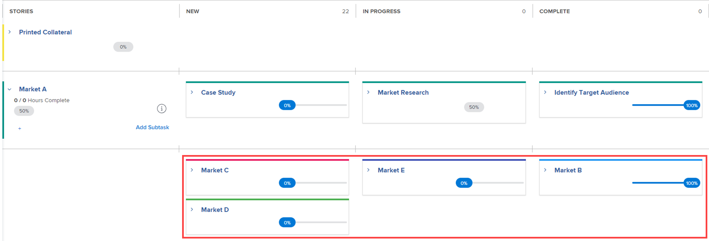

# Projekt in der Agile-Ansicht verwalten

<!-- Audited: 2/2024 -->

Sie können die agile Funktionalität für Ihr Projekt ohne die administrativen Herausforderungen nutzen, die normalerweise mit agilen Vorgehensweisen einhergehen (z. B. Verwaltung eines Team-Rückstands oder Erstellung von Iterationen).

Wenn Sie in einer agilen Umgebung arbeiten möchten, die einen Team-Backlog verwendet und es Ihnen ermöglicht, Iterationen aus Aufgaben im Backlog zu erstellen, folgen Sie den Anweisungen unter [Arbeiten in einer agilen Umgebung](../../../agile/work-in-an-agile-environment/work-in-an-agile-environment.md).

## Zugriffsanforderungen

+++ Erweitern Sie , um die Zugriffsanforderungen für die Funktionalität in diesem Artikel anzuzeigen.

Sie müssen über folgenden Zugriff verfügen, um die Schritte in diesem Artikel ausführen zu können:

<table style="table-layout:auto"> 
 <col> 
 <col> 
 <tbody> 
  <tr> 
   <td role="rowheader">Adobe Workfront-Abo</td> 
   <td> 
Alle
 </td> 
  </tr> 
  <tr> 
   <td role="rowheader">Adobe Workfront-Lizenz</td> 
   <td> 
Aktuell: Überprüfen oder höher
 
   
Neu: Mitarbeiter oder höher
 </td> 
  </tr> 
  <tr> 
   <td role="rowheader">Konfiguration der Zugriffsebene</td> 
   <td> 
Bearbeiten Sie den Zugriff auf die folgenden Bereiche:
 
    <ul> 
     <li> 
Projekte
 </li> 
     <li> 
Berichte, Dashboards, Kalender
 </li> 
     <li> 
Filter, Ansichten, Gruppierungen
 </li> 
    </ul> </td> 
  </tr> 
  <tr> 
   <td role="rowheader">Objektberechtigungen</td> 
   <td> 
Berechtigungen für das Projekt anzeigen
  </td> 
  </tr> 
 </tbody> 
</table>

Weitere Informationen zu den Informationen in dieser Tabelle finden Sie unter [Zugriffsanforderungen in der Dokumentation zu Workfront](/help/quicksilver/administration-and-setup/add-users/access-levels-and-object-permissions/access-level-requirements-in-documentation.md).

+++

## Grundlegendes zu Agile-Projekten

>[!NOTE]
>
>Dieser Abschnitt gilt nur für die veraltete Agile-Ansicht, nicht für die Pinnwandansicht eines Projekts.

* [Agile Funktionalität in einem Projekt](#agile-functionality-in-a-project)
* [Unterschiede bei der Verwendung der Agile-Ansicht für ein Projekt im Vergleich zu einer Iteration](#differences-when-using-the-agile-view-on-a-project-versus-on-an-iteration)

### Agile Funktionalität in einem Projekt {#agile-functionality-in-a-project}

Die folgende agile Funktion ist verfügbar, wenn ein Projekt in einer agilen Ansicht verwaltet wird:

* Fertigstellungsstatus\
  Weitere Informationen zum Fertigstellungsstatus finden Sie unter [Übersicht über den Iteration-Abschlussstatus](../../../agile/use-scrum-in-an-agile-team/burndown/iteration-completion-status-overview.md).

* Story Board\
  Weitere Informationen zum Storyboard finden Sie im Abschnitt [Pinnwand](../../../agile/use-scrum-in-an-agile-team/scrum-board/scrum-board.md) Abschnitt.

Es gibt einige Unterschiede bei der Verwendung von agilen Ansichten für ein Projekt im Vergleich zur Arbeit in einer reinen agilen Umgebung (mit Rückständen und Iterationen). Weitere Informationen finden Sie unter [Unterschiede bei der Verwendung der Agile-Ansicht für ein Projekt im Vergleich zu einer Iteration](#differences-when-using-the-agile-view-on-a-project-versus-on-an-iteration) in diesem Artikel.

### Unterschiede bei der Verwendung der Agile-Ansicht für ein Projekt im Vergleich zu einer Iteration {#differences-when-using-the-agile-view-on-a-project-versus-on-an-iteration}

* [Aufgaben und Unteraufgaben folgen verschiedenen Anzeigeregeln in einer Projekt-Agile-Ansicht und auf dem Story-Forum einer Iteration](#tasks-and-subtasks-follow-different-display-rules-on-the-story-board)
* [Rücklogs und Iterationen werden in der Agile-Ansicht nicht verwendet](#backlogs-and-iterations-are-not-used)
* [Die Aufgabenreihenfolge wird in der Agile-Ansicht beibehalten und kann nicht neu angeordnet werden](#task-order-is-maintained-in-the-agile-view-and-cannot-be-reordered)
* [Aufgaben werden nur in geplanten Stunden auf einer Projektliste gemessen](#tasks-are-measured-only-in-planned-hours)
* [Das Agile-Team wird nicht in einer Agile-Ansicht verwendet](#the-agile-team-is-not-used)
* [Jeder Benutzer im Projekt kann das Projekt in einer anderen Agile-Ansicht anzeigen](#each-user-on-the-project-can-view-the-project-in-a-different-agile-view)

#### Aufgaben und Unteraufgaben folgen verschiedenen Anzeigeregeln in einer Projekt-Agile-Ansicht und auf dem Story-Forum einer Iteration {#tasks-and-subtasks-follow-different-display-rules-on-the-story-board}

* Aufgaben, die weder über eine übergeordnete Aufgabe noch über eine Unteraufgabe verfügen, werden immer als eine einzige Storykarte auf dem Storyboard der Agile-Ansicht angezeigt.\
  Diese Aufgaben werden beispielsweise in der Listenansicht des Projekts wie folgt angezeigt:

  

  Diese Aufgaben werden in der agilen Projektansicht wie folgt angezeigt:

  

* Übergeordnete Aufgaben mit Unteraufgaben werden immer im **Meldungen** -Spalte des Story-Board der Agile-Ansicht. Unteraufgaben werden in der Swimlane der übergeordneten Aufgabe angezeigt.\
  Diese Aufgaben werden beispielsweise in der Listenansicht des Projekts wie folgt angezeigt:

  \
  Diese Aufgaben werden in der agilen Projektansicht wie folgt angezeigt:

  

* Unteraufgaben der zweiten Ebene (Unteraufgaben von Unteraufgaben) werden als hängende graue Karte der unmittelbar übergeordneten Aufgabe angezeigt.
* Unteraufgaben der dritten Ebene (Unteraufgaben von Unteraufgaben von Unteraufgaben) werden nie in der Agile-Ansicht angezeigt.

#### Rücklogs und Iterationen werden in der Agile-Ansicht nicht verwendet {#backlogs-and-iterations-are-not-used}

Beim Anzeigen eines Projekts in einer agilen Ansicht werden die folgenden agilen Komponenten nicht verwendet:

* **Rückprotokoll:** Es wird kein Rückstau verwendet, da Aufgaben im Projekt automatisch als Meldungen angezeigt werden.
* **Iterationen:** Statt Iterationen zu erstellen, um die Daten zu definieren, zu denen die Arbeit abgeschlossen sein wird, werden die aktuell in der Projekt-Timeline festgelegten Tage zu Arbeitstagen.

#### Die Aufgabenreihenfolge wird in der Agile-Ansicht beibehalten und kann nicht neu angeordnet werden {#task-order-is-maintained-in-the-agile-view-and-cannot-be-reordered}

Die Reihenfolge, in der Aufgaben in einem Projekt angezeigt werden, wird beibehalten, wenn Sie das Projekt in einem agilen Storyboard anzeigen.

Sie können Aufgaben im Projekt nicht neu anordnen, wenn Sie das Projekt in einer agilen Ansicht anzeigen. Da sich eine Änderung der Aufgabenreihenfolge auf andere Aufgaben auswirken kann, die möglicherweise Abhängigkeiten aufweisen, müssen Sie das Projekt in einer Standardansicht anzeigen, um die Aufgabenreihenfolge zu ändern.

#### Aufgaben werden nur in geplanten Stunden auf einer Projektliste gemessen {#tasks-are-measured-only-in-planned-hours}

Aufgaben an einem Projekt werden immer in &quot;Geplante Stunden&quot;gemessen.

Bei einer Iteration können Aufgaben (Geschichten) in Stunden oder Punkten gemessen werden.

#### Das Agile-Team wird nicht in einer Agile-Ansicht verwendet {#the-agile-team-is-not-used}

Da agile Teams die Arbeit mit den ihnen zugewiesenen Iterationen abschließen, werden agile Teams nicht verwendet, wenn ein Projekt in einer agilen Ansicht angezeigt wird.

Stattdessen werden alle Benutzer im Projekt im Wesentlichen zum agilen Team für dieses Projekt.

#### Jeder Benutzer im Projekt kann das Projekt in einer anderen Agile-Ansicht anzeigen {#each-user-on-the-project-can-view-the-project-in-a-different-agile-view}

Im Gegensatz zu einer agilen Iteration können Benutzer eines Projekts die agile Ansicht für sich selbst anpassen, während andere Benutzer eine andere agile Ansicht verwenden.

Bei einer agilen Iteration werden die auf der agilen Story-Pinnwand verfügbaren Informationen (z. B. verfügbare Statusspalten) auf Teamebene bestimmt.

Informationen zum Anpassen einer agilen Ansicht finden Sie unter [Erstellen oder Anpassen einer Agile-Ansicht](/help/quicksilver/reports-and-dashboards/reports/reporting-elements/create-edit-views.md#create-or-customize-an-agile-view) in [Erstellen oder Bearbeiten von Ansichten in Adobe Workfront](/help/quicksilver/reports-and-dashboards/reports/reporting-elements/create-edit-views.md).

## Anzeigen eines Projekts in der Agile-Ansicht

1. Wechseln Sie zu dem Projekt, das Sie in einer agilen Ansicht anzeigen möchten, entweder in der Aufgabenliste oder in der Problemliste.
1. Klicken Sie auf **Pinnwandansicht** icon .

   Die Pinnwandansicht des Projekts wird standardmäßig angezeigt.

   

   <!--(Legacy agile view only) If you previously viewed the project in a custom agile view, the project is displayed in that view rather than in the default agile view.-->

1. (Optional) Klicken Sie auf **Konfigurieren** , um Optionen für die Spalten und Karten festzulegen.

   Weitere Informationen finden Sie unter [Pinnwandspalten verwalten](/help/quicksilver/agile/get-started-with-boards/manage-board-columns.md) und [Anpassen der angezeigten Felder auf einer Karte](/help/quicksilver/agile/get-started-with-boards/customize-fields-on-card.md). Beachten Sie, dass Sie in der Pinnwandansicht eines Projekts keine Spaltenrichtlinien definieren können.

1. (Optional) Klicken Sie auf **Verwenden des veralteten agile** , um die ältere agile Ansicht anstelle der Pinnwandansicht zu verwenden.

1. (Optional - Nur ältere Dateiansicht) Wenn Sie eine benutzerdefinierte agile Ansicht erstellt haben oder wenn ein anderer Benutzer eine benutzerdefinierte agile Ansicht erstellt und für Sie freigegeben hat, können Sie sie anstelle der standardmäßigen agilen Ansicht anzeigen.

   Klicken Sie auf **Ansicht** Dropdown-Menü und klicken Sie dann auf die gewünschte benutzerdefinierte Ansicht.

   Die benutzerdefinierte Ansicht &quot;agile&quot;wird verwendet, wenn Sie das nächste Mal auf die **Agile** Symbol.

   Informationen zum Erstellen einer neuen agilen Ansicht finden Sie unter [Agile Ansichten erstellen und anpassen](#create-and-customize-agile-views), unten.

   Das Projekt wird in der benutzerdefinierten agile Ansicht angezeigt.

1. (Bedingt - Nur ältere agile Ansicht) Wenn Aufgaben in Ihrem Projekt andere Status als &quot;Neu&quot;, &quot;In Bearbeitung&quot;oder &quot;Abgeschlossen&quot;(Standardstatus für die Agile-Ansicht) verwenden, müssen Sie der agilen Ansicht die zusätzlichen Status hinzufügen, damit alle Aufgaben in diesen Status angezeigt werden.

   Wenn Aufgaben sich in einem Status befinden, der nicht auf der agilen Story-Pinnwand angezeigt wird, wird die Aufgabe selbst nicht auf der agilen Story-Pinnwand angezeigt (der prozentuale Abschluss dieser Aufgaben trägt jedoch weiterhin zum Percent Complete der übergeordneten Aufgaben und zum Percent Complete des übergeordneten Projekts bei).

   Um der agilen Ansicht Status hinzuzufügen, erstellen Sie entweder eine neue agile Ansicht oder passen Sie eine vorhandene agile Ansicht an, wie unter [Agile Ansichten erstellen und anpassen](#create-and-customize-agile-views), unten.

1. (Optional) Klicken Sie auf die Schaltfläche **Liste** Symbol.

## Agile Ansichten erstellen und anpassen {#create-and-customize-agile-views}

>[!NOTE]
>
>Dieser Abschnitt gilt nur für die veraltete Agile-Ansicht, nicht für die Pinnwandansicht eines Projekts.

Wie bei standardmäßigen Ansichten in Workfront können Sie vorhandene agile Ansichten anpassen oder neue agile Ansichten von Grund auf neu erstellen. Im Gegensatz zu Standardansichten können Sie keine neuen agilen Ansichten basierend auf vorhandenen agilen Ansichten erstellen.

Weitere Informationen zum Erstellen und Anpassen agiler Ansichten finden Sie unter [Erstellen oder Anpassen einer Agile-Ansicht](/help/quicksilver/reports-and-dashboards/reports/reporting-elements/create-edit-views.md#create-or-customize-an-agile-view) im Artikel [Erstellen oder Bearbeiten von Ansichten in Adobe Workfront](/help/quicksilver/reports-and-dashboards/reports/reporting-elements/create-edit-views.md).

## Vorhandene Agile-Ansicht freigeben

>[!NOTE]
>
>Dieser Abschnitt gilt nur für die veraltete Agile-Ansicht, nicht für die Pinnwandansicht eines Projekts.

Sie können eine von Ihnen erstellte Agile-Ansicht auf dieselbe Weise freigeben oder sie filtern oder gruppieren wie andere Ansichten.

Weitere Informationen finden Sie unter [Filter, Ansichten oder Gruppierungen freigeben](../../../reports-and-dashboards/reports/reporting-elements/share-filter-view-grouping.md).

## Vorhandene Agile-Ansicht entfernen

>[!NOTE]
>
>Dieser Abschnitt gilt nur für die veraltete Agile-Ansicht, nicht für die Pinnwandansicht eines Projekts.

Sie können eine Agile-Ansicht auf dieselbe Weise entfernen wie jede andere Ansicht, Filter oder Gruppierung.

Weitere Informationen finden Sie unter [Filter, Ansichten und Gruppierungen entfernen](/help/quicksilver/reports-and-dashboards/reports/reporting-elements/remove-filters-views-groupings.md).
