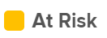

# Überblick über Projektbedingung und Bedingungstyp

<!-- Audited: 12/2023 -->

Die Projektbedingung ist eine visuelle Darstellung des Projektfortschritts. Es handelt sich um eine meldepflichtige Variable, die durch die Beziehung zwischen dem geplanten, dem geplanten und dem geschätzten Datum des Projekts bestimmt wird.

## Projektbedingung - Übersicht

Beachten Sie Folgendes beim Verständnis des Status eines Projekts:

* Als Projektbesitzer können Sie entscheiden, ob die Bedingung eines Projekts manuell oder automatisch festgelegt wird. Die Bedingung eines Projekts kann wie folgt festgelegt werden:

   * Manuell durch Benutzer, die Zugriff auf die Verwaltung des Projekts haben, und wenn der Bedingungstyp des Projekts auf „Manuell“ festgelegt ist.
   * Automatisch durch Adobe Workfront, wenn der Bedingungstyp des Projekts auf „Fortschrittsstatus“ festgelegt ist. Der Fortschrittsstatus des Projekts wird durch den Fortschritt der Aufgaben im Projekt bestimmt. Informationen zum Fortschrittsstatus des Projekts finden Sie unter [Übersicht über den Projektfortschritt](../../../manage-work/projects/planning-a-project/project-progress-status.md).

  Informationen zum Aktualisieren des Bedingungstyps des Projekts finden Sie unter [Festlegen des Bedingungstyps eines Projekts](../../../manage-work/projects/manage-projects/set-condition-type-for-project.md).

* Wenn Workfront die automatische Schätzung des Projektzustands ermöglicht, empfehlen wir die Verwendung von Vorgängern für Ihre Vorgänge, damit der Aufgabenfortschritt den tatsächlichen Fortschritt und den Fortschrittsstatus des Projekts widerspiegelt.
* Als Projektbesitzer können Sie das Projekt so ändern, dass es einen manuellen Bedingungstyp verwendet, anstatt den Fortschrittsstatus zu verwenden, indem Sie den Bedingungstyp von Fortschrittsstatus in Manuell ändern.

  >[!NOTE]
  >
  >Projekte mit einem der folgenden Status werden immer als In Target gekennzeichnet, unabhängig vom Datum der Aufgaben und ihrem Fortschritt:
  >
  >* Idee
  >* Angefordert
  >* Genehmigt
  >* Abgelehnt

<!--

<h2>Set the Condition Type for a project</h2>

(NOTE: drafted here and moved it to a separate article: /Content/Manage work/Projects/Manage projects/set-condition-type-for-project.htm)

<ol>
<li value="1">Go to the project for which you want to update the Condition Type. </li>
<li value="2"> 
  Click the <strong>More</strong> menu  to the right of the project name, then click <strong>Edit</strong>.    
 </li>
<li value="3">In the <strong>Condition Type</strong> field, choose one of the following:
<ul>
<li>
<strong>Manual:</strong> The project owner sets the Condition on the project manually.

In this case, the project owner can update the Condition of the project in the project header, or the Project Details section. 
</li>
<li>
<strong>Progress Status:</strong> Workfront sets the Condition based on the Progress Status of the project.  
</li>
</ul></li>
<li value="4">Click <strong>Save Changes</strong>. </li>
</ol>

-->

## Wie Workfront die Projektbedingung basierend auf dem Fortschrittsstatus aktualisiert

Wenn der Bedingungstyp des Projekts auf „Manuell“ festgelegt ist, können Sie unabhängig vom Fortschrittsstatus des Projekts bestimmen, welche Bedingung das Projekt hat.

Wir empfehlen jedoch, den Bedingungstyp des Projekts auf „Fortschrittsstatus“ zu setzen, damit Sie je nach Fortschritt Ihrer Aufgaben einen klaren Hinweis auf den tatsächlichen Fortschritt des Projekts erhalten. Informationen darüber, wie Workfront den Fortschrittsstatus von Projekten berechnet, finden Sie unter [Übersicht über den Projektfortschritt](../../../manage-work/projects/planning-a-project/project-progress-status.md).

In diesem Fall können die Werte für die Projektbedingung wie folgt lauten:

<table style="table-layout:auto"> 
 <col> 
 <col> 
 <col> 
 <col> 
 <tbody> 
  <tr> 
   <td><strong>Projektbedingung</strong></td> 
   <td><strong>Status des Projektverlaufs</strong></td> 
   <td><strong>Workfront-Bedingungsindikator</strong></td> 
   <td> </td> 
  </tr> 
  <tr> 
   <td>Im Zielbereich</td> 
   <td>Wenn der Fortschrittsstatus des Projekts „Pünktlich“ lautet, lautet der Status des Projekts "<strong>"</strong>. </td> 
   <td>  </td> 
   <td> </td> 
  </tr> 
  <tr> 
   <td>Gefährdet</td> 
   <td>Wenn der Fortschrittsstatus des Projekts "<strong>" </strong> "<strong> Risiko</strong> ist, dann ist der Status des Projekts <strong>Gefährdet</strong>.</td> 
   <td>  </td> 
   <td> </td> 
  </tr> 
  <tr> 
   <td>In Schwierigkeiten</td> 
   <td>Wenn der Fortschrittsstatus des Projekts "<strong>" lautet</strong> lautet der Projektstatus „In <strong>" </strong>. </td> 
   <td>  </td> 
   <td> </td> 
  </tr> 
 </tbody> 
</table>

>[!NOTE]
>
>Die Bedingungen können für Ihre Umgebung angepasst werden, sodass Sie in Ihrer Umgebung möglicherweise mehr als drei Optionen für die Bedingung finden. Die Namen der Bedingungen können sich von den oben aufgeführten unterscheiden. Informationen zum Anpassen von Bedingungen in finden Sie im Artikel [Erstellen oder Bearbeiten einer benutzerdefinierten Bedingung](../../../administration-and-setup/customize-workfront/create-manage-custom-conditions/create-edit-custom-conditions.md).

## Bericht zu Projektbedingungen, Projektbedingungsaktualisierung und letzter Bedingungsnotiz

In der Ansicht eines Projektberichts können Sie die folgenden Felder anzeigen, die sich auf den Zustand des Projekts beziehen:

* **Projektbedingung** Zeigt den aktuellen Zustand des Projekts an.
* **Aktualisierung der Projektbedingungen**: Zeigt die neueste Aktualisierung, die der Projektinhaber im Aktualisierungsprozess des Projekts bereitgestellt hat, zusammen mit der neuen Bedingung an.\
  Kommentare zu Bedingungsaktualisierungen werden nicht in der Spalte **Bedingungsaktualisierung** angezeigt, sondern nur zur Hauptaktualisierung.

* **Letzte Bedingung Hinweis**: Zeigt die Aktualisierung an, die zuletzt vom Eigentümer des Objekts für ein Objekt eingegeben wurde. Dieses Feld ist hilfreich, um die neueste Aktivität oder Interaktion des Besitzers mit einem Objekt anzuzeigen.\
  Die Spalte **Letzte Bedingung** ist leer, wenn der Notiztext der letzten Anmerkung eines Objekts gelöscht wurde. Wenn eine neue Notiz für das Objekt eingegeben wird, wird sie zur letzten Notiz und wird erneut in der Spalte angezeigt.

Informationen zum Erstellen eines Berichts finden Sie im Artikel [Erstellen eines benutzerdefinierten Berichts](../../../reports-and-dashboards/reports/creating-and-managing-reports/create-custom-report.md).
