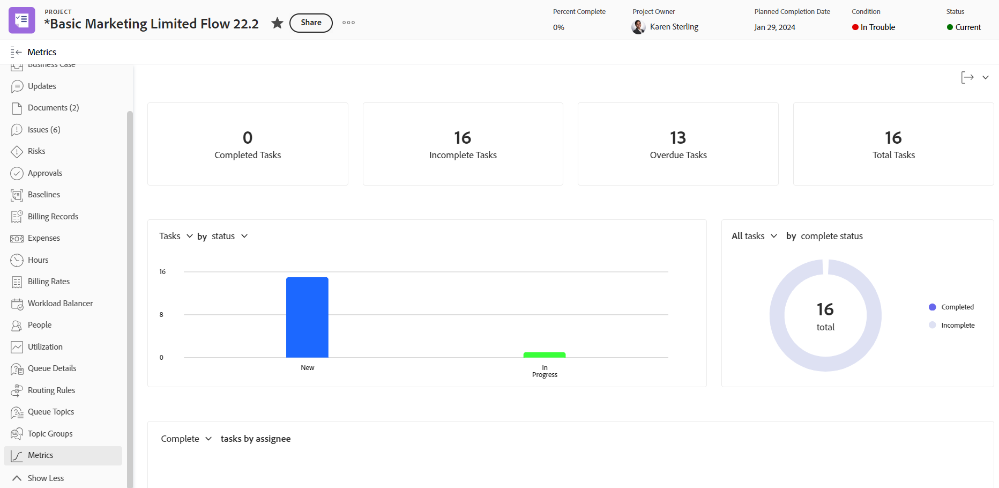
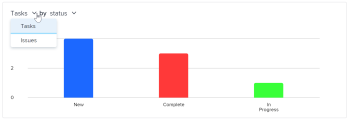
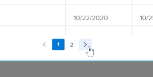

# Verstehen von Projektmetriken

Projektmetriken bieten eine allgemeine Ansicht der Leistung eines Projekts im Diagrammformat.

## Zugriffsanforderungen

+++ Erweitern Sie , um die Zugriffsanforderungen für die -Funktion in diesem Artikel anzuzeigen. 

<table style="table-layout:auto"> 
 <col> 
 <col> 
 <tbody> 
  <tr> 
   <td role="rowheader">Adobe Workfront-Paket</td> 
   <td> 
Beliebig
 </td> 
  </tr> 
  <tr> 
   <td role="rowheader">Adobe Workfront-Lizenz</td> 
   <td> 
Licht oder höher

   
Überprüfen oder höher
 </td> 
  </tr> 
  <tr> 
   <td role="rowheader">Konfigurationen der Zugriffsebene</td> 
   <td> 
Zugriff auf Projekte anzeigen
  </td> 
  </tr> 
  <tr> 
   <td role="rowheader">Objektberechtigungen</td> 
   <td> 
Anzeigen von Berechtigungen für ein Projekt
 </td> 
  </tr> 
 </tbody> 
</table>

*Weitere Informationen finden Sie unter [Zugriffsanforderungen in der Dokumentation zu Workfront](/help/quicksilver/administration-and-setup/add-users/access-levels-and-object-permissions/access-level-requirements-in-documentation.md).

+++

<!--Old:

<table style="table-layout:auto"> 
 <col> 
 <col> 
 <tbody> 
  <tr> 
   <td role="rowheader">Workfront plan</td> 
   <td> 
Any
 </td> 
  </tr> 
  <tr> 
   <td role="rowheader">Workfront license*</td> 
   <td> 
New: Light or higher 

   
Current: Review or higher 
 </td> 
  </tr> 
  <tr> 
   <td role="rowheader">Access level configuration</td> 
   <td> 
View access to Projects
  </td> 
  </tr> 
  <tr> 
   <td role="rowheader">Object permissions</td> 
   <td> 
View permissions to a project
 </td> 
  </tr> 
 </tbody> 
</table>-->

## Voraussetzungen

Um über das linke Bedienfeld eines Projekts auf den Bereich Metriken zuzugreifen, ist Folgendes erforderlich:

* Lassen Sie die Option Metriken im linken Bedienfeld im Bereich Projekte Ihrer Layout-Vorlage aktivieren.

  Informationen dazu, wie Workfront-Admins oder Gruppenadmins den linken Bereich mit einer Layout-Vorlage anpassen können, finden Sie unter [Anpassen des linken Bereichs mithilfe einer Layout-Vorlage](../../../administration-and-setup/customize-workfront/use-layout-templates/customize-left-panel.md).

## Übersicht über den Bereich Projektmetriken

Projektmetriken bieten Ihnen eine Visualisierung der Vorgänge in einem Projekt, sodass Sie die Anforderungen und den Status eines Projekts schnell bewerten können.

Im Bereich Metriken können Sie den Gesamtzustand eines Projekts sowie Folgendes anzeigen:

* Wo Arbeit aktiv oder gestoppt ist
* Wer hat offene Arbeitselemente zugewiesen
* Details zu Aufgaben oder Problemen, die überfällig sind oder kurz vor dem geplanten Abschlussdatum liegen

Sie können auch ein Drilldown in jedes Diagramm durchführen, um Aufgaben oder Probleme in einer bestimmten Kategorie genauer zu untersuchen.

Weitere Informationen zum Untersuchen dieser Aufgaben oder Probleme finden Sie unter [Metrikdetails anzeigen](#view-metrics-details).

<!--this was deprecated: 
>[!TIP]
>
>To see metrics at a higher level for a group of projects within a program, portfolio, etc., navigate to the Enhanced analytics area.  
>To learn more about Enhanced analytics, see [Enhanced analytics overview](../../../enhanced-analytics/enhanced-analytics-overview.md).-->

## Projektkennzahlen

Die wichtigsten Leistungsindikatoren (KPIs) werden oben im Bereich „Metriken“ angezeigt.

Diese KPIs sind in die folgenden Kategorien unterteilt:

| Abgeschlossene Aufgaben | **Abgeschlossene Aufgaben** zeigt die Anzahl der Aufgaben mit dem Status Abgeschlossen an. Diese Zahl umfasst auch Aufgaben mit einem benutzerdefinierten Status, der „Abgeschlossen“ entspricht. |
|---|---|
| Unvollständige Aufgaben | **Nicht abgeschlossene Aufgaben** zeigt die Anzahl der Aufgaben an, die sich nicht im Status Abgeschlossen oder Geschlossen bzw. einem Status befinden, der Abgeschlossen entspricht. |
| Überfällige Aufgaben | **Überfällige Aufgaben** zeigt die Anzahl der Aufgaben an, die hinter dem geplanten Abschlussdatum liegen und sich nicht im Status Abgeschlossen oder Geschlossen oder in einem Status befinden, der Abgeschlossen oder Geschlossen entspricht. |
| Aufgaben insgesamt | **Aufgaben insgesamt** zeigt die Gesamtzahl der Aufgaben im Projekt an. |

>[!TIP]
>
>Um eine Liste der Arbeitselemente für einen bestimmten KPI anzuzeigen, klicken Sie auf diesen KPI. In dieser Liste können Sie auf ein bestimmtes Arbeitselement klicken, um weitere Details auf einer neuen Registerkarte anzuzeigen.\
>\
>Weitere Informationen finden Sie unter [Metrikdetails anzeigen](#view-metrics-details).

## Balkendiagramm für Aufgaben oder Probleme

In dem Balkendiagramm, das unter den Projekt-KPIs angezeigt wird, können Sie den Status oder die Priorität der Arbeitselemente im Projekt anzeigen. Die Aufgabenansicht ist standardmäßig ausgewählt.

Wenn der Status in diesem Diagramm ausgewählt ist, können Sie alle Status von Aufgaben oder Problemen in einem Projekt anzeigen. Jeder Status wird in einem Balken im Diagramm gruppiert. Alle Standardsystemstatus und benutzerdefinierten Status werden in diesem Diagramm angezeigt.

Wenn in diesem Diagramm Priorität ausgewählt ist, können Sie alle Prioritäten von Aufgaben oder Problemen in einem Projekt anzeigen.

>[!TIP]
>
>Um eine Liste von Arbeitselementen mit einem bestimmten Status oder einer bestimmten Priorität anzuzeigen, klicken Sie auf einen Balken im Diagramm. In dieser Liste können Sie auf ein bestimmtes Arbeitselement klicken, um weitere Details auf einer neuen Registerkarte anzuzeigen.\
>\
>Weitere Informationen finden Sie unter [Metrikdetails anzeigen](#view-metrics-details).

## Ringdiagramm

Das Ringdiagramm, das sich unter den Projekt-KPIs befindet, ermöglicht es Ihnen, das Verhältnis zwischen abgeschlossenen Arbeitselementen und unvollständigen Arbeitselementen in einem Projekt anzuzeigen.

Im Dropdown-Menü über dem Diagramm können Sie Folgendes auswählen:

| Alle Aufgaben | Wenn Sie **Aufgaben** auswählen, werden die Gesamtzahl der Aufgaben im Projekt sowie das Verhältnis zwischen abgeschlossenen und unvollständigen Aufgaben angezeigt. |
|---|---|
| Alle Probleme | Wenn Sie **Probleme** auswählen, werden die Gesamtzahl der Probleme im Projekt sowie das Verhältnis zwischen abgeschlossenen und unvollständigen Problemen angezeigt. |

>[!TIP]
>
>Um eine Liste der abgeschlossenen oder unvollständigen Arbeitselemente anzuzeigen, klicken Sie auf diesen Abschnitt im Ringdiagramm. In dieser Liste können Sie auf ein bestimmtes Arbeitselement klicken, um weitere Details auf einer neuen Registerkarte anzuzeigen.\
>\
>Weitere Informationen finden Sie unter [Metrikdetails anzeigen](#view-metrics-details).

## Balkendiagramm für Zugewiesene

Das Balkendiagramm Zugewiesene Person zeigt die Anzahl der Aufgaben an, die den einzelnen Personen im Projekt zugewiesen wurden. Diese Zahl variiert je nach der Kategorie, die Sie aus dem Dropdown-Menü auswählen.

Sie können Aufgabenzuweisungen für ein Projekt in den folgenden Kategorien anzeigen:

| Abgeschlossen | Wenn Sie **Abschließen** auswählen, wird die Anzahl der Aufgaben angezeigt, die den einzelnen abgeschlossenen Benutzern zugewiesen wurden. |
|---|---|
| Unvollständig | Wenn Sie **Unvollständig** auswählen, wird die Anzahl der den einzelnen Benutzenden zugewiesenen Aufgaben angezeigt, die noch nicht abgeschlossen wurden. |
| Bevorstehend | Wenn Sie **Kommend** auswählen, wird die Anzahl der Aufgaben angezeigt, die jedem Benutzer zugewiesen wurden und das geplante Startdatum noch nicht erreicht haben. |
| Überfällig | Wenn Sie **Überfällig** auswählen, wird die Anzahl der Aufgaben angezeigt, die jedem Benutzer zugewiesen wurden und das geplante Abschlussdatum überschreiten und noch nicht abgeschlossen sind. |

>[!TIP]
>
>Um eine Liste der Arbeitselemente in der ausgewählten Kategorie anzuzeigen, die einem bestimmten Benutzer zugewiesen sind, klicken Sie auf den Balken neben dem Namen des Benutzers im Diagramm. In dieser Liste können Sie auf ein bestimmtes Arbeitselement klicken, um weitere Details auf einer neuen Registerkarte anzuzeigen.\
>\
>Weitere Informationen finden Sie unter [Metrikdetails anzeigen](#view-metrics-details).

## Anzeigen von Metrikdetails {#view-metrics-details}

Sie können mit den Diagrammen im Bereich Metriken interagieren, um verschiedene Aspekte eines Diagramms anzuzeigen oder die Aufgaben und Probleme innerhalb eines Diagramms genauer zu betrachten.

1. Navigieren Sie zu dem Projekt, für das Sie Metriken anzeigen möchten.
1. Klicken Sie im linken Bedienfeld auf **Metriken**.\
   Die Diagramme im Bereich Metriken zeigen standardmäßig Informationen zu Aufgaben an.\
   

1. (Bedingt) Wenn in einem Diagramm ein Dropdown-Pfeil angezeigt wird, klicken Sie auf das Symbol **Dropdown-Pfeil**, das im Diagramm  wird, und wählen Sie die gewünschte Option aus dem Menü aus.\
   Informationen zu den Optionen, die in den Menüs der einzelnen Diagramme angezeigt werden, finden Sie im entsprechenden Abschnitt oben.

1. (Optional) Gehen Sie wie folgt vor, um Aufgaben oder Probleme für eine Metrik auf der Seite genauer zu untersuchen:

   1. Klicken Sie auf das Element, für das Sie Details anzeigen möchten, z. B. Aufgaben, die einem bestimmten Benutzer zugewiesen sind, Probleme mit hoher Priorität oder alle überfälligen Aufgaben.

      Eine Liste mit Aufgaben oder Problemen wird angezeigt.

      

   1. Verwenden Sie die Pfeile unten in der Liste, um die Aufgabe oder das Problem zu finden, die bzw. das Sie überprüfen möchten.

      Oder

      Wählen Sie eine bestimmte Zahl aus, um Aufgaben oder Probleme auf einer bestimmten Seite anzuzeigen.

      

   1. Wählen Sie eine Aufgabe oder ein Problem aus, um weitere Details anzuzeigen.

      Die Aufgabe oder das Problem wird in einer neuen Registerkarte geöffnet.

1. (Optional) Um das Dashboard für Projektmetriken in eine .png-Datei zu exportieren, klicken Sie auf das **Export**-Symbol  und wählen Sie **Als PNG exportieren** aus dem Dropdown-Menü aus.

   >[!TIP]
   >
   >Wenn Sie das Dashboard exportieren, enthält die exportierte Datei nur das, was derzeit in Ihrem Viewport angezeigt wird. Um bestimmte Elemente in die exportierte Datei aufzunehmen, müssen Sie möglicherweise auf der Seite nach oben oder unten scrollen oder die Zoom-Einstellungen Ihres Browsers anpassen.
