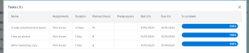

# Übersicht über Projektmetriken

Über Projektmetriken erhalten Sie einen allgemeinen Überblick über die Leistung eines Projekts im Diagrammformat.

## Zugriffsanforderungen

<table style="table-layout:auto"> 
 <col> 
 <col> 
 <tbody> 
  <tr> 
   <td role="rowheader">Workfront-Plan*</td> 
   <td> 
Beliebig
 </td> 
  </tr> 
  <tr> 
   <td role="rowheader">Workfront-Lizenz*</td> 
   <td> 
Überprüfen oder höher 
 </td> 
  </tr> 
  <tr> 
   <td role="rowheader">Zugriffsebene*</td> 
   <td> 
Zugriff auf Projekte anzeigen
 
<b>NOTIZ</b>

Wenn Sie immer noch keinen Zugriff haben, fragen Sie Ihren Workfront-Administrator, ob er zusätzliche Zugriffsbeschränkungen für Ihre Zugriffsebene festlegt. Informationen zum Zugriff auf Projekte finden Sie unter <a href="../../../administration-and-setup/add-users/configure-and-grant-access/grant-access-projects.md" class="MCXref xref">Projektzugriff gewähren</a>. Informationen dazu, wie ein Workfront-Administrator Ihre Zugriffsstufe ändern kann, finden Sie unter <a href="../../../administration-and-setup/add-users/configure-and-grant-access/create-modify-access-levels.md" class="MCXref xref">Benutzerdefinierte Zugriffsebenen erstellen oder ändern</a>. 
 </td>
</tr> 
  <tr> 
   <td role="rowheader">Objektberechtigungen</td> 
   <td> 
Berechtigungen für ein Projekt anzeigen
 
 Weitere Informationen zu Projektberechtigungen finden Sie unter <a href="../../../workfront-basics/grant-and-request-access-to-objects/share-a-project.md" class="MCXref xref">Freigeben eines Projekts in Adobe Workfront</a>.
 
Informationen zum Anfordern von zusätzlichem Zugriff finden Sie unter <a href="../../../workfront-basics/grant-and-request-access-to-objects/request-access.md" class="MCXref xref">Zugriff auf Objekte anfordern </a>.
 </td> 
  </tr> 
 </tbody> 
</table>

*Wenden Sie sich an Ihren Workfront-Administrator, um zu erfahren, welchen Plan, welchen Lizenztyp oder welchen Zugriff Sie haben.

## Voraussetzungen

Um über den linken Bereich eines Projekts auf den Bereich &quot;Metriken&quot;zuzugreifen, gehen Sie folgendermaßen vor:

* Lassen Sie die Metriken für die linke Bedienfeldoption im Bereich Projekte Ihrer Layoutvorlage aktiviert.

   Informationen dazu, wie Workfront-Administratoren oder -Gruppenadministratoren das linke Bedienfeld mit einer Layoutvorlage anpassen können, finden Sie unter [Anpassen des linken Bedienfelds mithilfe einer Layoutvorlage](../../../administration-and-setup/customize-workfront/use-layout-templates/customize-left-panel.md).

## Übersicht über den Bereich &quot;Projektmetriken&quot;

Mit Projektmetriken können Sie visualisieren, was in einem Projekt geschieht, und so schnell die Anforderungen und den Status eines Projekts bewerten.

Im Bereich Metriken können Sie den Gesamtzustand eines Projekts sowie folgende Punkte sehen:

* Wo die Arbeit aktiv oder angehalten ist
* Wer hat offene Arbeitselemente zugewiesen
* Details zu Aufgaben oder Problemen, die überfällig sind oder nahe dem geplanten Abschlussdatum liegen

Sie können auch in die einzelnen Diagramme vordringen, um Aufgaben oder Probleme in einer bestimmten Kategorie genauer zu untersuchen.

Weitere Informationen zum Untersuchen dieser Aufgaben oder Probleme finden Sie unter [Anzeigen von Metrikdetails](#view-metrics-details).

>[!TIP]
>
>Um Metriken für eine Gruppe von Projekten in einem Programm, Portfolio usw. auf höherer Ebene anzuzeigen, navigieren Sie zum Bereich &quot;Erweiterte Analyse&quot;.\
>Weitere Informationen zur erweiterten Analyse finden Sie unter [Erweiterte Analyse - Übersicht](../../../enhanced-analytics/enhanced-analytics-overview.md).

## Projekt-KPIs

Wichtige Leistungsindikatoren (KPIs) werden oben im Bereich &quot;Metriken&quot;angezeigt.

Diese KPIs sind in die folgenden Kategorien unterteilt:

| Abgeschlossene Aufgaben | **Abgeschlossene Aufgaben** zeigt die Anzahl der Aufgaben mit dem Status Abgeschlossen an. Diese Zahl enthält auch Aufgaben mit einem benutzerdefinierten Status, der mit &quot;Complete&quot;übereinstimmt. |
|---|---|
| Unvollständige Aufgaben | **Unvollständige Aufgaben** zeigt die Anzahl der Aufgaben an, die sich nicht im Status &quot;Abgeschlossen&quot;oder &quot;Abgeschlossen&quot;befinden oder deren Status mit &quot;Abgeschlossen&quot;übereinstimmt. |
| Überfällige Aufgaben | **Überfällige Aufgaben** zeigt die Anzahl der Aufgaben an, die über das geplante Abschlussdatum hinausgehen und sich weder im Status &quot;Abgeschlossen&quot;noch im Status &quot;Abgeschlossen&quot;befinden, der mit &quot;Abgeschlossen&quot;oder &quot;Abgeschlossen&quot;übereinstimmt. |
| Gesamtaufgaben | **Gesamtaufgaben** zeigt die Gesamtzahl der Aufgaben im Projekt an. |

>[!TIP]
>
>Um eine Liste der Arbeitselemente für einen bestimmten KPI anzuzeigen, klicken Sie auf diesen KPI. In dieser Liste können Sie auf ein bestimmtes Arbeitselement klicken, um weitere Details in einer neuen Registerkarte anzuzeigen.\
>\
>Weitere Informationen finden Sie unter [Anzeigen von Metrikdetails](#view-metrics-details).

## Aufgaben- oder Problembalkendiagramm

Im Balkendiagramm, das unter den Projekt-KPIs angezeigt wird, können Sie sich den Status oder die Priorität von Arbeitselementen im Projekt ansehen. Die Aufgabenansicht ist standardmäßig ausgewählt.

Wenn in dieser Grafik der Status ausgewählt ist, können Sie alle Status von Aufgaben oder Problemen in einem Projekt anzeigen. Jeder Status wird in einem Balken in der Grafik gruppiert. Alle standardmäßigen Systemstatus und benutzerdefinierten Status werden in dieser Grafik angezeigt.

Wenn in dieser Grafik die Priorität ausgewählt ist, können Sie alle Prioritäten von Aufgaben oder Problemen in einem Projekt anzeigen.

>[!TIP]
>
>Um eine Liste von Arbeitselementen mit einem bestimmten Status oder einer bestimmten Priorität anzuzeigen, klicken Sie auf eine Leiste im Diagramm. In dieser Liste können Sie auf ein bestimmtes Arbeitselement klicken, um weitere Details in einer neuen Registerkarte anzuzeigen.\
>\
>Weitere Informationen finden Sie unter [Anzeigen von Metrikdetails](#view-metrics-details).

## Ringdiagramm

Das Ringdiagramm unter den Projekt-KPIs ermöglicht es Ihnen, das Verhältnis zwischen abgeschlossenen Arbeitselementen und unvollständigen Arbeitselementen in einem Projekt zu ermitteln.

Im Dropdown-Menü über der Grafik können Sie Folgendes auswählen:

| Alle Aufgaben | Auswählen **Aufgaben** zeigt die Gesamtzahl der Aufgaben im Projekt sowie das Verhältnis zwischen abgeschlossenen und unvollständigen Aufgaben an. |
|---|---|
| Alle Probleme | Auswählen **issues** zeigt die Gesamtzahl der Probleme im Projekt sowie das Verhältnis zwischen abgeschlossenen und unvollständigen Problemen an. |

>[!TIP]
>
>Um eine Liste der abgeschlossenen oder unvollständigen Arbeitselemente anzuzeigen, klicken Sie auf diesen Abschnitt im Ringdiagramm. In dieser Liste können Sie auf ein bestimmtes Arbeitselement klicken, um weitere Details in einer neuen Registerkarte anzuzeigen.\
>\
>Weitere Informationen finden Sie unter [Anzeigen von Metrikdetails](#view-metrics-details).

## Balkendiagramm der Zuweisung

Das Balkendiagramm des Verantwortlichen zeigt die Anzahl der Aufgaben, die jeder Person im Projekt zugewiesen sind. Diese Zahl variiert je nach der Kategorie, die Sie aus dem Dropdown-Menü auswählen.

Sie können Aufgabenzuweisungen für ein Projekt in den folgenden Kategorien anzeigen:

| Abgeschlossen | Auswählen **Fertig** zeigt die Anzahl der Aufgaben an, die jedem Benutzer zugewiesen wurden, der abgeschlossen wurde. |
|---|---|
| Unvollständig | Auswählen **Unvollständig** zeigt die Anzahl der Aufgaben an, die jedem Benutzer zugewiesen wurden und die noch nicht abgeschlossen wurden. |
| Bevorstehend | Auswählen **Bevorstehende** zeigt die Anzahl der Aufgaben an, die jedem Benutzer zugewiesen wurden, der das geplante Startdatum noch nicht erreicht hat. |
| Überfällig | Auswählen **Überfällig** zeigt die Anzahl der jedem Benutzer zugewiesenen Aufgaben an, die über das geplante Abschlussdatum hinausgehen und noch nicht abgeschlossen wurden. |

>[!TIP]
>
>Um eine Liste der einem bestimmten Benutzer zugewiesenen Arbeitselemente der ausgewählten Kategorie anzuzeigen, klicken Sie in der Grafik auf die Leiste neben dem Namen des Benutzers. In dieser Liste können Sie auf ein bestimmtes Arbeitselement klicken, um weitere Details in einer neuen Registerkarte anzuzeigen.\
>\
>Weitere Informationen finden Sie unter [Anzeigen von Metrikdetails](#view-metrics-details).

## Anzeigen von Metrikdetails {#view-metrics-details}

Sie können mit den Diagrammen im Bereich Metriken interagieren, um verschiedene Aspekte eines Diagramms zu untersuchen oder die Aufgaben und Probleme innerhalb eines Diagramms genauer zu untersuchen.

1. Wechseln Sie zu dem Projekt, für das Sie Metriken anzeigen möchten.
1. Klicken Sie im linken Bereich auf **Mehr anzeigen** , um weitere Abschnitte anzuzeigen, klicken Sie dann auf **Metriken**.\
   Die Diagramme im Bereich Metriken zeigen standardmäßig Informationen zu Aufgaben an.\
   

1. (Bedingt) Wenn ein Dropdown-Pfeil in einem Diagramm angezeigt wird, klicken Sie auf die **Dropdown-Pfeil** icon  und wählen Sie im Menü die gewünschte Option aus.\
   Informationen zu den Optionen, die in den Menüs der einzelnen Diagramme angezeigt werden, finden Sie oben im entsprechenden Abschnitt.

1. (Optional) Gehen Sie wie folgt vor, um Aufgaben oder Probleme für Metriken auf der Seite genauer zu untersuchen:

   1. Klicken Sie auf das Element, für das Sie Details anzeigen möchten, z. B. auf Aufgaben, die einem bestimmten Benutzer zugewiesen sind, Probleme mit hoher Priorität oder alle überfälligen Aufgaben.

      Eine Liste mit Aufgaben oder Problemen wird angezeigt.

      

   1. Verwenden Sie die Pfeile am unteren Rand der Liste, um die Aufgabe oder das Problem zu finden, die bzw. das Sie untersuchen möchten.

      Oder

      Wählen Sie eine bestimmte Zahl aus, um Aufgaben oder Probleme auf einer bestimmten Seite anzuzeigen.

      

   1. Wählen Sie eine Aufgabe oder ein Problem aus, um weitere Details anzuzeigen.

      Die Aufgabe oder das Problem wird in einer neuen Registerkarte geöffnet.

1. (Optional) Um das Dashboard der Projektmetriken in eine PNG-Datei zu exportieren, klicken Sie auf die Schaltfläche **Export** icon , wählen Sie **Als PNG exportieren** aus dem Dropdown-Menü.

   >[!TIP]
   >
   >Wenn Sie das Dashboard exportieren, enthält die exportierte Datei nur das, was derzeit in Ihrem Viewport angezeigt wird. Um bestimmte Elemente in die exportierte Datei aufzunehmen, müssen Sie möglicherweise auf der Seite nach oben oder unten scrollen oder die Zoom-Einstellungen Ihres Browsers anpassen.
