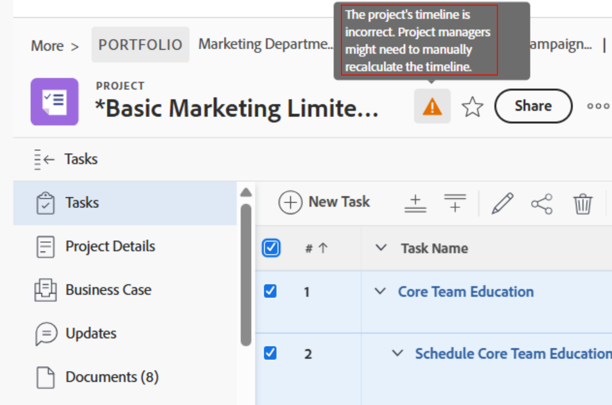
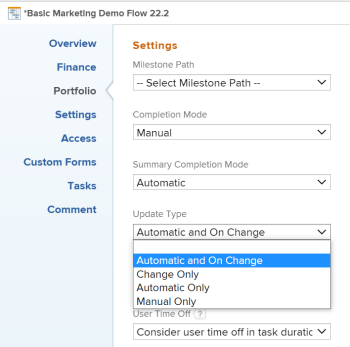

# Projektzeitleisten neu berechnen

<!--Audited: 06/2025-->

Durch die Neuberechnung der Timelines können Manager sehen, wie sich verschiedene Faktoren im Zusammenhang mit dem Projekt auf die Timeline des Projekts auswirken. Der Zeitplan eines Projekts bezieht sich auf geplante und geplante Termine.

Änderungen an Zeitplänen, Auszeiten für Mitarbeiter und anderen Elementen außerhalb des Projektumfangs wirken sich nicht sofort auf die Projektzeitleiste aus. Die Zeitleiste des Projekts wird beeinträchtigt, wenn die Zeitleiste neu berechnet wird. Externe Einflüsse wirken sich erst dann auf Ihr Projekt aus, wenn die Neuberechnung erfolgt.

In diesem Artikel wird beschrieben, wie die Neuberechnung der Zeitleiste erfolgt.

Die automatische Neuberechnung der Zeitleiste erfolgt für keinen der Benutzer, die an der Arbeit am Projekt beteiligt sind, ohne speziellen Zugriff. Darüber hinaus können Sie die Timeline manuell neu berechnen.

## Zugriffsanforderungen

+++ Erweitern, um die Zugriffsanforderungen für die in diesem Artikel beschriebene Funktionalität anzuzeigen. 

<table style="table-layout:auto"> 
 <col> 
 <col> 
 <tbody> 
  <tr> 
   <td role="rowheader">Adobe Workfront-Paket</td> 
   <td> 
Beliebig
 </td> 
  </tr> 
  <tr> 
   <td role="rowheader">Adobe Workfront-Lizenz</td> 
   <td> 
Standard
 
    
Plan

   </td> 
  </tr> 
  <tr> 
   <td role="rowheader">Konfigurationen der Zugriffsebene</td> 
   <td> 
Zugriff auf Projekte bearbeiten
 
Systemadministrator berechnet die Zeitleiste für alle Projekte im System neu
  </td> 
  </tr> 
  <tr> 
   <td role="rowheader">Objektberechtigungen</td> 
   <td> 
Verwalten von Berechtigungen für ein Projekt
  </td> 
  </tr> 
 </tbody> 
</table>

Weitere Informationen zu den Informationen in dieser Tabelle finden Sie unter [Zugriffsanforderungen in der Dokumentation zu Workfront](/help/quicksilver/administration-and-setup/add-users/access-levels-and-object-permissions/access-level-requirements-in-documentation.md).

+++

<!--Old:
<table style="table-layout:auto"> 
 <col> 
 <col> 
 <tbody> 
  <tr> 
   <td role="rowheader">Adobe Workfront plan</td> 
   <td> 
Any
 </td> 
  </tr> 
  <tr> 
   <td role="rowheader">Adobe Workfront license</td> 
   <td> 
Standard 
 
    
Plan 

   </td> 
  </tr> 
  <tr> 
   <td role="rowheader">Access level configurations</td> 
   <td> 
Edit access to Projects
 
System administrator to recalculate timeline for all projects in the system
  </td> 
  </tr> 
  <tr> 
   <td role="rowheader">Object permissions</td> 
   <td> 
Manage permissions to a project
  </td> 
  </tr> 
 </tbody> 
</table>-->

## Automatische Neuberechnung

Standardmäßig werden die Projektzeitleisten täglich neu berechnet, wenn sich der Projektumfang ändert oder jede Nacht. Der Workfront-Administrator bestimmt, ob die Timelines automatisch jede Nacht oder bei jeder Umfangsänderung berechnet werden, indem er die Timelines-Einstellungen im Bereich „Projektvoreinstellungen“ von „Setup“ verwaltet. Weitere Informationen finden Sie unter [Konfigurieren von Zeitleisten-Neuberechnungen für Projekte](../../../administration-and-setup/set-up-workfront/configure-system-defaults/configure-timeline-recalculations-projects.md).

>[!IMPORTANT]
>
>* Wenn die Zeitleiste eines Projekts länger als 15 Jahre ist, ist die automatische Neuberechnung für dieses Projekt deaktiviert und Sie können nur den Typ „Manuelles Update“ auswählen. Wenn Sie die Daten im Projekt auf weniger als 15 Jahre ändern, müssen Sie Ihre Zeitleiste einmal manuell neu berechnen, bevor sie automatisch berechnet wird.
>* Für die Sandbox-Umgebungen „Vorschau“ und „Benutzerdefinierte Aktualisierung“ ist die nächtliche Neuberechnung deaktiviert und die Projektzeitleisten werden nicht automatisch neu berechnet. Sie müssen die Zeitleiste des Projekts für die Sandbox-Umgebungen „Vorschau“ und „Benutzerdefinierte Aktualisierung“ manuell neu berechnen.
>* Wenn ein Projekt komplex ist, wird die automatische Neuberechnung der Zeitleiste möglicherweise nicht ausgeführt.
> Ein Beispiel für ein komplexes Projekt kann ein Projekt mit mehreren Abhängigkeiten, einer großen Anzahl von Aufgaben, mehreren projektübergreifenden Vorgängern oder mehreren Aufgabeneinzügen sein.
> Workfront platziert rechts neben dem Projektnamen auf der Projektseite einen Warnhinweis, der darauf hinweist, dass die Projektzeitleiste manuell neu berechnet werden muss. Nur Benutzer mit der Berechtigung Verwalten für das Projekt können die Timeline manuell neu berechnen.
>
>   
>

* [Automatische Neuberechnung der Projektzeitleisten](#automatic-recalculation-of-project-timelines)
* [Aktionen mit Trigger für eine automatische Neuberechnung der Projektzeitleisten](#actions-that-trigger-an-automatic-recalculation-of-project-timelines)

### Automatische Neuberechnung der Projektzeitleisten {#automatic-recalculation-of-project-timelines}

Workfront berechnet die Zeitleisten täglich nur für Projekte neu, die alle folgenden Bedingungen erfüllen:

* Sie haben den Status Aktuell .
* Der Projektaktualisierungstyp ist auf „Automatisch“ oder „Automatisch“ und „Bei Änderung“ festgelegt.

  Weitere Informationen finden Sie unter [Übersicht über den Projektaktualisierungstyp](../../../manage-work/projects/planning-a-project/project-update-type-overview.md).

* Sie haben ein Datum für die letzte Aktualisierung innerhalb der letzten 3 Monate. Ein Workfront-Administrator kann diese Standardfunktion ändern. Weitere Informationen finden Sie unter [Konfigurieren von Zeitleisten-Neuberechnungen für Projekte](../../../administration-and-setup/set-up-workfront/configure-system-defaults/configure-timeline-recalculations-projects.md).

* Das Datum der letzten Berechnung der Projekt-Zeitleiste liegt nicht im aktuellen Kalendertag. Das bedeutet, dass das letzte Berechnungsdatum der Projekt-Zeitleiste vor 00% :00 aktuellen Tages liegt.

Sie können konfigurieren, wie oft die Zeitleiste für Ihr Projekt aktualisiert wird. Wenn die Projekt-Zeitleiste aktualisiert wird, wird sie auf der Grundlage der am Projekt vorgenommenen Änderungen neu berechnet.

<!--
<MadCap:conditionalText data-mc-conditions="QuicksilverOrClassic.Draft mode">
or changes made to another project that the timeline is dependent on
</MadCap:conditionalText>
-->

<!--

(NOTE: above, the last part is drafted because of this: I don't think this is right because we told people that in the case of cross-project predecessors, the timeline must be calculated manually for the successor to see the updates in the predecessor's project. Drafting for now.)

-->

Weitere Informationen finden Sie unter [Auswahl des Projektaktualisierungstyps](../../../manage-work/projects/manage-projects/select-project-update-type.md).

<!--

(NOTE: content moved to the article linked above)

You can configure how the timeline for your project is updated:

<ol>
<li value="1">Go to the project for which you want to configure how the timeline is updated.</li>
<li value="2"> 
  Click the <strong>More</strong> icon  to the right of the project name, then click  <strong>Edit</strong>. 
 
The <strong>Edit Project</strong> dialog box is displayed.
 </li>
<li value="3"> 
Click<strong>Settings.</strong> 
 </li>
<li value="4">In the <strong>Update Type</strong> drop-down list, select from the following options: <strong>- Automatic and On Change:</strong> (Default setting) The project timeline is updated each time a change occurs in the project or in another project that the timeline is dependent on. The project timeline is also updated each night.  This is the recommended setting for this field because it ensures that the project timeline is always up to date. When you update a task or the project and trigger a timeline recalculation, all available dates are immediately displayed, allowing you to continue working. On projects with more than 100 tasks, dates that require longer calculations are dimmed.

 This indicates that the recalculation is not yet finished, and the dates are subject to change.  <strong>- Change Only:</strong> The project timeline is updated each time a change occurs in the project or in another project that the timeline is dependent on; scheduled updates do not occur. You might want to select this option if changes rarely occur in the project or in other projects that the timeline is dependent on. <strong>- Automatic Only:</strong> The project timeline is updated each night; it is not updated immediately after changes are made. You might want to select this option if many changes occur each day in the project or in other projects that the timeline is dependent on. <note type="note">
A project does not automatically recalculate each night if it is in Planning status. It only recalculates on change.
</note> <strong>- Manual Only:</strong> The project timeline is updated only when you select the option to Recalculate Timelines, as described in <a href="#manual-recalculation" class="MCXref xref">Manual recalculation</a>. You might want to select this option if you are making many changes to the project at one time, and you want the timeline recalculation to occur after all of the changes have been made (rather than after each individual change). For more information about the project Update Type, see <a href="../../../manage-work/projects/manage-projects/select-project-update-type.md" class="MCXref xref">Select the project Update Type </a><note type="note">
If the timeline of a project is longer than 15 years, the automatic recalculation is disabled. If you change the dates on the project to less than 15 years, you must manually recalculate your timeline one time before it is calculated automatically.
</note></li>
<li value="5">Click <strong>Save Changes.</strong></li>
</ol>

-->

### Aktionen mit Trigger für eine automatische Neuberechnung der Projektzeitleisten {#actions-that-trigger-an-automatic-recalculation-of-project-timelines}

Durch verschiedene Änderungen am Umfang während der Laufzeit eines Projekts wird die Zeitleiste des Projekts automatisch neu berechnet, einschließlich der folgenden Aktionen:

* Aufgabenstatus wird aktualisiert.
* Verschieben einer Aufgabe in ein anderes Projekt
* Aktualisieren des geplanten Datums oder der geplanten Abschlussdaten der Aufgaben.
* Aktualisieren des Dauertyps, der Aufgabenbeschränkung oder der Anzahl der Bevollmächtigten für die Aufgaben.
* Vorgängerbeziehungen für Aufgaben werden aktualisiert.
* Hinzufügen einer Genehmigung zu einer Aufgabe, wodurch auch Zeit zum geplanten Abschlussdatum der Aufgabe hinzugefügt wird.\
  Weitere Informationen zu den Genehmigungseinstellungen finden Sie unter [Konfigurieren globaler Genehmigungseinstellungen](../../../administration-and-setup/customize-workfront/configure-approval-milestone-processes/establish-approval-settings.md).

## Manuelle Neuberechnung {#manual-recalculation}

Als Projektbesitzer können Sie die Timelines für einzelne Projekte manuell neu berechnen. Der Workfront-Administrator kann alle Timelines in Workfront manuell neu berechnen.

* [Berechnen Sie die Timelines für einzelne Projekte oder als Stapel neu](#recalculate-timelines-for-individual-projects-or-in-bulk)
* [Berechnen Sie Zeitleisten im Feld Projekte bearbeiten stapelweise manuell neu](#manually-recalculate-timelines-in-bulk-in-the-edit-projects-box)
* [Berechnen Sie die Zeitleisten für alle Projekte im System neu (nur Workfront-Administratoren)](#recalculate-timelines-for-all-projects-in-the-system-workfront-administrators-only)

### Zeitleisten für einzelne Projekte oder stapelweise neu berechnen {#recalculate-timelines-for-individual-projects-or-in-bulk}

Sie können die Zeitleiste eines Projekts in Workfront auf der Projektseite oder in einer Projektliste oder einem Bericht neu berechnen.

1. Wechseln Sie zu dem Projekt, für das Sie die Zeitleiste neu berechnen möchten, und klicken Sie auf das **Mehr**-Symbol  links neben dem Projektnamen.

   ODER

   Gehen Sie zu einer Projektliste oder einem Bericht, wählen Sie ein oder mehrere Projekte aus und klicken Sie dann oben in der Liste auf das **Mehr**-Symbol Mehr Menü).

   

   >[!TIP]
   >
   >Abhängig von der Komplexität Ihrer Projekte empfehlen wir, bei der Massenberechnung der Zeitleisten keine große Anzahl von Projekten auszuwählen, um eine optimale Leistung zu gewährleisten. Ein Projekt zu komplex kann beispielsweise durch mehrere Abhängigkeiten oder Zuweisungen oder eine große Anzahl benutzerdefinierter Felder werden.

1. Klicken Sie auf **Zeitleiste neu**. Die Zeitleiste wird neu berechnet und eine Erfolgsmeldung wird auf dem Bildschirm angezeigt.

   >[!TIP]
   >
   >Bevor die Neuberechnung der Zeitleiste abgeschlossen ist, werden einige geplante oder projizierte Termine möglicherweise abgeblendet angezeigt. Dies bedeutet, dass die Neuberechnung noch nicht abgeschlossen ist und die Daten sich ändern können.

### Berechnen Sie Zeitleisten im Feld Projekte bearbeiten stapelweise manuell neu {#manually-recalculate-timelines-in-bulk-in-the-edit-projects-box}

Sie können die Timelines mehrerer Projekte manuell neu berechnen, indem Sie sie stapelweise bearbeiten.

>[!TIP]
>
>Je nach Komplexität Ihrer Projekte empfehlen wir, bei der Massenbearbeitung nicht eine große Anzahl von Projekten auszuwählen, um eine optimale Leistung zu gewährleisten. Ein Projekt zu komplex kann beispielsweise durch mehrere Abhängigkeiten oder Zuweisungen oder eine große Anzahl benutzerdefinierter Felder werden.

1. Zu einer Projektliste gehen.
1. Wählen Sie mehrere Projekte in der Liste aus und klicken Sie dann auf **Bearbeiten**.
1. Klicken Sie **Einstellungen** und wählen Sie dann **Timelines neu berechnen** aus.

1. Klicken Sie auf **Änderungen speichern**.

### Berechnen Sie die Zeitleisten für alle Projekte im System neu (nur Workfront-Administratoren) {#recalculate-timelines-for-all-projects-in-the-system-workfront-administrators-only}

Workfront-Administratoren können die Diagnose „Zeitleiste neu berechnen“ ausführen, um sofort alle Zeitleisten im Workfront-System neu zu berechnen. Auf diese Weise können alle Projektmanager den Einfluss externer Änderungen sowohl bei geplanten als auch bei geplanten Terminen sofort sehen.

Weitere Informationen zur Neuberechnung der Timelines für die gesamte Workfront-Site finden Sie im Abschnitt Neuberechnen der Timelines für die gesamte Workfront-Instanz in [Konfigurieren von Timeline-Neuberechnungen für Projekte](../../../administration-and-setup/set-up-workfront/configure-system-defaults/configure-timeline-recalculations-projects.md).

<!--

<h2>Project Update Types</h2>

(NOTE: drafted and moved to thisa rticle: /Content/Manage work/Projects/Planning a Project/project-update-type-overview.htm)

For information about how to update the project's Update Type, see <a href="../../../manage-work/projects/manage-projects/select-project-update-type.md" class="MCXref xref">Select the project Update Type </a>. 
 <note type="important">
If the timeline of a project is longer than 15 years, Workfront does not calculate the timeline automatically or on change. The Update Type of a project longer than 15 years is always Manual.
</note>

You can select how each project calculates its timeline by choosing between the following Update Types:
 <note type="important">
If the timeline of a project is longer than 15 years, Workfront does not calculate the timeline automatically or on change. The Update Type of a project longer than 15 years is always Manual.
</note>
<ul>
<li> 
<strong>Automatic and On Change:</strong> This is the default setting. The project timeline is updated each time a change occurs in the project or in another project that the timeline is dependent on. The project timeline is also updated each night.   This is the recommended setting as it ensures that the project timeline is always up to date.
 
When you update a task or the project and trigger a timeline recalculation, all available dates are immediately displayed, allowing you to continue working. On projects with more than 100 tasks, dates that require longer calculations are dimmed. 
 
  
 
This indicates that the recalculation is not yet finished, and the dates are subject to change. 
 </li>
<li><strong>Change Only:</strong> The project timeline is updated each time a change occurs in the project or in another project that the timeline is dependent on; scheduled updates do not occur.  You might want to select this option if you are concerned about system performance and if changes rarely occur in the project or in other projects that the timeline is dependent on.</li>
<li> 
<strong>Automatic Only:</strong> The project timeline is updated each night; it is not updated immediately after changes are made. You might want to select this option if you are concerned about system performance and if many changes occur each day in the project or in other projects that the timeline is dependent on.
 <note type="note">
A project does not automatically recalculate each night if it is in Planning status. It only recalculates on change.
</note> </li>
<li><strong>Manual Only:</strong> The project timeline is updated only when you select the option to <strong>Recalculate Timelines</strong>, as described in the section "Manual Recalculation" in the article <a href="#" class="MCXref xref selected">Recalculate project timelines</a>. You might want to select this option if you are making many changes to the project at one time, and you want the timeline recalculation to occur after all of the changes have been made (rather than after each individual change).</li>
</ul>

-->
