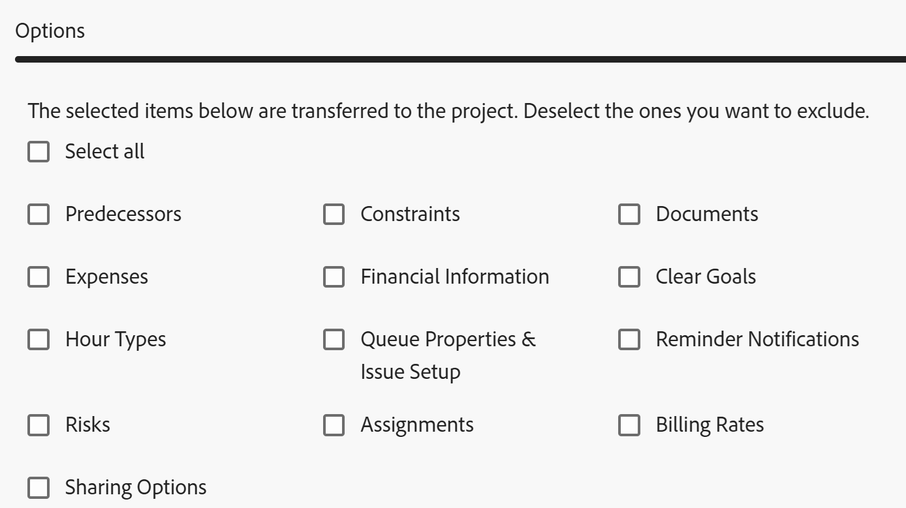

# Speichern eines Projekts als Vorlage

<!--Audited: 6/2025-->

<!--

(NOTE: Keep this the way it is in the Managing Projects area because the functionality in the UI is "Save as template" at the project level, so users see that in the UI; there is another article that this links to which is more in depth (step-by-step). This functionality needs to stay in both projects AND templates areas.)

-->

<!--

The highlighted information on this page refers to functionality not yet generally available. It is available only in the Preview environment for all customers. The same features will also be available in the Production environment for all customers after a week from the Preview release.     

For more information, see [Interface modernization](/help/quicksilver/product-announcements/product-releases/interface-modernization/interface-modernization.md). 

-->

Wenn Sie festlegen, dass ein Projekt zu einem späteren Zeitpunkt wieder ausgeführt werden soll, können Sie aus diesem vorhandenen Projekt eine Vorlage erstellen. Anschließend können Sie die Vorlage erneut verwenden, um zukünftige Projekte zu erstellen, die ähnliche Informationen enthalten oder möglicherweise dieselbe Zeitleiste oder dieselben Zuweisungen für das vorhandene Projekt verwenden.

## Zugriffsanforderungen

+++ Erweitern, um die Zugriffsanforderungen für die in diesem Artikel beschriebene Funktionalität anzuzeigen. 

<table style="table-layout:auto"> 
 <col> 
 <col> 
 <tbody> 
  <tr> 
   <td role="rowheader">Adobe Workfront-Paket</td> 
   <td> 
Beliebig
 </td> 
  </tr> 
  <tr> 
   <td role="rowheader">Adobe Workfront-Lizenz</td> 
   <td> 
Standard

   
Plan
 
   </td> 
  </tr> 
  <tr> 
   <td role="rowheader">Konfigurationen der Zugriffsebene</td> 
   <td> 
Zugriff auf Vorlagen bearbeiten
 /td&gt; 
  </tr> 
  <tr> 
   <td role="rowheader">Objektberechtigungen</td> 
   <td> 
Anzeigen oder Erweitern von Berechtigungen für ein Projekt 
 
Sie erhalten Verwaltungsberechtigungen für die Vorlage, nachdem Sie das Projekt als Vorlage gespeichert haben
 </td> 
  </tr> 
 </tbody> 
</table>

Weitere Informationen finden Sie unter [Zugriffsanforderungen in der Dokumentation zu Workfront](/help/quicksilver/administration-and-setup/add-users/access-levels-and-object-permissions/access-level-requirements-in-documentation.md).

+++

<!--Old:

<table style="table-layout:auto"> 
 <col> 
 <col> 
 <tbody> 
  <tr> 
   <td role="rowheader">Adobe Workfront plan</td> 
   <td> 
Any 
 </td> 
  </tr> 
  <tr> 
   <td role="rowheader">Adobe Workfront license*</td> 
   <td> 
New: Standard 

   Or 
   
Current: Plan 
 
   </td> 
  </tr> 
  <tr> 
   <td role="rowheader">Access level configurations</td> 
   <td> 
Edit access to Templates
 /td> 
  </tr> 
  <tr> 
   <td role="rowheader">Object permissions</td> 
   <td> 
View or higher permissions to a project 
 
You obtain Manage permissions to the template after you save the project as a template
 </td> 
  </tr> 
 </tbody> 
</table>-->

## Speichern eines Projekts als Vorlage

<!--
Saving a project as a template differs in the Production and the Preview environments. 

### Save a project as a template in the Production environment

1. Go to the project that you want to save as a template. 
1. Click the **More** menu , then **Save as Template**. 
1. Specify the following information for the template:

   <table style="table-layout:auto"> 
    <col> 
    <col> 
    <tbody> 
     <tr> 
      <td role="rowheader">Name</td> 
      <td>Specify a name for the template.</td> 
     </tr> 
     <tr> 
      <td role="rowheader">Description</td> 
      <td>Provide a description for the template.</td> 
     </tr> 
     <tr> 
      <td role="rowheader">Is Active</td> 
      <td> 
Select from the following options:
 
       <ul> 
        <li> 
<strong>Yes</strong>: Other users can find the template and attach it to projects.
 </li> 
        <li><strong>No</strong>: Other users cannot find the template and cannot attach it to projects.</li> 
       </ul> </td> 
     </tr> 
     <tr> 
      <td role="rowheader">Custom Forms</td> 
      <td>Use the drop-down list to select any custom forms to attach to the template. If any custom forms have already been associated with the project, all of the data fields from those custom forms are displayed. You can include up to 10 custom forms on a single template.</td> 
     </tr> 
    </tbody> 
   </table>

1. Click **Manage Forms** to remove or reorder the forms. For information about how to remove and reorder custom forms on the template, see [Custom forms](../../../administration-and-setup/customize-workfront/create-manage-custom-forms/create-and-manage-custom-forms.md).

   

1. Click **Next Step.**
1. In the **Options** section, select the checkbox beside any information you want to clear from the template.

   

1. Click **Next Step.**
1. In the **Exclude** section, select any tasks that you want to exclude from the project.

   

1. Click **Finish and Save Template.**

   Your template now appears in the list of available templates and can either be attached to an existing project or used to create a new one.

### Save a project as a template in the Preview environment

-->

1. Wechseln Sie zu dem Projekt, das Sie als Vorlage speichern möchten.
1. Klicken Sie auf **Mehr** Menü  rechts neben dem Projektnamen in der Kopfzeile und dann **Als Vorlage speichern**.
1. Geben **im Abschnitt „Als Vorlage**&quot; die folgenden Informationen für die Vorlage an:

   <table style="table-layout:auto"> 
    <col> 
    <col> 
    <tbody> 
     <tr> 
      <td role="rowheader">Vorlagenname</td> 
      <td>Geben Sie einen Namen für die Vorlage an.</td> 
     </tr> 
     <tr> 
      <td role="rowheader">Beschreibung</td> 
      <td>Geben Sie eine Beschreibung für die Vorlage an.</td> 
     </tr> 
     <tr> 
      <td role="rowheader">Ist aktiv</td> 
      <td> 
Wählen Sie aus den folgenden Optionen aus:
 
       <ul> 
        <li> 
<strong>Ja</strong>: Andere Benutzer können die Vorlage finden und sie an Projekte anhängen.
 </li> 
        <li><strong>Nein</strong>: Andere Benutzer können die Vorlage nicht finden und sie nicht an Projekte anhängen.</li> 
       </ul> </td> 
     </tr> 
     <tr> 
      <td role="rowheader">Benutzerdefinierte Formulare</td> 
      <td>Verwenden Sie die Dropdown-Liste, um benutzerdefinierte Formulare auszuwählen, die an die Vorlage angehängt werden sollen. Wenn bereits benutzerdefinierte Formulare mit dem Projekt verknüpft wurden, werden alle Datenfelder aus diesen benutzerdefinierten Formularen angezeigt. Sie können bis zu 10 benutzerdefinierte Formulare in eine Vorlage aufnehmen.</td> 
     </tr> 
    </tbody> 
   </table>

1. Klicken Sie **linken Bereich auf** Benutzerdefinierte Forms&quot;, um die Formulare zu entfernen oder neu anzuordnen.

   Um die Formulare neu anzuordnen, ziehen Sie sie per Drag-and-Drop in die richtige Reihenfolge.
Um ein Formular zu entfernen, wählen Sie es aus und klicken Sie auf **Entfernen**. Klicken Sie **Abbrechen**, um die ausgewählten Formulare zu entfernen.

   

1. Aktualisieren Sie bei Bedarf die Informationen in den angehängten benutzerdefinierten Formularen. Die Informationen werden auf die Vorlage übertragen.

1. Klicken Sie **linken** auf „Optionen“ und aktivieren Sie dann das Kontrollkästchen neben den Informationen, die Sie auf die Vorlage übertragen möchten. Nicht ausgewählte Elemente werden nicht in die Vorlage übertragen. Standardmäßig sind alle Optionen deaktiviert.

   

1. Klicken Sie **linken** auf „Ausschließen“ und wählen Sie dann alle Aufgaben aus, die Sie aus dem Projekt ausschließen möchten. Standardmäßig sind alle Aufgaben deaktiviert.

   

1. Klicken **oben rechts** Bildschirm auf „Beenden und Vorlage speichern“.

   Ihre Vorlage wird jetzt in der Liste der verfügbaren Vorlagen angezeigt und kann entweder an ein vorhandenes Projekt angehängt oder zum Erstellen eines neuen verwendet werden.

