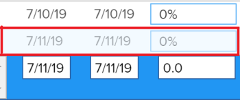

# Auswählen des Aktualisierungstyps eines Projekts

Durch Auswahl eines Aktualisierungstyps für ein Projekt können Sie steuern, wie oft die Änderungen, die Sie an der Zeitleiste des Projekts vornehmen, in den übergeordneten Aufgaben oder im Projekt gespeichert werden.

Wenn die Zeitleiste des Projekts aktualisiert wird, wird sie auf der Grundlage der am Projekt vorgenommenen Änderungen, der zugehörigen Aufgaben oder der Änderungen an einem anderen Projekt, von dem die Zeitleiste abhängig ist, neu berechnet.

Beispielsweise wird durch die folgenden Änderungen an den Aufgaben im Projekt-Trigger die Zeitleiste des Projekts aktualisiert:

* Aktualisieren der Daten von Aufgaben
* Vorgängerbeziehungen von Aufgaben ändern
* Ändern Sie die hierarchischen Beziehungen, indem Sie zusätzlich zur Änderung der Aufgabenbeschränkung oder des Dauertyps Zuweisungen hinzufügen oder entfernen.

## Zugriffsanforderungen

+++ Erweitern, um die Zugriffsanforderungen für die in diesem Artikel beschriebene Funktionalität anzuzeigen. 

<table style="table-layout:auto"> 
 <col> 
 <col> 
 <tbody> 
  <tr> 
   <td role="rowheader">Adobe Workfront-Paket</td> 
   <td> 
Beliebig
 </td> 
  </tr> 
  <tr> 
   <td role="rowheader">Adobe Workfront-Lizenz</td> 
   <td>
Standard
 
   
Abo
 </td> 
  </tr> 
  <tr> 
   <td role="rowheader">Konfigurationen der Zugriffsebene</td> 
   <td> 
Zugriff auf Projekte bearbeiten
 </td> 
  </tr> 
  <tr> 
   <td role="rowheader">Objektberechtigungen</td> 
   <td> 
Verwalten von Berechtigungen für ein Projekt
 </td> 
  </tr> 
 </tbody> 
</table>

Weitere Informationen finden Sie unter [Zugriffsanforderungen in der Dokumentation zu Workfront](/help/quicksilver/administration-and-setup/add-users/access-levels-and-object-permissions/access-level-requirements-in-documentation.md).

+++

## Aktualisieren des Aktualisierungstyps eines Projekts

Wenn die Aufgaben aktualisiert werden, werden ihre übergeordneten Objekte (übergeordnete Aufgaben oder das Projekt) zu dem Zeitpunkt aktualisiert, der durch den Aktualisierungstyp angegeben wird.  So geben Sie einen Aktualisierungstyp für Ihr Projekt an:

1. Wechseln Sie zu dem Projekt, dessen Aktualisierungstyp Sie angeben möchten.
1. Klicken Sie auf das Menü  neben dem Namen des Projekts und dann auf **Bearbeiten** .

1. Klicken Sie auf **Projekt** **Einstellungen**.

   

1. Wählen Sie im Feld **Aktualisierungstyp** aus, ob Workfront die Zeitleiste des Projekts automatisch täglich berechnen soll, bei einer Änderung oder ob der Projektmanager sie manuell berechnen soll.

   Wählen Sie aus den Optionen in der folgenden Liste aus.

   >[!IMPORTANT]
   >
   >Wenn der Zeitplan eines Projekts länger als 15 Jahre ist, berechnet Workfront den Zeitplan nicht automatisch oder bei einer Änderung. Der Aktualisierungstyp eines Projekts, das länger als 15 Jahre dauert, ist immer „Manuell“.

   * **Automatisch und Bei Änderung** Dies ist die Standardeinstellung. Die Zeitleiste des Projekts wird jedes Mal aktualisiert, wenn eine Änderung im Projekt oder in einem anderen Projekt auftritt, von dem die Zeitleiste abhängig ist. Die Zeitleiste des Projekts wird ebenfalls jede Nacht aktualisiert.\
     Dies ist die empfohlene Einstellung, da sie sicherstellt, dass die Zeitleiste des Projekts immer auf dem neuesten Stand ist.

     Wenn Sie eine Aufgabe oder das Projekt aktualisieren und eine Neuberechnung der Zeitleiste durchführen, werden alle verfügbaren Daten sofort angezeigt, sodass Sie weiterarbeiten können. Bei Projekten mit mehr als 100 Aufgaben werden Datumsangaben, für die längere Berechnungen erforderlich sind, abgeblendet.

     

     Dies bedeutet, dass die Neuberechnung noch nicht abgeschlossen ist und sich die Daten ändern können.

   * **Nur Änderung** Die Zeitleiste des Projekts wird jedes Mal aktualisiert, wenn eine Änderung im Projekt oder in einem anderen Projekt erfolgt, von dem die Zeitleiste abhängig ist. Geplante Aktualisierungen werden nicht durchgeführt.\
     Sie sollten diese Option auswählen, wenn Sie sich Sorgen über die Systemleistung machen und wenn Änderungen selten im Projekt oder in anderen Projekten auftreten, von denen die Zeitleiste abhängig ist.

   * **Nur automatisch** Die Zeitleiste des Projekts wird jede Nacht aktualisiert. Sie wird nicht sofort nach den Änderungen aktualisiert.\
     Sie sollten diese Option auswählen, wenn Sie sich Sorgen über die Systemleistung machen und wenn im Projekt oder in anderen Projekten, von denen die Timeline abhängig ist, täglich viele Änderungen auftreten.

     >[!NOTE]
     >
     >Ein Projekt wird nicht jede Nacht automatisch neu berechnet, wenn es sich im Status „Planung“ befindet. Er wird nur bei Änderung neu berechnet.

   * **Nur manuell:** Die Projekt-Zeitleiste wird nur aktualisiert, wenn Sie die Option **Zeitleisten neu berechnen** auswählen, wie im Abschnitt „Manuelle Neuberechnung“ im Artikel [Neuberechnen von Projekt-Zeitleisten](../../../manage-work/projects/manage-projects/recalculate-project-timeline.md) beschrieben.\
     Sie können diese Option auswählen, wenn Sie mehrere Änderungen am Projekt gleichzeitig vornehmen und die Neuberechnung der Zeitleiste nach allen Änderungen (und nicht nach jeder einzelnen Änderung) durchgeführt werden soll.

1. Klicken Sie auf **Speichern**.
