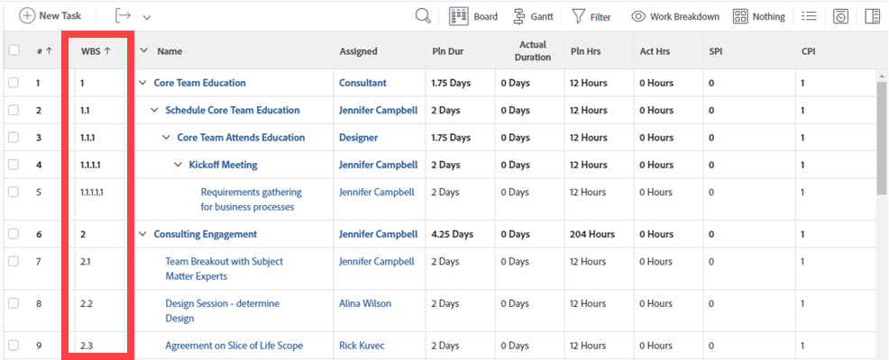

# Bestimmen der Arbeitsaufschlüsselungsstruktur in einem Projekt

Die Definition einer Arbeitsaufschlüsselungsstruktur (Work Breakdown Structure, WBS) für ein Projekt ist ein Satz von Aktivitäten, die letztendlich den Projektplan skizzieren. Die WBS teilt das Ergebnis des Projekts in überschaubare Arbeitselemente auf, die zur Definition von Meilensteinen und zur Organisation von Arbeitsaufgaben verwendet werden können.

Sie müssen über eine Planungslizenz mit Zugriff auf Projekte bearbeiten verfügen, um die Arbeitsaufschlüsselungsstruktur eines Projekts zu erstellen. Je nachdem, wie viele Aktivitäten Sie beim Erstellen der WBS durchführen, kann zusätzlicher Zugriff auf andere Bereiche von Adobe Workfront erforderlich sein.

Es wird empfohlen, das Projekt im Planungsstatus zu belassen, während Sie Änderungen an der Arbeitsaufschlüsselungsstruktur vornehmen, um Benachrichtigungen an Trigger im Projektteam zu vermeiden.

## Definieren der Projektziele

Ziel eines Projekts ist es, den internen und externen Akteuren greifbare Ergebnisse zu liefern. Die Ergebnisse eines Projekts sind die Ergebnisse, die Sie durch Fertigstellen des Projekts erzielen möchten. Ergebnisse werden fast immer mit mindestens einem lieferbaren Ergebnis verknüpft und alle Ergebnisse sollten mit einem Projekt verknüpft werden.

Projektergebnisse können Verbrauchsgüter, geistiges Ergebnis (z. B. Berichte) oder Dienstleistungen sein. Wenn Ihr Projektumfang beispielsweise darin besteht, ein Haus zu erstellen, können einige der Lieferziele Folgendes umfassen:

* Erstellen von Architekturplänen
* Abschließen des Klempners
* Elektroarbeiten
* die Stiftung zu stärken
* Rahmenarbeit
* Schließung des Verkaufs des Hauses.

Je nach Größe und Umfang kann ein Projekt aus mehreren Lieferzielen bestehen.

Sobald Sie Ihre Sendungen identifiziert haben, können Sie damit beginnen, sie in Aufgaben zu unterteilen. Aufgaben sind die Ergebnisse, die Sie erzielen, um Ihr Gesamtergebnis für das Projekt bereitzustellen. Bei der Definition Ihrer Aufgaben berücksichtigen Sie die folgenden Parameter:

* Dauer der Fertigstellung.
* Für den Abschluss der Arbeit benötigtes Budget.
* Erforderliche Ressourcen, um die Arbeit abzuschließen.
* Planung der Ressourcen basierend auf der logischen Zeitleiste der Aufgaben.

Stellen Sie bei der Definition von Aufgaben sicher, dass Sie nicht zu viel Arbeit für eine einzelne Aufgabe planen. Wenn die für eine Aufgabe benötigte Arbeit mehr als 40 Stunden beträgt (eine typische Woche der Arbeit), müssen Sie diese Arbeitszeit möglicherweise in Unteraufgaben aufschlüsseln. Nach Abschluss aller Unteraufgaben wird die Hauptaufgabe abgeschlossen.

Um WBS-Ergebnisse und -Lieferziele in Workfront zu definieren, empfehlen wir die folgenden Aktivitäten, um eine hierarchische Ansicht der Projektaufgaben zu erstellen:

* Erstellen Sie ein neues Projekt, falls noch nicht geschehen.\
  Informationen zum Erstellen eines Projekts finden Sie im Artikel [Projekt erstellen](../../../manage-work/projects/create-projects/create-project.md).

* Erstellen Sie Aufgaben für alle Aktionselemente, die zum Abschließen jedes Ergebnisses und jeder Bereitstellung erforderlich sind.\
  Informationen zum Erstellen von Aufgaben finden Sie im Artikel [Erstellen von Aufgaben in einem Projekt](../../../manage-work/tasks/create-tasks/create-tasks-in-project.md) .

* Ermitteln Sie aus den soeben erstellten Aufgaben, welche der wichtigsten Ergebnisse sind, und ordnen Sie sie Meilensteinen zu.\
  Informationen zum Erstellen von Meilensteinaufgaben finden Sie in den Artikeln [Meilensteinpfad erstellen](../../../administration-and-setup/customize-workfront/configure-approval-milestone-processes/create-milestone-path.md) und [Verknüpfen von Meilensteinen mit Aufgaben](../../../manage-work/tasks/manage-tasks/associate-milestones-with-tasks.md).

* Schlüsseln Sie die Aufgaben mit einem zu großen Bereich in Unteraufgaben auf. Ordnen Sie sie dem übergeordneten Element zu, das Ihr Deliverable definiert.\
  Informationen zum Erstellen von Unteraufgaben finden Sie im Artikel [Erstellen von Unteraufgaben](../../../manage-work/tasks/create-tasks/create-subtasks.md).

* Identifizieren Sie Abhängigkeitsbeziehungen zwischen Unteraufgaben und zwischen Meilensteinen.\
  In einer Abhängigkeitsbeziehung hängt der Beginn einer Aufgabe vom Abschluss einer anderen Aufgabe oder einer anderen Gruppe von Aufgaben ab.\
  Weitere Informationen zu Aufgabenabhängigkeiten finden Sie in den Artikeln [Übersicht über die Vorgänger von Aufgaben](../../../manage-work/tasks/use-prdcssrs/predecessors-overview.md) und [Erstellen einer Vorgängerbeziehung auf der Aufgabenliste](../../../manage-work/tasks/use-prdcssrs/create-predecessors-on-task-list.md).

* Bestimmen Sie, ob zu einem beliebigen Zeitpunkt der Projektlebensdauer Genehmigungen und Überprüfungen erforderlich sind. Erstellen Sie Validierungsprozesse, um diese Anforderungen zu erfüllen.\
  Weitere Informationen zu Genehmigungen finden Sie im Artikel [Erstellen eines Genehmigungsprozesses für Arbeitselemente](../../../administration-and-setup/customize-workfront/configure-approval-milestone-processes/create-approval-processes.md).

## Schätzen des Arbeitsplanes und der Zeitplaneinschränkungen

Nachdem Sie den grundlegenden Meilenstein und die Aufgabenstruktur des Projekts erstellt haben, können Sie die Zeit schätzen, die zum Abschließen des gesamten Projekts benötigt wird, indem Sie Aufgabenbegrenzungen und -dauern definieren.

Beachten Sie Folgendes:

* Aufgabenbegrenzungen definieren, wann die Arbeit an einer Aufgabe beginnen oder enden muss.

  Informationen zum Definieren von Aufgabenbegrenzungen finden Sie im Artikel [Übersicht über Aufgabenbegrenzungen](../../../manage-work/tasks/task-constraints/task-constraint-overview.md).

* Die Dauer einer Aufgabe ist der Zeitrahmen, der zum Abschließen einer Aufgabe verfügbar ist. Bei der Schätzung der Dauer können Sie einen Wert eingeben, der die Möglichkeit einer Verzögerung berücksichtigt. Wenn ähnliche Projekte in der Vergangenheit abgeschlossen wurden, ist es möglicherweise sinnvoll, diesen Wert festzulegen.

  Da die Dauer eine Schätzung ist, sollten Sie sicherstellen, optimistische Zeitwerte festzulegen, um Faktoren zu berücksichtigen, die die Aufgabe beeinflussen könnten, wie Wetter, Stromausfälle, Lieferantenschwierigkeiten oder andere unvorhergesehene Ereignisse. Stellen Sie außerdem sicher, dass Sie überlegen, ob es zugehörige Vorgänger- oder Abhängigkeitsaufgaben gibt und wie diese Einschränkungen bei der Arbeit platzieren und die Aufgabenfertigstellung beeinflussen können.

  Je nach Dauer der Aufgabe können Sie die Dauer einer Aufgabe während der Lebensdauer eines Projekts ändern. Dies wirkt sich jedoch auch auf die Zeitleiste des Projekts aus. Informationen zur Dauer einer Aufgabe finden Sie im Artikel [Übersicht über Aufgabendauer und -dauer](../../../manage-work/tasks/taskdurtn/task-duration-and-duration-type.md) .

## Aufgaben zuweisen

Nachdem Sie die Dauer und die Begrenzungen jeder Aufgabe definiert haben, können Sie bestimmen, wer über die Zeit und die Fertigkeiten verfügt, um die Arbeit durchzuführen. Sie können den folgenden Entitäten in Workfront Aufgaben zuweisen:

* Benutzende\
  Aufgaben können nur Benutzern mit der Zugriffsebene Planer oder Worker zugewiesen werden. Sie können zwar Anforderungen und Validierern Aufgaben zuweisen, diese jedoch nicht abschließen. Aus diesem Grund wird empfohlen, ihnen keine Aufgaben zuzuweisen.

  Informationen zu den Zugriffsebenen und dazu, wie sie definieren, was Benutzer mit Workfront-Objekten tun können, finden Sie unter [Übersicht über Zugriffsebenen](../../../administration-and-setup/add-users/access-levels-and-object-permissions/access-levels-overview.md).

* Aufgabengebiete
* Teams

Informationen zum Zuweisen von Aufgaben finden Sie in den Artikeln im [Aufgaben zuweisen](../../../manage-work/tasks/assign-tasks/assign-tasks-1.md) Abschnitt.

## Ressourcen verwalten

Mit der Ressourcenverwaltung in Workfront können Sie feststellen, ob ausreichend Mitarbeiter für die Durchführung des Projekts zur Verfügung stehen. Wenn Benutzer zu einem Projekt hinzugefügt werden, zeigt Workfront die Nutzung der einzelnen Benutzer an. Ressourcen-Manager können sehen, wie viele Stunden die Person während des Zeitraums des Projekts anderen Projekten zugewiesen ist.

>[!NOTE]
>
>Solange das Projekt den Status Planung hat, werden den Benutzern zugewiesene Aufgaben nicht in den Aufgabenlisten angezeigt.

Zu Beginn eines Geschäftsjahres oder -quartals möchten Sie Ihre Ressourcen möglicherweise auf einer höheren Ebene über mehrere Projekte hinweg verwalten, ohne dass Sie über eine spezifische Aufschlüsselungsstruktur für Ihre Arbeit verfügen.\
Informationen zur Planung der Nutzung Ihrer Ressourcen auf höherer Ebene finden Sie im Artikel [Erste Schritte mit der Ressourcenplanung](../../../resource-mgmt/resource-planning/get-started-resource-planning.md).

Wenn Sie Ihre Ressourcen im Zusammenhang mit dem Erstellen der Arbeitsaufschlüsselungsstruktur eines Projekts verwalten und sicherstellen, dass jede Aufgabe der richtigen Ressource zugewiesen ist, können Sie Ihre Ressourcen für die zu erledigende Arbeit planen.\
Informationen zur Planung Ihrer Ressourcen finden Sie in den Artikeln im Abschnitt [Der Lastenausgleich: Artikelindex](../../../resource-mgmt/workload-balancer/workload-balancer.md) Abschnitt.

## Geschätzte Projektfinanzen

Workfront berechnet die für jede Aufgabe geplanten Kosten und die Gesamtkosten eines Projekts. Die für eine Aufgabe geplanten Kosten umfassen alle Ausgaben der Aufgabe zuzüglich der Kosten des mit der Aufgabe betrauten Mitarbeiters bzw. der zugewiesenen Rolle. Die Stundensätze für die Aufgabe, die Rolle und den Mitarbeiter werden während der Aufgabe, Rolle und Benutzererstellung zugewiesen.

Weitere Informationen zu den Projektfinanzen finden Sie im Abschnitt . [Projektfinanzen: Artikelindex](../../../manage-work/projects/project-finances/project-finances-overview.md).

## Festlegen von Genehmigungspunkten für das Projekt

Durch die Erstellung von Genehmigungsprozessen in Workfront können Sie Überprüfungspunkte für das Projekt einrichten, um den Fortschritt und potenzielle Problembereiche zu überwachen. Über den Genehmigungsprozess können Projekteigentümer erkennen, welche Aufgaben zu spät und zu früh ausgeführt werden, Audit-Protokolle einsehen, in denen aufgeführt ist, wer den Aufgabenstatus geändert hat, und Verläufe zu Problemen anzeigen, einschließlich der Art und Weise, wie Probleme gelöst wurden und wann sie geschlossen wurden. Nach der Überprüfung eines Projekts können Projekteigentümer bestimmen, welche Schritte unternommen und den Projektplan bei Bedarf aktualisiert werden sollen.

Weitere Informationen zu Genehmigungen finden Sie im Artikel [Erstellen eines Genehmigungsprozesses für Arbeitselemente](../../../administration-and-setup/customize-workfront/configure-approval-milestone-processes/create-approval-processes.md)

## Anzeigen Ihrer WBS

Um die WBS eines Projekts zu verstehen, möchten Sie die folgenden Aufgabenelemente anzeigen:

* Aufgabensequenz und Timeline (geplante Start- und Abschlussdaten und Aufgabendauer)
* Vorgängerabhängigkeiten
* Untergeordnete und übergeordnete Beziehung
* Arbeitsaufträge

Nachdem Sie Ihre WBS abgeschlossen haben, können Sie sie in einer Aufgabenliste auf Projektebene oder in einem Bericht anzeigen.

* [Anzeigen von WBS in einer Aufgabenliste](#view-the-wbs-in-a-task-list)
* [Anzeigen von WBS in einem Aufgabenbericht](#view-the-wbs-in-a-task-report)

### Anzeigen von WBS in einer Aufgabenliste {#view-the-wbs-in-a-task-list}

Sie können die Aufgabenliste auf Projektebene anzeigen.

1. Wechseln Sie zu dem Projekt, für das Sie die Arbeitsaufschlüsselungsstruktur anzeigen möchten.
1. Wählen Sie die **Aufgaben** Registerkarte.
1. (Optional) Wählen Sie **Nichts** im **Gruppierung** Dropdown-Menü.

   Die Arbeitsaufschlüsselungsstruktur zeigt den Einzug der Aufgaben in die WBS nicht an.

1. Aus dem **Ansicht** und wählen Sie die **Arbeitsteilung** anzeigen.

   Die Struktur der Arbeitsaufschlüsselung wird in der zweiten Spalte der ausgewählten Ansicht angezeigt.

   

### Anzeigen von WBS in einem Aufgabenbericht {#view-the-wbs-in-a-task-report}

Sie können einen Aufgabenbericht erstellen und die WBS der Aufgaben anzeigen, indem Sie einen der folgenden Schritte ausführen:

* Wenden Sie die Ansicht &quot;Arbeitsaufschlüsselungsstruktur&quot;auf den Bericht an.
* Fügen Sie die Spalte Arbeitsaufschlüsselungsstruktur zu einem benutzerspezifischen Bericht hinzu.

>[!TIP]
>
>Es wird empfohlen, eine Projektgruppierung hinzuzufügen, um Klarheit darüber zu schaffen, zu welchen Projekten die Aufgaben gehören. Der Einzug der Aufgaben wird in einem Aufgabenbericht nicht angezeigt.

Informationen zum Erstellen von Berichten finden Sie im Artikel [Benutzerdefinierten Bericht erstellen](../../../reports-and-dashboards/reports/creating-and-managing-reports/create-custom-report.md).

## Speichern der WBS eines Projekts als Vorlage

Wenn Sie an anderen Projekten arbeiten, die Arbeitszeitplänen ähnlich dem soeben erstellten WBS folgen, können Sie das Projekt als Vorlage speichern. Eine Vorlage spart Zeit und Mühe bei der Erstellung zukünftiger Projekte.

Wenn Ihr Unternehmen wenig Umsatz erzielt, sollten Sie warten, bis nach der Benutzerzuweisung die Vorlage gespeichert wird. Unabhängig davon, wann ein Projekt als Vorlage gespeichert wird, können Benutzerzuweisungen oder bestimmte Aufgaben beim Anhängen der Vorlage an ein neues Projekt entfernt werden.

Die folgenden Elemente einer Arbeitsaufschlüsselungsstruktur können in einer Vorlage gespeichert werden, um sie in Zukunft mit einem anderen Projekt zu verwenden:

* Vorgängerabhängigkeiten
* Zuweisungen (einschließlich Projektinhaber, Sponsor und Ressourcen-Manager)
* Genehmigungsprozesse
* Aufgabenbegrenzungen
* Dokumente
* Ausgaben und sonstige Finanzinformationen
* Ziele
* Stundentypen
* Struktur der Anforderungswarteschlange
* Erinnerungsnachrichten
* Risiken
* Abrechnungssätze
* Freigeben von Informationen
* Benutzerdefinierte Formulare

Informationen zum Speichern von Projekten als Vorlagen finden Sie im Artikel [Vorlage aus Projekt erstellen](../../../manage-work/projects/create-and-manage-templates/create-template-from-project.md) .
