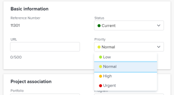

# Projektprioritäten verstehen und aktualisieren

Es gibt mehrere Möglichkeiten, Prioritäten für Projekte zu verwenden, und sie kommunizieren nicht miteinander. Es wird empfohlen, eine der Prioritäten für Projekte auszuwählen, die Ihren Anforderungen entsprechen, und bei der Kategorisierung der Bedeutung Ihrer Projekte darauf hinzuweisen. 

## Zugriffsanforderungen

<!--drafted for P&P:

<table style="table-layout:auto"> 
 <col> 
 <col> 
 <tbody> 
  <tr> 
   <td role="rowheader">Adobe Workfront plan*</td> 
   <td> 
Any
 </td> 
  </tr> 
  <tr> 
   <td role="rowheader">Adobe Workfront license*</td> 
   <td> 
Current license: Standard 

   Or
   
Legacy license: Plan 
 </td> 
  </tr> 
  <tr> 
   <td role="rowheader">Access level configurations*</td> 
   <td> 
Edit access to Projects
 
<b>NOTE</b> 
   
   If you still don't have access, ask your Workfront administrator if they set additional restrictions in your access level. For information on how a Workfront administrator can modify your access level, see <a href="../../../administration-and-setup/add-users/configure-and-grant-access/create-modify-access-levels.md" class="MCXref xref">Create or modify custom access levels</a>.
 </td> 
  </tr> 
  <tr> 
   <td role="rowheader">Object permissions</td> 
   <td> 
Manage permissions to the project
 
For information on requesting additional access, see <a href="../../../workfront-basics/grant-and-request-access-to-objects/request-access.md" class="MCXref xref">Request access to objects </a>.
 </td> 
  </tr> 
 </tbody> 
</table>
-->
Sie müssen über folgenden Zugriff verfügen, um die Schritte in diesem Artikel ausführen zu können:

<table style="table-layout:auto"> 
 <col> 
 <col> 
 <tbody> 
  <tr> 
   <td role="rowheader">Adobe Workfront-Plan*</td> 
   <td> 
Beliebig
 </td> 
  </tr> 
  <tr> 
   <td role="rowheader">Adobe Workfront-Lizenz*</td> 
   <td> 
Plan 
 </td> 
  </tr> 
  <tr> 
   <td role="rowheader">Konfigurationen auf Zugriffsebene*</td> 
   <td> 
Zugriff auf Projekte bearbeiten
 
<b>NOTIZ</b>

Wenn Sie immer noch keinen Zugriff haben, fragen Sie Ihren Workfront-Administrator, ob er zusätzliche Zugriffsbeschränkungen für Ihre Zugriffsebene festlegt. Informationen dazu, wie ein Workfront-Administrator Ihre Zugriffsebene ändern kann, finden Sie unter <a href="../../../administration-and-setup/add-users/configure-and-grant-access/create-modify-access-levels.md" class="MCXref xref">Benutzerdefinierte Zugriffsebenen erstellen oder ändern</a>.
 </td>
</tr> 
  <tr> 
   <td role="rowheader">Objektberechtigungen</td> 
   <td> 
Berechtigungen für das Projekt verwalten
 
Informationen zum Anfordern von zusätzlichem Zugriff finden Sie unter <a href="../../../workfront-basics/grant-and-request-access-to-objects/request-access.md" class="MCXref xref">Zugriff auf Objekte anfordern </a>.
 </td> 
  </tr> 
 </tbody> 
</table>

&#42;Wenden Sie sich an Ihren Workfront-Administrator, um zu erfahren, welchen Plan, welchen Lizenztyp oder welchen Zugriff Sie haben.

## Arten von Projektpriorität in Adobe Workfront

Im Folgenden finden Sie Prioritätstypen, mit denen Sie Projekte in Adobe Workfront nach Rang ordnen können:

* **Feld &quot;Projektpriorität&quot;**: Sie können einem Projekt manuell eine Priorität zuweisen.

   Weitere Informationen zum Feld &quot;Projektpriorität&quot;finden Sie im Abschnitt . [Überlegungen zur Projektpriorität](#considerations-about-project-priority) in diesem Artikel.

* **Die Priorität eines Projekts im Portfolio Optimizer**, wenn das Projekt mit einem Portfolio verknüpft ist: 

   Weitere Informationen zur Priorität eines Portfolios im Projektoptimierer finden Sie im Artikel [Priorisieren von Projekten in Portfolio Optimizer](../../../manage-work/portfolios/portfolio-optimizer/prioritize-projects-in-portfolio-optimizer.md).

* **Die Priorität eines Projekts im Ressourcenplaner**: Sie können Projekte im Ressourcenplaner manuell priorisieren, um anzugeben, welche Projekte zuerst Ressourcen erhalten sollen. 

   Weitere Informationen zur Priorisierung von Projekten im Ressourcen-Planer finden Sie im Abschnitt &quot;Project Planning Priority&quot;im Artikel [Navigationsübersicht über den Ressourcenplaner](../../../resource-mgmt/resource-planning/resource-planner-navigation.md).

## Überlegungen zur Projektpriorität {#considerations-about-project-priority}

Sie können Projekte in Workfront eine Priorität zuweisen. Aufgaben und Probleme haben auch Prioritäten. Wenn Sie eine Priorität für das Projekt angeben, wird jedem im System mitgeteilt, wie wichtig dieses Projekt ist.

Beachten Sie bei der Auswahl einer Priorität für Ihre Projekte Folgendes:

* Ihr Workfront-Administrator definiert die in Workfront verfügbaren Prioritäten. Nach ihrer Einrichtung stehen sie Ihnen zur Verfügung, um sie mit Projekten im Feld Priorität zu verbinden. 

   Weitere Informationen zum Erstellen von Prioritäten in Workfront finden Sie im Artikel [Erstellen und Anpassen von Prioritäten](../../../administration-and-setup/customize-workfront/creating-custom-status-and-priority-labels/create-customize-priorities.md).

* Wenn Sie das Feld &quot;Priorität&quot;eines Projekts aktualisieren, wird diese Priorität nicht an den Portfolio Optimizer oder den Ressourcen-Planer übertragen. 
* Der Prioritätswert eines Projekts wird hauptsächlich für Berichtszwecke verwendet.

   Sie können beispielsweise nach allen Projekten suchen, die den Prioritätswert &quot;Dringend&quot;haben, wenn Sie dieses Feld in einem Projektfilter verwenden. 

* Sie können die Projektpriorität in den folgenden Bereichen von Workfront aktualisieren:

   * Im **Projekt bearbeiten** Dialogfeld.
   * Im **Projektdetails** -Registerkarte eines Projekts.
   * In einer Projektliste oder einem Bericht.

## Aktualisieren des Felds &quot;Projektpriorität&quot;

1. Wechseln Sie zu dem Projekt, dessen Priorität Sie aktualisieren möchten.
1. Klicken **Projektdetails** im linken Bereich.
1. Klicken Sie auf **Bearbeiten** icon  in der oberen rechten Ecke des Bereichs Projektdetails klicken Sie auf **Übersicht**.

1. Im **Priorität** aus den folgenden Optionen auswählen:

   * Keine
   * Niedrig
   * Normal

      Dies ist die Standardpriorität.

   * Hoch
   * Dringend

   

1. Klicken **Änderungen speichern**.

   Sie müssen mit anderen Benutzern kommunizieren und verstehen, was jede Prioritätsstufe für das Projekt bedeutet.
