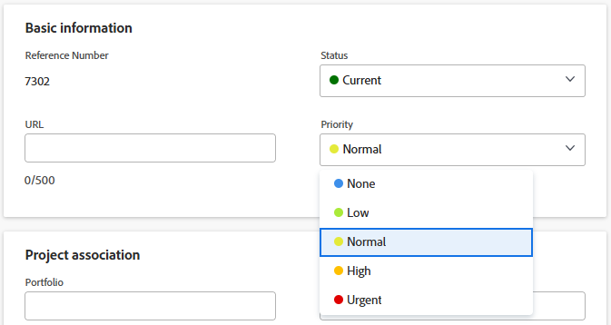

# Verstehen und Aktualisieren von Projektprioritäten

Es gibt mehrere Möglichkeiten, Prioritäten für Projekte zu verwenden, und sie kommunizieren nicht miteinander. Es wird empfohlen, eine Projektpriorität auszuwählen, die Ihren Anforderungen entspricht, und bei der Kategorisierung der Bedeutung Ihrer Projekte darauf zu verweisen.

## Zugriffsanforderungen

+++ Erweitern, um die Zugriffsanforderungen für die in diesem Artikel beschriebene Funktionalität anzuzeigen. 

<table style="table-layout:auto"> 
 <col> 
 <col> 
 <tbody> 
  <tr> 
   <td role="rowheader">Adobe Workfront-Paket</td> 
   <td> 
Beliebig
 </td> 
  </tr> 
  <tr> 
   <td role="rowheader">Adobe Workfront-Lizenz</td> 
   <td>
Standard
 
   
Abo
 </td> 
  </tr> 
  <tr> 
   <td role="rowheader">Konfigurationen der Zugriffsebene</td> 
   <td> 
Zugriff auf Projekte bearbeiten
 </td> 
  </tr> 
  <tr> 
   <td role="rowheader">Objektberechtigungen</td> 
   <td> 
Verwalten von Berechtigungen für das Projekt
 </td> 
  </tr> 
 </tbody> 
</table>

Weitere Informationen finden Sie unter [Zugriffsanforderungen in der Dokumentation zu Workfront](/help/quicksilver/administration-and-setup/add-users/access-levels-and-object-permissions/access-level-requirements-in-documentation.md).

+++

<!--
Old:

<table style="table-layout:auto"> 
 <col> 
 <col> 
 <tbody> 
  <tr> 
   <td role="rowheader">Adobe Workfront plan*</td> 
   <td> 
Any
 </td> 
  </tr> 
  <tr> 
   <td role="rowheader">Adobe Workfront license*</td> 
   <td> 
Plan 
 </td> 
  </tr> 
  <tr> 
   <td role="rowheader">Access level configurations*</td> 
   <td> 
Edit access to Projects
 
<b>NOTE</b> 
   
   If you still don't have access, ask your Workfront administrator if they set additional restrictions in your access level. For information on how a Workfront administrator can modify your access level, see <a href="../../../administration-and-setup/add-users/configure-and-grant-access/create-modify-access-levels.md" class="MCXref xref">Create or modify custom access levels</a>.
 </td> 
  </tr> 
  <tr> 
   <td role="rowheader">Object permissions</td> 
   <td> 
Manage permissions to the project
 
For information on requesting additional access, see <a href="../../../workfront-basics/grant-and-request-access-to-objects/request-access.md" class="MCXref xref">Request access to objects </a>.
 </td> 
  </tr> 
 </tbody> 
</table>
-->

## Typen von Projektpriorität in Adobe Workfront

Im Folgenden finden Sie Prioritätstypen, mit denen Sie Projekte in Adobe Workfront nach Rang ordnen können:

* **Das Feld Projektpriorität**: Sie können einem Projekt manuell eine Priorität zuweisen. In diesem Artikel wird beschrieben, wie Sie einem Projekt manuell eine Priorität zuweisen.

  Weitere Informationen finden Sie im Abschnitt [Überlegungen zur Projektpriorität](#considerations-about-project-priority) in diesem Artikel.

* **Die Priorität eines Projekts in Portfolio Optimizer**, wenn das Projekt mit einem Portfolio verknüpft ist:

  Weitere Informationen zur Priorität eines Projekts in Portfolio Optimizer finden Sie im Artikel [Priorisieren von Projekten in Portfolio Optimizer](../../../manage-work/portfolios/portfolio-optimizer/prioritize-projects-in-portfolio-optimizer.md).

* **Die Priorität eines Projekts im Ressourcenplaner**: Sie können Projekte im Ressourcenplaner manuell priorisieren, um anzugeben, welche Projekte zuerst Ressourcen erhalten sollen.

  Weitere Informationen zur Priorisierung von Projekten im Ressourcenplaner finden Sie im Abschnitt „Projektplanungspriorität“ im Artikel [Ressourcenplaner - Navigationsübersicht](../../../resource-mgmt/resource-planning/resource-planner-navigation.md).

## Überlegungen zur Projektpriorität {#considerations-about-project-priority}

Sie können Projekten in Workfront eine Priorität zuordnen. Wenn eine Priorität für das Projekt angegeben wird, wird allen im System mitgeteilt, wie wichtig dieses Projekt ist.

Beachten Sie bei der Auswahl einer Priorität für Ihre Projekte Folgendes:

* Ihr Workfront-Administrator definiert die in Workfront verfügbaren Prioritäten. Nachdem sie eingerichtet wurden, können Sie sie mit Projekten im Feld Priorität verknüpfen.

  Weitere Informationen zum Erstellen von Prioritäten in Workfront finden Sie im Artikel [Erstellen und Anpassen von Prioritäten](../../../administration-and-setup/customize-workfront/creating-custom-status-and-priority-labels/create-customize-priorities.md).

* Wenn Sie das Feld Priorität eines Projekts aktualisieren, wird diese Priorität nicht an Portfolio Optimizer oder den Ressourcenplaner übertragen. Das Feld Priorität des Projekts ist lediglich eine manuelle Markierung, die Sie auf das Projekt setzen, um anderen Benutzern seine Bedeutung zu verdeutlichen.
* Der Prioritätswert eines Projekts wird hauptsächlich zu Berichtszwecken verwendet.

  Sie können beispielsweise nach allen Projekten suchen, die den Prioritätswert „Dringend“ aufweisen, wenn Sie dieses Feld in einem Projektfilter verwenden.
* Aufgaben und Probleme haben ebenfalls Prioritäten, aber die Aufgaben-, Problem- und Projektprioritäten arbeiten unabhängig voneinander und beeinflussen sich nicht automatisch gegenseitig. Sie können in einem Projekt mit niedriger Priorität ein Problem mit hoher Priorität oder eine Aufgabe mit mittlerer Priorität haben.
* Sie können die Priorität von Projekten in den folgenden Bereichen von Workfront aktualisieren:

   * Im Dialogfeld **Projekt bearbeiten**.
   * Auf der **Projektdetails** Registerkarte eines Projekts.
   * In einer Projektliste oder einem Bericht.

## Aktualisieren des Feldes Projektpriorität

1. Wechseln Sie zu dem Projekt, dessen Priorität Sie aktualisieren möchten.
1. Klicken Sie **linken** auf „Projektdetails“.
1. Klicken Sie auf **Bearbeiten**-Symbol  in der oberen rechten Ecke des Bereichs Projektdetails und dann auf **Übersicht**.

1. Wählen **im Feld** eine der folgenden Optionen aus:

   * Keine
   * Niedrig
   * Normal

     Dies ist die Standardpriorität.

   * Hoch
   * Dringend

   

1. Klicken Sie auf **Änderungen speichern**.

   Sie müssen mit anderen Benutzern kommunizieren und verstehen, was jede Prioritätsstufe für das Projekt bedeutet.
