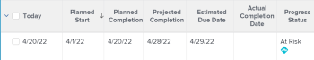

# Übersicht über den Projektstatus

<!--Audited: 12/2023-->

Adobe Workfront ermittelt den Fortschrittsstatus eines Projekts, indem es den Fortschritt des Projekts über seine Zeitleiste hinweg betrachtet. Sie können Workfront so konfigurieren, dass die Bedingung eines Projekts basierend auf dem Wert des Fortschrittsstatus der Aufgaben bestimmt wird. Weitere Informationen zum Konfigurieren der Bedingung des Projekts finden Sie im Artikel [Überblick über Projektbedingungen und Bedingungstyp](../../../manage-work/projects/manage-projects/project-condition-and-condition-type.md).

Im Folgenden werden die Fortschrittsstatus von Projekten in Workfront beschrieben:

<table style="table-layout:auto"> 
 <col> 
 <col> 
 <tbody> 
  <tr> 
   <td>Im Zeitplan</td> 
   <td> Der Fortschrittsstatus eines Projekts lautet <strong>Einschaltzeit</strong> , wenn:<ul><li>Wenn sowohl das prognostizierte als auch das geschätzte Abschlussdatum vor oder gleich dem geplanten Abschlussdatum des Projekts liegen</li></ul> 
  
 </td> 
  </tr> 
  <tr> 
   <td>Gefährdet</td> 
   <td> Der Fortschrittsstatus eines Projekts lautet <strong>Risiko</strong> , wenn <strong>alle</strong> der folgenden Werte zutreffen:<ul><li>Sowohl die geschätzten als auch die geplanten Abschlussdaten befinden sich in der Zukunft</li><li> Sowohl das geschätzte als auch das geplante Abschlussdatum liegen nach dem geplanten Abschlussdatum</li><li> Das geschätzte Abschlussdatum liegt nach dem geplanten Abschlussdatum</li></ul>
  
 </td> 
  </tr> 
  <tr> 
   <td>In Verzug</td> 
   <td> Der Fortschrittsstatus eines Projekts lautet <strong>Hinter</strong> , wenn <strong>alle</strong> der folgenden Werte wahr sind:<ul><li>Sowohl die geschätzten als auch die geplanten Abschlussdaten befinden sich in der Zukunft</li><li> Sowohl das geschätzte als auch das geplante Abschlussdatum liegen nach dem geplanten Abschlussdatum des Projekts</li><li> Das geschätzte Abschlussdatum liegt nicht später als das geplante Abschlussdatum</li></ul> 
  
 </td> 
  </tr> 
  <tr> 
   <td>In Verzug</td> 
   <td> 
     Der Fortschrittsstatus eines Projekts lautet <strong>Verspätet</strong> , wenn <strong>Entweder</strong> der folgenden Werte wahr sind:<ul><li>Das Projekt ist abgeschlossen und das tatsächliche Abschlussdatum liegt nach dem geplanten Abschlussdatum. 
  
 </li> 
     <li> 
Das Projekt ist nicht abgeschlossen und das geplante Abschlussdatum des Projekts liegt in der Vergangenheit. 
  
 </li> 
    </ul> </td> 
  </tr> 
 </tbody> 
</table>

Beachten Sie Folgendes:

* Das geplante Abschlussdatum des Projekts wird von der Aufgabe auf dem kritischen Pfad mit dem neuesten geplanten Abschlussdatum bestimmt.
* Das geschätzte Abschlussdatum des Projekts wird von der Aufgabe auf dem kritischen Pfad mit dem neuesten geschätzten Abschlussdatum bestimmt.

Weitere Informationen zum kritischen Pfad des Projekts finden Sie unter [Überblick über den kritischen Pfad des Projekts](../../../manage-work/tasks/manage-tasks/critical-path.md).

Informationen zu den geplanten Abschlussdaten finden Sie unter [Überblick über das geplante Abschlussdatum für Projekte, Aufgaben und Probleme](../../../manage-work/projects/planning-a-project/project-projected-completion-date.md).
