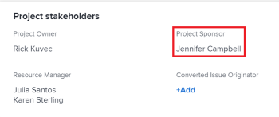

# Projektbesitzer und Sponsoren aktualisieren

<!--Audited: 07/2024-->

Wenn Sie ein Projekt in Adobe Workfront erstellen, werden Sie automatisch als Projektbesitzer des Projekts festgelegt. Sie können dieses Feld mit einem anderen Benutzer aktualisieren. Sie können auch das Feld Projektsponsor eines Projekts aktualisieren.

Informationen zu Projektbesitzern und Sponsoren finden Sie unter [Übersicht über Projektbesitzer und Sponsoren](../../../manage-work/projects/planning-a-project/project-owners-and-sponsors.md).

>[!TIP]
>
>Sie können einen Eigentümer und einen Sponsor für eine Vorlage identifizieren. Wenn Sie ein Projekt aus dieser Vorlage erstellen, wird der Vorlagenbesitzer zum Projektbesitzer und der Vorlagensponsor zum Projektsponsor.
>
>Wenn die Vorlage keinen Eigentümer hat, wird der Benutzer, der das Projekt aus der Vorlage erstellt, zum Projektbesitzer.
>
>Informationen zum Bearbeiten von Vorlagen finden Sie unter [Projektvorlagen bearbeiten](../../../manage-work/projects/create-and-manage-templates/edit-templates.md).

## Zugriffsanforderungen

<!--drafted for P&P:

<table style="table-layout:auto"> 
 <col> 
 <col> 
 <tbody> 
  <tr> 
   <td role="rowheader">Adobe Workfront plan*</td> 
   <td> 
Any
 
  
 </td> 
  </tr> 
  <tr> 
   <td role="rowheader">Adobe Workfront license*</td> 
   <td> 
Current license: Standard 
 
   Or
   
Legacy license: Plan 
 
   </td> 
  </tr> 
  <tr> 
   <td role="rowheader">Access level configurations*</td> 
   <td> 
Edit access to Projects
 
<b>NOTE</b>
   
   If you still don't have access, ask your Workfront administrator if they set additional restrictions in your access level. For information on how a Workfront administrator can modify your access level, see <a href="../../../administration-and-setup/add-users/configure-and-grant-access/create-modify-access-levels.md" class="MCXref xref">Create or modify custom access levels</a>.
 </td> 
  </tr> 
  <tr> 
   <td role="rowheader">Object permissions</td> 
   <td> 
Edit permissions to a project
 
For information on requesting additional access, see <a href="../../../workfront-basics/grant-and-request-access-to-objects/request-access.md" class="MCXref xref">Request access to objects </a>.
 </td> 
  </tr> 
 </tbody> 
</table>
-->

+++ Erweitern Sie , um die Zugriffsanforderungen für die -Funktion in diesem Artikel anzuzeigen.

<table style="table-layout:auto"> 
 <col> 
 <col> 
 <tbody> 
  <tr> 
   <td role="rowheader">Adobe Workfront-Plan</td> 
   <td> 
Beliebig
 
  
 </td> 
  </tr> 
  <tr> 
   <td role="rowheader">Adobe Workfront-Lizenz*</td> 
   <td>
Neu: Standard
 
   
Aktuell: Plan 
 </td> 
  </tr> 
  <tr> 
   <td role="rowheader">Konfigurationen der Zugriffsebene*</td> 
   <td> 
Zugriff auf Projekte bearbeiten
 </td> 
  </tr> 
  <tr> 
   <td role="rowheader">Objektberechtigungen</td> 
   <td> 
Bearbeiten von Berechtigungen für ein Projekt
 </td> 
  </tr> 
 </tbody> 
</table>

*Weitere Informationen finden Sie unter [Zugriffsanforderungen in der Dokumentation zu Workfront](/help/quicksilver/administration-and-setup/add-users/access-levels-and-object-permissions/access-level-requirements-in-documentation.md).

+++

## Aktualisieren des Projektbesitzers eines Projekts

Wenn Sie einen Benutzer als Projektbesitzer eines Projekts hinzufügen, erteilt Workfront ihm automatisch die Berechtigungen zum Anzeigen des Projekts.

1. Wechseln Sie zu dem Projekt, das Sie aktualisieren möchten.
1. Klicken Sie **linken** auf „Projektdetails“.
1. Klicken Sie auf **Bearbeiten**-Symbol  in der oberen rechten Ecke des Bereichs Projektdetails und dann auf **Übersicht**.

1. Geben Sie den Namen eines Benutzers für das Feld **Projektbesitzer** an.

   Nur aktive Benutzer können als Projektbesitzer angegeben werden.

1. Klicken Sie **Änderungen speichern**.

   Der Projektbesitzer wird im Projekt-Header und im Bereich Projektdetails aktualisiert.

   

## Aktualisieren des Projektsponsors eines Projekts

Wenn Sie einen Benutzer als Projektsponsor eines Projekts hinzufügen, erteilt Workfront ihm automatisch die Berechtigungen zum Anzeigen des Projekts.

>[!TIP]
>
>Wenn der Benutzer, den Sie als Projektsponsor hinzufügen, Systemadministrator ist, wird er nicht zur Freigabeliste des Projekts hinzugefügt.

1. Wechseln Sie zu dem Projekt, das Sie aktualisieren möchten.
1. Klicken Sie **linken** auf „Projektdetails“.
1. Klicken Sie auf **Bearbeiten**-Symbol  in der oberen rechten Ecke des Bereichs Projektdetails und dann auf **Übersicht**.

1. Geben Sie den Namen eines Benutzers für das Feld **Projektsponsor** an.

   Nur aktive Benutzer können als Projektsponsoren angegeben werden.

1. Klicken Sie **Änderungen speichern**.

   Der Projektsponsor aktualisiert sich im Bereich Projektdetails .

   
