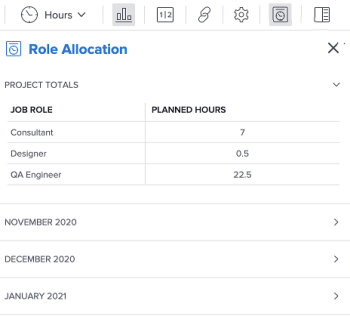

# Anzeigen geplanter Projektstunden im Panel „Zuordnung von Rollen“

Sie können die Rollenzuweisung für alle Aufgabengebiete anzeigen, die Arbeitselementen in einem Projekt zugewiesen sind, und zwar im Bedienfeld „Rollenzuweisung“ des Projekts.

>[!NOTE]
>
>Dieser Artikel bezieht sich auf die Anzeige der Aufgabengebiete, die mit Aufgaben und Problemen in einem Projekt verknüpft sind, und der ihnen zugewiesenen geplanten Stunden im Bedienfeld „Rollenzuweisung“ eines Projekts. Informationen zur Abstimmung der geplanten Stunden mit den Stunden für Initiativen mithilfe des Bedienfelds „Rollenzuweisung“ bei Verwendung des Adobe Workfront-Szenarioplaners finden Sie unter:
>
>* [Funktionszuordnung für Projekte und Initiativen in der Aufgabenliste anzeigen](../../../scenario-planner/show-role-allocation-task-list-nwe.md)
>* [Funktionszuordnung für Projekte und Initiativen im Workload-Balancer anzeigen](../../../scenario-planner/show-role-allocation-workload-balancer.md)
>
>  Sie müssen über eine Lizenz für Szenario-Planer verfügen, um Initiativstunden im Bedienfeld „Rollenzuweisung“ anzeigen zu können. Weitere Informationen zum Szenario-Planer finden Sie unter [Erste Schritte mit dem Szenario-Planer](../../../scenario-planner/get-started-with-scenario-planning.md).
>
>Wenn Ihr Unternehmen den Szenario-Planer von Adobe bereits in der Vergangenheit erworben hat, ist er im Besitz des Bestandsschutzes. Der Szenario-Planer kann nicht mehr erworben werden.

## Zugriffsanforderungen

+++ Erweitern, um die Zugriffsanforderungen für die in diesem Artikel beschriebene Funktionalität anzuzeigen. 

<table style="table-layout:auto"> 
 <col> 
 <col> 
 <tbody> 
  <tr> 
   <td role="rowheader">Adobe Workfront-Paket</td> 
   <td> 
Adobe Workfront Ultimate

   
Adobe Workflow Ultimate

    </td> 
  </tr> 
  <tr> 
   <td role="rowheader">Adobe Workfront-Lizenz</td> 
   <td> 
   
Licht oder höher

   
Überprüfen oder höher
 </td> 
  </tr> 
  <tr> 
   <td role="rowheader">Konfigurationen der Zugriffsebene</td> 
   <td> 
Zugriff auf Projekte anzeigen oder höher

   
Zugriff auf den Szenario-Planer bearbeiten, um Stunden zu Initiativen zu aktualisieren

   </td> 
  </tr> 
  <tr> 
   <td role="rowheader">Objektberechtigungen</td> 
   <td> 
Anzeigen von oder höheren Berechtigungen für das Projekt
 </td> 
  </tr> 
 </tbody> 
</table>

Weitere Informationen finden Sie unter [Zugriffsanforderungen](/help/quicksilver/administration-and-setup/add-users/access-levels-and-object-permissions/access-level-requirements-in-documentation.md) in der Dokumentation zu Workfront.

+++

<!--
Old:

able style="table-layout:auto"> 
 <col> 
 <col> 
 <tbody> 
  <tr> 
   <td role="rowheader">Adobe Workfront plan*</td> 
   <td> 
Any 
 </td> 
  </tr> 
  <tr> 
   <td role="rowheader">Adobe Workfront license*</td> 
   <td> 
Review or higher
 </td> 
  </tr> 
  <tr> 
   <td role="rowheader">Access level configurations*</td> 
   <td> 
View or higher access to Projects
 
If you still don't have access, ask your Workfront administrator if they set additional restrictions in your access level. For information on how a Workfront administrator can modify your access level, see <a href="../../../administration-and-setup/add-users/configure-and-grant-access/create-modify-access-levels.md" class="MCXref xref">Create or modify custom access levels</a>.
 </td> 
  </tr> 
  <tr> 
   <td role="rowheader">Object permissions</td> 
   <td> 
View or higher permissions on the project
 
For information on requesting additional access, see <a href="../../../workfront-basics/grant-and-request-access-to-objects/request-access.md" class="MCXref xref">Request access to objects </a>.
 </td> 
  </tr> 
 </tbody> 
</table>
-->

## Voraussetzungen

Sie müssen über Folgendes verfügen:

* Aufgaben oder Probleme, die Aufgabengebieten oder Benutzern zugewiesen wurden, die mit einem Aufgabengebiet verknüpft sind.

  >[!TIP]
  >
  >Wenn die Aufgaben oder Probleme nicht zugewiesen oder Teams bzw. Benutzern ohne Aufgabengebiet zugewiesen werden, sind die geplanten Stunden des Projekts im Bedienfeld „Rollenzuweisung“ auf null festgelegt.

* Aufgaben und Probleme mit einer Dauer größer als null.

## Anzeigen geplanter Projektstunden im Panel „Zuordnung von Rollen“

{{step1-to-projects}}

1. Klicken Sie auf den Namen eines Projekts, um darauf zuzugreifen. Dadurch wird die Projektseite geöffnet.
1. Klicken Sie im linken Bedienfeld auf eine der folgenden Optionen:

   * **Aufgaben**
   * **Workload Balancer**

1. Klicken Sie auf das Symbol **Rollenzuweisung anzeigen** .

   Das Bedienfeld „Rollenzuweisung“ wird angezeigt.

   

1. Überprüfen Sie die folgenden Informationen im Bedienfeld **Rollenzuweisung**:

   | Feld | Beschreibung |
   |---|---|
   | **Aufgabengebiet** | Aufgabengebiete, die den Aufgaben und Problemen im Projekt zugewiesen sind Dabei kann es sich um Aufgabengebiete handeln, die direkt Aufgaben und Problemen zugewiesen sind, oder um Aufgabengebiete, die Benutzern zugewiesen sind, die Aufgaben und Problemen im Projekt zugewiesen sind. |
   | **Geplante Stunden** | Die Gesamtzahl der geplanten Stunden aus Aufgaben und Problemen, die Aufgabengebieten oder Benutzern zugewiesen wurden, die mit einem Aufgabengebiet im Projekt verknüpft sind. |

