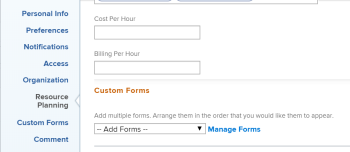
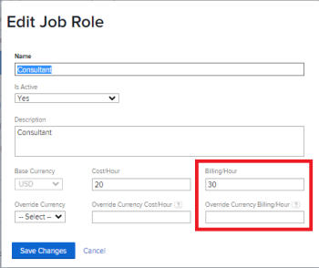

# Übersicht über Rechnungsstellung und Umsatz

{{highlighted-preview}}

Als Projektmanager können Sie die Abrechnungssätze verwenden, um den Umsatz Ihrer Projekte zu erfassen.

In diesem Artikel wird das Tracking von Umsätzen für Projekte beschrieben. Der Umsatz wird im Nutzungsbericht anders berechnet. Informationen zu Umsatzberechnungen im Nutzungsbericht finden Sie unter [Informationen zur Ressourcenauslastung anzeigen](../../../resource-mgmt/resource-utilization/view-utilization-information.md).

## Übersicht über die Abrechnungsraten

Beachten Sie beim Arbeiten mit Abrechnungsraten Folgendes:

* Sie benötigen eine Planungslizenz mit Zugriff auf Finanzdaten bearbeiten , um die Abrechnungsraten zu verwalten.\
  Weitere Informationen zur Gewährung des Zugriffs auf Finanzdaten finden Sie unter [Zugriff auf Finanzdaten gewähren](../../../administration-and-setup/add-users/configure-and-grant-access/grant-access-financial.md).

* Die Abrechnungsraten sind die Beträge des Umsatzes pro Arbeitseinheit, die mit den Rollen oder Benutzern in einem Beschäftigungsverhältnis stehen.

  Das Multiplizieren der Raten mit den Arbeitsstunden generiert Umsatz für Ihre Projekte.

* Nachdem Sie Ihre Abrechnungsraten ermittelt haben, können Sie den Umsatz nachverfolgen, indem Sie Abrechnungsdatensätze erstellen, um aufzuzeichnen, was abgerechnet wurde oder nicht.

  >[!TIP]
  >
  >Wenn Sie einen Abrechnungsdatensatz als &quot;Abgerechnet&quot;markieren, kann er nie bearbeitet werden. Dies ist wichtig, wenn Ihre Tarife variieren und Sie die Umsatz- und Ausgabedaten in Ihrem Projekt speichern möchten. Wenn Sie ihn zu einem Rechnungsdatensatz hinzufügen und ihn als &quot;Abgerechnet&quot;markieren, wird verhindert, dass er aktualisiert wird, wenn die Preise in Ihrem System aktualisiert werden.

  Weitere Informationen zum Erstellen von Rechnungsdatensätzen finden Sie im Artikel [Rechnungsdatensätze erstellen](../../../manage-work/projects/project-finances/create-billing-records.md).

* Sie können Abrechnungssätze für Benutzer und Rollen erstellen oder eine einmalige Abrechnungsrate für ein Projekt oder eine Aufgabe festlegen.

>[!IMPORTANT]
>
>Die Raten, mit denen der Umsatz berechnet wird, gehören dem Benutzer, der die Zeit protokolliert, oder seinen Rollen.

* [Benutzerabrechnungssätze](#user-billing-rates)
* [Abrechnungssätze für Auftragsrollen](#job-role-billing-rates)
* [Feste Abrechnungsraten für Projekte oder Aufgaben](#fixed-billing-rates-for-projects-or-tasks)
* [Rechnungssätze überschreiben](#override-billing-rates)

### Benutzerabrechnungssätze {#user-billing-rates}

Als Benutzeradministrator können Sie bei der Erstellung eines Benutzers diesen eine Abrechnungsrate zuweisen, indem Sie in seinem Profil einen Wert für das Feld &quot;Abrechnung pro Stunde&quot;angeben.

Weitere Informationen zum Erstellen von Benutzern finden Sie im Artikel [Benutzer hinzufügen](../../../administration-and-setup/add-users/create-and-manage-users/add-users.md).



<div class="preview">

In der Vorschau -Umgebung können Sie den Benutzer mit dem Datum der effektiven Rechnungsraten verknüpfen, indem Sie Werte für die Felder &quot;Rechnungsstellung pro Stunde&quot;und die Daten für die Tarife angeben.


</div>

### Abrechnungssätze für Auftragsrollen {#job-role-billing-rates}

Als Adobe Workfront-Administrator können Sie bei der Erstellung einer Stellenrolle diese mit einer Abrechnungsrate verknüpfen, indem Sie einen Wert für das Feld &quot;Abrechnung/Stunde&quot;angeben.

Sie können den Wert eines Rechnungskurses für Auftragsrollen mithilfe der Basiswährung Ihres Workfront-Systems oder mithilfe einer anderen benutzerdefinierten Währung definieren.

Weitere Informationen zum Erstellen von Stellenrollen und zum Überschreiben ihrer Währung finden Sie im Artikel [Erstellen und Verwalten von Vorgangsrollen](../../../administration-and-setup/set-up-workfront/organizational-setup/create-manage-job-roles.md)



<div class="preview">

In der Vorschau -Umgebung können Sie die Auftragsrolle mit dem Datum der effektiven Abrechnungsraten verknüpfen, indem Sie Werte für die Felder &quot;Abrechnung pro Stunde&quot;und die Daten für die Tarife angeben.


</div>

### Feste Abrechnungsraten für Projekte oder Aufgaben {#fixed-billing-rates-for-projects-or-tasks}

Zusätzlich zu den Stundensätzen für Benutzer und Rolle können Sie auch die folgenden festen Abrechnungsraten erzielen:

* Fester Betrag für den festen Umsatz pro Stunde
* Fester Betrag für den Typ des festen Umsatzes

Weitere Informationen dazu, wie feste Abrechnungssätze zur Berechnung des Umsatzes verwendet werden, finden Sie unter [Übersicht über die Aufgaben Umsatztypen](#overview-of-task-revenue-types).

### Rechnungssätze überschreiben {#override-billing-rates}

>[!IMPORTANT]
>
>Sie können die mit Auftragsrollen verbundenen Abrechnungsraten überschreiben. Sie können die Abrechnungsraten von Benutzern oder feste Tarife nicht überschreiben.

Sie können die Abrechnungssätze für die Rolle &quot;Auftrag&quot;für Folgendes überschreiben:

* Ein bestimmtes Unternehmen

  Weitere Informationen zum Erstellen unternehmensspezifischer Tarife für die Abrechnung von Rollen finden Sie unter [Erstellen und Bearbeiten von Unternehmen](../../../administration-and-setup/set-up-workfront/organizational-setup/create-and-edit-companies.md).

* Ein bestimmtes Projekt

  Weitere Informationen zum Erstellen von unternehmensspezifischen Abrechnungsraten für die Rollenabrechnung finden Sie im Artikel [Übersicht über die Außerkraftsetzung der Abrechnungsraten von Auftragsrollen und die Berechnung des Umsatzes eines Projekts](../../../manage-work/projects/project-finances/override-role-billing-rates-and-calculate-project-revenue.md).

## Verfolgen von Umsatzmengen

Workfront kann geplante Umsätze automatisch verfolgen, wenn Aufgaben basierend auf den geplanten Stunden der Aufgaben erstellt werden.

Sie kann auch den tatsächlichen Umsatz automatisch verfolgen, wenn die tatsächlichen Stunden bei Aufgaben, Problemen und im Projekt protokolliert werden.

Die folgende Tabelle zeigt die Umsatztypen im Zusammenhang mit Aufgaben, Problemen und Projekten.

<table style="table-layout:auto"> 
 <col> 
 <col> 
 <tbody> 
  <tr> 
   <td role="rowheader">Geplante Einnahmen</td> 
   <td> <p>Bei Aufgaben ist dies der Umsatz, der mit den geplanten Stunden von Aufgaben verbunden ist. Die geplanten Stunden aus allen Aufgaben werden in die geplanten Stunden des Projekts einfließen, um zur Berechnung der geplanten Stunden des Projekts beizutragen. </p> <p>Weitere Informationen zu geplanten Stunden in Workfront finden Sie unter <a href="../../../manage-work/tasks/task-information/planned-hours.md" class="MCXref xref">Übersicht über geplante Stunden</a>. </p> <p>Workfront berechnet den geplanten Umsatz für Aufgaben anhand dieser Formel:</p>
   <p><code>Task Planned Revenue = Planned Hours * Billing hourly rate</code><p> <p><span class="preview"><strong>NOTE</strong></br> Der Abrechnungsstundensatz in der Formel berücksichtigt alle Datumsänderungen des Satzes.</span></p> <p>Workfront berechnet den geplanten Umsatz für Projekte anhand der folgenden Formel:</p> <p><code>Project Planned Revenue = SUM (All tasks Planned Revenue) + Fixed Revenue</code></p>
   <p><b>NOTIZ</b>

<p>Der geplante Umsatz des Projekts, der im Bereich "Projektdetails"und in den Projektberichten angezeigt wird, unterscheidet sich von dem geplanten Umsatz, der im Nutzungsbericht angezeigt wird. </p> <p>Der geplante Umsatz im Bereich "Projektdetails"spiegelt den mit der Aufgabe "Geplante Stunden"verbundenen Aufgabenumsatz sowie den festen Umsatz des Projekts wider. Der geplante Umsatz im Nutzungsbericht zeigt den geplanten Umsatz an, der nur mit den geplanten Stunden aus den Aufgabenzuweisungen für das Projekt verbunden ist. </p> 
     <div class="example" data-mc-autonum="<b>Example: </b>"> 
      <p>Wenn das Projekt eine Aufgabe mit 10 Stunden umfasst, die einem Berater mit einer Stundenrate von 20 US-Dollar zugewiesen ist und das Projekt einen festen Umsatz von 100 US-Dollar aufweist, zeigt der Nutzungsbericht 200 US-Dollar für den geplanten Umsatz an (den geplanten Umsatz, der mit den Stunden der Aufgabe verknüpft ist). Im Abschnitt Projektdetails werden 300 USD (der geplante Umsatz aus der Aufgabe und der feste Umsatz für das Projekt) angezeigt. </p> 
     </div> </p> <p>Der geplante Umsatz von Aufgaben wird anhand der Abrechnungsstundenraten der den Aufgaben zugewiesenen Benutzer oder Stellenrollen berechnet. Der Umsatztyp der Aufgaben beeinflusst, welche Rate (Benutzer oder Rolle) zur Berechnung des geplanten Umsatzes verwendet wird. Weitere Informationen finden Sie in den folgenden Abschnitten in diesem Artikel:</p> 
    <ul> 
     <li> <p><a href="#overview-of-task-revenue-types" class="MCXref xref">Übersicht über die Aufgaben Umsatztypen</a> </p> </li> 
     <li> <p><a href="#revenue-calculations-for-tasks-based-on-user-and-role-assignments" class="MCXref xref">Umsatzberechnungen für Aufgaben basierend auf Benutzer- und Rollenzuweisungen</a> </p> </li> 
    </ul> <p>Weitere Informationen zu geplanten Umsatzberechnungen im Bericht "Nutzung"finden Sie unter <a href="../../../resource-mgmt/resource-utilization/view-utilization-information.md" class="MCXref xref">Informationen zur Ressourcenauslastung anzeigen </a>. </p> </td> 
  </tr> 
  <tr> 
   <td role="rowheader">Tatsächliche Einnahmen*</td> 
   <td> <p>In Verbindung mit den tatsächlichen Stunden von Aufgaben, Problemen und Projekten. </p> <p>Im Allgemeinen berechnet Workfront den tatsächlichen Umsatz anhand dieser Formel:</p> <p><code>Actual Revenue = Actual Hours * Billing rate</code> </p> <p><span class="preview"><strong>NOTE</strong></br> Der Abrechnungsstundensatz in der Formel berücksichtigt alle Datumsänderungen des Satzes.</span></p> <p>Informationen zu den tatsächlichen Umsatzberechnungen im Nutzungsbericht finden Sie unter <a href="../../../resource-mgmt/resource-utilization/view-utilization-information.md" class="MCXref xref">Informationen zur Ressourcenauslastung anzeigen </a>. </p> <p><b>TIPP</b>

Sie können den tatsächlichen Umsatz nicht auf der Ausgabenebene anzeigen, aber die mit den tatsächlichen Stunden verbundenen Umsätze bei den Problemen tragen zum tatsächlichen Umsatz des Projekts bei. </p> </td>
</tr> 
 </tbody> 
</table>

*Bei tatsächlichen Stunden beziehen sich die Tarife des Benutzers immer auf den Benutzer, der die Stunden protokolliert, oder auf die Raten seiner Rollen. Informationen dazu, wann Workfront die Benutzerraten verwendet und wann es die Raten seiner Arbeitsplatzrollen verwendet, finden Sie unter [Umsatzberechnungen](#revenue-calculations) in diesem Artikel.

<!--Note from the table for Planned Revenue line: 
     <p data-mc-conditions="QuicksilverOrClassic.Draft mode">(the note below is duplicated in this article: /Content/Resource Mgmt/Resource utilization/view-utilization-information.htm and in the glossary)</p>
    -->

Wenn beispielsweise eine Aufgabe mit dem Typ &quot;Benutzerstündlicher Umsatz&quot;zwei Stunden dauern soll und der zugewiesene Benutzer eine Stundenrate von 30 USD pro Stunde hat, beträgt der geplante Umsatz der Aufgabe 60 USD. Wenn die Aufgabe abgeschlossen ist und der Benutzer nur 1,5 Stunden als tatsächliche Zeit zum Fertigstellen der Aufgabe protokolliert, beträgt der tatsächliche Umsatzbetrag 45 USD. Wenn ein anderer Benutzer, der der Aufgabe nicht zugewiesen ist, die Zeit protokolliert, wird der tatsächliche Umsatz anhand der Abrechnungsraten dieses Benutzers berechnet.

Sie können Umsätze wie folgt aufzeichnen:

* Indem Sie den Umsatztyp Ihrer Aufgaben definieren und Benutzer oder Rollen, die Arbeitselementen zugewiesen sind, mit Abrechnungsraten verknüpfen. Dadurch wird der Umsatz nach der geplanten oder tatsächlichen Arbeitszeit für die Arbeitselemente berechnet. Sie können eine Obergrenze auf den maximalen Betrag festlegen, der für stündliche Tarife berechnet wird, oder nicht.\
  Weitere Informationen zum Festlegen des Umsatztyps einer Aufgabe finden Sie im Artikel [Aufgaben bearbeiten](../../../manage-work/tasks/manage-tasks/edit-tasks.md).

* Durch Abrechnung einer pauschalen festen Umsatzrate für Aufgaben oder Projekte.\
  Wenn Sie Aufgaben mit festem Umsatz haben, wird der Betrag des festen Umsatzes als geplanter Umsatz einer Aufgabe oder eines Projekts hinzugefügt und der geplante Umsatz einer Aufgabe kann einem Rechnungsdatensatz als fester Umsatz hinzugefügt werden.
* Durch Festlegen einer pauschalen Abrechnungsrate für einen festen Umsatz für ein Projekt und anschließendes Festlegen von Stundensätzen für die Aufgaben innerhalb des Projekts. Workfront fügt die Stundensätze für die Aufgaben zur Pauschale des Projekts hinzu.\
  Beispielsweise könnte ein Mechaniker, der Workfront verwendet, Kosten für Teile als feste Einnahmen für das Projekt eingeben und dann stündlich für die mit der Reparatur eines Fahrzeugs verbrachte Zeit aufrechnen. Feste Umsätze aus Projekten oder Aufgaben werden dann nach Abschluss realisiert.

Sie können Ihre Aufgaben auch als &quot;Nicht abrechenbar&quot;markieren. In diesem Fall ist ihnen kein geplanter oder tatsächlicher Umsatz zugeordnet.

## Übersicht über die Aufgaben Umsatztypen {#overview-of-task-revenue-types}

Standardmäßig wird der Umsatztyp aller neuen Aufgaben gemäß den Voreinstellungen für Aufgaben und Probleme festgelegt, die von Ihrem Workfront- oder Gruppenadministrator festgelegt wurden.\
Weitere Informationen zum Definieren der Aufgaben- und Problemvoreinstellungen für Ihre Workfront-Instanz finden Sie im Artikel [Systemweite Aufgaben- und Problemeinstellungen konfigurieren](../../../administration-and-setup/set-up-workfront/configure-system-defaults/set-task-issue-preferences.md).

Der Projekteigentümer kann den Umsatztyp von Aufgaben und den festen Umsatz für Projekte ändern.\
Weitere Informationen zum Festlegen des festen Umsatzes für ein Projekt finden Sie im Artikel [Projekte bearbeiten](../../../manage-work/projects/manage-projects/edit-projects.md).\
Weitere Informationen zum Festlegen des Umsatztyps einer Aufgabe finden Sie im Artikel [Aufgaben bearbeiten](../../../manage-work/tasks/manage-tasks/edit-tasks.md).

Sie können die folgenden Umsatztypen auf Ihre Aufgaben oder Projekte anwenden:

<table border="1" cellspacing="15"> 
 <col> 
 <col> 
 <thead> 
  <tr> 
   <th> <p><strong>Umsatztyp</strong> </p> </th> 
   <th> <p><strong>Beschreibung</strong> </p> </th> 
  </tr> 
 </thead> 
 <tbody> 
  <tr> 
   <td> <p>Festeinnahmen</p> </td> 
   <td> <p>Dieser Typ kann mit Projekten und Aufgaben verwendet werden. </p> <p>Beim Anhängen einer Vorlage an ein Projekt wird der feste Umsatz aus der Vorlage zum festen Umsatz des Projekts hinzugefügt. Weitere Informationen finden Sie unter <a href="../../../manage-work/projects/create-and-manage-templates/attach-template-to-project-overview.md" class="MCXref xref">Übersicht über das Anhängen einer Vorlage an ein Projekt</a>. </p> <p>Bei Aufgaben wird der Umsatz der Aufgabe unabhängig von der Aufgabenzuweisung immer mit dem für die Aufgabe angegebenen Festbetrag berechnet. </p> <p>Der feste Umsatz aus untergeordneten Aufgaben wird in den Umsatz der übergeordneten Aufgabe und dann in den Umsatz des Projekts einberechnet. Wenn für die übergeordnete Aufgabe und/oder das Projekt ein fester Betrag definiert ist, wird der Betrag zu den geplanten Einnahmen hinzugefügt, die aus etwaigen untergeordneten Aufgaben aggregiert werden.</p> <p>Der Betrag des festen Umsatzes aus Aufgaben kann in einem Rechnungsdatensatz des Projekts enthalten sein.</p> </td> 
  </tr> 
  <tr> 
   <td> <p>Benutzer pro Stunde</p> </td> 
   <td> <p>Dieser Typ kann nur für Aufgaben verwendet werden. </p> <p>Die Abrechnungsrate, die Sie für einen bestimmten Benutzer festgelegt haben, multipliziert mit der Anzahl der für diese Aufgabe geplanten Stunden, wird zum geplanten Umsatz der Aufgabe. Die Abrechnungsrate, die Sie für einen bestimmten Benutzer festlegen, multipliziert mit der Anzahl der Stunden, die der Benutzer für die Aufgabe anmeldet, ist der tatsächliche Umsatz der Aufgabe. <br>Wenn Sie beispielsweise einen Benutzer erstellen und für das Feld "Abrechnung pro Stunde"20 USD festlegen, dann beträgt der tatsächliche Abrechnungsbetrag der Aufgabe 100 USD, wenn der Benutzer 5 Stunden für eine Aufgabe auf dem Timesheet sendet.</p>
   <p><span class="preview">Ein Benutzerprofil kann mehrere Abrechnungsraten mit effektiven Daten enthalten. Beispielsweise endet der erste Abrechnungskurs des Benutzers von 20 USD am 30. April 2023 und der zweite Abrechnungskurs des Benutzers von 25 USD am 1. Mai 2023. Wenn der Benutzer am 28. April 2 Stunden und am 2. Mai 3 Stunden für eine Aufgabe sendet, beträgt der tatsächliche Rechnungsbetrag der Aufgabe 40 USD + 75 USD = 115 USD.</span></p>
   <p><b>TIPP</b>

Dies ist der standardmäßige Umsatztyp beim Erstellen einer Aufgabe.</p> </td>
</tr> 
  <tr> 
   <td> <p>Stundensatz nach Funktion</p> </td> 
   <td> <p>Dieser Typ kann nur für Aufgaben verwendet werden.</p> <p>Dieser Typ ähnelt dem Typ Benutzer stündlich , verwendet jedoch anstelle von Benutzerraten die Anzahl der Arbeitsplätze.</p> <p><span class="preview"><strong>NOTE</strong><br>Eine Stellenfunktion kann auch mehrere Abrechnungsraten mit effektiven Daten aufweisen.</span></p></td> 
  </tr> 
  <tr> 
   <td> <p>Benutzer stündlich mit Cap</p> </td> 
   <td> <p>Dieser Typ kann nur für Aufgaben verwendet werden.</p> <p>Aufgaben werden stündlich in Rechnung gestellt, wie in Benutzer stündlich, sie haben jedoch eine maximale Obergrenze, die Sie angeben können. <br>Wenn beispielsweise die Abrechnungsrate eines Benutzers 25 USD beträgt, der Höchstbetrag für die Aufgabe jedoch 20 USD beträgt und der Benutzer eine Stunde protokolliert, beträgt der tatsächliche Umsatz für die Aufgabe 20 USD. </p> </td> 
  </tr> 
  <tr> 
   <td> <p>Stündliche Rolle mit Cap</p> </td> 
   <td> <p>Dieser Typ kann nur für Aufgaben verwendet werden.</p> <p>Dieser Typ ähnelt dem Typ Benutzer stündlich mit Cap , verwendet jedoch anstelle von Benutzerraten die Anzahl der Arbeitsplätze. </p> </td> 
  </tr> 
  <tr> 
   <td> <p>Benutzer pro Stunde plus festgelegt</p> </td> 
   <td> <p>Dieser Typ kann nur für Aufgaben verwendet werden. </p> <p>Aufgaben werden stündlich in Rechnung gestellt, wie in Benutzer stündlich, haben jedoch einen Festbetrag, den Sie zur Benutzerrate hinzufügen können. Der für die Aufgabe angegebene Festbetrag kann in die Abrechnungsdatensätze für das Projekt aufgenommen werden. Der Festbetrag wird nicht mit den Stunden der Aufgabe multipliziert. Dies ist nur der Abrechnungskurs des Benutzers. </p> </td> 
  </tr> 
  <tr> 
   <td> <p>Stundensatz nach Funktion plus fest</p> </td> 
   <td> <p>Dieser Typ kann nur für Aufgaben verwendet werden. </p> <p>Aufgaben werden stündlich in Rechnung gestellt, wie in "Stündlich Rolle"angegeben, verfügen jedoch über einen zusätzlichen Festbetrag, den Sie zur Rollenrate hinzufügen können. Der für die Aufgabe angegebene Festbetrag kann in die Abrechnungsdatensätze für das Projekt aufgenommen werden. Der Festbetrag wird nicht mit den Stunden der Aufgabe multipliziert. Nur die Abrechnungsrate für die Rolle "Job"ist das. </p> </td> 
  </tr> 
  <tr> 
   <td> <p>Festgelegt pro Stunde</p> </td> 
   <td> <p>Dieser Typ kann nur für Aufgaben verwendet werden.</p> <p>Die Begrenzung oder Festbetrag, die Sie für die Aufgabe festlegen, multipliziert mit der Anzahl der Stunden, die für die Aufgabe eingegeben wurden (unabhängig von Benutzer oder deren Auftragseingaben), ist der Rechnungsbetrag.</p> </td> 
  </tr> 
  <tr> 
   <td> <p>Nicht fakturierbar</p> </td> 
   <td> <p>Dieser Typ kann nur für Aufgaben verwendet werden.</p> <p>Dieser Umsatztyp hat keine Auswirkungen auf den Umsatz. </p> <p>Wenn für ein übergeordnetes Objekt diese Einstellung festgelegt ist, gelten untergeordnete Aufgaben mit einem Abrechnungstyp weiterhin normal.</p> <p>Wenn ein Benutzer ohne Zugriff auf Finanzdaten oder ein Benutzer ohne finanzielle Berechtigungen für eine Vorlage ein Projekt aus dieser Vorlage erstellt, ist dies der standardmäßige Umsatztyp für die Aufgaben im Projekt.</p> <p>Informationen zum Zugriff auf Finanzdaten finden Sie im Artikel <a href="../../../administration-and-setup/add-users/configure-and-grant-access/grant-access-financial.md" class="MCXref xref">Zugriff auf Finanzdaten gewähren</a>.<br>Weitere Informationen zu finanziellen Berechtigungen für Objekte finden Sie im Artikel <a href="../../../workfront-basics/grant-and-request-access-to-objects/sharing-permissions-on-objects-overview.md" class="MCXref xref">Übersicht über die Freigabe von Berechtigungen für Objekte</a>.<br>Informationen zum Erstellen von Projekten aus Vorlagen finden Sie im Artikel <a href="../../../manage-work/projects/create-projects/create-project-from-template.md" class="MCXref xref">Erstellen eines Projekts mit einer Vorlage</a>. </p> </td> 
  </tr> 
 </tbody> 
</table>

## Übersicht über den Umsatz für übergeordnete Aufgaben

Wenn Sie eine eigenständige Aufgabe mit Rechnungsinformationen in eine übergeordnete Aufgabe ändern, behält die neue übergeordnete Aufgabe weiterhin alle Rechnungsinformationen bei, die zuvor auf sie angewendet wurden, sowie die zuvor angewendeten Stunden. Sämtliche Rechnungsinformationen aus Stunden, die bei den untergeordneten Aufgaben protokolliert wurden, werden als &quot;Tatsächlicher Umsatz&quot;in die neue übergeordnete Aufgabe aggregiert.

Der geplante Umsatz aus den untergeordneten Aufgaben wird ebenfalls in die übergeordnete Aufgabe einbezogen.

## Übersicht über den Umsatz bei Problemen

Probleme haben keine geplanten oder tatsächlichen Umsätze, können aber tatsächliche Kosten haben.

Wenn Sie Stunden für ein Problem protokollieren und einen Stundentyp verwenden, der als &quot;Als Umsatz zählen&quot;gekennzeichnet ist, berechnet Workfront einen tatsächlichen Kostenbetrag entsprechend der Rate des Benutzers, der sich in der Zeit anmeldet. Diese Zahl wird zu den tatsächlichen Kosten des Projekts hinzugefügt. Die Stunden können auch in einem Rechnungsdatensatz enthalten sein.

Weitere Informationen zu Tracking-Kosten finden Sie im Artikel [Kosten verfolgen](../../../manage-work/projects/project-finances/track-costs.md).

Weitere Informationen zu Stundentypen finden Sie im Artikel [Stundentypen verwalten](../../../administration-and-setup/set-up-workfront/configure-timesheets-schedules/hour-types.md).

## Umsatzberechnungen

* [Umsatzberechnungen für Aufgaben basierend auf Benutzer- und Rollenzuweisungen](#revenue-calculations-for-tasks-based-on-user-and-role-assignments)

### Umsatzberechnungen für Aufgaben basierend auf Benutzer- und Rollenzuweisungen {#revenue-calculations-for-tasks-based-on-user-and-role-assignments}

Beachten Sie bei der Berechnung der Einnahmen für eine Aufgabe Folgendes:

* Wenn ein Benutzer oder eine Auftragsrolle einen Satz von 0,00 USD anzeigt, liest Workfront diesen Betrag als gültigen Betrag und multipliziert diesen Betrag mit der Anzahl der Stunden, die der Auftrag zur Berechnung des Umsatzes benötigt. Wenn Sie für Ihre Aufgaben keinen Umsatz anzeigen möchten, stellen Sie sicher, dass das Feld für die Abrechnungsrate für Ihre Benutzer- oder Auftragsrolle leer ist.
* Wenn Abrechnungsraten für Auftragsrollen gelten, verwendet Workfront die Überschreibungsrate auf Projektebene anstelle der Abrechnungsrate für diese Rolle, die auf Systemebene jedes Mal festgelegt wird, wenn eine Überschreibungsrate für das Projekt vorliegt.
* <span class="preview">Wenn für den tatsächlichen Umsatz der Benutzer oder die Auftragsrolle mehrere Abrechnungsraten mit effektiven Datumsangaben aufweist, entspricht der Aufgabenerlös der Summe der Einnahmen aus jedem Zeitraum, in dem der Benutzer seine Zeit protokolliert hat. Der geplante Umsatz basiert auf den geplanten Stunden für die Zeiträume.</span>
* Im Falle mehrerer Bevollmächtigter für die Aufgaben gelten die unten beschriebenen Szenarien für jeden Bevollmächtigten.

Es gibt eine Hierarchie, welche Rate bei Umsatzberechnungen basierend auf Aufgabenzuweisungen verwendet wird.

Wenn Ihr Workfront-Administrator **Manuelles Zuweisen von Vorgangsrollen zu Stundeneinträgen** im Bereich &quot;Voreinstellungen für Timesheets und Stunden&quot;festgelegt ist, und wenn die Benutzer-Protokollierungszeit im Projekt eine andere Rolle auswählt, die mit dieser Zeit verknüpft werden soll, wird der tatsächliche Umsatz der Aufgabe oder des Projekts immer anhand der Rolle berechnet, die dem Stundeneintrag zugeordnet ist. Informationen zum Aktivieren der Protokollierungszeit für eine bestimmte Auftragsrolle finden Sie im Artikel [Zeitblatt- und Stundeneinstellungen](../../../administration-and-setup/set-up-workfront/configure-timesheets-schedules/timesheet-and-hour-preferences.md).

Bei der Berechnung der Aufgabenerlöse anhand des Typs Umsatz und der Art der Aufgabenzuweisung gibt es die folgenden Szenarien:

* **Der Umsatztyp der Aufgabe ist &quot;Benutzer stündlich&quot;**

  <table style="table-layout:auto"> 
   <col> 
   <col> 
   <col> 
   <col> 
   <tbody> 
    <tr> 
     <td role="rowheader">Abrechnung pro Stunde</td> 
     <td>Keine Zuweisung</td> 
     <td>Benutzerzuweisung</td> 
     <td>Aufgabenzuweisung</td> 
    </tr> 
    <tr> 
     <td role="rowheader">Abrechnung pro Stunde für geplanten Umsatz</td> 
     <td>$0.00</td> 
     <td> Wenn ein Benutzer in seinem Profil eine Abrechnungsrate hat, wird diese zur Berechnung des geplanten Umsatzes verwendet. Andernfalls wird die Systemabrechnungsrate der Rolle des Hauptauftrags verwendet. <br><p><b>NOTE</b>  Der Benutzer kann der Aufgabe mit einer seiner sekundären Job-Rollen zugewiesen werden, aber hier wird die Rate der Rolle des Hauptauftrags verwendet.</p><p><span class="preview">Wenn sich die Rolle des Benutzers während der Zuweisung geändert hat, werden bei der Neuberechnung der Projektfinanzierungen die korrekten Zinssätze angewendet.</span></p></td> 
     <td><p><span class="preview">Wenn eine Ratenkarte an das Projekt angehängt ist, wird der geplante Umsatz basierend auf der Auftragrolle aus der Ratenkarte berechnet.</span></p> <p><span class="preview">Die Abrechnungsraten können auf Projektebene überschrieben werden.</span></p></td> 
    </tr> 
    <tr> 
     <td role="rowheader">Abrechnung pro Stunde für tatsächlichen Umsatz</td> 
     <td>Wenn der Benutzer, der die Stunden protokolliert, eine Abrechnungsrate in seinem Profil hat, wird diese Rate verwendet. 
     <br><span class="preview">Wenn die Zeit für einen Benutzer oder eine Rolle protokolliert wird, der bzw. die in den erweiterten Zuweisungen eine standortspezifische Zuweisung hat, wird die Rate des Standorts verwendet.</span>
     <br>Andernfalls wird die Abrechnungsrate der Rolle des Hauptauftrags verwendet. Wenn dem Benutzer oder seiner Hauptrolle keine Abrechnungsrate zugeordnet ist, beträgt der tatsächliche Umsatz 0,00 USD. <br><p><b>NOTIZ</b>

  Nur die Raten, die mit dem Benutzer verknüpft sind, der die Zeit protokolliert, werden für die Berechnung berücksichtigt, selbst wenn der Aufgabe ein anderer Benutzer zugewiesen ist.</p></td>
  <td>Wenn der Benutzer, der die Stunden protokolliert, eine Abrechnungsrate in seinem Profil hat, wird diese Rate verwendet. <br><span class="preview">Wenn die Zeit für einen Benutzer oder eine Rolle protokolliert wird, der bzw. die in den erweiterten Zuweisungen eine standortspezifische Zuweisung hat, wird die Rate des Standorts verwendet.</span><br>Andernfalls wird die Abrechnungsrate der Rolle des Hauptauftrags verwendet. Wenn dem Benutzer oder seiner Hauptrolle keine Abrechnungsrate zugeordnet ist, beträgt der tatsächliche Umsatz 0,00 USD. <br><p><b>NOTIZ</b>

  Nur die Raten, die mit dem Benutzer verknüpft sind, der die Zeit protokolliert, werden für die Berechnung berücksichtigt, selbst wenn der Aufgabe ein anderer Benutzer zugewiesen ist.</p></td>
  <td>Wenn der Benutzer, der die Stunden protokolliert, eine Abrechnungsrate in seinem Profil hat, wird diese Rate verwendet. Andernfalls wird die Abrechnungsrate der Rolle des Hauptauftrags verwendet.<br><p><b>NOTIZ</b>

  Wenn der Benutzer, der die Protokollierungszeit verwendet, keine Abrechnungsrate zugeordnet ist und er keine Auftrags- oder Abrechnungsrate für seine Rolle hat, wird der Satz aus der mit der Aufgabe verknüpften Auftragsrolle verwendet. Wenn für diese Rolle kein Abrechnungskurs vorhanden ist, beträgt der Umsatz 0,00 USD.</p></td>
  </tr> 
   </tbody> 
  </table>

* **Der Umsatztyp der Aufgabe ist &quot;Stündlich&quot;**

  <table style="table-layout:auto"> 
   <col> 
   <col> 
   <col> 
   <col> 
   <tbody> 
    <tr> 
     <td role="rowheader">Abrechnung pro Stunde</td> 
     <td>Keine Zuweisung</td> 
     <td>Benutzerzuweisung</td> 
     <td>Aufgabenzuweisung</td> 
    </tr> 
    <tr> 
     <td role="rowheader">Abrechnung pro Stunde für geplanten Umsatz</td> 
     <td>$0.00</td> 
     <td><p>Workfront untersucht die Rolle, die der Benutzer bei der Berechnung des geplanten Umsatzes spielt. <br>Wenn der Benutzer keiner Rolle in der Aufgabe zugeordnet ist, beträgt der Umsatz 0,00 USD.</p> <p><span class="preview"><strong>NOTE</strong><br>Wenn sich die Rolle des Benutzers während der Zuweisung geändert hat, werden bei der Neuberechnung der Projektfinanzierungen die korrekten Zinssätze angewendet.</span></p> </td> 
     <td><p><span class="preview">Wenn eine Ratenkarte an das Projekt angehängt ist, wird der geplante Umsatz basierend auf der Auftragrolle aus der Ratenkarte berechnet.</span></p> <p><span class="preview">Die Abrechnungsraten können auf Projektebene überschrieben werden.</span></p></td> 
    </tr> 
    <tr> 
     <td role="rowheader">Abrechnung pro Stunde für tatsächlichen Umsatz</td> 
     <td>Workfront verwendet die Abrechnungsrate der Rolle des Hauptauftrags des Benutzers, der die Zeit protokolliert. <br><span class="preview">Wenn die Zeit für einen Benutzer oder eine Rolle protokolliert wird, der bzw. die in den erweiterten Zuweisungen eine standortspezifische Zuweisung hat, wird die Rate des Standorts verwendet.</span> <br>Wenn dem Benutzer, der die Zeit protokolliert, keine Auftragsrolle zugeordnet ist oder die Rolle des Hauptauftrags keine Abrechnungsrate aufweist, beträgt der tatsächliche Umsatz 0,00 USD. </td> 
     <td> Wenn der Benutzer, der die Zeit protokolliert, der Aufgabe zugewiesen ist, wird die Abrechnungsrate der Auftragsrolle, die dem Benutzer der Aufgabe zugeordnet ist, zur Berechnung des tatsächlichen Umsatzes verwendet. <br><span class="preview">Wenn die Zeit für einen Benutzer oder eine Rolle protokolliert wird, der bzw. die in den erweiterten Zuweisungen eine standortspezifische Zuweisung hat, wird die Rate des Standorts verwendet.</span> <br>Andernfalls wird die Abrechnungsrate der Rolle des Hauptauftrags verwendet. Wenn der Benutzer keine Rolle als Hauptauftrag hat oder seine Rolle als Hauptauftrag keine Abrechnungsrate aufweist, beträgt der tatsächliche Umsatz 0,00 USD. </td> 
     <td>Wenn eine der Auftragsrollen des Benutzers, der die Zeit protokolliert, der Aufgabe zugewiesen ist, wird diese Auftragsrollenrate verwendet. Wenn die der Aufgabe zugewiesene Auftragsrolle nicht mit dem Benutzer verknüpft ist, der die Zeit protokolliert, wird zur Berechnung des tatsächlichen Umsatzes die Abrechnungsrate der Hauptrolle des Benutzers verwendet. Wenn der Benutzer keine Rolle als Job hat oder keine Rate mit seiner Rolle als primärer Job verknüpft ist, wird die Rate der der Aufgabe zugewiesenen Auftragrolle verwendet. </td> 
    </tr> 
   </tbody> 
  </table>

<!--
<div data-mc-conditions="QuicksilverOrClassic.Draft mode">
<p>Ideal table but does not come across Markdown</p>
<table style="table-layout:auto">
<col>
<col>
<col>
<col>
<col>
<col>
<col>
<tbody>
<tr>
<td colspan="3">Revenue Type = User Hourly</td>
<td colspan="4">Revenue Type = Role Hourly</td>
</tr>
<tr>
<td> <p> </p> </td>
<td> <p><strong>No Assignment</strong> </p> </td>
<td> <p><strong>User Assignment</strong> </p> </td>
<td> <p><strong>Job Role Assignment</strong> </p> </td>
<td> <p><strong>No Assignment</strong> </p> </td>
<td> <p><strong>User Assignment</strong> </p> </td>
<td> <p><strong>Job Role Assignment</strong> </p> </td>
</tr>
<tr>
<td> <p><strong>Billing per hour rate for Planned Revenue</strong> </p> </td>
<td> <p>$0.00</p> </td>
<td> <p> If a user has a billing rate in their profile, then that rate is used to calculate Planned Revenue. Otherwise, the system billing rate of their primary job role is used. <br><note type="note">
The user can be assigned to the task with one of their secondary job roles, but the rate of the primary job role is used here instead.
</note></p> </td>
<td> <p> The system billing rate of the job role assigned to the task is used to calculate Planned Revenue. </p> </td>
<td> <p>$0.00</p> </td>
<td> <p>Workfront looks at the job role that the user fulfills on the task to calculate the Planned Revenue. <br>If the user is not associated with any role on the task, the Revenue is $0.00. </p> </td>
<td> <p>The billing rate of the job role assigned to the task is used to calculate Planned Revenue. </p> <p> </p> <p> </p> </td>
</tr>
<tr>
<td> <p><strong>Billing per hour rate for Actual Revenue</strong> </p> </td>
<td colspan="2"> <p>If the user logging the hours has a billing rate in their profile, that rate is used. <br>Otherwise, the billing rate of their primary job role is used. If there is no billing rate associated with the user or their primary role, the Actual Revenue is $0.00. <br><note type="note">
Only the rates associated with the user logging the time are taken into account for the calculation, even when another user is assigned to the task.
</note></p> </td>
<td> If the user logging the hours has a billing rate in their profile, that rate is used. Otherwise, the billing rate of their primary job role is used.<br><note type="note">
If the user logging time has no billing rate associated with them, and they do not have a job role or a billing rate for their job role, then the rate from the job role associated with the task is used. If there is no billing rate for this role, the revenue is $0.00
</note></td>
<td> <p>Workfront uses the billing rate of the primary job role of the user logging the time. <br>If the user logging the time has no job role associated with them, or if the primary job role has no billing rate, the Actual Revenue is $0.00. </p> </td>
<td> <p> If the user logging the time is assigned to the task, the billing rate of the job role associated with the user on the task is used to calculate the Actual Revenue. Otherwise, the billing rate of their primary job role is used. If the user has no primary job role or if their primary job role has no billing rate, the Actual Revenue is $0.00. </p> </td>
<td> <p>If one of the job roles of the user logging the time is assigned to the task, that job role rate is used. If the job role assigned to the task is not associated with the user logging the time, then the billing rate of the primary role of the user is used to calculate the Actual Revenue. If the user does not have a job role or there is no rate associated with their primary job role, then the rate of the job role assigned to the task is used. </p> </td>
</tr>
</tbody>
</table>
</div>
-->

### Umsatzberechnungen für Projekte

Sie können die folgenden Umsatztypen für Projekte verfolgen:

* Der geplante Umsatz für ein Projekt wird anhand der folgenden Formel berechnet:

  ```
  Project Planned Revenue = SUM(Task Planned Revenue)+ Fixed Revenue
  ```

  Informationen zur Berechnung des geplanten Umsatzes für Aufgaben finden Sie in der [Umsatzberechnungen für Aufgaben basierend auf Benutzer- und Rollenzuweisungen](#revenue-calculations-for-tasks-based-on-user-and-role-assignments) in diesem Artikel.

* Der tatsächliche Umsatz eines Projekts wird anhand der folgenden Formel berechnet:

  ```
  Project Actual Revenue = SUM (Task Actual Revenue) + (Hours logged for the project x User Billing per Hour Rate) + SUM (Hours logged for the issues x User Billing per Hour rate)
  ```

Informationen zur Berechnung des tatsächlichen Umsatzes der Aufgabe finden Sie in der [Umsatzberechnungen für Aufgaben basierend auf Benutzer- und Rollenzuweisungen](#revenue-calculations-for-tasks-based-on-user-and-role-assignments) in diesem Artikel.

Für den tatsächlichen Umsatz, der mit den direkt im Projekt protokollierten Stunden oder den Problemen verknüpft ist, verwendet Workfront die Abrechnungsrate des Benutzers, der die Zeit im Projekt protokolliert. Wenn dem Benutzer keine Abrechnungsrate zugeordnet ist, verwendet Workfront die Abrechnungsrate seiner Primären Auftragsrolle. Wenn beide Raten null sind, ist der tatsächliche Umsatz, der den im Projekt angemeldeten Stunden zugeordnet ist, oder die Probleme sind null.
