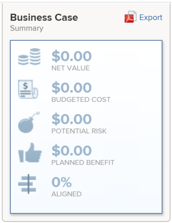

# Budgetierte Kosten berechnen

<!--

(NOTE: This article is linked from "Tracking Project Progress with a Utilization Report"

Keep the structure of this article similar to Calculating Budgeted Labor Cost)

-->

Die budgetierten Kosten eines Projekts entsprechen den Gesamtkosten, die mit dem Projekt verbunden sind und zum Zeitpunkt der Planung des Projekts geschätzt werden.

## Übersicht über budgetierte Kosten in einem Projekt

Die budgetierten Kosten eines Projekts können nicht manuell geändert werden. Adobe Workfront berechnet die budgetierten Kosten anhand der folgenden Formel:

`Budgeted Cost = Resource Planner Budgeted Labor Cost + Budgeted Expenses Cost + Fixed Cost of the project`

* Der **Ressourcenplaner budgetierte Lohnkosten** in der obigen Berechnung entspricht den Kosten, die mit den Aufgabengebieten im Projekt verknüpft sind.

  Sie können die budgetierten Lohnkosten eines Projekts im Bereich Ressourcenbudgetierung des Business Case oder des Ressourcenplaners verfolgen.

  >[!TIP]
  >
  >  Die budgetierten Lohnkosten eines Projekts im Business Case werden in Berichten und Listen als Ressourcenplaner „budgetierte Lohnkosten“ angezeigt.

  Informationen zu budgetierten Lohnkosten finden Sie im Artikel [Budgetierte Lohnkosten und budgetierte Stunden für Projekte](../../../manage-work/projects/project-finances/budgeted-labor-cost.md).

* Die **budgetierten Kosten** in der obigen Berechnung sind die geplanten Kosten, die mit den Ausgaben für das Projekt verbunden sind, da sie im Bereich Ausgaben des Business Case oder auf der Registerkarte Ausgaben des Projekts berechnet werden.\
  Weitere Informationen zu Ausgaben für ein Projekt finden Sie im Artikel [Verwalten von Projektausgaben](../../../manage-work/projects/project-finances/manage-project-expenses.md).

* Die **Fixkosten** in der obigen Berechnung ist der feste Betrag, der mit den Kosten des Projekts verknüpft ist, wie im Bereich „Finanzen“ des Abschnitts „Details“ des Projekts definiert.\
  Weitere Informationen zur Unterregisterkarte „Finanzen“ eines Projekts finden Sie im Artikel [Verwalten von Informationen im Bereich „Projektfinanzierung](../../../manage-work/projects/project-finances/manage-project-finance-area.md).

>[!NOTE]
>
>Workfront berechnet alle Kosteninformationen anhand der Projektwährung. Wenn Sie im Ressourcenplaner budgetierte Stunden für Ihre Ressourcen angeben, ist die Option zum Ändern der Projektwährung deaktiviert.
>
>Weitere Informationen zum Ändern der Währung eines Projekts finden Sie im Artikel [Ändern der Projektwährung](../../../manage-work/projects/project-finances/change-project-currency.md).

## Budgetierte Kosten eines Projekts suchen

Die budgetierten Kosten, wie sie im Bereich Ressourcenbudgetierung des Business Case oder des Ressourcenplaners angezeigt werden, werden in den folgenden Bereichen von Workfront unter den folgenden Namen angezeigt:

<table style="table-layout:auto"> 
   <col> 
   <col> 
   <tbody> 
    <tr> 
     <td><strong>Anzeigename der budgetierten Kosten</strong></td> 
     <td><strong>Gebiet von Workfront</strong></td> 
    </tr> 
    <tr> 
     <td>Budgetierte Kosten</td> 
     <td> 
Business Case-Zusammenfassung
 
  
 </td> 
    </tr> 
    <tr> 
     <td>Kosten</td> 
     <td> 
Portfolio Optimizer
 
Tipp: Die Summe aller budgetierten Kostenwerte des Projekts entspricht den budgetierten Kosten des Portfolios.
 </td> 
    </tr> 
    <tr> 
     <td>Budgetierte Projektkosten</td> 
     <td> <!--
       
Resource Estimates report (NOTE: this was removed with flash)

      --> 
Projektbericht
 
Bericht zu Projekten (Finanzdaten)
 
Aufgabenbericht
 
Problembericht
 
Bericht zu budgetierten Stunden
 
Weitere Informationen zum Erstellen eines Berichts finden Sie im Artikel <a href="../../../reports-and-dashboards/reports/creating-and-managing-reports/create-custom-report.md" class="MCXref xref">Erstellen eines benutzerdefinierten Berichts</a>.
 </td> 
    </tr> 
   </tbody> 
  </table>
