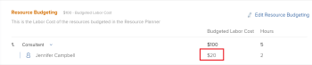
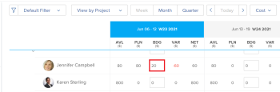

# Grundlegendes zu budgetierten Lohnkosten und budgetierten Stunden für Projekte

<!--
<(NOTE: Keep the structure of this article similar to Calculating Budgeted Cost)

-->

Mit dem Adobe Workfront-Ressourcenplaner können Sie Ihre Ressourcen für die Arbeit budgetieren.

Wenn Sie Ihre Ressourcen für die Arbeit an Projekten budgetieren, berechnet Workfront die budgetierten Lohnkosten für die Funktionen, Projekte und Benutzenden auf der Grundlage von Werten für „Kosten pro Stunde“.

Der Ressourcenplaner budgetierte Lohnkosten eines Projekts ist eine Berechnung zwischen den Kosten, die mit den Aufgabengebieten verbunden sind, die für die Fertigstellung der Arbeit am Projekt zugewiesen wurden, und der geschätzten Anzahl der Stunden (budgetierte Stunden des Ressourcenplaners), die jede Funktion benötigen könnte, um die Arbeit abzuschließen.

>[!IMPORTANT]
>
>Der Ressourcenplaner hat keine Auswirkungen auf die budgetierten Lohnkosten der Benutzer. Nur die Lohnkosten für Aufgabengebiete wirken sich auf die Projektkosten aus.

## Übersicht über die budgetierten Lohnkosten für Aufgabengebiete und das Projekt

Workfront verwendet die budgetierten Lohnkosten der Aufgabengebiete des Projekts, um die budgetierten Lohnkosten des Projekts zu berechnen.

>[!TIP]
>
>Die budgetierten Lohnkosten eines Projekts im Business Case werden in Berichten und Listen als Ressourcenplaner „budgetierte Lohnkosten“ angezeigt.

Die **budgetierten Lohnkosten** (oder Ressourcenplaner - budgetierte Lohnkosten) eines Projekts werden nach folgender Formel berechnet:

`Resource Planner Budgeted Labor Cost = SUM ( Resource Planner Budgeted Hours for each job role on the project * Cost per Hour rate of each job role on the project)`

Die in der obigen Berechnung verwendeten Felder beziehen sich auf Folgendes:

* Die budgetierten Stunden für Aufgabengebiete im Bereich Ressourcenbudgetierung des Projekts oder des Ressourcenplaners.

  Weitere Informationen zur Budgetierung von Ressourcen im Ressourcenplaner finden Sie im Abschnitt „Budgetierung von Ressourcen im Ressourcenplaner“ im Artikel [Ressourcenplaner - Übersicht](../../../resource-mgmt/resource-planning/get-started-resource-planner.md).

  Weitere Informationen zur Budgetierung von Ressourcen im Bereich Ressourcenbudgetierung des Business Case finden Sie [Budgetressourcen im Business Case](../../../manage-work/projects/define-a-business-case/budget-resources-in-business-case.md).

* Der **Kosten pro Stunde eines Aufgabengebiets** in der obigen Berechnung bezieht sich auf die Kosten, die mit jedem Aufgabengebiet im Projekt verbunden sind.\
  Weitere Informationen zum Erstellen und Verwalten von Aufgabengebieten sowie zum Verknüpfen dieser Aufgabengebiete mit Kostensätzen finden Sie im Artikel [Erstellen und Verwalten von Aufgabengebieten](../../../administration-and-setup/set-up-workfront/organizational-setup/create-manage-job-roles.md).

>[!NOTE]
>
>Workfront berechnet alle Kosteninformationen anhand der Projektwährung. Wenn Sie im Ressourcenplaner budgetierte Stunden für Ihre Ressourcen angeben, ist die Option zum Ändern der Projektwährung deaktiviert.\
>Weitere Informationen zum Ändern der Währung eines Projekts finden Sie im Artikel [Ändern der Projektwährung](../../../manage-work/projects/project-finances/change-project-currency.md).

## Übersicht über die budgetierten Lohnkosten für Benutzer

<!--

(NOTE: Update the following section in the Create a Business Case article, as well, when you update it here.)

-->

>[!IMPORTANT]
>
>Die vom Benutzer budgetierten Lohnkosten wirken sich nicht auf die budgetierten Lohnkosten des Projekts aus. Nur die Lohnkosten der Aufgabengebiete eines Projekts wirken sich auf die budgetierten Lohnkosten des Ressourcenplaners aus.
> 
>Die Summe aller Arbeitskosten aller Benutzer kann mit den budgetierten Arbeitskosten des Ressourcenplaners für die mit den Benutzern verknüpften Aufgabengebiete übereinstimmen oder nicht.
>
>Wenn Sie im Ressourcenplaner budgetierte Stunden für Benutzer schätzen, sind die damit verbundenen Kosten die Kosten der den Benutzern zugeordneten Aufgabengebiete. Es handelt sich dabei nicht um Kosten, die mit den Benutzenden oder ihren Tarifen verbunden sind.

Wenn Benutzende den Aufgabengebieten im Projekt zugeordnet sind und ihre Stunden im Ressourcenplaner budgetiert sind, werden ihre budgetierten Lohnkosten je nach Anzeige in Workfront wie folgt angezeigt:

* [!UICONTROL **Budgetierte Arbeitskosten**]: Der Bereich Ressourcenbudgetierung des Business Case unter den jeweiligen Rollen.

  

* [!UICONTROL **BDG**]: Der Ressourcenplaner bei der Anzeige von Informationen in der Projekt- und Funktionsansicht nach Kosten.

  

Benutzer werden im Bereich Ressourcenbudgetierung des Business Case unter ihren jeweiligen Rollen oder im Ressourcenplaner angezeigt, wenn sie die folgenden Anforderungen erfüllen:

* Sie sind mit einem der Aufgabengebiete des Projekts verknüpft.
* Sie haben im Ressourcenplaner budgetierte Stunden angegeben.
* Mit ihrem Profil ist ein Stundensatz „Kosten pro Stunde“ verknüpft.

  Weitere Informationen zum Hinzufügen von Stundensätzen zu Benutzenden finden Sie im Artikel [Bearbeiten des Benutzerprofils](../../../administration-and-setup/add-users/create-and-manage-users/edit-a-users-profile.md).

* Der Benutzer ist Teil eines der mit dem Projekt verknüpften Ressourcenpools.

Die budgetierten Lohnkosten eines Benutzers werden nach folgender Formel berechnet:

`User Budgeted Labor Cost = Budgeted hours for the user on the project * Cost per Hour rate of the user`

## Budgetierte Lohnkosten eines Projekts suchen

Die budgetierten Lohnkosten, wie sie im Bereich Ressourcenbudgetierung des Business Case oder des Ressourcenplaners angezeigt werden, werden in den folgenden Bereichen von Workfront unter den folgenden Namen angezeigt:

<table style="table-layout:auto"> 
   <col> 
   <col> 
   <tbody> 
    <tr> 
     <td><strong>Anzeigename der budgetierten Lohnkosten</strong></td> 
     <td><strong>Gebiet von Workfront</strong></td> 
    </tr> 
    <tr> 
     <td>Budgetierte Lohnkosten</td> 
     <td>Bereich „Ressourcenbudgetierung“ des Business Case</td> 
    </tr> 
    <tr> 
     <td>Budgetierte Kosten</td> 
     <td>
Auslastungsbericht - Kostenansicht

Weitere Informationen finden Sie unter <a href="../../../resource-mgmt/resource-utilization/view-utilization-information.md">Nutzungsinformationen anzeigen</a> .
</td> 
    </tr> 
    <tr> 
     <td>BDG </td> 
     <td>Ressourcenplaner - Projekt- oder Rollenansichten, nach Kosten</td> 
    </tr> 
    <tr> 
     <td>Ressourcenplaner-Projekt - budgetierte Lohnkosten</td> 
     <td> 
Projektbericht
 
Bericht zu Projekten (Finanzdaten)
 
Aufgabenbericht
 
Problembericht
 
Bericht zu budgetierten Stunden
 
Informationen zum Erstellen eines Berichts finden Sie im Artikel <a href="../../../reports-and-dashboards/reports/creating-and-managing-reports/create-custom-report.md" class="MCXref xref">Erstellen eines benutzerdefinierten Berichts</a>.
 </td> 
    </tr> 
   </tbody> 
  </table>

>[!NOTE]
>
>Wenn Sie den Adobe Workfront-Szenarioplaner verwenden, um Projektressourcen zu budgetieren, sind die budgetierten Lohnkosten im Bereich Ressourcenbudgetierung des Business Case mit den Personalkosten der mit dem Projekt verknüpften Initiative identisch. Der Szenario-Planer ist nur in der neuen Adobe Workfront-Version verfügbar und erfordert eine zusätzliche Lizenz. Weitere Informationen zum Workfront-Szenarienplaner finden Sie unter [Überblick über den Szenarienplaner](../../../scenario-planner/scenario-planner-overview.md). Informationen zur Budgetierung von Ressourcen mit dem Szenarienplaner finden Sie unter [Budgetieren von Ressourcen im Business Case mit dem Szenarienplaner](../../../manage-work/projects/define-a-business-case/budget-resources-in-business-case-use-scenario-planner.md).

## Suchen der budgetierten Stunden eines Projekts

<!--
(NOTE: Keep the structure of this article similar to Calculating Budgeted Cost)
-->

Budgetierte Stunden wirken sich auf den Wert der budgetierten Lohnkosten (oder der budgetierten Ressourcenplaner-Kosten) des Projekts aus.

Die budgetierten Lohnkosten eines Projekts sind die Kosten, die den Aufgabengebieten zugeordnet sind, die für die Fertigstellung der Arbeit am Projekt zugewiesen wurden, sowie die geschätzte Anzahl der Stunden (budgetierte Stunden), die jede Funktion benötigen könnte, um die Arbeit abzuschließen.

Sie können die budgetierten Stunden in Workfront in den Feldern der folgenden Tabelle anzeigen.

>[!NOTE]
>
>Jede andere Erwähnung von „Budgetierte Stunden“ in Workfront bezieht sich auf Stunden, die mit veralteten Funktionen budgetiert wurden, die aus Workfront entfernt wurden. Diese Felder sind schreibgeschützt und werden nicht mit aktuellen Informationen aktualisiert, wenn Sie die aktuellen Tools für die Ressourcenbudgetierung verwenden.

Die budgetierten Stunden im Bereich Ressourcenbudgetierung des Business Case oder des Ressourcenplaners werden in den folgenden Bereichen von Workfront und unter den folgenden Namen angezeigt:

* **Stunden**: Bereich „Ressourcenbudgetierung“ des Business Case
* **BDG**:Resource Planer nach Stunden angezeigt
* **Budgetierte Stunden**: Ansicht „Stunden“ im Auslastungsbericht
Weitere Informationen finden Sie unter [Informationen zur Ressourcenauslastung anzeigen](../../../resource-mgmt/resource-utilization/view-utilization-information.md).
* **Bud. Stunden**: Bericht „Budgetierte Stunde“

  Das Objekt „Budgetierte Stunde“ im Bericht „Budgetierte Stunde“ bezieht sich auf Informationen zu einem veralteten Ressourcenverwaltungstool. Nur der „Bud. Das Feld „Stunden“ in diesem Bericht bezieht sich auf die budgetierten Stunden im Ressourcenplaner oder im Bereich „Ressourcenbudgetierung“ des Business Case des Projekts.

  Weitere Informationen zum Erstellen eines Berichts finden Sie im Artikel **Erstellen eines benutzerdefinierten Berichts**.
* **Ressourcenplaner - Budgetierte**: in den folgenden Berichten:

   * Projektbericht
   * Bericht zu Projekten (Finanzdaten)
   * Aufgabenbericht
   * Problembericht
   * Bericht zu budgetierten Stunden
