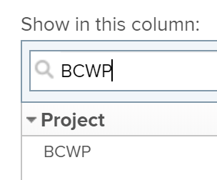

# Berechnen der budgetierten Kosten der geleisteten Arbeit (Budgeted Cost of Work Performed, BCWP)

## Übersicht über die budgetierten Kosten der geleisteten Arbeit (SKAA)

Die budgetierten Kosten der geleisteten Arbeit (BCWP), auch als Ertragswert bezeichnet, sind eine Projektleistungsmetrik, die den Betrag der Aufgabe darstellt, der zum Zeitpunkt der Berechnung dieser Metrik tatsächlich abgeschlossen wurde.

Adobe Workfront berechnet die budgetierten Kosten der geleisteten Arbeit (BCWP) für Projekte und Aufgaben.

Beachten Sie bei der Überprüfung der Werte für den SKAA für eine Aufgabe oder ein Projekt Folgendes:

* Workfront berechnet den SKAA für eine Aufgabe auf Grundlage Ihrer Konfiguration für die Leistungsindexmethode (PMI) des Projekts.

  Sie können Ihr Projekt so konfigurieren, dass die PMI anhand von Stunden oder Kosten berechnet wird, und der SKAA-Wert wird auch anhand derselben Werte berechnet.

  Informationen zur Konfiguration der Berechnung des BCWP finden Sie im Abschnitt [Konfigurieren der Berechnung des BCWP](#configure-how-bcwp-is-calculated) in diesem Artikel.

* Workfront berechnet den SKAA-Wert für ein Projekt, indem es alle SKAA-Werte aus allen übergeordneten Aufgaben und einzelnen Aufgaben des Projekts hinzufügt.

  Die Werte aus untergeordneten Aufgaben werden nicht zum SKAA des Projekts hinzugefügt.

## Zugriffsanforderungen

+++ Erweitern, um die Zugriffsanforderungen für die in diesem Artikel beschriebene Funktionalität anzuzeigen.

<table style="table-layout:auto"> 
 <col> 
 <col> 
 <tbody> 
  <tr> 
   <td>Adobe Workfront-Paket</td> 
   <td>Beliebig</td> 
  </tr> 
  <tr> 
   <td>Adobe Workfront-Lizenz</td> 
   <td>
   <p>Standard</p>
   <p>Abo</p></td> 
  </tr> 
  <tr> 
   <td>Konfigurationen der Zugriffsebene</td> 
   <td>Zugriff auf Projekte bearbeiten</td> 
  </tr> 
  <tr> 
   <td>Objektberechtigungen</td> 
   <td>Verwalten von Berechtigungen für das Projekt</td> 
  </tr> 
 </tbody> 
</table>

Weitere Informationen finden Sie unter [Zugriffsanforderungen in der Dokumentation zu Workfront](/help/quicksilver/administration-and-setup/add-users/access-levels-and-object-permissions/access-level-requirements-in-documentation.md).

+++

## Konfigurieren der Berechnung des BCWP {#configure-how-bcwp-is-calculated}

Sie können konfigurieren, ob der SKAA in Stunden oder Kosten berechnet wird, indem Sie konfigurieren, wie die Leistungsindexmethode (PIM) des Projekts berechnet wird.

1. Gehen Sie zu einem Projekt und erweitern **Projektdetails** im linken Bereich.
1. Suchen Sie im Bereich **Finanzen** das Feld **Leistungsindexmethode** und doppelklicken Sie darauf, um es zu bearbeiten.

   

1. Wählen Sie aus den folgenden Optionen aus:

   | Option | Wie die Berechnung durchgeführt wird |
   |---|---|
   | Stundenbasiert | Workfront berechnet den SKAA-Wert anhand der geplanten Stunden für die Aufgaben. |
   | Kostenbasiert | Workfront berechnet den SKAA-Wert anhand der geplanten Kosten der Aufgaben. |

1. Klicken Sie auf **Änderungen speichern**.

   Der SKAA der Aufgaben im Projekt wird anhand der Stunden oder Kosten berechnet.

## BCWP berechnen

Workfront berechnet die budgetierten Kosten der geleisteten Arbeit (BCWP) für eine Aufgabe oder ein Projekt anhand der folgenden Formeln:

```
Task BCWP = Actual Percent Complete x Task Budget
```

```
Project BCWP = SUM(BCWP values of all parent and individual tasks)
```

Die folgenden Werte werden bei dieser Berechnung verwendet:

| Verwendeter Wert | Beschreibung des verwendeten Werts |
|---|---|
| Tatsächlicher Prozentsatz abgeschlossen | Dies ist der tatsächliche abgeschlossene Prozentsatz der Aufgabe, wie er in Workfront angezeigt wird. |
| Aufgabenbudget | Dies ist der Wert für die geplanten Stunden oder geplanten Kosten der Aufgabe. |

Wenn beispielsweise der tatsächliche abgeschlossene Prozentsatz der Aufgabe 25 % beträgt und das Aufgabenbudget oder die geplanten Kosten 10.000 USD betragen, lautet der SKAA für die Aufgabe wie folgt:

```
BCWP = 25% x $10,000 = $2,500
```

## Suchen des SKAA für ein Projekt oder eine Aufgabe

Sie können den Wert der budgetierten Kosten der geleisteten Arbeit in einem Bericht oder einer Liste anzeigen, indem Sie die Spalte SKAA zu Ihrer Ansicht hinzufügen.

1. Navigieren Sie zu einer Liste mit Aufgaben oder Projekten.
1. Erweitern Sie das **Ansicht**-Menü und wählen Sie **Neue Ansicht** oder **Ansicht anpassen**.

1. Klicken Sie auf **Spalte hinzufügen**.
1. Beginnen Sie im Feld **In dieser Spalte anzeigen** mit der Eingabe **BCWP** und klicken Sie, um es auszuwählen, wenn es in der Liste angezeigt wird.

   

1. Klicken Sie auf **Ansicht speichern**.
1. Das BCWP-Feld wird in der Ansicht angezeigt.
