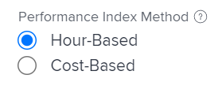
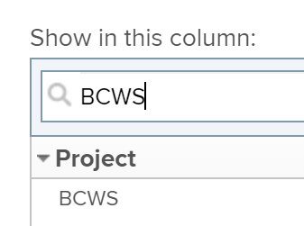

# Berechnen der budgetierten Kosten für geplante Arbeit (Budgeted Cost of Work Scheduled, BCWS)

## Übersicht über die budgetierten Kosten der geplanten Arbeit (BCWS)

Die budgetierten Kosten der geplanten Arbeit (BCWS), auch als Geplanter Wert bezeichnet, sind eine Projektleistungskennzahl, die den Betrag der Aufgabe darstellt, der zum Zeitpunkt der Berechnung dieser Kennzahl hätte abgeschlossen sein sollen.

Adobe Workfront berechnet die budgetierten Kosten der geplanten Arbeit (BCWS) für Projekte und Aufgaben.

Beachten Sie bei der Überprüfung der Werte für den SKBA für eine Aufgabe oder ein Projekt Folgendes:

* Workfront berechnet den BCWS für eine Aufgabe anhand Ihrer Konfiguration für die Leistungsindexmethode (PIM) des Projekts.

  Sie können Ihr Projekt so konfigurieren, dass die PIM anhand von Stunden oder Kosten berechnet wird, und der SKBA wird ebenfalls anhand derselben Werte berechnet.

  Informationen zum Konfigurieren der BCWS-Berechnung finden Sie im Abschnitt [Konfigurieren der BCWS](#configure-how-bcws-is-calculated) in diesem Artikel.

* Workfront berechnet den SKBA für ein Projekt, indem es alle SKBA-Werte aus allen übergeordneten Aufgaben und einzelnen Aufgaben des Projekts hinzufügt.

  Die Werte aus untergeordneten Aufgaben werden nicht zum SKBA des Projekts hinzugefügt.

## Zugriffsanforderungen

+++ Erweitern, um die Zugriffsanforderungen für die in diesem Artikel beschriebene Funktionalität anzuzeigen.

<table style="table-layout:auto"> 
 <col> 
 <col> 
 <tbody> 
  <tr> 
   <td>Adobe Workfront-Paket</td> 
   <td>Beliebig</td> 
  </tr> 
  <tr> 
   <td>Adobe Workfront-Lizenz</td> 
   <td>
   <p>Standard</p>
   <p>Abo</p></td> 
  </tr> 
  <tr> 
   <td>Konfigurationen der Zugriffsebene</td> 
   <td>Zugriff auf Projekte bearbeiten</td> 
  </tr> 
  <tr> 
   <td>Objektberechtigungen</td> 
   <td>Verwalten von Berechtigungen für das Projekt</td> 
  </tr> 
 </tbody> 
</table>

Weitere Informationen finden Sie unter [Zugriffsanforderungen in der Dokumentation zu Workfront](/help/quicksilver/administration-and-setup/add-users/access-levels-and-object-permissions/access-level-requirements-in-documentation.md).

+++

## Konfigurieren der BCWS-Berechnung {#configure-how-bcws-is-calculated}

Sie können konfigurieren, ob der SKBA in Stunden oder Kosten berechnet wird, indem Sie konfigurieren, wie die Leistungsindexmethode (PIM) des Projekts berechnet wird.

1. Gehen Sie zu einem Projekt und klicken **im linken Bereich** Projektdetails“.
1. Suchen Sie im Bereich **Finanzen** das Feld **Leistungsindexmethode** und doppelklicken Sie darauf, um es zu bearbeiten.

   

1. Wählen Sie aus den folgenden Optionen aus:

   | Option | Wie die Berechnung durchgeführt wird |
   |---|---|
   | Stundenbasiert | Workfront berechnet den SKBA mithilfe der geplanten Stunden der Aufgaben. |
   | Kostenbasiert | Workfront berechnet den SKBA anhand der geplanten Kosten der Aufgaben. |


1. Klicken Sie auf **Änderungen speichern**.

   Der SKBA der Aufgaben im Projekt wird anhand der Stunden oder Kosten berechnet.

## BCWS berechnen

Workfront berechnet die budgetierten Kosten der geplanten Arbeit (BCWS) für Aufgaben oder Projekte anhand der folgenden Formeln:

```
Task BCWS = Planned Percent Complete x Task Budget
```

```
Project BCWS = SUM(BCWS values of all parent and individual tasks)
```

Die folgenden Werte werden bei dieser Berechnung verwendet:

| Verwendeter Wert | Beschreibung des verwendeten Wertes |
|---|---|
| Geplanter Prozentsatz abgeschlossen | So sollte der Prozentsatz der abgeschlossenen Aufgabe aussehen, indem Sie sich die Zeit ansehen, die zwischen dem Beginn der Aufgabe und heute vergangen ist. |
| Aufgabenbudget | Dies ist der Wert für die geplanten Stunden oder geplanten Kosten der Aufgabe. |

Wenn es heute beispielsweise der 12. Februar ist und eine Aufgabe vom 10. bis zum 20. Februar dauern soll, sollte die Aufgabe heute zu 20 % abgeschlossen sein. Wenn das Budget der Aufgabe (geplante Kosten) 10.000 USD beträgt, lautet der SKBA für die Aufgabe:

```
Task BCWS = 20% x $10,000 = $2,000
```

## Suchen des BCWS für ein Projekt oder eine Aufgabe

Sie können den Wert der budgetierten Kosten geplanter Arbeit in einem Bericht oder einer Liste anzeigen, indem Sie die Spalte BCWS zu Ihrer Ansicht hinzufügen.

1. Navigieren Sie zu einer Liste mit Aufgaben oder Projekten.
1. Erweitern Sie das **Ansicht**-Menü und wählen Sie **Neue Ansicht** oder **Ansicht anpassen**.

1. Klicken Sie auf **Spalte hinzufügen**.
1. Beginnen Sie im Feld **In dieser Spalte anzeigen** mit der Eingabe **BCWS** und klicken Sie, um es auszuwählen, wenn es in der Liste angezeigt wird.

   

1. Klicken Sie auf **Ansicht speichern**.
1. Das **BCWS**-Feld wird in der Ansicht angezeigt.
