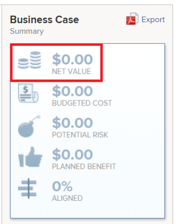

# Berechnen des Nettowerts

Der Nettowert eines Projekts entspricht dem erwarteten Gesamtwert des Projekts nach Berechnung des Nutzens und Entfernung der Kosten.

## Übersicht über den Nettowert des Projekts

Adobe Workfront berechnet den Nettowert eines Projekts anhand der folgenden Formel:

```
Project Net Value = Planned Benefit - Budgeted Cost - Potential Risk Cost
```

Die folgenden Felder können sich auf den Nettowert eines Projekts auswirken:

* **Geplanter Nutzen**: Dies ist ein manueller Eintrag, der vom Projektinhaber beim Ausfüllen **Bereichs „Projektinformationen** des Business Case angegeben wird.\
  Weitere Informationen zum geplanten Nutzen eines Projekts finden Sie im Abschnitt [Projektinformationen](../../../manage-work/projects/define-a-business-case/areas-of-business-case.md#project-info) im Artikel [Überblick über die Bereiche des Business Case](../../../manage-work/projects/define-a-business-case/areas-of-business-case.md).

* **Budgetierte Kosten**: Dies sind die Gesamtkosten, die mit dem Projekt verbunden sind und zum Zeitpunkt des ersten Starts des Projekts geschätzt werden.

  Die **budgetierte Kosten** verwendet den Wert **Budgetierte Arbeitskosten** der im Bereich Ressourcenbudgetierung des Business Case berechnet wird. Dabei werden die für Ihre Aufgabengebiete im Ressourcenplaner budgetierten Stunden und der Stundensatz pro Stunde für jedes Aufgabengebiet berücksichtigt.\
  Die budgetierten Kosten wirken sich auf **Nettowert** Projekts aus. Weitere Informationen zur Berechnung der budgetierten Kosten finden Sie unter [Budgetierte Kosten berechnen](../../../manage-work/projects/project-finances/budgeted-cost.md).

* **Mögliche Risikokosten**: Dies sind die Kosten, die mit allen Risiken im Projekt verbunden sind, wie sie im Business Case oder auf der Registerkarte „Risiken“ des Projekts definiert sind.\
  Weitere Informationen zur Berechnung der potenziellen Risikokosten eines Projekts finden Sie im Artikel [Berechnung potenzieller Risikokosten](../../../manage-work/projects/project-finances/potential-risk-cost.md).


## Suchen Sie das Projekt „Nettowert“

Den Nettowert für ein Projekt finden Sie in den folgenden Bereichen in Workfront:

* Im Business Case-Zusammenfassungsbereich des Business Case\
  Weitere Informationen zum Bereich „Zusammenfassung eines Business-Case“ finden Sie im Abschnitt „Grundlagen zur Zusammenfassung eines Business-Case“ im Artikel [Erstellen eines Business-Case für &#x200B;](../../../manage-work/projects/define-a-business-case/create-business-case.md) Projekt[Erstellen eines Business-Case für ein Projekt](../../../manage-work/projects/define-a-business-case/create-business-case.md).

  

* In Portfolio Optimizer, wenn das Projekt mit einem Portfolio verknüpft ist

  >[!TIP]
  >
  >Die Summe aller Projekt-Nettowerte ist der Nettowert des Portfolios.

  Weitere Informationen zu Portfolio Optimizer finden Sie unter [Übersicht über Portfolio Optimizer](../../../manage-work/portfolios/portfolio-optimizer/portfolio-optimizer-overview.md).

* Im Feld Nettowert des Projekts der folgenden Listen und Berichte:

   * Projekt
   * Aufgabe
   * Problem
   * Projekt (Finanzdaten)

  Weitere Informationen zum Erstellen eines Berichts finden Sie im Artikel [Erstellen eines benutzerdefinierten Berichts](../../../reports-and-dashboards/reports/creating-and-managing-reports/create-custom-report.md).
