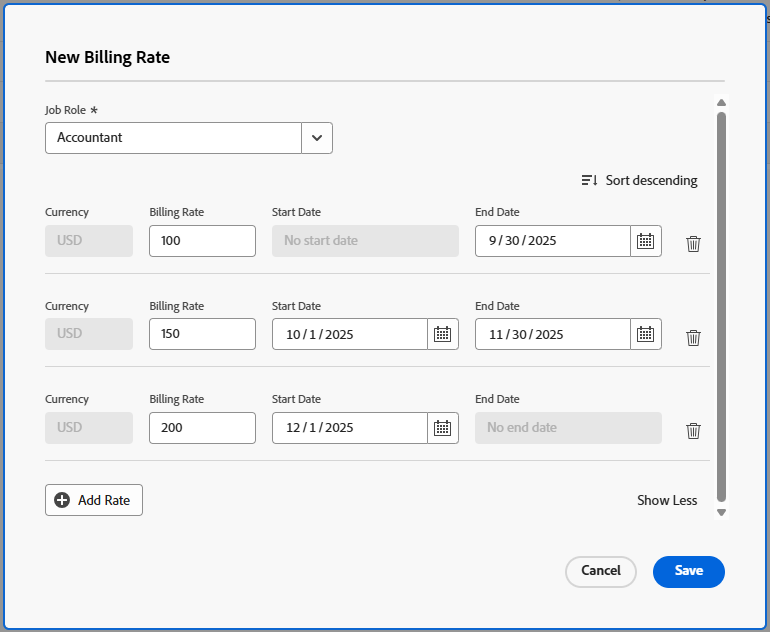

# Aufgabengebiet-Abrechnungssätze auf Projektebene überschreiben

<!--The highlighted information on this page refers to functionality not yet generally available. It is available only in the Preview Sandbox environment, and is being released in a phased rollout to Production.-->

Als Projekt-Manager können Sie den Abrechnungssatz für ein Aufgabengebiet in einem bestimmten Projekt angeben. Dieser Abrechnungssatz auf Projektebene überschreibt den Abrechnungssatz auf Systemebene für dieses Aufgabengebiet. Workfront verwendet zur Berechnung des Umsatzes den Abrechnungssatz auf Projektebene des Aufgabengebiets, anstatt den Abrechnungssatz auf Systemebene zu verwenden.

In diesem Artikel wird beschrieben, wie Sie die Abrechnungssätze für Systemaufgaben für ein Projekt überschreiben können.

Allgemeine Informationen zum Überschreiben von Abrechnungssätzen für Aufgabengebiete für Projekte und zur Berechnung des Projektumsatzes finden Sie unter [Übersicht über das Überschreiben von Abrechnungssätzen für Aufgabengebiete und die Berechnung des Umsatzes für ein Projekt](../../../manage-work/projects/project-finances/override-role-billing-rates-and-calculate-project-revenue.md).

Weitere Informationen dazu, welches Aufgabengebiet zur Berechnung des Umsatzes für das Projekt verwendet wird, finden Sie im Abschnitt „Grundlagen zu Umsatzberechnungen für Aufgaben basierend auf Benutzer- und Rollenzuweisungen“ im Artikel [Übersicht über Abrechnung und Umsatz](../../../manage-work/projects/project-finances/billing-and-revenue-overview.md).

>[!NOTE]
>
>Bei tatsächlichen Einnahmen sollten die Abrechnungssätze, die auf Stunden angewendet werden, die einem als „In Rechnung gestellt“ markierten Abrechnungs-Datensatz hinzugefügt werden, nicht von Abrechnungssatz-Überschreibungen beeinflusst werden, die nach der Abrechnung des Abrechnungs-Datensatzes auftreten.

## Zugriffsanforderungen

+++ Erweitern Sie , um die Zugriffsanforderungen für die -Funktion in diesem Artikel anzuzeigen.

<table style="table-layout:auto"> 
 <col> 
 <col> 
 <tbody> 
  <tr> 
   <td>Adobe Workfront-Paket</td> 
   <td>Beliebig</td> 
  </tr> 
  <tr> 
   <td>Adobe Workfront-Lizenz</td> 
   <td>
   
Standard

   
Plan
</td> 
  </tr> 
  <tr> 
   <td>Konfigurationen der Zugriffsebene</td> 
   <td> 
Zugriff auf Projekte und Finanzdaten bearbeiten
 
Administratorzugriff für Aufgabengebiete
</td> 
  </tr> 
  <tr> 
   <td>Objektberechtigungen</td> 
   <td>Verwalten Sie Berechtigungen für das Projekt, das die Option Finanzdaten bearbeiten enthält. </td> 
  </tr> 
 </tbody> 
</table>

Weitere Informationen finden Sie unter [Zugriffsanforderungen in der Dokumentation zu Workfront](/help/quicksilver/administration-and-setup/add-users/access-levels-and-object-permissions/access-level-requirements-in-documentation.md).

+++

## Aufgabengebiet-Abrechnungssätze auf Projektebene überschreiben

Sie können den Abrechnungssatz eines Aufgabengebiets für ein Projekt wie folgt überschreiben:

* Einmal durch Auswahl eines neuen Tarifs für das Aufgabengebiet.\
  Der neue Satz wird für die gesamte Laufzeit des Projekts zur Berechnung des Umsatzes verwendet.

* Mehrere Male, indem Sie mehrere neue Kurse für bestimmte Datumsbereiche auswählen.\
  Für jeden angegebenen Datumsbereich kann ein anderer Satz verwendet werden.

* Sie können einer Projektvorlage neue Abrechnungssätze hinzufügen, die beim Erstellen des Projekts aus dieser Vorlage zu Projekt-Abrechnungssätzen werden. Informationen zum Bearbeiten von Vorlagen finden Sie unter [Projektvorlagen bearbeiten](/help/quicksilver/manage-work/projects/create-and-manage-templates/edit-templates.md).

>[!TIP]
>
>Benutzer-Abrechnungssätze für ein Projekt können nicht überschrieben werden.

So überschreiben Sie einen Abrechnungssatz für ein Projekt:

1. Wechseln Sie zu dem Projekt, für das Sie die Abrechnungssätze überschreiben möchten.
1. Klicken **im linken** auf „Abrechnungssätze“.
1. Klicken Sie **Abrechnungssatz hinzufügen** > **Neuer Abrechnungssatz**.

   Das Feld „Neuer Abrechnungssatz“ wird geöffnet.

1. Wählen **im Feld** das Aufgabengebiet aus, für das Sie den Abrechnungssatz ändern möchten.

   Das Feld **Standard-Abrechnungssatz** zeigt den Satz auf Systemebene für dieses Aufgabengebiet an.

1. Geben Sie im Feld **Abrechnungssätze 1** die einmalige Überschreibung des Abrechnungssatzes ein und klicken Sie dann auf **Speichern**, um den Abrechnungssatz einmal zu überschreiben

   Oder

   Klicken Sie **Abrechnungssatz hinzufügen**, um weitere Abrechnungssatz-Überschreibungen hinzuzufügen.

1. (Bedingt) Wenn Sie mehr als eine Abrechnungssatz-Überschreibung hinzufügen, geben Sie die folgenden Informationen an:

   * **Abrechnungssätze 1**: Der Wert des Abrechnungssatzes vom Beginn des Projekts bis zum ersten Datum der ersten Überschreibung. Dies ist in der Regel der gleiche Betrag wie die **Standardrate**.
   * **Startdatum**: Dies ist das Datum, an dem der Standardsatz endet.
   * **Enddatum**: Das Datum, an dem die neue Überschreibung des Abrechnungssatzes endet.

   <!--Sample image in the Preview environment:-->
   

   <!--Sample image in the Production environment:
   -->

1. Die Zeitzone für die von Ihnen ausgewählten Daten wird unten im Feld „Neuer Abrechnungssatz“ angezeigt. Dies ist die Zeitzone, die mit Ihrer Workfront-Instanz verknüpft ist, wie im Bereich Kundeninformationen von Setup gezeigt. Weitere Informationen finden Sie [Konfigurieren der grundlegenden Informationen für Ihr System](../../../administration-and-setup/get-started-wf-administration/configure-basic-info.md).
1. Workfront wendet den Tarif für Aufgabengebiete außer Kraft setzen auf die Stunden an, die während der bei der Berechnung des Umsatzes für das Projekt angegebenen Zeitrahmen auftreten.
1. Zwischen den Zeitrahmen zweier Außerkraftsetzungsraten sollte es keine Lücken geben. Das **Startdatum** einer Überschreibungsrate sollte der Tag sein, der unmittelbar auf das **Enddatum** des vorherigen Überschreibungsdatums folgt.

1. Sie können weder ein Startdatum für den ersten Überschreibungssatz noch ein Enddatum für den letzten Überschreibungssatz angeben.\
   Es wird empfohlen, den Standardsatz für die erste Überschreibungsrate zu verwenden.\
   Workfront geht davon aus, dass die erste Überschreibungsrate auf alle Stunden angewendet wird, deren Datum älter als das Enddatum der ersten Überschreibungsrate ist, und dass die letzte Überschreibungsrate auf alle Stunden angewendet wird, deren Datum neuer als das Startdatum der letzten Überschreibung ist.\
   Wird eine Stunde vor dem geplanten Startdatum des Projekts protokolliert, wird der allererste Abrechnungssatz verwendet.\
   Wird eine Stunde nach dem geplanten Abschlussdatum des Projekts protokolliert, wird der letzte Abrechnungssatz verwendet.

1. Klicken Sie auf **Speichern**.
