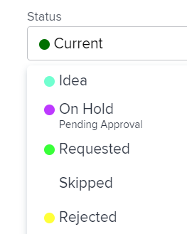

# Anwenden von Status auf Arbeit, die einer Gruppe zugeordnet ist

<!--
Alina, I moved this out of an admin article about statuses (Create and customize statuses)
-->

Wenn ein Projekt mit einer Gruppe verknüpft ist, können Sie sowohl den Status auf Systemebene als auch einen benutzerdefinierten Status, der mit dieser Gruppe verknüpft ist, auf das Projekt bzw. auf die Aufgaben und Probleme in diesem Projekt anwenden. Informationen zum Gruppenstatus in Adobe Workfront finden Sie unter [Erstellen oder Bearbeiten eines Status](../../../administration-and-setup/customize-workfront/creating-custom-status-and-priority-labels/create-or-edit-a-status.md).

>[!TIP]
>
>Sie können nur Projekte mit Gruppen verknüpfen. Probleme und Aufgaben übernehmen die Gruppe aus dem Projekt, dem sie angehören.

## Zugriffsanforderungen

+++ Erweitern, um die Zugriffsanforderungen für die in diesem Artikel beschriebene Funktionalität anzuzeigen. 

<table style="table-layout:auto"> 
 <col> 
 <col> 
 <tbody> 
  <tr> 
   <td role="rowheader">Adobe Workfront-Paket</td> 
   <td> 
Beliebig
 </td> 
  </tr> 
  <tr> 
   <td role="rowheader">Adobe Workfront-Lizenz</td> 
   <td> 
Standard

   
Abo
 </td> 
  </tr> 
  <tr> 
   <td role="rowheader">Konfigurationen der Zugriffsebene</td> 
   <td> 
Zugriff auf Projekte bearbeiten
 </td> 
  </tr> 
  <tr> 
   <td role="rowheader">Objektberechtigungen</td> 
   <td> 
Verwalten von Berechtigungen für das Projekt
 </td> 
  </tr> 
 </tbody> 
</table>

Weitere Informationen finden Sie unter [Zugriffsanforderungen in der Dokumentation zu Workfront](/help/quicksilver/administration-and-setup/add-users/access-levels-and-object-permissions/access-level-requirements-in-documentation.md).

+++

<!--
Old:
<table style="table-layout:auto"> 
 <col> 
 <col> 
 <tbody> 
  <tr> 
   <td role="rowheader">Adobe Workfront plan*</td> 
   <td> 
Any
 </td> 
  </tr> 
  <tr> 
   <td role="rowheader">Adobe Workfront license*</td> 
   <td> 
Plan 
 </td> 
  </tr> 
  <tr> 
   <td role="rowheader">Access level configurations*</td> 
   <td> 
Edit access to Projects
 
<b>NOTE</b>
   
   If you still don't have access, ask your Workfront administrator if they set additional restrictions in your access level. For information on how a Workfront administrator can modify your access level, see <a href="../../../administration-and-setup/add-users/configure-and-grant-access/create-modify-access-levels.md" class="MCXref xref">Create or modify custom access levels</a>.
 </td> 
  </tr> 
  <tr> 
   <td role="rowheader">Object permissions</td> 
   <td> 
Manage permissions to the project
 
For information on requesting additional access, see <a href="../../../workfront-basics/grant-and-request-access-to-objects/request-access.md" class="MCXref xref">Request access to objects </a>.
 </td> 
  </tr> 
 </tbody> 
</table>
-->

## Projektgruppe und -status aktualisieren

Wenn Sie die Gruppe für ein Projekt aktualisieren, ändern sich die verfügbaren Optionen für den Status von Aufgaben, Problemen oder das Projekt, sodass sie mit der Gruppe übereinstimmen.

1. Gehen Sie zu einem Projekt oder erstellen Sie ein neues Projekt, wie in [Erstellen eines Projekts](../../../manage-work/projects/create-projects/create-project.md) beschrieben.
1. Klicken Sie auf das **Mehr**-Symbol  und dann auf **Bearbeiten**.

1. Wählen Sie in dem **Projekt bearbeiten** unten im Abschnitt **Übersicht** die Gruppe im Dropdownmenü **Gruppe** aus.

1. Wählen **im Dropdown** Menü „Status“ den benutzerdefinierten Status aus.

   >[!NOTE]
   >
   >Wenn Sie im Dropdown-Menü **Gruppe** eine andere Gruppe auswählen, ändern sich die benutzerdefinierten Status im Menü **Status** automatisch, um sie mit der neuen Gruppe zu korrelieren.
   >
   >
   >
   >

1. Wählen Sie den Status des Projekts aus. Die benutzerdefinierten Status, die Sie erstellt und auf diese Gruppe angewendet haben, werden in der Liste angezeigt.
