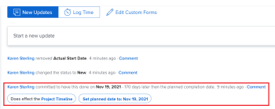

# Übersicht über das Commit-Datum

<!--Audited: 05/2025-->

<!-- The highlighted information on this page refers to functionality not yet generally available. It is available only in the Preview environment for all customers, or in the Production environment for customers who enabled fast releases.

For information about fast releases, see [Enable or disable fast releases for your organization](/help/quicksilver/administration-and-setup/set-up-workfront/configure-system-defaults/enable-fast-release-process.md).

For information about the current release, see [Third Quarter 2024 release overview](/help/quicksilver/product-announcements/product-releases/24-q3-release-activity/24-q3-release-overview.md).-->

Das Commit-Datum ist das Datum, zu dem sich ein Benutzer einer Aufgabe oder eines Problems verpflichtet hat, die Aufgabe oder das Problem abzuschließen. Dies unterscheidet sich vom geplanten Abschlussdatum einer Aufgabe oder eines Problems, da es eine realistischere Schätzung des Abschlussdatums ist, die nur von dem Benutzer gegeben wird, der für die Arbeit verantwortlich ist.

Informationen zum geplanten Abschlussdatum finden Sie unter [Übersicht über das geplante Abschlussdatum der Aufgabe](../../../manage-work/tasks/task-information/task-planned-completion-date.md).

## Übersicht über das Commit-Datum

Beachten Sie beim Arbeiten mit Commit-Daten Folgendes:

* Nur Aufgaben und Probleme haben ein Commit-Datum.
* Commit-Termine werden von Adobe Workfront nicht automatisch festgelegt. Wenn Sie eine Aufgabe oder ein Problem erstellen, wird ihr kein Commit-Datum zugewiesen.
* Wenn Sie einer Aufgabe oder einem Problem zugewiesen sind, können Sie das Commit-Datum festlegen, indem Sie einen der folgenden Schritte ausführen:

   * Workfront kann das Commit-Datum so festlegen, dass es dem vorhandenen geplanten Abschlussdatum der Aufgabe oder des Problems entspricht, indem für die Aufgabe oder das Problem auf „Bearbeiten“, „Problem starten“ oder „Aufgabe starten“ geklickt wird. Weitere Informationen finden Sie [Ersetzen der Schaltfläche Bearbeiten durch eine Schaltfläche Starten](../../../people-teams-and-groups/create-and-manage-teams/work-on-it-button-to-start-button.md).
   * Stellen Sie das Commit-Datum manuell entsprechend dem Zeitpunkt ein, zu dem die Aufgabe oder das Problem Ihrer Meinung nach abgeschlossen sein wird. Dies ist Ihre Schätzung und Verpflichtung als Verantwortlicher gegenüber dem Projekt-Manager, dass die Aufgabe oder das Problem bis zu einem bestimmten Datum abgeschlossen sein wird. Weitere Informationen finden Sie unter [Aktualisieren von Commit-Daten für Aufgaben und Probleme](/help/quicksilver/manage-work/projects/updating-work-in-a-project/update-commit-date-on-tasks-and-issues.md).

>[!NOTE]
>
>Sie müssen Aufgabenbesitzer einer Aufgabe sein, um das Commit-Datum zu ändern. Die folgenden Benutzer können das Commit-Datum einer Aufgabe nicht ändern:
>
>* Projektbesitzer
>* Projektsponsor
>* Ressourcenmanager
>* Systemadministrator
>* Beliebiger anderer Bevollmächtigter für die Aufgabe
>* Jeder andere Benutzer mit Berechtigungen für die Aufgabe
>
>Weitere Informationen zum Aufgabenbesitzer finden Sie unter [Aufgaben bearbeiten](../../../manage-work/tasks/manage-tasks/edit-tasks.md).

## Suchen des Commit-Datums von Aufgaben und Problemen

Das Commit-Datum von Aufgaben und Problemen finden Sie in den folgenden Bereichen von Workfront:

* Die Detailseite
* Das Bedienfeld Zusammenfassung , nachdem ein Workfront- oder Gruppen-Administrator es Ihrer Layout-Vorlage hinzugefügt hat. Weitere Informationen finden Sie [Anpassen des Bedienfelds Zusammenfassung mithilfe einer Layout-Vorlage](/help/quicksilver/administration-and-setup/customize-workfront/use-layout-templates/customize-home-summary-layout-template.md).
* Die Kopfzeile einer Aufgabe oder eines Problems, nachdem ein Workfront- oder Gruppenadministrator sie zu Ihrer Layout-Vorlage hinzugefügt hat. Weitere Informationen finden Sie unter [Anpassen von Objektkopfzeilen mithilfe einer Layout-Vorlage](/help/quicksilver/administration-and-setup/customize-workfront/use-layout-templates/customize-object-headers.md).

## Benachrichtigungen und Aktualisierungen, die durch eine Änderung des Commit-Datums ausgelöst werden {#notifications-and-updates-triggered-by-changing-the-commit-date}

Wenn eine Aufgabe oder ein Problem, die bzw. das zugewiesen wurde, manuell ein Commit-Datum in ein Datum ändert, das sich von dem vom Projektinhaber festgelegten geplanten Abschlussdatum unterscheidet, gibt es eine Reihe von Benachrichtigungen und Aktualisierungen, die den Projektinhaber und andere Benutzer auf diese Änderung hinweisen.

>[!NOTE]
>
>Änderungen am Commit-Datum ändern nicht automatisch die geplanten Daten, und Änderungen an den geplanten Daten ändern nicht automatisch das Commit-Datum.

Manuelles Festlegen des Commit-Datums für eine Aufgabe oder einen Problem-Trigger :

* Die Änderung des Verpflichtungsdatums wird in der Systemaktivität und auf den Registerkarten Alle des Abschnitts Aktualisieren der Aufgabe oder des Problems angezeigt.

  

  Die Änderung des Übertragungsdatums wird im Bereich Aktualisierungen der Aufgabe oder des Problems angezeigt, wenn der Workfront-Administrator dieses Update im Bereich Aktualisierungen-Feeds im Setup aktiviert. Weitere Informationen finden Sie unter [System-getrackte Aktualisierungen](../../../administration-and-setup/set-up-workfront/system-tracked-update-feeds/system-tracked-update-feeds.md).

  Wenn ein Projektbesitzer die Änderung nicht akzeptieren möchte, empfehlen wir, dass er dem Benutzer, der ein neues Datum vorschlägt, über die Registerkarte Kommentare im Abschnitt Aktualisierungen einen Kommentar zurückgibt, ihn bittet, das Commit-Datum wieder in das ursprüngliche geplante Datum zu ändern, oder ein neues Datum auswählt.

  Wenn ein Projektinhaber die Änderung akzeptiert, kann er das geplante Abschlussdatum manuell an das Commit-Datum anpassen, das der dem Element zugewiesene Benutzer angeboten hat, indem er die Aufgabe oder das Problem bearbeitet.

  Sie müssen Zugriff auf die Verwaltung der Aufgabe oder des Problems haben, um sie bearbeiten zu können.

  >[!TIP]
  >
  >Sie können Ihren System- oder Gruppenadministrator bitten, das Feld Übertragungsdatum zu Ihrem Zusammenfassungsbereich oder Ihrer Kopfzeile hinzuzufügen, um die Aktualisierung zu vereinfachen.
  >
  >Weitere Informationen finden Sie in den folgenden Artikeln:
  >
  >* [Übersicht](/help/quicksilver/workfront-basics/the-new-workfront-experience/summary-overview.md)
  >* [Passen Sie das Bedienfeld Zusammenfassung mithilfe einer Layout-Vorlage an](/help/quicksilver/administration-and-setup/customize-workfront/use-layout-templates/customize-home-summary-layout-template.md)
  >* [Anpassen von Objekt-Headern mithilfe einer Layout-Vorlage](/help/quicksilver/administration-and-setup/customize-workfront/use-layout-templates/customize-object-headers.md)

<!--this is no longer possible: 
>[!NOTE]
>
>If you want to see how the timeline of the project is affected by accepting to change the Planned Completion Date of the task, click **Project Timeline**. This opens the task list where you can evaluate the date changes and the project timeline.
>
>
>  >
>
-->

* Das voraussichtliche Abschlussdatum der Aufgabe oder des Problems ist auf dasselbe Datum festgelegt, da die Aufgabe jetzt einen genaueren Hinweis darauf enthält, wann sie wahrscheinlich abgeschlossen wird.

  Weitere Informationen finden Sie unter [Übersicht über das voraussichtliche Abschlussdatum für Projekte, Aufgaben und Probleme](../../../manage-work/projects/planning-a-project/project-projected-completion-date.md).

  

* Der Projektbesitzer wird im Bereich Benachrichtigungen darüber benachrichtigt, dass sich das Commit-Datum einer Aufgabe oder eines Problems geändert hat.

  

  <!--
  
(NOTE: the tip below is actually wrong and the updates feeds should not control this setting, but at this time it does, according to this issue in Hub: https://hub.workfront.com/issue/61e1aa5e0002a186fdd0a73a10db0fc3/updates?email-source=comm

  -->

  >[!TIP]
  >
  >Die Benachrichtigung, dass sich das Commit-Datum geändert hat, wird nur dann an den Projektbesitzer gesendet, wenn der Workfront-Administrator die Anzeige des Commit-Datums im Bereich Updates-Feeds im Setup aktiviert. Weitere Informationen finden Sie unter [System-getrackte Aktualisierungen](../../../administration-and-setup/set-up-workfront/system-tracked-update-feeds/system-tracked-update-feeds.md).

Informationen zu den zusätzlichen Funktionen, die beim Aktualisieren eines Arbeitselements verfügbar sind, finden Sie unter [Arbeit aktualisieren](../../../workfront-basics/updating-work-items-and-viewing-updates/update-work.md).

Informationen zum Aktualisieren von Commit-Daten für Aufgaben und Probleme finden Sie unter [Aktualisieren von Commit-Daten für Aufgaben und Probleme](../../../manage-work/projects/updating-work-in-a-project/update-commit-date-on-tasks-and-issues.md).

<!--

<h2>Update Commit Dates on tasks and issues</h2>

(NOTE: moved to its own article) 

Updating the Commit Date is identical for tasks and issues.

<ol>
<li value="1"> 
Go to a task or issue that you are assigned to as the <strong>Task Owner</strong>.
 
For more information about finding out who the Task Owner for an issue or task is, see the section <a href="../../../manage-work/tasks/manage-tasks/edit-tasks.md#assignments" class="MCXref xref">Edit tasks</a> in the article <a href="../../../manage-work/tasks/manage-tasks/edit-tasks.md" class="MCXref xref">Edit tasks</a>.
 </li>
<li value="2"> 
Click Work on it in the task or issue header
 
Or
 
Click <strong>Start Task</strong> or <strong>Start Issue</strong> if the Work on it button has been customized in your environment to indicate that you are now working on the work item. 
 
At this time, the Commit Date and the Planned Completion Date of the task or issue are the same.
 </li>
<li value="3"> 
(Optional) If you clicked Start Task or Start Issue, click <strong>Undo</strong> in the lower-left corner of the screen. The Commit Date is removed. 
 
For information about replacing the Work On It button with a Start button, see <a href="../../../people-teams-and-groups/create-and-manage-teams/work-on-it-button-to-start-button.md" class="MCXref xref">Replace the Work On It button with a Start button</a>.
 <note type="tip">
The option to undo your selection to start your work is not available when you click
Work on it.
</note> </li>
<li value="4"> 
 Expand the <strong>This will be done by</strong> date picker, and select a new Commit Date.

Click <strong>Updates</strong> in the left panel, then click the <strong>Start a new update</strong>><strong>Commit Date</strong>

Or

Click <strong>Task Details</strong> or <strong>Issue Details</strong> in the left panel, then double click <strong>Commit Date</strong> and select a new date from calendar. 

The Commit Date and the Planned Completion date are no longer the same.

Instead, the Commit Date and the Projected Completion Date of the task or issue become the same.

The changes are saved automatically.

The Project Owner is notified that you have suggested a new Commit Date for the task or issue and can, at this time, update the Planned Completion Date of the task or issue to match the Commit Date you suggested. For information about the notifications and updates that are triggered by this change, see the section <a href="#notifications-and-updates-triggered-by-changing-the-commit-date" class="MCXref xref">Notifications and updates triggered by changing the Commit Date</a> in this article.

 </li>
</ol>

-->
