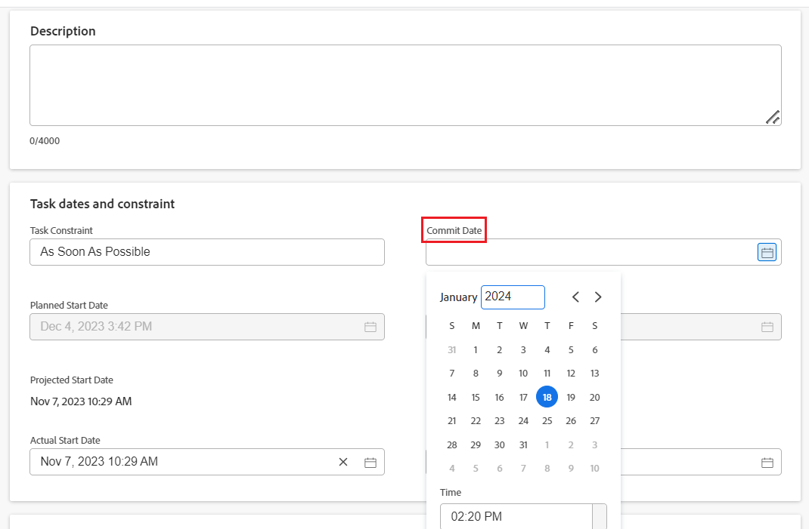

# Aktualisieren der Daten zum Bestätigen von Aufgaben und Problemen

Sie können das Übermittlungsdatum einer Aufgabe oder eines Problems, dem Sie zugewiesen sind, manuell aktualisieren. Weitere Informationen zum Festlegen von Datumswerten in Adobe Workfront finden Sie unter [Datum bestätigen - Übersicht](../../../manage-work/projects/updating-work-in-a-project/overview-of-commit-dates.md).

## Zugriffsanforderungen

<!--Audited: 01/2024-->

Sie müssen über folgenden Zugriff verfügen, um die Schritte in diesem Artikel ausführen zu können:

<table style="table-layout:auto"> 
 <col> 
 <col> 
 <tbody> 
  <tr> 
   <td role="rowheader">Adobe Workfront-Plan*</td> 
   <td> 
Alle
 </td> 
  </tr> 
  <tr> 
   <td role="rowheader">Adobe Workfront-Lizenz*</td> 
   <td> 
   Für die neuen Lizenzen:
   <ul>
   <li>
Standard für Aufgaben
 </li>
   <li>
Beitragende oder höher für Probleme
</li>
   </ul>
   Für aktuelle Lizenzen:
<ul>
   <li>
Arbeit oder höher für Aufgaben
</li> 
   <li>
Anfrage oder höher für Probleme
</li>
</ul>

</td> 
  </tr> 
  <tr> 
   <td role="rowheader">Konfigurationen auf Zugriffsebene</td> 
   <td> 
Zugriff auf Aufgaben und Probleme bearbeiten
 </td> 
  </tr> 
  <tr> 
   <td role="rowheader">Objektberechtigungen</td> 
   <td> 
Berechtigungen für Aufgaben oder Probleme verwalten
 </td> 
  </tr> 
 </tbody> 
</table>

*Wenden Sie sich an Ihren Workfront-Administrator, um zu erfahren, welchen Plan, welchen Lizenztyp oder welchen Zugriff Sie haben. Weitere Informationen finden Sie unter [Zugriffsanforderungen in der Dokumentation zu Workfront](/help/quicksilver/administration-and-setup/add-users/access-levels-and-object-permissions/access-level-requirements-in-documentation.md).

## Voraussetzungen

Bevor Sie beginnen, müssen Sie der Aufgabe oder dem Problem zugewiesen sein, für die Sie das Veröffentlichungsdatum aktualisieren müssen.

## Aktualisieren der Daten zum Bestätigen von Aufgaben und Problemen

Die Aktualisierung des Veröffentlichungsdatums ist für Aufgaben und Probleme identisch.

1. Gehen Sie zu einer Aufgabe oder einem Problem, die bzw. dem Sie als **Inhaber**.

   Weitere Informationen dazu, wie Sie herausfinden, wer der Aufgabeneigentümer für ein Problem oder eine Aufgabe ist, finden Sie im Abschnitt [Aufgaben bearbeiten](../../../manage-work/tasks/manage-tasks/edit-tasks.md#assignments) im Artikel [Aufgaben bearbeiten](../../../manage-work/tasks/manage-tasks/edit-tasks.md).

1. Klicks **Aufgabendetails** oder **Problemdetails** im linken Bereich.
1. Klicks **Übersicht** um sie zu erweitern.
1. Aktualisieren Sie die **Datum der Übermittlung** -Feld.

   

1. Klicks **Änderungen speichern**.

   Nach dieser Änderung geschieht Folgendes: 

   * Das Datum der Übermittlung und das geplante Abschlussdatum der Aufgabe bzw. des Problems sind nicht mehr dasselbe.

     Stattdessen werden das Bestätigungsdatum und das geplante Abschlussdatum der Aufgabe oder des Problems identisch.

     

   * Wenn Sie den Bereich &quot;Veraltete Aktualisierungen&quot;verwenden, wird der Projekteigentümer darüber informiert, dass Sie ein neues Zustellungsdatum für die Aufgabe oder das Problem vorgeschlagen haben. Er kann zu diesem Zeitpunkt das geplante Abschlussdatum der Aufgabe oder des Problems entsprechend dem von Ihnen vorgeschlagenen Zustimmungsdatum aktualisieren. Diese Funktion wird im neuen Kommentierungserlebnis nicht unterstützt. Weitere Informationen finden Sie unter [Die neue Kommentarfunktion](/help/quicksilver/product-announcements/betas/new-commenting-experience-beta/unified-commenting-experience.md).

     

     Informationen zu den Benachrichtigungen und Aktualisierungen, die durch diese Änderung ausgelöst werden, finden Sie im Abschnitt . [Durch Änderung des Zusagedatums ausgelöste Benachrichtigungen und Aktualisierungen](../../../manage-work/projects/updating-work-in-a-project/overview-of-commit-dates.md#notifica) im Artikel [Datum bestätigen - Übersicht](../../../manage-work/projects/updating-work-in-a-project/overview-of-commit-dates.md).
