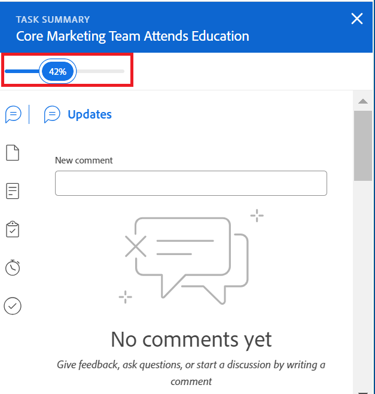

# Prozentsatz für Abgeschlossene Aufgaben anzeigen und aktualisieren

<!--Audited:01/2024-->

Sie können den Prozentsatz der Abschlüsse einer Aufgabe aktualisieren, um den Fortschritt anzugeben, den Sie bei der Erfüllung der Aufgabe erzielt haben.

## Zugriffsanforderungen

+++ Erweitern Sie , um die Zugriffsanforderungen für die Funktionalität in diesem Artikel anzuzeigen.

Sie müssen über folgenden Zugriff verfügen, um Aufgaben manuell aktualisieren zu können:

<table style="table-layout:auto"> 
 <col> 
 <col> 
 <tbody> 
  <tr> 
   <td role="rowheader">Adobe Workfront-Abo</td> 
   <td> 
Alle
 </td> 
  </tr> 
  <tr> 
   <td role="rowheader">Adobe Workfront-Lizenz*</td> 
   <td> 
Neue Lizenz: Standard
 
   Oder
   
Aktuelle Lizenz: Arbeite oder höher

   </td> 
  </tr> 
  <tr> 
   <td role="rowheader">Konfigurationen auf Zugriffsebene</td> 
   <td> 
Zugriff auf Aufgaben bearbeiten
 </td> 
  </tr> 
  <tr> 
   <td role="rowheader">Objektberechtigungen</td> 
   <td> 
Berechtigungen für die Aufgabe verwalten
  </td> 
  </tr> 
 </tbody> 
</table>

*Weitere Informationen finden Sie unter [Zugriffsanforderungen in der Workfront-Dokumentation](/help/quicksilver/administration-and-setup/add-users/access-levels-and-object-permissions/access-level-requirements-in-documentation.md).

+++

## Bereiche, in denen der prozentuale Abschluss einer Aufgabe aktualisiert werden kann

Sie können den Prozentsatz der Abschlüsse für eine Aufgabe in einem der folgenden Bereiche aktualisieren:

* **In einer Aufgabenliste**: Sie können den Prozentsatz des Abschlusses einer Aufgabe aktualisieren, wenn die Spalte &quot;Prozent abgeschlossen&quot;angezeigt wird.\
  Weitere Informationen zur Inline-Bearbeitung finden Sie unter [Inline-Bearbeitung von Elementen in einer Liste in Adobe Workfront](../../../workfront-basics/navigate-workfront/use-lists/inline-edit-objects.md).

* **In der Meilensteinansicht**: Sie können den Prozentsatz der Abschlüsse einer Aufgabe aktualisieren, wenn Sie die Meilensteinansicht in einer Projektliste oder einem Projektbericht verwenden. Weitere Informationen finden Sie unter [Verwenden der Meilensteinansicht](../../../reports-and-dashboards/reports/reporting-elements/use-milestone-view.md).

<!--only in legacy commenting: 
* **As you update the task**:  You can update the percent complete option of a task when adding an update to the task.

  >[!IMPORTANT]
  >
  >This option displays only after you enable the Show Percent Complete option.  
  >To enable the percent complete update bar for tasks, do the following:   
  >
  >1. Go to the **Main** menu>your name>**More** icon next to your name >**Edit** > select **Show percent complete on update status**.   
  >  >-->

* **In der Aufgabenkopfzeile**: Sie können den Prozentsatz der Abschlüsse einer Aufgabe in der Aufgabenkopfzeile aktualisieren. Weitere Informationen finden Sie unter [Aufgaben bearbeiten](../../tasks/manage-tasks/edit-tasks.md).

  

* **Im Bereich &quot;Zusammenfassung&quot;einer Aufgabe**: Sie können den Prozentsatz der Abschlüsse einer Aufgabe am oberen Rand des Bereichs &quot;Zusammenfassung&quot;aktualisieren, wenn Sie die Aufgabe in den folgenden Bereichen anzeigen:

   * Aufgabenliste oder Bericht
   * Arbeitszeittabelle
   * Workload Balancer

  

  Weitere Informationen finden Sie unter [Übersicht der Zusammenfassung](/help/quicksilver/workfront-basics/the-new-workfront-experience/summary-overview.md)

* **Startseite**: Sie können den prozentualen Abschluss einer Aufgabe oder eines Problems über das Bedienfeld &quot;Zusammenfassung&quot;im Bereich &quot;Startseite&quot;oder über das Widget &quot;Meine Arbeit&quot;aktualisieren.

  Weitere Informationen finden Sie unter [Erste Schritte mit der Startseite](/help/quicksilver/workfront-basics/using-home/using-the-home-area/get-started-with-home.md).

## Überlegungen zum Aktualisieren des prozentualen Abschlusses einer Aufgabe

* Wenn Sie eine Aufgabe als zu 100 % abgeschlossen markieren, wird der Aufgabenstatus auf &quot;Abgeschlossen&quot;aktualisiert.
* Für übergeordnete Aufgaben gibt es die folgenden Szenarien:
   * Sie können den prozentualen Abschluss einer übergeordneten Aufgabe nicht auf 100 % aktualisieren, wenn der Zusammenfassungsabschlussmodus des Projekts auf Automatisch eingestellt ist und die Unteraufgaben nicht abgeschlossen sind.
   * Sie können den Prozentsatz der Abschlüsse einer übergeordneten Aufgabe auf 100 % aktualisieren, wenn für den Zusammenfassungsabschlussmodus des Projekts &quot;Manuell&quot;festgelegt ist und die Unteraufgaben abgeschlossen oder unvollständig sind.

  Weitere Informationen finden Sie unter [Projekte bearbeiten](../manage-projects/edit-projects.md).

## Prozentsatz des Abschlusses einer Aufgabe aktualisieren

1. Navigieren Sie zu einem der folgenden Bereiche in Workfront:

   * Aufgabenliste
   * Eine Liste von Projekten und Anwendung der Milestone-Ansicht
   * Aufgabe durch Zugriff auf die Aufgabenseite
1. Suchen Sie das Feld **Prozent abgeschlossen** für die Aufgabe, deren Prozentsatz aktualisiert werden soll.

   >[!TIP]
   >
   >  Das Feld &quot;Prozent abgeschlossen&quot;wird immer oben im Bedienfeld &quot;Zusammenfassung&quot;angezeigt.

1. Klicken Sie in das Feld **Prozent abgeschlossen** und geben Sie eine Zahl zwischen 0 und 100 ein.

   Oder

   Klicken Sie auf die Leiste &quot;**Prozent abgeschlossen**&quot;und ziehen Sie sie auf die erforderliche Zahl, um anzugeben, wie viel der Aufgaben Sie abgeschlossen haben (sofern verfügbar).

   >[!NOTE]
   >
   >Wenn Sie angeben, dass 100 % der Aufgabe abgeschlossen ist, wird der Status der Aufgabe auch auf &quot;Abgeschlossen&quot;aktualisiert.

1. Drücken Sie die Eingabetaste in der Tastatur, um den Prozentsatz vollständig zu speichern.

Die Prozent abgeschlossen des Projekts wird ebenfalls automatisch aktualisiert.

