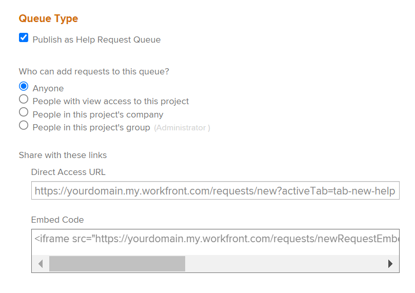
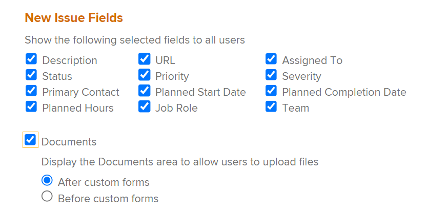

# Erstellen einer Anforderungswarteschlange

<!--
<THIS IS CONNECTED TO THE PRODUCT IN BLUEPRINTS. DO NOT MOVE/ CHANGE URL>
-->

Sie können eine Anforderungswarteschlange einrichten, in die Benutzer gelegentliche Anforderungen eingeben können, die für ein Projekt nicht geplant sind. Beispielsweise kann eine Helpdesk-Anforderungswarteschlange eingerichtet werden, um alle Benutzeranforderungen zu erfassen, die an eine IT-Abteilung gesendet werden.

## Zugriffsanforderungen

<!--drafted for P&P: replace the table below with this:

<table style="table-layout:auto"> 
 <col> 
 <col> 
 <tbody> 
  <tr> 
   <td role="rowheader">Adobe Workfront plan*</td> 
   <td> 
Any 
 </td> 
  </tr> 
  <tr> 
   <td role="rowheader">Adobe Workfront license*</td> 
   <td> 
   
Current license: Stadard 

   Or
   
Legacy license: Plan 
 </td> 
  </tr> 
  <tr> 
   <td role="rowheader">Access level configurations*</td> 
   <td> 
Edit access to Projects
 
<b>NOTE</b> 
   
   If you still don't have access, ask your Workfront administrator if they set additional restrictions in your access level. For information on how a Workfront administrator can modify your access level, see <a href="../../../administration-and-setup/add-users/configure-and-grant-access/create-modify-access-levels.md" class="MCXref xref">Create or modify custom access levels</a>.
 </td> 
  </tr> 
  <tr> 
   <td role="rowheader">Object permissions</td> 
   <td> 
 Manage permissions to the project
 
For information on requesting additional access, see <a href="../../../workfront-basics/grant-and-request-access-to-objects/request-access.md" class="MCXref xref">Request access to objects </a>.
 </td> 
  </tr> 
 </tbody> 
</table>

&#42;To find out what plan, license type, or access you have, contact your Workfront administrator
-->

Sie müssen über folgenden Zugriff verfügen, um die Schritte in diesem Artikel ausführen zu können:

<table style="table-layout:auto"> 
 <col> 
 <col> 
 <tbody> 
  <tr> 
   <td role="rowheader">Adobe Workfront-Plan*</td> 
   <td> 
Beliebig 
 </td> 
  </tr> 
  <tr> 
   <td role="rowheader">Adobe Workfront-Lizenz*</td> 
   <td> 
Plan 
 </td> 
  </tr> 
  <tr> 
   <td role="rowheader">Konfigurationen auf Zugriffsebene*</td> 
   <td> 
Zugriff auf Projekte bearbeiten
 
Hinweis: Wenn Sie immer noch keinen Zugriff haben, fragen Sie Ihren Workfront-Administrator, ob er zusätzliche Zugriffsbeschränkungen für Ihre Zugriffsebene festlegt. Informationen dazu, wie ein Workfront-Administrator Ihre Zugriffsebene ändern kann, finden Sie unter <a href="../../../administration-and-setup/add-users/configure-and-grant-access/create-modify-access-levels.md" class="MCXref xref">Benutzerdefinierte Zugriffsebenen erstellen oder ändern</a>.
 </td> 
  </tr> 
  <tr> 
   <td role="rowheader">Objektberechtigungen</td> 
   <td> 
 Berechtigungen für das Projekt verwalten
 
Informationen zum Anfordern von zusätzlichem Zugriff finden Sie unter <a href="../../../workfront-basics/grant-and-request-access-to-objects/request-access.md" class="MCXref xref">Zugriff auf Objekte anfordern </a>.
 </td> 
  </tr> 
 </tbody> 
</table>

&#42;Wenden Sie sich an Ihren Workfront-Administrator, um zu erfahren, welchen Plan, welchen Lizenztyp oder welchen Zugriff Sie haben

## Übersicht über Anforderungswarteschlangen

Sie richten eine Anforderungswarteschlange als Projekt ein. Wenn Sie das Projekt als Anforderungswarteschlange festlegen, wird die Warteschlange über den Anforderungsbereich von Adobe Workfront zugänglich. Wenn Sie die Anforderungswarteschlange anpassen, passen Sie auch die Formularbenutzer an, die beim Senden der Anforderungen ausgefüllt werden.

In diesem Artikel wird beschrieben, wie Sie eine Anforderungswarteschlange aus einem vorhandenen Projekt erstellen. Um jedoch Konsistenz für Ihren Anfrageaufnahmeprozess zu schaffen oder mehrere Ebenen zu Berichtszwecken und einer besseren Verwaltung hinzuzufügen, können Sie auch zusätzliche Bausteine einer Anforderungswarteschlange konfigurieren, die in der folgenden Tabelle beschrieben werden.

<table style="table-layout:auto"> 
 <col> 
 <col> 
 <tbody> 
  <tr> 
   <td role="rowheader">Warteschlangendetails</td> 
   <td> 
Sie müssen ein Projekt als Anforderungswarteschlange im Bereich Warteschlangendetails einrichten. Dieser Schritt ist obligatorisch. 
 
Weitere Informationen finden Sie unter <a href="#create-a-request-queue" class="MCXref xref">Erstellen einer Anforderungswarteschlange</a> in diesem Artikel.
 </td> 
  </tr> 
  <tr> 
   <td role="rowheader">Themengruppen</td> 
   <td> 
Es handelt sich dabei um zusätzliche Menüs, mit denen Anforderungen basierend auf allgemeinen Funktionen klassifiziert werden. Beispielsweise könnten Sie für eine IT-Anforderungswarteschlange Themengruppen "On-site"und "Remote"verwenden. 
 
Weitere Informationen finden Sie unter <a href="../../../manage-work/requests/create-and-manage-request-queues/create-topic-groups.md" class="MCXref xref">Themengruppen erstellen</a>. 
 
Dies ist optional.
 </td> 
  </tr> 
  <tr> 
   <td role="rowheader">Warteschlangenthemen</td> 
   <td> 
Es handelt sich dabei um zusätzliche Menüs, mit denen Anforderungen klassifiziert werden, die zu derselben Themengruppe gehören, basierend auf allgemeinen Funktionen. Eine Themengruppe kann mehrere Warteschlangenthemen enthalten. 
 
Beispielsweise kann die Themengruppe "On-site"für die IT-Anforderungswarteschlange die Themen "Hardware", "Software"und "Netzwerk"enthalten. 
 
Weitere Informationen finden Sie unter <a href="../../../manage-work/requests/create-and-manage-request-queues/create-queue-topics.md" class="MCXref xref">Erstellen von Warteschlangenthemen</a>. 
 
Dies ist optional.
 </td> 
  </tr> 
  <tr> 
   <td role="rowheader">Routing-Regeln</td> 
   <td> 
Sie ermöglichen es Ihnen, jede Anfrage an einen Benutzer, eine Jobrolle, ein Team oder ein Projekt zu leiten. 
 
Weitere Informationen finden Sie unter <a href="../../../manage-work/requests/create-and-manage-request-queues/create-routing-rules.md" class="MCXref xref">Erstellen von Routing-Regeln</a>. 
 
Dies ist optional.
 </td> 
  </tr> 
 </tbody> 
</table>

## Erstellen einer Anforderungswarteschlange

Wenn Sie ein Projekt als Anforderungswarteschlange einrichten, muss der Projektstatus Aktuell sein, damit er im Anforderungsbereich von Workfront angezeigt wird.

So erstellen Sie eine Anforderungswarteschlange:

1. Wechseln Sie zu dem Projekt, das Sie als Anforderungswarteschlange einrichten möchten.
1. (Optional) Klicken Sie auf **Projektdetails** im linken Bereich und fügen Sie eine **Beschreibung** im Projekt **Übersicht** Bereich. Diese Informationen werden bei allen neuen Anforderungen angezeigt.
1. Klicken **Warteschlangendetails** im linken Bereich. Möglicherweise müssen Sie auf **Mehr anzeigen**, dann **Warteschlangendetails**.

   Dadurch wird der Abschnitt Warteschlangendetails geöffnet.

   

1. Geben Sie die folgenden Informationen an:

   * **Als Warteschlange für Hilfeanfragen veröffentlichen:** Wählen Sie diese Option aus, um dieses Projekt als Anforderungswarteschlange zu identifizieren. Alle eingehenden Probleme werden als Anforderungen betrachtet.\
      Wenn diese Option nicht ausgewählt ist, verhält sich das Projekt wie ein Standardprojekt in Workfront und alle eingehenden Probleme sind Probleme.

   * **Wer kann dieser Warteschlange Anforderungen hinzufügen?** Wählen Sie aus, welche Benutzer Zugriff haben, um Anforderungen zu dieser Warteschlange hinzuzufügen. Sie können den folgenden Gruppen von Personen erlauben, die Anforderungswarteschlange in ihrem Anforderungsbereich in der globalen Navigationsleiste anzuzeigen:

      | Wer kann Anforderungen eingeben? | Beschreibung |
      |---|---|
      | Jeder | Jeder Workfront-Benutzer mit einem aktiven Konto kann diese Anforderungswarteschlange anzeigen und Anforderungen hinzufügen |
      | Benutzer mit Ansichtszugriff auf dieses Projekt | Benutzer mit Anzeigeberechtigungen für das Projekt können Anforderungen anzeigen und dieser Warteschlange hinzufügen |
      | Personen im Unternehmen dieses Projekts | Benutzer, die zum mit diesem Projekt verbundenen Unternehmen gehören, können Anforderungen anzeigen und dieser Warteschlange hinzufügen. Wenn mit dem Projekt ein Unternehmen verknüpft ist, wird der Name des Unternehmens nach dieser Einstellung in Klammern aufgeführt. |
      | Personen in der Gruppe dieses Projekts | Benutzer, die zu der mit diesem Projekt verknüpften Gruppe gehören, können Anforderungen anzeigen und dieser Warteschlange hinzufügen. Wenn dem Projekt eine Gruppe zugeordnet ist, wird der Name der Gruppe nach dieser Einstellung in Klammern aufgeführt. |

      {style="table-layout:auto"}

   * **Über diese Links freigeben:** Mit den folgenden Optionen können Sie Benutzern außerhalb von Workfront oder Workfront-Benutzern über eine externe Seite direkten Zugriff auf die Anforderungswarteschlange und die damit verknüpften Formulare gewähren. Informationen zum Einbetten einer Anforderungswarteschlange in ein Dashboard als externe Seite finden Sie unter [Einbetten einer Anforderungswarteschlange in ein Dashboard](../../../reports-and-dashboards/dashboards/creating-and-managing-dashboards/embed-request-queue-dashboard.md).

      Benutzer müssen bereits über Zugriffsrechte für die Anforderungswarteschlange verfügen, um direkten Zugriff zu erhalten. Die Verwendung einer der hier beschriebenen Optionen gewährt Benutzern nicht automatisch Zugriff.

      >[!TIP]
      >
      >Benutzer müssen sich zunächst bei Workfront anmelden, bevor sie über eine andere Anwendung auf die Seite &quot;Anforderungswarteschlange&quot;zugreifen können.

      * **Direct Access URL:** Wenn ein Benutzer von einem Browser aus auf diese URL zugreift, wird der Benutzer direkt zum Abschnitt &quot;Neue Anforderung&quot;im Bereich &quot;Anforderungen&quot;geleitet und diese Anforderung ist standardmäßig für ihn ausgewählt.

         

         >[!NOTE]
         >
         >Sie können eine Anforderungswarteschlange in einem Dashboard als externe Seite anzeigen. In diesem Fall ist die Anforderungswarteschlange vorausgewählt, Sie können jedoch eine beliebige andere Anforderungswarteschlange aus dem Feld Anforderungstyp auswählen. Benutzer können den Anfragetyp ändern. Navigationskomponenten der Anforderungen werden ebenfalls angezeigt.

      * **Einbettungscode:** Verwenden Sie diesen HTML-Code, um das Anforderungswarteschlangenformular als iFrame auf einer beliebigen HTML-Seite einzubetten.\
         Wenn Benutzer nicht bereits bei Workfront authentifiziert sind, wenn sie die Seite anzeigen, auf der der Code eingebettet ist, wird das Dialogfeld für die Workfront-Anmeldung angezeigt. Nach der Anmeldung eines Benutzers wird das Formular für die Anforderungswarteschlange angezeigt.

         

         >[!NOTE]
         Beim Anzeigen einer Anforderungswarteschlange in einem iFrame wird nur das Anforderungsformular angezeigt. Der Anforderungsname ist vorausgewählt und abgeblendet. Der Benutzer kann den Anfragetyp nicht ändern. Navigationskomponenten des Anforderungsbereichs werden nicht angezeigt.

         Damit das Anforderungswarteschlangenformular bei Verwendung dieses Einbettungscodes angezeigt wird, müssen Sie die Einstellung &quot;Einbetten von Workfront in einen iframe zulassen&quot;in Ihrem System-Setup aktivieren. Weitere Informationen zum Aktivieren der Einbettung von Workfront in einen iFrame finden Sie unter [Systemsicherheitsvoreinstellungen konfigurieren](../../../administration-and-setup/manage-workfront/security/configure-security-preferences.md). Wenn diese Einstellung nicht aktiviert ist, wird der iframe als leer angezeigt.

         Sie können verschiedene Aspekte der Darstellung des eingebetteten Formulars wie folgt anpassen:

         <table border="1" cellspacing="15"> 
         <col> 
         <col> 
         <thead> 
          <tr> 
           <th> 
<strong>Funktionalität</strong> 
 </th> 
           <th> 
<strong>Lösung</strong> 
 </th> 
          </tr> 
         </thead> 
         <tbody> 
          <tr> 
           <td> 
Anpassen der Rahmengröße
 </td> 
           <td> 
Ändern Sie die Attribute "Breite"und "Höhe".
 
Standardmäßig ist die Breite "500"und die Höhe "600".
 </td> 
          </tr> 
          <tr> 
           <td> 
Benutzer zu einem bestimmten Warteschlangenthema oder einer bestimmten Themengruppe leiten
 </td> 
           <td> 
Fügen Sie den Parameter "path"zur src-URL hinzu. Sie können den Pfadparameter finden, indem Sie zum gewünschten Warteschlangenthema oder zur gewünschten Themengruppe im nicht eingebetteten Formular navigieren und die URL überprüfen.
 </td> 
          </tr> 
          <tr> 
           <td> 
Anzeigen und Ermöglichen von Benutzern, die vorkonfigurierte Dropdownliste "Themengruppe"zu ändern
 </td> 
           <td> 
Verwenden Sie den Parameter "path", indem Sie die <code>showPreSelectedOptions=true</code> -Parameter <code>src URL</code>.
 </td> 
          </tr> 
          <tr> 
           <td> 
Erkennen, wann das Formular gesendet wurde
 </td> 
           <td> 
Fügen Sie einen Ereignis-Listener "message"zum Fenster Ihrer Web-Seite hinzu und überprüfen Sie, ob <code>event.data.type</code> is <code>requestSubmitted</code>. <code>event.data.newIssueID</code> wird auf die ID des erstellten Problems gesetzt.
 </td> 
          </tr> 
         </tbody> 
        </table>
   * **Anfragetypen:** Wählen Sie aus den folgenden Standardoptionen aus.

      Der Workfront-Administrator kann die standardmäßigen Anfragetypen umbenennen. Weitere Informationen zum Umbenennen der Anfragetypen finden Sie unter [Anpassen von Standardausgabetypen](../../../administration-and-setup/set-up-workfront/configure-system-defaults/customize-default-issue-types.md).

      * Reihenfolge ändern
      * Problem
      * Anforde- rungen
      * Risiko

         Dies ist ein erforderliches Feld und Sie müssen mindestens eine Option auswählen.
      >[!NOTE]
      Anfragetypen werden nur dann als Auswahl im Bereich Anforderungen angezeigt, wenn der Anfragetyp sowohl auf den Seiten Warteschlangendetails als auch Warteschlangenthema ausgewählt ist. Informationen zum Einrichten des Bereichs &quot;Queue Details&quot;eines Projekts finden Sie unter [Erstellen von Warteschlangenthemen](../../../manage-work/requests/create-and-manage-request-queues/create-queue-topics.md).

      Jeder hier ausgewählte Typ steht im Formular zur Verfügung (Sie können mehrere Typen auswählen). Die Auswahl von mehr als einem Typ kann dabei helfen, mehrere eingehende Anfragen zu organisieren.\
      Wenn Sie beispielsweise das Formular in einer Anforderungswarteschlange für ein IT-Projekt verwenden, können die folgenden Anforderungstypen in die Warteschlange eingehen: Hardware, Software, Fehlerbehebungen und Probleme.

   * **Standarddauer:** Die Standarddauer ist die Zeitdauer, die normalerweise zum Abschließen eines Problems benötigt wird. Dies wird zur Standardeinstellung für alle eingehenden Probleme und kann manuell geändert werden. Die Dauer wird in der Regel in Stunden, Tagen oder Wochen festgelegt. Die Standarddauer eines Problems ist dieselbe wie die geplanten Stunden zu diesem Problem. Das geplante Abschlussdatum des Problems wird auf dieser Grundlage berechnet.\
      Die Standarddauer für die Problemdauer beträgt 1 Tag oder 8 Stunden. Wenn Ihr Workfront-Administrator die typischen Stunden pro Arbeitstag auf weniger als 8 Stunden festlegt, beträgt die Standarddauer für Probleme immer noch 8 Stunden. Wenn beispielsweise die typische Dauer pro Arbeitstag auf 7 Stunden festgelegt ist, beträgt die Standarddauer für Probleme 1,14 Tage oder 8 Stunden. Weitere Informationen zum Einrichten der typischen Stunden pro Arbeitstag finden Sie im Abschnitt &quot;Timeline-Berechnungen&quot;im Artikel [Systemweite Projektvoreinstellungen konfigurieren](../../../administration-and-setup/set-up-workfront/configure-system-defaults/set-project-preferences.md).

   * **Benutzer aus demselben Unternehmen erben dieselben Berechtigungen für alle Anforderungen.:** Wenn diese Option aktiviert ist, sind alle an die Warteschlange gesendeten Anforderungen für Benutzer im selben Unternehmen sichtbar. Benutzer können diese Anforderungen im Abschnitt Alle Anforderungen im Bereich Anforderungen anzeigen. Wenn diese Einstellung aktiviert oder deaktiviert ist, wirkt sich dies auf alle zukünftigen Anforderungen aus. keine rückwirkenden Auswirkungen auf Informationen.
   * **Wenn jemand eine Anfrage stellt, gewähren Sie automatisch Folgendes:** Wenn ein Benutzer eine Anforderung an die Anforderungswarteschlange sendet, wird dem Benutzer automatisch die für diese Anforderung ausgewählte Berechtigungsstufe zugewiesen. Wählen Sie aus den folgenden Berechtigungsebenen aus:

      * **Anzeigen**
      * **Mitwirken**. Dies ist die Standardauswahl.
      * **Verwalten**
      Weitere Informationen zum Workfront-Berechtigungsmodell finden Sie unter [Übersicht über die Freigabe von Berechtigungen für Objekte](../../../workfront-basics/grant-and-request-access-to-objects/sharing-permissions-on-objects-overview.md).\
      Durch das Festlegen von Berechtigungen hier sparen Sie Zeit, anstatt Berechtigungen für jede einzelne eingehende Anfrage erteilen zu müssen. Die Auswahl dieser Option wirkt sich auf alle zukünftigen Anforderungen aus, wirkt sich jedoch nicht rückwirkend auf vorhandene Anforderungen aus.

   * **Standardgenehmigung**: Ordnen Sie dieser Anforderungswarteschlange einen Validierungsprozess zu. In diesem Dropdown-Menü werden nur die Prozesse zur Genehmigung von Problemen angezeigt. Alle an diese Warteschlange gesendeten Probleme werden diesem Genehmigungsprozess zugeordnet. Ihr Workfront-Administrator muss Genehmigungsprozesse auf Systemebene definieren, bevor Sie sie mit Anforderungswarteschlangen verknüpfen können. Benutzer mit Administratorzugriff auf Genehmigungsprozesse können auch gruppenspezifische Validierungsprozesse erstellen.

      >[!IMPORTANT]
      Wenn sich die Gruppe des Projekts ändert, wird der gruppenspezifische Genehmigungsprozess, der an bestehende Probleme angehängt ist, zu einem Genehmigungsprozess für einzelne Anwendungen. Weitere Informationen dazu, wie sich Änderungen an der Projektgruppe oder Änderungen im Genehmigungsprozess auf die Validierungseinstellungen auswirken, finden Sie unter [Auswirkungen von Änderungen am Gruppen- und Genehmigungsprozess auf zugewiesene Genehmigungsprozesse](../../../administration-and-setup/customize-workfront/configure-approval-milestone-processes/how-changes-affect-group-approvals.md).

      Wenn Sie mit einer Anforderungswarteschlange mehrere Warteschlangenthemen verknüpft haben, empfehlen wir, stattdessen Genehmigungsprozesse mit den Warteschlangenthemen zu verknüpfen. Weitere Informationen zum Erstellen von Warteschlangenthemen finden Sie unter [Erstellen von Warteschlangenthemen](../../../manage-work/requests/create-and-manage-request-queues/create-queue-topics.md).

      Beachten Sie beim Hinzufügen von Genehmigungsprozessen zu Anforderungswarteschlangen Folgendes:

      * In der Liste werden nur aktive Validierungsprozesse angezeigt.
      * Systemweite und gruppenspezifische Validierungsprozesse werden in der Liste angezeigt. Ein Genehmigungsprozess, der mit einer anderen Gruppe als der des Projekts verknüpft ist, wird nicht in der Liste angezeigt.
   * **Standardroute**: Weisen Sie dieser Anforderungswarteschlange eine Routing-Regel zu. Mit Routing-Regeln können Sie der richtigen Ressource (Benutzer, Auftragsrolle oder Team) und dem richtigen Projekt automatisch neue Probleme zuweisen, die an eine Anforderungswarteschlange gesendet werden. Alle Probleme, die an diese Warteschlange gesendet werden, werden mit dieser Routing-Regel verknüpft. Sie müssen Routing-Regeln konfigurieren, bevor Sie sie mit der Anforderungswarteschlange verknüpfen können.\
      Wenn einer Anforderungswarteschlange mehrere Warteschlangenthemen zugeordnet sind, empfehlen wir, stattdessen Routing-Regeln mit den Warteschlangenthemen zu verknüpfen. Weitere Informationen zum Erstellen von Routing-Regeln finden Sie unter [Erstellen von Routing-Regeln](../../../manage-work/requests/create-and-manage-request-queues/create-routing-rules.md).

   * **Neue Ausgabefelder:** Wählen Sie im Abschnitt Alle Benutzer mit den folgenden ausgewählten Feldern anzeigen alle Felder aus, die für alle Benutzer sichtbar sein sollen, die eine Anforderung an das Projekt senden oder dem Projekt oder den Aufgaben ein Problem hinzufügen.

      >[!TIP]
      Neue Problemfelder, die im Abschnitt &quot;Warteschlangendetails&quot;ausgewählt sind, sind auch mit neuen Problemen verknüpft, die dem Projekt oder den Aufgaben im Abschnitt Probleme hinzugefügt wurden.

      Wenn Sie die Felder &quot;Zugeordnet&quot;, &quot;Auftragsrolle&quot;oder &quot;Team&quot;aktivieren, werden sie im Anfrageformular immer in &quot;Zuweisungen&quot;umbenannt. Sie können jedoch nur den hier ausgewählten Zuweisungstyp angeben.

      >[!NOTE]
      Wenn Sie im Bereich &quot;Warteschlangendetails&quot;die Option &quot;Zugeordnet&quot;ausgewählt haben, können Sie im Anfrageformular nur Benutzer in das Feld &quot;Zuweisungen&quot;eingeben. In diesem Fall können Sie keine Jobrollen oder Teams eingeben.

   * **Dokumente**: Wenn Sie im neuen Anfrageformular den Abschnitt Dokumente anzeigen möchten, wählen Sie aus, wo der Abschnitt zum Hochladen des Dokuments positioniert werden soll. Wählen Sie aus den folgenden Optionen aus:

      <table style="table-layout:auto"> 
      <col> 
      <col> 
      <tbody> 
       <tr> 
        <td role="rowheader">Nach benutzerdefinierten Formularen</td> 
        <td>Der Abschnitt Dokumente wird unten im Anfrageformular angezeigt. </td> 
       </tr> 
       <tr> 
        <td role="rowheader">Vor benutzerdefinierten Formularen</td> 
        <td> 
Der Abschnitt "Dokumente"wird zwischen den Workfront-Feldern und den benutzerdefinierten Feldern des Anfrageformulars angezeigt. 
 </td> 
       </tr> 
      </tbody> 
     </table>

      

   * **Alle ausgewählten und nicht ausgewählten Felder anzeigen für:** Wählen Sie aus, welche Benutzer alle Felder im Formular sehen sollen. Die folgenden Optionen steuern den Zugriff auf die Felder im Formular.

      | Welche Benutzer können alle Felder im Anfrageformular sehen? | Beschreibung |
      |---|---| 
      | Alle Benutzer (Lizenzen planen) | Alle Benutzer mit einer Planungslizenz können sowohl die ausgewählten als auch die nicht ausgewählten Felder sehen. |
      | Personen mit Ansichtszugriff auf dieses Projekt (Planlizenz) | Benutzer mit einer Planlizenz, die ebenfalls Ansichtsrechte für dieses Projekt haben, können sowohl die ausgewählten als auch die nicht ausgewählten Felder sehen. Die übrigen Benutzer, die Anfragen an dieses Projekt senden können, sehen nur die ausgewählten Felder. |
      | Keine Benutzer | Die nicht ausgewählten Felder werden keinem Benutzer angezeigt. Alle Benutzer, die Anforderungen an dieses Projekt senden können, sehen nur die ausgewählten Felder. |

   * **Benutzerdefinierte Forms**: Wählen Sie ein benutzerdefiniertes Formular aus, das mit der Anforderungswarteschlange verknüpft werden soll. In diesem Dropdownmenü können Sie nur die Option Benutzerdefinierte Forms für Probleme auswählen. Bei allen an die Anforderungswarteschlange gesendeten Problemen sind die ausgewählten Formulare ihnen zugeordnet.\
      Wenn mehrere Warteschlangenthemen mit einer Anforderungswarteschlange verknüpft sind, empfehlen wir, benutzerdefinierte Formulare stattdessen mit den Warteschlangenthemen zu verknüpfen. Weitere Informationen zum Erstellen von Unterabschnitten für die Anforderungswarteschlange finden Sie unter [Erstellen von Warteschlangenthemen](../../../manage-work/requests/create-and-manage-request-queues/create-queue-topics.md).

      Wenn mehrere benutzerdefinierte Formulare mit der Anforderungswarteschlange verknüpft sind, ziehen Sie die Formulare in die gewünschte Reihenfolge, um sie in der **Forms neu anordnen** Abschnitt.

      >[!TIP]
      Benutzerdefinierte Formulare, die dem Abschnitt &quot;Warteschlangendetails&quot;hinzugefügt werden, sind auch mit neuen Problemen verknüpft, die dem Projekt oder den Aufgaben im Abschnitt &quot;Probleme&quot;hinzugefügt wurden.

1. Fahren Sie mit der Auswahl der Informationen für die Einstellungen im **E-Mail-Warteschlangeneinstellungen** -Bereich, damit Benutzer Anfragen per E-Mail an das Projekt in der Anforderungswarteschlange senden können.

   Weitere Informationen finden Sie unter [Benutzer können ein Problem per E-Mail an ein Anforderungswarteschlangenprojekt senden](../../../manage-work/requests/create-requests/enable-email-issues-into-projects.md).

1. Klicken Sie auf **Speichern**.\
   Ihr Projekt wurde jetzt als Anforderungswarteschlange konfiguriert und Benutzer können jetzt Anforderungen hinzufügen.

1. (Optional) Um die Funktionalität der Anforderungswarteschlange zu verbessern, erstellen Sie zusätzliche Unterabschnitte für Ihre Warteschlange sowie Regeln, um die eingehenden Anforderungen an das richtige Team, den richtigen Bevollmächtigten oder das richtige Projekt zu leiten.

   * Informationen zum Erstellen von Unterabschnitten für die Anforderungswarteschlange finden Sie in den Artikeln [Erstellen von Warteschlangenthemen](../../../manage-work/requests/create-and-manage-request-queues/create-queue-topics.md) und [Themengruppen erstellen](../../../manage-work/requests/create-and-manage-request-queues/create-topic-groups.md).
   * Informationen zum Weiterleiten der Anfragen an den entsprechenden Verantwortlichen, das entsprechende Team und das entsprechende Projekt finden Sie unter [Erstellen von Routing-Regeln](../../../manage-work/requests/create-and-manage-request-queues/create-routing-rules.md).
