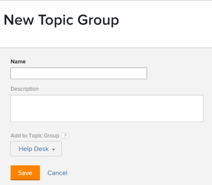

# Erstellen von Themengruppen

<!-- Audited: 2/2024 -->

Themengruppen sind mit Anfrage-Warteschlangen verknüpft. Je nach Art der Anfragen können Sie Ihre Anfrage-Warteschlangen mithilfe von Themengruppen in mehrere Kategorien einteilen.

## Zugriffsanforderungen

+++ Erweitern, um die Zugriffsanforderungen für die in diesem Artikel beschriebene Funktionalität anzuzeigen.

<table style="table-layout:auto"> 
 <col> 
 <col> 
 <tbody> 
  <tr> 
   <td role="rowheader">Adobe Workfront-Paket</td> 
   <td> 
Beliebig 
 </td> 
  </tr> 
  <tr> 
   <td role="rowheader"> 
Adobe Workfront-Lizenz
 </td> 
   <td>   
      
Standard

      
Abo

 </td> 
  </tr> 
  <tr> 
   <td role="rowheader">Konfigurationen der Zugriffsebene</td> 
   <td> 
Zugriff auf Projekte bearbeiten
 </td> 
  </tr> 
  <tr> 
   <td role="rowheader">Objektberechtigungen</td> 
   <td> 
 Verwalten von Berechtigungen für das Projekt
 </td> 
  </tr> 
 </tbody> 
</table>

Weitere Informationen finden Sie unter [Zugriffsanforderungen](/help/quicksilver/administration-and-setup/add-users/access-levels-and-object-permissions/access-level-requirements-in-documentation.md) in der Dokumentation zu Workfront.

+++

## Übersicht über Themengruppen

Wenn Sie beispielsweise über eine Anfrage-Warteschlange für Marketing-Anfragen verfügen, können Sie eine Themengruppe „Muttertagskampagne“, eine Themengruppe der zweiten Ebene „Digitale Medien“ und eine zusätzliche Themengruppe der zweiten Ebene „Druckmedien“ verwenden. Anschließend können sich in jeder Themengruppe mehrere Warteschlangenthemen befinden. Beispielsweise können „Banner-Anzeige“ und „Blog“ Warteschlangenthemen für die Themengruppe „Digitale Medien“ sein.

Weitere Informationen zum Erstellen von Anfrage-Warteschlangen finden Sie unter [Erstellen einer Anfrage-Warteschlange](../../../manage-work/requests/create-and-manage-request-queues/create-request-queue.md).

Beachten Sie beim Arbeiten mit Themengruppen Folgendes:

* Sie können innerhalb einer Anfrage-Warteschlange bis zu 10 Ebenen von Themengruppen erstellen.
* Die Anzahl der Warteschlangenthemen, die einer Themengruppe zugeordnet werden können, ist unbegrenzt.
* Themengruppen sind meldepflichtige Objekte.
* Themengruppen können nicht von einem Projekt in ein anderes verschoben werden.

## Erstellen von Themengruppen

Es wird empfohlen, Themengruppen zu erstellen, bevor Sie ein Warteschlangenthema erstellen. Eine Themengruppe kann jedoch im Warteschlangenthema-Builder erstellt werden. Weitere Informationen zum Erstellen von Warteschlangenthemen finden Sie unter [Warteschlangenthemen erstellen](../../../manage-work/requests/create-and-manage-request-queues/create-queue-topics.md).

Erstellen einer Themengruppe:

1. Wechseln Sie zu dem Projekt, das Sie als Warteschlange für Hilfeanfragen veröffentlicht haben.\
   Weitere Informationen zum Veröffentlichen eines Projekts als Warteschlange für Hilfeanfragen finden Sie unter [Erstellen einer Anfragewarteschlange](../../../manage-work/requests/create-and-manage-request-queues/create-request-queue.md).

1. Klicken Sie **linken Bereich** Themengruppen“.
1. Klicken Sie **Neue Themengruppe**.

   <!--    -->

1. Geben Sie die folgenden Informationen an:

   * **Name**: Der Name ist für Benutzer sichtbar, die Anfragen an diese Anfrage-Warteschlange senden.
   * **Beschreibung**: Die Beschreibung wird angezeigt, wenn Benutzende die Themengruppe auswählen, um eine neue Anfrage zu senden.
   * **Zu Themengruppe hinzufügen**: Sie können die neue Themengruppe zu einer vorhandenen Themengruppe hinzufügen oder sie direkt zum Projekt hinzufügen, das als Warteschlange für Hilfeanfragen veröffentlicht wurde.

1. Klicken Sie auf **Speichern**.\
   Dadurch wird eine neue Themengruppe in Ihrer Anfragewarteschlange erstellt. Sie können jetzt zusätzliche Kategorien aus dem ersten Dropdown-Menü unter einer Anfrage-Warteschlange auswählen.\
   Weitere Informationen zum Senden von Anfragen finden Sie unter [Erstellen und Senden von Adobe Workfront-Anfragen](../../../manage-work/requests/create-requests/create-submit-requests.md).
1. Um eine vorhandene Themengruppe zu bearbeiten, wählen Sie die Themengruppe aus der Themengruppenliste aus und bearbeiten Sie dann die Details in dem sich öffnenden Fenster. Klicken Sie **Speichern**, um die Änderungen zu speichern.
