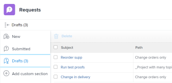

# Erstellen von Anfragen aus Entwürfen

Zusätzlich zur Verwendung der verfügbaren Entwürfe, die Workfront Ihnen bei der Eingabe einer neuen Anfrage vorschlägt, können Sie auch über den Abschnitt „Entwürfe“ auf eine Entwurfsanfrage zugreifen und die Übermittlung dort abschließen.

## Zugriffsanforderungen

+++ Erweitern, um die Zugriffsanforderungen für die in diesem Artikel beschriebene Funktionalität anzuzeigen.

<table style="table-layout:auto"> 
 <col> 
 <col> 
 <tbody> 
  <tr> 
   <td role="rowheader">Adobe Workfront-Paket</td> 
   <td> 
Beliebiges Adobe Workfront- oder Workflow-Paket

   
Beliebiges Adobe Workfront-Planungspaket zum Erstellen von Anfragen für Workfront Planning </td> 
  </tr> 
  <tr> 
   <td role="rowheader">Adobe Workfront-Lizenz</td> 
   <td> 
Mitwirkende oder höher

   
Anfragende oder höher

    </td> 
  </tr> 
  <tr> 
   <td role="rowheader">Konfigurationen der Zugriffsebene</td> 
   <td> 
Zugriff auf Anfragen bearbeiten
  </td> 
  </tr>

</tbody> 
</table>

Weitere Informationen finden Sie unter [Zugriffsanforderungen](/help/quicksilver/administration-and-setup/add-users/access-levels-and-object-permissions/access-level-requirements-in-documentation.md) in der Dokumentation zu Workfront.

+++

## Voraussetzungen für das Erstellen von Anfragen aus Entwürfen

Sie müssen Folgendes tun, bevor Sie eine Anfrage aus einem Entwurf erstellen können:

* Erstellen Sie eine Anfrage. Dadurch wird die Anfrage automatisch im Abschnitt Entwürfe als Entwurf gespeichert.

  Informationen zum Erstellen von Anfragen finden Sie unter [Erstellen und Senden von Adobe Workfront-Anfragen](../../../manage-work/requests/create-requests/create-submit-requests.md).

## Erstellen von Anfragen aus Entwürfen

Sie können Anfragen aus Entwürfen sowohl für Workfront- als auch für Planning-Anfragen erstellen.

Das Erstellen von Anfragen aus Entwürfen unterscheidet sich zwischen dem neuen anfragenden Erlebnis und dem alten Erlebnis.

* [Erstellen von Anfragen aus Entwürfen im neuen anfordernden Erlebnis](#create-requests-from-drafts-in-the-new-requesting-experience)
* [Erstellen von Anfragen aus Entwürfen im alten anfordernden Erlebnis](#create-requests-from-drafts-in-the-legacy-requesting-experience)

### Erstellen von Anfragen aus Entwürfen im neuen anfordernden Erlebnis

1. Öffnen Sie den Entwurf.

   Entwürfe finden Sie an den folgenden Speicherorten:

   * In der Anfragenliste im Bereich Anfragen
   * In der Anfragenliste im Widget Meine Anfragen auf der Startseite
   * Im Dialogfeld Neue Anfrage (enthält nur Entwürfe von Anfragen, die mit dem ausgewählten Formular erstellt wurden)

   >[!NOTE]
   >
   >In der alten anfordernden Version erstellte Entwürfe sind in der neuen anfordernden Version nicht verfügbar.

1. Aktualisieren Sie die Informationen für die Anfrage, wie in [Erstellen und Senden von Adobe Workfront-Anfragen](../../../manage-work/requests/create-requests/create-submit-requests.md) beschrieben.
1. (Optional und bedingt) Klicken Sie während der Eingabe der Anfrage jederzeit auf **Verwerfen** Entwurf, wenn Sie den Entwurf löschen möchten. Dadurch wird der Entwurf gelöscht.

   Wenn Sie Ihren Entwurf versehentlich verworfen haben, können Sie in der Nachricht **unteren Bildschirmrand sofort auf** Rückgängig“ klicken. Diese Option ist nur für einige Sekunden verfügbar.

   Weitere Informationen zum Löschen von Entwürfen finden Sie unter [Löschen einer gesendeten Anfrage oder eines Anfrageentwurfs](../../../manage-work/requests/create-requests/delete-request-draft.md).

1. (Optional) Wenn Sie Änderungen am Entwurf speichern möchten, ohne ihn zu übermitteln, verlassen Sie die Seite Neue Anfrage . Änderungen werden automatisch gespeichert.

1. Nachdem Sie die Informationen für die Anfrage ausgefüllt haben, klicken Sie auf **Senden**.

   Wenn Sie die Anfrage senden, wird der Entwurf durch die neue Anfrage ersetzt und kann nicht als Entwurf wiederhergestellt werden.

### Erstellen von Anfragen aus Entwürfen im alten anfordernden Erlebnis

>[!NOTE]
>
>Es ist nicht möglich, Anfragen aus Planungsanfrageentwürfen mit dem alten Erlebnis zu erstellen.

{{step1-to-requests}}

1. Wählen **Entwürfe** im linken Bedienfeld aus.

   In dieser Liste wird ein Entwurf für jedes Warteschlangenthema jeder Anfragewarteschlange angezeigt.

   

1. (Optional) Klicken Sie auf eine Spaltenüberschrift, um die Liste nach dieser Spalte zu sortieren.

1. Überprüfen Sie die Informationen zu den einzelnen Entwürfen in den folgenden Spalten der Liste „Entwürfe“:

   | Betreff | Dies ist der Name, den Sie Ihrer Anfrage gegeben haben, als Sie mit der Erstellung begonnen haben. |
   | --- | --- |
   | Path | Der Name der Anfrage-Warteschlange, der Themengruppen und der Warteschlangenthemen, an die Sie die Anfrage ursprünglich senden wollten. |
   | Eingabedatum | Das Datum, an dem Sie mit der Erstellung der Anfrage begonnen haben. |
   | Datum der letzten Aktualisierung | Das letzte Ihrer letzten Aktualisierung. Wenn Sie sie seit dem ersten Start der Anfrage nicht aktualisiert haben, sollten das Eingabedatum und das Datum der letzten Aktualisierung gleich sein. |

   {style="table-layout:auto"}

1. (Optional) Tippen Sie mithilfe des Schnellfilters oben rechts in der Liste „Entwürfe“ den Namen einer entworfenen Anfrage, einer Anforderungswarteschlange, eines Warteschlangen-Themas oder einer Themengruppe ein und klicken Sie dann auf den Namen eines Entwurfs, um ihn zu öffnen.

   >[!TIP]
   >
   >Permanente Filter können nicht im Bereich Entwürfe des Bereichs Anfragen angewendet werden. Darüber hinaus gibt es keine Optionen, um die Ansicht der Entwurfsliste zu ändern oder zu ändern.

1. Aktualisieren Sie die Informationen für die Anfrage, wie in [Erstellen und Senden von Adobe Workfront-Anfragen](../../../manage-work/requests/create-requests/create-submit-requests.md) beschrieben.
1. (Optional und bedingt) Klicken Sie während der Eingabe der Anfrage jederzeit auf **Verwerfen** Entwurf, wenn Sie den Entwurf löschen möchten. Dadurch wird der Entwurf gelöscht, der nicht wiederhergestellt werden kann. Weitere Informationen zum Löschen von Entwürfen finden Sie unter [Löschen eines Anfrageentwurfs](../../../manage-work/requests/create-requests/delete-request-draft.md).

1. (Optional) Klicken Sie **Abbrechen** in der linken unteren Ecke der Seite, um Ihre Aktion rückgängig zu machen und den Entwurf beizubehalten.

1. Führen Sie nach dem Ausfüllen der Informationen für die Anfrage einen der folgenden Schritte aus:

   * Klicken Sie **Senden**, wenn Sie bereit sind, die Anfrage zu senden. Die Anfrage wird im Abschnitt Gesendet gespeichert. Abhängig von der Routing-Regel der Anfrage-Warteschlange kann diese Anfrage an ein anderes Projekt als das als Anfrage-Warteschlange bezeichnete weitergeleitet werden. Weitere Informationen zu Routingregeln finden Sie unter [Routingregeln erstellen](../../../manage-work/requests/create-and-manage-request-queues/create-routing-rules.md).

     ODER

     Klicken Sie auf **Schließen**, wenn Sie noch nicht bereit sind, ihn zu übermitteln, und Sie möglicherweise später zurückkehren und ihn abschließen. Ihre Anfrage wird im Abschnitt „Entwürfe“ gespeichert und steht Ihnen beim nächsten Senden einer Anfrage für diese Anfrage-Warteschlange zur Verfügung.

     

     Wenn Sie die Anfrage senden, wird der Entwurf gelöscht und kann nicht wiederhergestellt werden.

