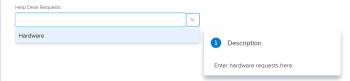

# Anfragen erstellen und senden

<!--Audited: 12/2023-->

<!--

(NOTE: Linked to the UI - do not change/ remove; THIS IS NOW SPLIT IN THREE ARTICLES>> MAKE SURE THE TRANSITION TO THE OTHER TWO IS CLEAR SINCE THIS IS LINKED TO UI)

(NOTE: If they come out with templates AND drafts, consider splitting this article to keep Create in one and Working with Drafts and Requests in another??)

(NOTE: this article is linked from Submitting Workfront Requests from Salesforce) 

-->

Geplante Arbeiten werden in Adobe Workfront durch Projekte und Aufgaben dargestellt. Sie können jedoch in einer Umgebung arbeiten, in der ungeplante Arbeit in Form von Anfragen jederzeit eintreffen kann. Workfront bietet einen Workflow, der diesen Umgebungstyp durch die Verwendung von Anfrage-Warteschlangen unterstützt.

Nachdem Sie eine Anfrage in einer Anfragewarteschlange erstellt haben, können Sie sie entweder dem Abschluss zuweisen oder in eine Aufgabe oder ein Projekt konvertieren.\
Weitere Informationen zum Konvertieren von Problemen in eine Aufgabe oder ein Projekt finden Sie im Artikel [Übersicht über das Konvertieren von Problemen in Adobe Workfront](../../../manage-work/issues/convert-issues/convert-issues.md).

Sie können eine Workfront-Anfrage wie folgt erstellen:

* Von Grund auf wie in diesem Artikel beschrieben.
* Aus Entwürfen. Weitere Informationen finden Sie unter [Erstellen von Anfragen aus Entwürfen](../../../manage-work/requests/create-requests/create-requests-from-drafts.md).
* von einer vorhandenen Anfrage durch Kopieren und Senden einer Kopie. Weitere Informationen finden Sie unter [Anforderungen kopieren und senden](../../../manage-work/requests/create-requests/copy-and-submit-requests.md).

Sie können eine Workfront-Planungsanfrage von Grund auf neu erstellen, um Datensätze in Workfront Planning auf folgende Weise zu erstellen:

* Von einem Link zu einem Workfront Planning-Anfrageformular.

* Aus einem Workfront-Planungsanfrageformular im Bereich Anfragen von Workfront.

  Ihr Unternehmen muss ein Workfront Planning-Paket erwerben. Weitere Informationen finden Sie unter [Senden von Adobe Workfront-Planungsanfragen zum Erstellen von Datensätzen](/help/quicksilver/planning/requests/submit-requests.md).

## Zugriffsanforderungen

+++ Erweitern, um die Zugriffsanforderungen für die in diesem Artikel beschriebene Funktionalität anzuzeigen.

<table style="table-layout:auto"> 
 <col> 
 <col> 
 <tbody> 
 <tbody> 
  <tr> 
   <td role="rowheader">Adobe Workfront-Paket</td> 
   <td> 
Beliebig 
 </td> 
  </tr> 
  <tr> 
   <td role="rowheader">Adobe Workfront-Lizenz</td> 
   <td> 
Mitwirkender oder höher

   
Anfrage oder höher

    </td> 
  </tr> 
  <tr> 
   <td role="rowheader">Konfigurationen der Zugriffsebene</td> 
   <td> 
Zugriff auf Anfragen bearbeiten
  </td> 
  </tr> 
  <tr> 
   <td role="rowheader"> Produkt</td> 
   <td> <ul><li>Adobe Workfront</li><li>Sie müssen über Adobe Workfront Planning verfügen, um Planungsanfragen oder Anfrageformulare anzuzeigen</td> 
  </tr> 
 </tbody> 
</table>

Weitere Informationen finden Sie unter [Zugriffsanforderungen in der Dokumentation zu Workfront](/help/quicksilver/administration-and-setup/add-users/access-levels-and-object-permissions/access-level-requirements-in-documentation.md).

+++

## Voraussetzungen für die Verwendung von Anfrage-Warteschlangen

Ein Workfront-Administrator muss Anfrage-Warteschlangen erstellen und Benutzern zur Verfügung stellen, bevor sie diese Funktion verwenden können. Benutzende mit einer Planerlizenz und mit Bearbeitungszugriff auf Projekte und Verwaltungsberechtigungen für ein bestimmtes Projekt können ebenfalls Anfragewarteschlangen erstellen.

Informationen zum Erstellen von Anforderungswarteschlangen finden Sie im Artikel [Erstellen einer Anforderungswarteschlange](../../../manage-work/requests/create-and-manage-request-queues/create-request-queue.md).

Ein Workfront-Administrator muss die folgenden Komponenten einer Anfrage-Warteschlange erstellen:

* Ein Projekt mit dem aktuellen Status, das als Warteschlange für Hilfeanfragen veröffentlicht wurde.
* Warteschlangenthemen.\
  Weitere Informationen finden Sie im Artikel [Warteschlangenthemen erstellen](../../../manage-work/requests/create-and-manage-request-queues/create-queue-topics.md).

* Routingregeln.\
  Weitere Informationen finden Sie im Artikel [Routing-Regeln erstellen](../../../manage-work/requests/create-and-manage-request-queues/create-routing-rules.md).

* (Optional) Themengruppen.\
  Weitere Informationen finden Sie im Artikel [Themengruppen erstellen](../../../manage-work/requests/create-and-manage-request-queues/create-topic-groups.md).

* (Optional) Benutzerdefiniertes Formular anfordern.\
  Weitere Informationen finden Sie im Artikel [Erstellen eines benutzerdefinierten Formulars](/help/quicksilver/administration-and-setup/customize-workfront/create-manage-custom-forms/form-designer/design-a-form/design-a-form.md).

* (Optional) Genehmigungsprozess anfordern.\
  Weitere Informationen finden Sie im Artikel [Erstellen eines Genehmigungsprozesses für Arbeitselemente](../../../administration-and-setup/customize-workfront/configure-approval-milestone-processes/create-approval-processes.md).

## Erstellen von Anfragen und Generieren von Entwürfen in der Workfront-Web-App

Wenn Sie eine Anfrage in der Workfront-Web-App erstellen, speichert Workfront die Anfrage als Entwurf, bevor Sie sie senden. Workfront erstellt einen Entwurf, sobald Sie Ihre Anfrage-Warteschlange auswählen und Informationen eingeben.

Sie können mit dem Senden der Anfrage fortfahren oder so viele Informationen ausfüllen, wie verfügbar sind, und die Anfrage verlassen, um sie später abzuschließen. Workfront speichert die von Ihnen gestartete Anfrage. Sie finden sie unter:

* Neues anforderndes Erlebnis: Die Anfragenliste
* Veraltete Anfrage von Erlebnis: Der Ordner „Drafts“

>[!IMPORTANT]
>
>Beachten Sie beim Arbeiten mit Entwürfen Folgendes:
>
>* Workfront erstellt keine Anfrageentwürfe, wenn Sie sie über ein Drittanbieterprogramm senden, z. B. per E-Mail an Workfront senden oder sie mit einem anderen Programm erstellen. Wenn Sie eine Anfrage von außerhalb der Workfront-Web-App senden, wird die Anfrage im Abschnitt Gesendet gespeichert.
>* Wenn sich die Struktur einer Anfrage-Warteschlange ändert, können Sie nicht mehr auf vorhandene Entwürfe zugreifen. Wenn beispielsweise ein Warteschlangenthema entfernt oder eine Themengruppe hinzugefügt wird, können die gespeicherten Entwürfe nicht mehr aufgerufen werden.
>

Weitere Informationen zum Erstellen von Anfragen aus vorhandenen Entwürfen finden Sie unter [Anfragen aus Entwürfen erstellen](../../../manage-work/requests/create-requests/create-requests-from-drafts.md). Informationen zum Löschen von Anfrageentwürfen finden Sie unter [Löschen eines Anfrageentwurfs](../../../manage-work/requests/create-requests/delete-request-draft.md).

So erstellen Sie eine Anfrage in der Workfront-Web-App:

{{step1-to-requests}}

1. (Optional und bedingt) Wählen Sie oben rechts **Bildschirm die Einstellung** Zu neuem Erlebnis wechseln) aus.

1. Klicken **oben** auf der Seite auf „Neue Anfrage“.

   >[!TIP]
   >
   >* Die Option Neue Anfrage kann aus jedem Abschnitt im Bereich Anfragen aufgerufen werden.
   >* Die Option Neue Anfrage ist abgeblendet, wenn Sie keinen Zugriff zum Erstellen von Problemen haben.

   Das **Neue Anfrage**-Feld wird geöffnet.

1. (Bedingt) Wenn Sie zu der neuen -Version gewechselt sind, wählen Sie einen der Pfade oder Formulare für die Workfront-Anfrage-Warteschlange aus oder klicken Sie auf die Suchleiste.

   Wenn Sie auf die Suchleiste klicken, wird ein Dropdown-Menü mit den zuletzt verwendeten Warteschlangen und Formularen angezeigt. Wählen Sie eine aus der Liste aus oder beginnen Sie mit der Eingabe und wählen Sie die Warteschlange oder das Formular aus, wenn es angezeigt wird.

   >[!NOTE]
   >
   >Beachten Sie Folgendes bezüglich des neuen anfragenden Erlebnisses:
   >* Die Liste enthält die Workfront-Anfragewarteschlangen und Workfront Planning-Anfrageformulare.
   >* Sie können die Liste nach Objekttyp filtern.
   >* In der neuen anfordernden -Version befinden sich Entwürfe in derselben Liste wie die gesendeten Anfragen.

1. (Bedingt) Wenn Sie zu der neuen -Version gewechselt sind, wählen Sie Ihre Themengruppen und Warteschlangenthemen aus und aktualisieren Sie das Formular weiter.

   Klicken Sie andernfalls in das Feld **Anfragetyp** und führen Sie einen der folgenden Schritte aus:

   * Wählen Sie im Abschnitt **Letzte Pfade** einen Pfad aus, den Sie kürzlich zum Öffnen einer Anfrage-Warteschlange verwendet haben. Ein Pfad enthält die Anfrage-Warteschlange, die Themengruppen und das Warteschlangenthema, das Sie kürzlich übermittelt haben. Die letzten drei Pfade werden standardmäßig angezeigt.

     >[!NOTE]
     >
     >Workfront speichert einen Pfad nur, wenn Sie tatsächlich eine Anforderung gesendet haben. Es werden keine Pfade für entworfene Anfragen erstellt.

     

   * Wählen Sie im **Anfrage** Warteschlangen) eine Anfrage-Warteschlange aus.
   * Geben Sie ein Keyword ein, der zu einem zuvor aufgerufenen Pfad gehört, um nach einer Anfrage-Warteschlange zu suchen.

     Wenn Sie beispielsweise eine Anfrage-Warteschlange mit dem Namen „Helpdesk“ mit einer Themengruppe mit dem Namen „Standort“ und ein Warteschlangenthema mit dem Namen „Remote“ haben, können Sie „remote“ eingeben und alle Anfrage-Warteschlangen, die „remote“ in einem beliebigen Pfadelement enthalten, werden angezeigt.

     >[!TIP]
     >
     >Wenn Sie einen Namen eingeben, der ein Sonderzeichen enthält, werden die Anfrage-Warteschlange, das Warteschlangenthema oder die Themengruppe angezeigt, auch wenn Sie das Zeichen nicht eingeben.

     

     Die Liste der verfügbaren Anfragewarteschlangen und der letzten Pfade wird dynamisch aktualisiert und enthält jetzt nur Pfade, die das in den Ergebnissen hervorgehobene Keyword enthalten.

     Die Suchergebnisse werden in den folgenden Bereichen angezeigt:

     <table style="table-layout:auto"> 
      <col> 
      <col> 
      <tbody> 
       <tr> 
        <td role="rowheader">Anfrage-Warteschlangen</td> 
        <td>Anfrage-Warteschlangen, die das Keyword im Namen enthalten</td> 
       </tr> 
       <tr> 
        <td role="rowheader">Anfrage-Pfade</td> 
        <td> 
Pfade (z. B. Anfrage-Warteschlangen, Themengruppen, Warteschlangenthemen), die das Keyword in einem der Namen ihrer Elemente enthalten
 </td> 
       </tr> 
      </tbody> 
     </table>

   >[!TIP]
   >
   >* Die ersten 200 Anfragewarteschlangen werden standardmäßig in alphabetischer Reihenfolge angezeigt.
   >* Der Name der Anfrage-Warteschlange ist der Name des Projekts, das als Hilfe-Anfrage-Warteschlange veröffentlicht wurde.
   >* Die Beschreibung des Projekts, das als ausgewählte Anfrage-Warteschlange konfiguriert wurde, wird rechts neben dem Namen der Anfrage-Warteschlange angezeigt.
   >   
   >Weitere Informationen zum Veröffentlichen eines Projekts als Warteschlange für Hilfeanfragen finden Sie im Artikel [Erstellen einer Anfragewarteschlange](../../../manage-work/requests/create-and-manage-request-queues/create-request-queue.md).

1. Führen Sie im **Neue Anfrage**-Formular einen der folgenden Schritte aus:

   * (Bedingt) Wählen Sie einen verfügbaren Entwurf aus der Benachrichtigungsmeldung aus, die im Feld Anfragetyp angezeigt wird.

     Dieser Bereich wird nur angezeigt, wenn Sie Entwürfe zuvor gespeichert haben, ohne sie zu übermitteln.

     Standardmäßig werden die drei letzten Entwürfe aus drei verschiedenen Warteschlangenthemen angezeigt.

     

   * Beginnen Sie mit der Eingabe einer neuen Anfrage in die ausgewählte Warteschlange.

     Ein neuer Entwurf wird automatisch im Abschnitt „Entwürfe“ gespeichert, nachdem Sie mit der Eingabe von Informationen für die neue Anfrage begonnen haben und der Anfrage im Feld „Betreff“ einen Namen gegeben haben.

1. (Optional) Wenn die Anfrage-Warteschlange Themengruppen enthält, wählen Sie den Namen der Themengruppe im ersten Dropdown-Feld aus. Wählen Sie andernfalls ein Warteschlangenthema aus.

   >[!TIP]
   >
   >Wenn Sie den Mauszeiger über eine Themengruppe oder ein Warteschlangenthema bewegen, wird das Feld Beschreibung rechts angezeigt. Enthält zusätzliche Informationen zur Themengruppe oder zum Warteschlangenthema.
   >
   >
   >
   >

   Ihre Anfrage-Warteschlange kann bis zu 10 Ebenen von Themengruppen enthalten.\
   Weitere Informationen zum Erstellen von Themengruppen finden Sie im Artikel [Themengruppen erstellen](../../../manage-work/requests/create-and-manage-request-queues/create-topic-groups.md). Weitere Informationen zum Erstellen von Warteschlangenthemen finden Sie im Artikel [Erstellen von Warteschlangenthemen](../../../manage-work/requests/create-and-manage-request-queues/create-queue-topics.md).

   >[!TIP]
   >
   >Wenn Sie einen Entwurf oder einen vorherigen Pfad ausgewählt haben, sind die Themengruppen und Warteschlangenthemen bereits ausgewählt. Sie können bei Bedarf ein anderes auswählen.

1. Je nachdem, welche Felder der Workfront-Administrator im Abschnitt **Neue Problemfelder** der Unterregisterkarte **Warteschlangendetails** im Projekt aktiviert hat, finden Sie beim Senden einer neuen Anfrage möglicherweise eines der folgenden Felder:

   <table style="table-layout:auto"> 
    <col> 
    <col> 
    <tbody> 
     <tr> 
      <td role="rowheader"><strong>Betreff</strong> </td> 
      <td>Geben Sie einen Namen für Ihre Anfrage an. Dies ist ein Pflichtfeld.</td> 
     </tr> 
     <tr> 
      <td role="rowheader"><strong>Beschreibung</strong> </td> 
      <td>Geben Sie eine Beschreibung für Ihre Anfrage an.</td> 
     </tr> 
     <tr> 
      <td role="rowheader"><strong>URL</strong> </td> 
      <td> 
Geben Sie eine URL an, die sich auf Ihre Anfrage beziehen kann.
 </td> 
     </tr> 
     <tr> 
      <td role="rowheader"><strong>Priorität</strong> </td> 
      <td> 
Geben Sie eine Priorität für Ihre Anfrage an. Die Priorität sollte definieren, wie schnell diese Anfrage Ihrer Meinung nach gelöst werden sollte. Die Standardoptionen sind: 
 
       <ul> 
        <li>Keine</li> 
        <li>Niedrig </li> 
        <li>Normal</li> 
        <li>Hoch</li> 
        <li>Dringend</li> 
       </ul> 
Ihr Systemadministrator kann die Namen der Prioritäten ändern.
 </td> 
     </tr> 
     <tr> 
      <td role="rowheader"><strong>Schweregrad</strong> </td> 
      <td> 
Geben Sie einen Schweregrad für Ihre Anfrage an. Der Schweregrad sollte die Auswirkungen dieser Anfrage auf Ihre Arbeit definieren, falls sie nicht rechtzeitig behoben wird. Die Standardoptionen sind:
 
       <ul> 
        <li>Kosmetisch</li> 
        <li>Verwirrend</li> 
        <li>Programmfehler mit Umgehungslösung</li> 
        <li>Programmfehler ohne Umgehungslösung</li> 
        <li>Schwerer Fehler</li> 
       </ul> 
Ihr Systemadministrator kann die Namen der Schweregrade ändern.
 </td> 
     </tr> 
     <tr> 
      <td role="rowheader"><strong>Primärer Kontakt</strong> </td> 
      <td>Der Primäre Ansprechpartner einer Anfrage ist standardmäßig bei Ihnen, da Sie die Ansprechperson für alle Fragen im Zusammenhang mit der Anfrage sind. Sie können dies jedoch für jeden anderen Workfront-Benutzer ändern.</td> 
     </tr> 
     <tr data-mc-conditions="QuicksilverOrClassic.Quicksilver"> 
      <td role="rowheader"><strong>Arbeitsaufträge</strong> </td> 
      <td> 
Geben Sie den Namen eines aktiven Benutzers, Aufgabengebiets oder Teams an, dem die Anfrage zugewiesen werden soll. 
 
Es kann nur ein Team angegeben werden.

   
 Je nach Einrichtung der Anfrage-Warteschlange können Sie der Anfrage möglicherweise nur einen oder zwei Ressourcentypen anstelle von allen drei zuweisen (z. B. können Sie die Anfrage nur Benutzern zuweisen).

   
Wenn der Anfrage-Warteschlange auch eine Routing-Regel zugeordnet ist, die die Anfrage automatisch an einen anderen Ressourcentyp weiterleitet (z. B. ein Team), wird Ihre Anfrage sowohl der Entität, die Sie beim Senden der Anfrage manuell angeben (Benutzer), als auch der in der Routing-Regel angegebenen Ressource (dem Team) zugewiesen. 

   
 Weitere Informationen finden Sie in den folgenden Artikeln:
 
      <ul> 
      <li> 
<a href="../../../manage-work/requests/create-and-manage-request-queues/create-request-queue.md" class="MCXref xref">Anfrage-Warteschlange erstellen</a> 
 </li> 
      <li> 
<a href="../../../manage-work/requests/create-and-manage-request-queues/create-routing-rules.md" class="MCXref xref">Routing-Regeln erstellen</a>   
 </li> 
      </ul> 

   
Es wird empfohlen, Routing-Regeln für Ihre Anfrage-Warteschlangen zu verwenden, damit sie automatisch an die entsprechenden Ressourcen weitergeleitet werden können. 
 </td> 
     </tr>

   <tr> 
      <td role="rowheader"><strong>Geplante Stunden</strong> </td> 
      <td> 
Schätzen Sie, wie viele Stunden es dauern würde, bis diese Anfrage abgeschlossen ist.
 </td> 
     </tr> 
     <tr> 
      <td role="rowheader"><strong>Geplantes Startdatum</strong> </td> 
      <td> 
Geben Sie das Datum an, an dem die Bearbeitung dieser Anfrage beginnen soll.
 </td> 
     </tr> 
     <tr> 
      <td role="rowheader"><strong>Geplantes Abschlussdatum</strong> </td> 
      <td>Geben Sie das Datum an, an dem diese Anfrage aufgelöst werden soll.</td> 
     </tr> 
     <tr> 
      <td role="rowheader"><strong>Status</strong> </td> 
      <td>Der Standardstatus einer neuen Anfrage lautet „Neu“. Ihr Systemadministrator hat möglicherweise den Namen dieses Status geändert. Sie können den Status in diesem Dropdown-Menü auch in etwas Anderes ändern.</td> 
     </tr> 
     <tr> 
      <td role="rowheader"><strong>Dokumente</strong> </td> 
      <td> 
Dokumente zu Ihrer Anfrage hinzufügen. 
 
 Je nachdem, wie die Anfrage-Warteschlange eingerichtet wurde, wird der Abschnitt Dokumente möglicherweise vor oder nach den benutzerdefinierten Feldern angezeigt. 
 
Dokumente, die Sie in Workfront hochladen, werden in einer entworfenen Anfrage 24 Stunden lang gespeichert. Danach müssen Sie sie erneut anhängen, wenn Sie zur Bearbeitung und Übermittlung des Entwurfs zurückkehren. Dokumente, die von anderen Laufwerken verknüpft sind, werden dauerhaft im Entwurf gespeichert. 
 </td> 
     </tr> 
    </tbody> 
   </table>

1. (Optional) Wenn der Workfront-Administrator ein benutzerdefiniertes Formular mit der Anfrage-Warteschlange oder dem Warteschlangenthema verknüpft hat, geben Sie die Felder innerhalb des benutzerdefinierten Formulars an.\
   Benutzerdefinierte Formulare unterscheiden sich von Instanz zu Instanz von Workfront.
1. (Optional und bedingt) Klicken Sie während der Eingabe der Anfrage jederzeit auf [!UICONTROL **Entwurf verwerfen**], wenn Sie den automatisch erstellten Entwurf löschen möchten. Dadurch wird der Entwurf gelöscht, der nicht wiederhergestellt werden kann. Eine Bestätigungsmeldung wird angezeigt, die bestätigt, dass Sie den Entwurf löschen.

1. (Optional) Klicken Sie auf [!UICONTROL **Rückgängig**] in der Bestätigungsmeldung, wenn Sie Ihre Aktion rückgängig machen und den Entwurf beibehalten möchten.

1. Führen Sie einen der folgenden Schritte aus:

   * Klicken Sie **Senden**, wenn Sie bereit sind, die Anfrage zu senden. Die Anfrage wird im Abschnitt Gesendet gespeichert. Abhängig von der Routing-Regel der Anfrage-Warteschlange kann diese Anfrage an ein anderes Projekt als das als Anfrage-Warteschlange bezeichnete weitergeleitet werden. Weitere Informationen zu Routingregeln finden Sie unter [Routingregeln erstellen](../../../manage-work/requests/create-and-manage-request-queues/create-routing-rules.md).

     ODER

     Klicken Sie auf **Schließen**, wenn Sie noch nicht bereit sind, ihn zu übermitteln, und Sie möglicherweise später zurückkehren und ihn abschließen. Ihre Anfrage wird im Abschnitt „Entwürfe“ gespeichert und steht Ihnen beim nächsten Senden einer Anfrage für diese Anfrage-Warteschlange zur Verfügung.

     

   Wenn Sie die Anfrage senden, wird der Entwurf automatisch gelöscht und kann nicht wiederhergestellt werden.

   Gesendete Anfragen werden im Abschnitt **Gesendet** des Bereichs Anfragen aufgeführt. Wenn Sie die neue -Version verwenden, werden die von Workfront gesendeten Anfragen auf der Registerkarte **Workfront** im Bereich Anfragen angezeigt.

   Informationen zum Bearbeiten eingehender Anfragen finden Sie im Artikel [Verwalten von Arbeits- und Teamanfragen](../../../people-teams-and-groups/work-with-team-requests/manage-work-and-team-requests.md).

   Informationen zum Auffinden gesendeter oder entworfener Anfragen finden Sie auch unter [Gesendete Anfragen suchen](../../../manage-work/requests/create-requests/locate-submitted-requests.md).

## Erstellen von Anfragen von außerhalb von Workfront

Sie können einen direkten Link zu einer Anfrage-Warteschlange freigeben, wenn Sie eine neue Anfrage senden, und sie in andere Programme einbetten. Benutzer, die über das Web oder andere Programme auf diesen Link zugreifen, müssen auch mit einem aktiven Workfront-Konto angemeldet sein, um auf diese Warteschlange zugreifen und Anfragen an sie senden zu können. Weitere Informationen finden Sie unter [Freigeben eines Links zu einer Anfrage-Warteschlange](../../../manage-work/requests/create-requests/share-link-to-request-queue.md).

## Anfragen durch E-Mail an Workfront erstellen

Wenn Ihre Anfrage-Warteschlange für den Empfang von Anfragen per E-Mail aktiviert ist, können Sie Ihre Anfragen direkt an die mit der Anfrage-Warteschlange verknüpfte E-Mail-Adresse senden.

Der Textkörper der E-Mail wird als Anfragebeschreibung hinzugefügt.

>[!NOTE]
>
>Die HTML-Formatierung wird entfernt, wenn die Anfrage in Workfront eingeht, aber Signaturen und vorhandene Inhalte im Antwort-an-Thread werden nicht entfernt und erscheinen in der Anfragebeschreibung.

Informationen zum Aktivieren einer Anfrage-Warteschlange für den Empfang von Anfragen per E-Mail finden Sie unter [Benutzer können ein Problem per E-Mail an ein Anfrage-Warteschlangen-Projekt senden](../../../manage-work/requests/create-requests/enable-email-issues-into-projects.md).

## Erstellen von Anfragen mit der Workfront Mobile App

Sie können Anfragen über die Mobile App auf Ihrem Smartphone senden. Sie können eine neue Anfrage erstellen und sie an die Anfrage-Warteschlangen senden, auf die Sie in der Web-Anwendung Zugriff haben.

Informationen zum Senden von Anfragen über die Mobile App finden Sie im Abschnitt Anfragen in den Artikeln:

* [Adobe Workfront für Android](../../../workfront-basics/mobile-apps/using-the-workfront-mobile-app/workfront-for-android.md#requests)
* [Adobe Workfront für iOS](../../../workfront-basics/mobile-apps/using-the-workfront-mobile-app/workfront-for-ios.md#requests)

## Erstellen von Anfragen aus anderen Programmen

Sie können Anfragen mit allen Programmen senden, die in Workfront integriert wurden:

* Sie können eine benutzerdefinierte Integration zwischen Workfront und einem anderen Programm erstellen, mit der Sie Anfragen von dem anderen Programm an Workfront senden können.\
  Weitere Informationen zu benutzerdefinierten Workfront-Integrationen finden Sie im Artikel [Adobe Workfront-Integrationen](../../../administration-and-setup/configure-integrations/workfront-integrations-1.md).

## Erstellen von Anfragen mithilfe eines Workfront Planning-Anfrageformulars

Sie können eine Workfront-Planungsanfrage mithilfe eines Planungsanfrageformulars hinzufügen. Durch das Hinzufügen von Workfront Planning-Anfragen können Planungsdatensätze erstellt werden, wenn das Anforderungsformular genehmigt wurde oder keine Genehmigung erforderlich ist.

Ihr Unternehmen muss ein Workfront Planning-Paket erwerben, um Planungsanfragen senden zu können.

Weitere Informationen finden Sie in den folgenden Artikeln:

* [Erstellen und Verwalten eines Anfrageformulars in Adobe Workfront Planning](/help/quicksilver/planning/requests/create-request-form.md).
* [Senden von Adobe Workfront-Planungsanfragen zum Erstellen von Datensätzen](/help/quicksilver/planning/requests/submit-requests.md).

## Gesendete Anfragen suchen

Informationen zum Auffinden gesendeter oder entworfener Anfragen finden Sie unter [Gesendete Anfragen suchen](../../../manage-work/requests/create-requests/locate-submitted-requests.md).
